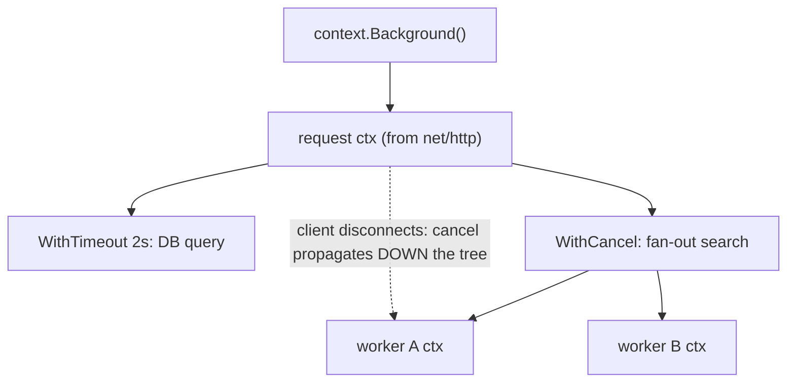

# Concurrency Synchronization

Channels are not Go's only concurrency tool. The `sync` and `sync/atomic` packages provide classic primitives — mutexes, wait groups, once — while `context` standardizes cancellation and deadlines across API boundaries. This guide covers those tools, data races and the race detector, the essentials of the Go memory model, and `errgroup`, the de facto standard for structured concurrent error handling.

## The sync Package

### Mutex and RWMutex

```go
type SafeCounter struct {
    mu sync.Mutex          // guards counts (document what a mutex protects!)
    counts map[string]int
}

func (c *SafeCounter) Inc(key string) {
    c.mu.Lock()
    defer c.mu.Unlock()    // defer guarantees unlock on every path, even panics
    c.counts[key]++
}

func (c *SafeCounter) Get(key string) int {
    c.mu.Lock()
    defer c.mu.Unlock()
    return c.counts[key]
}
```

`sync.RWMutex` allows many concurrent readers OR one writer — use it when reads vastly outnumber writes and the critical section is non-trivial (for tiny sections, plain `Mutex` is often faster due to lower overhead):

```go
c.mu.RLock()  // shared read lock
defer c.mu.RUnlock()
```

Rules interviewers check: mutexes are **not reentrant** (locking twice from the same goroutine deadlocks); a mutex must not be copied after first use (pass structs containing one by pointer — `go vet` catches this); zero value is ready to use.

### WaitGroup

Waits for a collection of goroutines to finish:

```go
var wg sync.WaitGroup
for _, url := range urls {
    wg.Add(1)                    // Add BEFORE starting the goroutine
    go func(u string) {
        defer wg.Done()          // Done exactly once per Add(1)
        fetch(u)
    }(url)
}
wg.Wait()                        // blocks until the counter hits zero
```

Pitfalls: calling `Add` *inside* the goroutine races with `Wait`; reusing a WaitGroup before `Wait` returns; forgetting `Done` on error paths (hence `defer`).

### Once

Runs a function exactly once, safely under concurrency — the standard lazy-init tool:

```go
var (
    once     sync.Once
    instance *DB
)

func GetDB() *DB {
    once.Do(func() { instance = connect() }) // all callers block until done
    return instance
}
// Go 1.21+: sync.OnceFunc / sync.OnceValue wrap this pattern.
```

### atomic

Lock-free primitives for single-word operations:

```go
var hits atomic.Int64          // typed atomics (Go 1.19+) — prefer these
hits.Add(1)
fmt.Println(hits.Load())

var ready atomic.Bool
ready.Store(true)
```

Atomics suit simple counters and flags. The moment an invariant spans more than one variable, you need a mutex — two individually-atomic operations are not atomic together.

## Data Races and the Race Detector

A **data race** is two goroutines accessing the same memory concurrently, at least one writing, with no synchronization. Races are undefined behavior — torn reads, lost updates, and crashes that appear only under production load:

```go
// RACY: classic lost update
counter := 0
for i := 0; i < 1000; i++ {
    go func() { counter++ }()   // read-modify-write, unsynchronized
}
// counter ends up < 1000 unpredictably
```

Go ships a dynamic race detector (based on ThreadSanitizer):

```bash
go test -race ./...
go run -race main.go
```

It instruments memory accesses and reports races that actually occur during the run (it cannot prove absence). It costs ~5-10x CPU and ~10x memory, so it runs in CI and staging, not usually in production. Any race it reports is a real bug — there are no benign data races in Go.

## The context Package

`context.Context` carries cancellation signals, deadlines, and request-scoped values across API boundaries. It is the first parameter of nearly every function in modern Go services:

```go
func fetchUser(ctx context.Context, id int) (*User, error) {
    req, err := http.NewRequestWithContext(ctx, "GET", url, nil) // ctx flows into I/O
    ...
}
```



```go
// Cancellation
ctx, cancel := context.WithCancel(context.Background())
defer cancel()                       // ALWAYS defer cancel — releases resources

// Timeout / deadline
ctx, cancel := context.WithTimeout(ctx, 2*time.Second)
defer cancel()

select {
case res := <-work(ctx):
    return res, nil
case <-ctx.Done():                   // closed on cancel OR timeout
    return nil, ctx.Err()            // context.Canceled or context.DeadlineExceeded
}
```

Cancellation flows **parent to child** only: cancelling a child never affects the parent. Contexts are immutable; `WithX` returns a derived child.

**Context values** are for request-scoped metadata that crosses API boundaries — request IDs, auth tokens, trace spans — not for passing function parameters:

```go
type ctxKey struct{}                          // unexported key type avoids collisions

func WithRequestID(ctx context.Context, id string) context.Context {
    return context.WithValue(ctx, ctxKey{}, id)
}
func RequestID(ctx context.Context) string {
    id, _ := ctx.Value(ctxKey{}).(string)
    return id
}
```

## Memory Model Basics

The Go memory model defines when one goroutine is guaranteed to observe another's writes, via **happens-before** relationships. Without a happens-before edge, there is no visibility guarantee at all (and a race is UB).

Edges are created by synchronization:

- A send on a channel happens before the corresponding receive completes.
- The close of a channel happens before a receive that returns `ok=false`.
- The nth `mu.Unlock()` happens before the (n+1)th `mu.Lock()`.
- `wg.Done()` calls happen before `wg.Wait()` returns; `once.Do(f)`'s `f` happens before any `Do` returns.
- Atomic operations behave as sequentially consistent among themselves.

```go
// WRONG: a plain bool flag has no happens-before edge
var done bool
var msg string
go func() { msg = "hello"; done = true }()
for !done {}                 // may spin forever, or see done==true but msg==""
fmt.Println(msg)

// RIGHT: the channel creates the edge; msg is guaranteed visible
ch := make(chan struct{})
go func() { msg = "hello"; close(ch) }()
<-ch
fmt.Println(msg)
```

The one-sentence takeaway for interviews: *"If goroutines share data, every access must be ordered by channels, mutexes, or atomics — the compiler and CPU are free to reorder anything else."*

## errgroup

`golang.org/x/sync/errgroup` is the standard way to run a group of goroutines, wait for all, capture the **first error**, and cancel the rest:

```go
import "golang.org/x/sync/errgroup"

func fetchAll(ctx context.Context, urls []string) ([]string, error) {
    g, ctx := errgroup.WithContext(ctx)   // ctx is cancelled on first error
    results := make([]string, len(urls))

    for i, url := range urls {
        g.Go(func() error {               // Go 1.22+: loop vars are per-iteration
            body, err := fetch(ctx, url)  // respects cancellation
            if err != nil {
                return fmt.Errorf("fetch %s: %w", url, err)
            }
            results[i] = body             // distinct index per goroutine: no race
            return nil
        })
    }
    if err := g.Wait(); err != nil {      // waits for all; returns first error
        return nil, err
    }
    return results, nil
}
```

`g.SetLimit(n)` bounds concurrency, turning errgroup into a bounded worker pool with error propagation — this is the pattern production services actually use for parallel fan-out (e.g., calling three backend services to render one page, canceling the others as soon as one fails).

## Best Practices

- Prefer channels for transferring ownership of data and signaling; prefer mutexes for guarding shared state (caches, counters, maps). "Use whichever is simplest and correct."
- Document what each mutex protects, and keep the mutex physically adjacent to the fields it guards in the struct.
- Keep critical sections tiny — never do I/O while holding a lock.
- Always `defer mu.Unlock()` and `defer cancel()` immediately after acquiring them.
- Pass `ctx context.Context` as the first parameter; never store contexts in structs; never pass nil (use `context.TODO()` when unsure).
- Use context values only for cross-cutting request metadata, never as hidden function arguments.
- Make `go test -race` part of CI; treat every reported race as a serious bug.
- Reach for `errgroup` instead of hand-rolled WaitGroup+error-channel machinery for parallel fan-out.

## Interview Questions

<details>
<summary>1. When would you choose a mutex over a channel, and vice versa?</summary>

Use a mutex when goroutines share a piece of state that each needs to read/modify — caches, counters, registries: it is simpler and faster than simulating exclusion with channels. Use channels when data or events *flow* between goroutines — handing off work items, results, signals, cancellation — because they combine transfer and synchronization and express pipelines naturally. The Go proverb: share memory by communicating for ownership transfer; communicate by sharing memory (with locks) for shared structures. Choose the simplest tool that makes the invariants obvious.
</details>

<details>
<summary>2. What is a data race, exactly, and how does Go help you find them?</summary>

A data race is two or more goroutines accessing the same memory location concurrently with at least one write and no synchronization ordering the accesses. Under the Go memory model this is undefined behavior — not just stale reads, but potentially corrupted slices/maps/interfaces and crashes. The `-race` flag builds with ThreadSanitizer-style instrumentation that vector-clocks every access and reports races that occur at runtime with both stack traces. It only detects races that execute, adds roughly 5-10x overhead, and should run in CI/staging on realistic workloads.
</details>

<details>
<summary>3. Why must wg.Add be called before starting the goroutine rather than inside it?</summary>

Because `wg.Wait()` returns when the counter is zero. If `Add(1)` runs *inside* the goroutine, the scheduler may run `Wait()` before the goroutine ever starts: the counter is still zero, `Wait` returns immediately, and the program proceeds (or exits) while work is pending — a race between `Add` and `Wait`. Calling `Add` in the parent, before `go`, guarantees the counter reflects all pending goroutines before anyone waits.
</details>

<details>
<summary>4. What is the difference between context.WithCancel, WithTimeout, and WithDeadline? What does Done() actually return?</summary>

All three derive a child context whose `Done()` channel closes when cancelled. `WithCancel` closes it only when you call the returned `cancel`. `WithDeadline` closes it at an absolute time (or on cancel); `WithTimeout` is sugar for `WithDeadline(now+d)`. `Done()` returns a receive-only channel that is closed on cancellation — goroutines select on it. After closure, `ctx.Err()` reports `context.Canceled` or `context.DeadlineExceeded`. You must call `cancel` even when the timeout fires, to release the timer and tree bookkeeping — hence `defer cancel()`.
</details>

<details>
<summary>5. Two goroutines communicate through a plain boolean flag with no locks or channels. What can go wrong?</summary>

Everything. Without a happens-before edge, the compiler may hoist the flag read out of the loop (spinning forever on a cached value), the CPU may reorder the flag write before the data writes it "guards", and the reader may see the flag set while the guarded data is still stale. It is also a data race, hence undefined behavior. Fix: use a channel close, a mutex, or `atomic.Bool` — each creates the required memory-ordering edge as defined by the Go memory model.
</details>

<details>
<summary>6. What does sync.Once guarantee, and what happens if the function panics?</summary>

`once.Do(f)` guarantees `f` executes exactly once across all goroutines, and every `Do` call returns only after that single execution completes — so all callers observe the initialization's effects (happens-before edge). If `f` panics, `Once` still counts it as done: the panic propagates to that caller, and subsequent `Do` calls do nothing — potentially leaving a half-initialized value permanently. So `f` should not fail; if initialization can fail, capture the error (e.g., `sync.OnceValues`) or use a different pattern that supports retry.
</details>

<details>
<summary>7. How does errgroup improve on a raw WaitGroup for parallel fan-out?</summary>

A WaitGroup only waits — you must hand-build error collection (a channel or mutex-guarded slice) and cancellation. `errgroup.WithContext` gives you: `g.Go(func() error)` capturing each goroutine's error; `g.Wait()` returning the *first* non-nil error; automatic cancellation of the shared context the moment any goroutine fails, so siblings stop doing useless work; and `g.SetLimit(n)` for bounded concurrency. It encodes the standard "call N backends, fail fast, cancel the rest" pattern in a few lines.
</details>

<details>
<summary>8. Is incrementing an int from multiple goroutines with counter++ safe if you "only need an approximate count"?</summary>

No. `counter++` is a read-modify-write, so concurrent increments are a data race, and Go races are undefined behavior — this is not "approximately correct", it is incorrect (and `-race` will flag it). Beyond lost updates, racy access can in principle corrupt adjacent state due to compiler/CPU reordering. Use `atomic.Int64.Add(1)`, which is both correct and nearly as fast, or a mutex if the counter participates in larger invariants.
</details>
