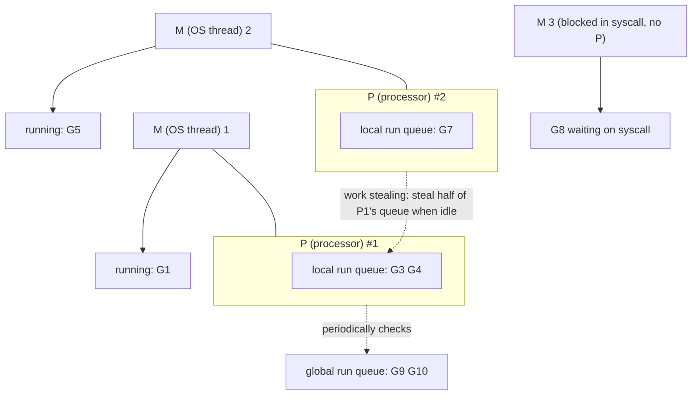
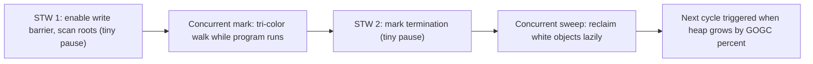

# Go Runtime and Scheduler

Every Go binary embeds a runtime that schedules goroutines, manages growable stacks, and garbage-collects memory. Senior Go interviews go beneath the language into this machinery: the GMP scheduler model, how goroutine stacks grow, how the concurrent tri-color GC achieves sub-millisecond pauses, and how escape analysis decides between stack and heap allocation.

## The GMP Scheduler Model

The runtime multiplexes many goroutines onto few OS threads using three entities:

- **G (goroutine)** — the unit of work: a function, its stack, and scheduling state.
- **M (machine)** — an OS thread that actually executes code.
- **P (processor)** — a scheduling context holding a local run queue of Gs. There are exactly `GOMAXPROCS` Ps (default: number of CPU cores). **An M must hold a P to run Go code.**



Key mechanics interviewers expect you to narrate:

- **Local run queues + work stealing.** Each P has a lock-free local queue (up to 256 Gs). An idle P first checks its own queue, occasionally the global queue, then steals half of another P's queue. This balances load without a single contended lock.
- **Syscall handoff.** When a G blocks in a syscall, its M blocks with it — so the runtime detaches the P and hands it to another (possibly new) M, keeping all cores busy. On return, the G is requeued and the surplus M is parked.
- **Netpoller.** Network I/O does not block Ms at all: sockets are registered with epoll/kqueue, the G is parked, and the netpoller readies it when the socket is — thousands of idle connections cost no threads. This is why Go servers scale like event loops while you write straight-line blocking code.
- **Preemption.** Goroutines are preempted cooperatively at function-call points, and since Go 1.14 also **asynchronously** (signal-based), so a tight `for {}` loop can no longer starve the scheduler or block GC.
- **GOMAXPROCS** caps *parallelism* (Ps), not concurrency (Gs) or threads (Ms can exceed it when blocked in syscalls). In containers, note the runtime historically didn't read cgroup CPU limits — `automemlimit`/`automaxprocs` (or Go 1.25's container awareness) fix mismatches that cause throttling.

## Goroutine Stacks: Small and Growable

Each goroutine starts with a ~2 KB stack — not the megabytes an OS thread reserves. Every function prologue checks whether the stack has room; if not, the runtime allocates a larger segment (typically doubling), **copies** the whole stack over, and adjusts pointers. Stacks also shrink during GC if mostly unused.

```go
// This is fine in Go: deep recursion grows the stack on demand
func depth(n int) int {
    if n == 0 { return 0 }
    var pad [128]byte  // consume stack space
    _ = pad
    return 1 + depth(n-1)
}
// The same code with 1M goroutines still only uses ~2GB initially: 2KB each.
```

Contiguous (copying) stacks replaced the old "segmented stacks", which suffered hot split thrashing at segment boundaries. Consequence: pointers into a goroutine's own stack are safe (the runtime fixes them up on copy) — but this is also why Go must know precisely where all pointers are, a requirement shared with the GC.

## Garbage Collector: Concurrent Tri-Color Mark-Sweep

Go's GC is a **non-generational, non-compacting, concurrent tri-color mark-sweep** collector optimized for low latency: stop-the-world pauses are typically well under a millisecond, independent of heap size.

The tri-color invariant: objects are **white** (not yet visited — garbage candidates), **grey** (visited, children pending), or **black** (visited, children scanned). Marking finishes when no grey objects remain; whites are garbage.



Because the program mutates pointers *during* marking, a **write barrier** intercepts pointer writes so a black object can never point to an unscanned white object (which would get wrongly collected). If mutators allocate faster than marking proceeds, they are drafted into **mark assist** work, throttling allocation.

Tuning knobs:

```go
// GOGC=100 (default): run the next GC when the heap doubles since the last mark.
// GOGC=off disables GC; higher values trade memory for less GC CPU.
debug.SetGCPercent(200)

// GOMEMLIMIT (Go 1.19+): a soft heap ceiling — critical in containers so the
// GC works harder near the limit instead of getting OOM-killed.
debug.SetMemoryLimit(1 << 30) // or env GOMEMLIMIT=1GiB
```

Real-world framing: Go trades some throughput (write barriers, no compaction, no generations) for consistently tiny pauses — the right trade for latency-sensitive servers like API gateways and Kubernetes components.

## Escape Analysis: Stack vs Heap

The compiler decides *where* each value lives. If a value provably does not outlive its function, it goes on the (cheap, GC-free) **stack**; if it might — it **escapes** to the heap:

```go
func stackAlloc() int {
    x := 42          // stays on the stack: never escapes
    return x
}

func heapAlloc() *int {
    x := 42          // ESCAPES: the returned pointer outlives the frame
    return &x        // perfectly legal in Go — the compiler moves x to the heap
}
```

See the compiler's decisions:

```bash
go build -gcflags="-m" ./...
# ./main.go:9:2: moved to heap: x
# ./main.go:14:13: ... escapes to heap
```

Common causes of escape:

```go
func escapes() {
    v := 1
    fmt.Println(v)            // escapes: fmt takes ...any (interface) params
    s := make([]byte, n)      // escapes if n is not a compile-time constant
    global = &v               // escapes: stored beyond the frame
    ch <- &v                  // escapes: sent to another goroutine
}
```

Interview sound bite: *"In Go, `&localVar` is always safe — escape analysis moves the variable to the heap if needed. The stack/heap decision is an optimization detail, not a correctness concern, but it drives allocation pressure and therefore GC cost."* Hot-path optimization is largely about *preventing* escapes: preallocating buffers, avoiding interface boxing, and reusing objects via `sync.Pool`.

## Putting It Together

A typical HTTP request in a Go server: the listener G accepts a connection and spawns a handler G (2 KB stack). The handler reads the socket — the G parks in the netpoller, its M+P run other Gs. Data arrives; the netpoller readies the G onto a P's run queue. The handler allocates a response buffer (escape analysis decides stack vs heap), and if the heap has grown enough, the GC starts a concurrent mark alongside thousands of other request goroutines. All of this on ~`GOMAXPROCS` threads.

## Best Practices

- Leave `GOMAXPROCS` at its default on bare metal; in CPU-limited containers, align it with the cgroup quota (uber-go/automaxprocs or a recent Go version).
- Set `GOMEMLIMIT` in memory-limited containers so the GC degrades gracefully instead of the OOM killer striking.
- Reduce allocation rate before tuning GC: preallocate slices/maps, reuse buffers with `sync.Pool`, avoid needless interface conversions in hot loops.
- Use `go build -gcflags=-m` to verify hot-path values don't escape, and benchmarks with `-benchmem` to watch allocs/op.
- Don't fear `&local` or returning pointers — write clear code first; escape analysis is an optimization lens, not a style rule.
- Profile before believing anything: `pprof` heap/CPU profiles and `GODEBUG=gctrace=1` tell you what the GC actually costs.
- Remember blocking syscalls consume real threads: wrap heavy file I/O in bounded worker pools if you fan out widely.

## Interview Questions

<details>
<summary>1. Explain the G, M, and P in Go's scheduler and why P exists at all.</summary>

G is a goroutine (code + stack + state), M is an OS thread, and P is a logical processor: a token holding a local run queue and per-core resources (like allocation caches), with exactly GOMAXPROCS of them. An M must acquire a P to execute Go code. P exists to decouple parallelism from threads: it enables mostly lock-free scheduling through per-P run queues (instead of one contended global queue), and when an M blocks in a syscall, its P — the right to run Go — is handed to another M so the core doesn't idle. Ms come and go; Ps are the fixed budget of parallelism.
</details>

<details>
<summary>2. What happens to the scheduler when a goroutine performs a blocking syscall vs blocking on a channel?</summary>

Channel block (or mutex, or network I/O via the netpoller): pure user-space parking — the G is put in a wait queue, and its M+P immediately pick another runnable G. No thread is consumed. Blocking syscall (e.g., file read): the OS thread itself blocks, so the runtime releases the P from that M and attaches it to another (possibly newly created) M to keep running goroutines. When the syscall returns, the G goes back on a run queue and the extra M is parked. This is why syscall-heavy workloads can spawn many threads while channel-heavy workloads stay at ~GOMAXPROCS.
</details>

<details>
<summary>3. How do goroutine stacks grow, and why did Go abandon segmented stacks?</summary>

Each function prologue compares the stack pointer against the current stack's limit; on overflow the runtime allocates a new stack roughly double the size, copies the old contents, and rewrites pointers into the stack (it knows where they are from precise pointer maps). Stacks can also shrink at GC. Segmented stacks — linked chunks added on demand — were abandoned because of "hot splits": a function call sitting exactly at a segment boundary inside a loop repeatedly allocated and freed a segment, causing wild performance cliffs. Contiguous copying stacks make growth cost rare and amortized.
</details>

<details>
<summary>4. Walk through Go's GC phases. Where are the stop-the-world pauses?</summary>

(1) Sweep termination + mark setup: a brief STW to enable the write barrier and prepare scanning. (2) Concurrent mark: the tri-color walk runs alongside the program; mutators pay via the write barrier and mark assists if they allocate too fast. (3) Mark termination: a second brief STW to finish marking and disable the barrier. (4) Concurrent sweep: white objects are reclaimed lazily as spans are reused. The two STW pauses are typically tens to hundreds of microseconds, independent of heap size — the heavy work (marking) is concurrent.
</details>

<details>
<summary>5. What is the tri-color invariant and why does the GC need a write barrier?</summary>

Objects are white (unvisited), grey (visited, children unscanned), or black (fully scanned); collection ends when no grey remains and whites are freed. The invariant: a black object must never point to a white object with no grey path to it — otherwise that white object would be missed and freed while live. Since the program keeps mutating pointers during concurrent marking, it could create exactly that black-to-white edge. The write barrier intercepts pointer stores and shades the relevant object grey, preserving the invariant without stopping the world.
</details>

<details>
<summary>6. What is escape analysis? Give three things that force a heap allocation.</summary>

Escape analysis is the compile-time proof of whether a value's lifetime is bounded by its function frame; if provably bounded, it is stack-allocated (free to reclaim), otherwise it "escapes" to the GC-managed heap. Common escape causes: returning a pointer to a local (or storing it in a global/struct that outlives the call); passing a value into an interface parameter such as `fmt.Println`'s `...any` (boxing); capturing by a closure that outlives the function, sending pointers on channels, or `make` with a non-constant/large size. Inspect with `go build -gcflags=-m`.
</details>

<details>
<summary>7. Is Go's GC generational or compacting? Why not, and what is the trade-off?</summary>

Neither. No compaction: objects never move (except stacks), which keeps interior pointers and cgo interop simple and avoids long relocation pauses — fragmentation is mitigated by size-segregated span allocation. No generations: the write barrier needed for generational remembered sets adds mutator overhead, and Go's escape analysis already keeps many short-lived values off the heap entirely (they die on the stack). The trade-off is throughput: Go may spend more CPU re-marking long-lived heaps than a generational collector would, in exchange for uniformly tiny pauses and a simpler runtime.
</details>

<details>
<summary>8. GOMAXPROCS is 4. How many goroutines can run simultaneously? How many OS threads can exist?</summary>

At most 4 goroutines execute Go code truly in parallel — one per P. But the process may have far more OS threads: Ms blocked in syscalls or cgo calls hold no P and don't count against GOMAXPROCS, so a workload doing heavy file I/O can have dozens of threads while still only 4 run Go code. Total runnable goroutines are unbounded (millions), queued on the Ps' run queues. Note GOMAXPROCS also does not limit background runtime threads (GC workers count within it, but the sysmon monitor thread runs outside).
</details>
