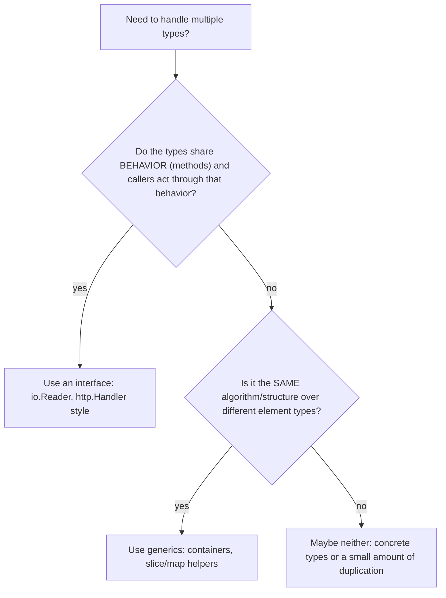

# Generics in Go

Go 1.18 (2022) added type parameters after a decade of debate, enabling type-safe generic functions and data structures without `interface{}` casts or code generation. This guide covers the syntax, constraints (including `comparable` and custom interface constraints), the crucial judgment call of generics vs interfaces, real examples you can reuse in interviews, and the deliberate limitations of Go's design.

## Type Parameters

Type parameters appear in square brackets before ordinary parameters; each has a **constraint** describing what the type must support:

```go
// T is a type parameter; any is the loosest constraint (interface{}).
func First[T any](s []T) (T, bool) {
    var zero T                 // the zero value of T — a common generic idiom
    if len(s) == 0 {
        return zero, false
    }
    return s[0], true
}

n, ok := First([]int{1, 2, 3})       // T inferred as int — no explicit brackets
s, ok := First([]string{"a", "b"})   // T inferred as string
p, ok := First[float64](nil)         // explicit instantiation when inference can't
```

Type inference means call sites usually look like normal function calls. Before generics, this function would have taken `[]interface{}` (forcing allocations and casts) or been copy-pasted per type.

## Constraints

A constraint is just an interface, used at compile time to bound a type parameter.

### comparable

The built-in `comparable` constraint permits types usable with `==`/`!=` — required for map keys:

```go
func Contains[T comparable](s []T, target T) bool {
    for _, v := range s {
        if v == target {       // legal only because T is comparable
            return true
        }
    }
    return false
}

func Unique[T comparable](s []T) []T {
    seen := make(map[T]struct{}, len(s))  // T as a map key needs comparable
    out := make([]T, 0, len(s))
    for _, v := range s {
        if _, ok := seen[v]; !ok {
            seen[v] = struct{}{}
            out = append(out, v)
        }
    }
    return out
}
```

### Union constraints and ~ (underlying types)

Constraints can list type unions. The tilde `~int` means "any type whose *underlying* type is int", so named types like `type Celsius int` qualify:

```go
type Number interface {
    ~int | ~int32 | ~int64 | ~float32 | ~float64
}

func Sum[T Number](nums []T) T {
    var total T
    for _, n := range nums {
        total += n             // + is legal: every type in the union supports it
    }
    return total
}

type Celsius float64
temps := []Celsius{20.5, 22.1}
fmt.Println(Sum(temps))        // works because of ~float64
```

The standard `cmp` package (Go 1.21) ships `cmp.Ordered` for everything supporting `<`, so you rarely define numeric constraints yourself.

### Method-based constraints

Ordinary interfaces work as constraints too:

```go
type Stringer interface{ String() string }

func JoinStrings[T Stringer](items []T, sep string) string {
    parts := make([]string, len(items))
    for i, it := range items {
        parts[i] = it.String()
    }
    return strings.Join(parts, sep)
}
```

## Generics vs Interfaces: When to Use Which

This judgment call is the most common generics interview question.



- **Interfaces** abstract over *behavior*: "anything I can Read from". The concrete type varies at **runtime**; heterogeneous collections work (`[]io.Reader` with files and buffers mixed).
- **Generics** abstract over *element types* for identical code: "a slice of any single T". Types are fixed at **compile time**; you keep the concrete type end-to-end (no boxing, no assertions), and you can express relationships like "returns the same type it takes".

Rule of thumb from the Go team: **start with interfaces; reach for generics when you catch yourself writing the same function per type or casting from `any`.** Functions operating on slices/maps/channels of any element are the sweet spot (`slices.Sort`, `maps.Keys` in the stdlib are exactly this).

## Real Examples

### Map / Filter / Reduce

```go
func Map[T, U any](s []T, f func(T) U) []U {
    out := make([]U, 0, len(s))
    for _, v := range s {
        out = append(out, f(v))
    }
    return out
}

func Filter[T any](s []T, keep func(T) bool) []T {
    out := make([]T, 0, len(s))
    for _, v := range s {
        if keep(v) {
            out = append(out, v)
        }
    }
    return out
}

func Reduce[T, U any](s []T, init U, f func(U, T) U) U {
    acc := init
    for _, v := range s {
        acc = f(acc, v)
    }
    return acc
}

// Usage — fully type-checked, zero casts:
names := Map(users, func(u User) string { return u.Name })
adults := Filter(users, func(u User) bool { return u.Age >= 18 })
total := Reduce(orders, 0.0, func(sum float64, o Order) float64 { return sum + o.Amount })
```

### A generic data structure: type-safe stack

```go
type Stack[T any] struct {
    items []T
}

func (s *Stack[T]) Push(v T)  { s.items = append(s.items, v) }

func (s *Stack[T]) Pop() (T, bool) {
    var zero T
    if len(s.items) == 0 {
        return zero, false
    }
    v := s.items[len(s.items)-1]
    s.items = s.items[:len(s.items)-1]
    return v, true
}

var st Stack[int]
st.Push(1)
st.Push(2)
v, _ := st.Pop()   // v is an int — no type assertion, unlike the pre-generics []any version
```

The same pattern builds `Queue[T]`, `Set[T comparable]`, `LRUCache[K comparable, V any]` — classic interview data structures, now type-safe.

### What NOT to do

```go
// BAD: needless generics — the interface already says everything.
func WriteAll[W io.Writer](w W, data []byte) error { // just take io.Writer!
    _, err := w.Write(data)
    return err
}

// BAD: any-constrained parameter you then need operators on — won't compile.
func Add[T any](a, b T) T {
    return a + b               // ERROR: operator + not defined for T (constraint is any)
}
// Fix: constrain it — func Add[T cmp.Ordered](a, b T) T
```

## Limitations

Deliberate omissions to keep the language simple — know these for senior interviews:

- **No generic methods.** Methods cannot introduce their own type parameters (`func (s *Stack[T]) Map[U any](...)` is illegal); use a package-level function instead. This preserves simple interface satisfaction rules.
- **No specialization or overloading.** You cannot write a faster version for a particular type; one body serves all instantiations.
- **Constraint interfaces with unions can't be used as ordinary variable types** — `var x Number` is illegal; unions exist only for constraints.
- **No compile-time metaprogramming** — constraints express operations, not arbitrary predicates.
- **Implementation is a hybrid** ("GC shapes stenciling"): types with the same memory shape (e.g., all pointers) share generated code passing a runtime dictionary, so generic code can be marginally slower than hand-specialized code — usually irrelevant, occasionally measurable in hot loops.

Real-world adoption: the standard library's `slices`, `maps`, and `cmp` packages, `sync.OnceValue`, and libraries like `samber/lo` are the canonical uses — utility functions and containers, not sprawling generic frameworks.

## Best Practices

- Reach for generics only to eliminate real duplication or `any`-plus-assertion code; don't genericize speculatively.
- Prefer stdlib `slices`/`maps`/`cmp` helpers over hand-rolling your own Map/Filter in production code.
- Use the narrowest constraint that compiles: `comparable` for map keys/equality, `cmp.Ordered` for sorting, method interfaces for behavior.
- Include `~` in custom union constraints so named types (`type ID int64`) aren't locked out.
- Keep type-parameter lists short (one or two); if a function needs four type parameters, the design is probably wrong.
- Return `(T, bool)` or `(T, error)` with an explicit `var zero T` for "not found" cases.
- When a plain interface parameter expresses the contract (`io.Writer`), use it — generics add nothing there.

## Interview Questions

<details>
<summary>1. What problem do generics solve that interfaces couldn't?</summary>

Type-safe code over *element types* without runtime cost or casts. Pre-generics, a general-purpose container or slice helper took `interface{}`: callers lost static typing, needed type assertions on the way out, and paid boxing allocations. Interfaces also can't express "the return type equals the input element type" — `func Reverse(s []any) []any` loses the type, while `func Reverse[T any](s []T) []T` preserves it. Generics move that checking to compile time while keeping one implementation.
</details>

<details>
<summary>2. What is the comparable constraint and when do you need it?</summary>

`comparable` is a built-in constraint satisfied by types supporting `==`/`!=` — numbers, strings, booleans, pointers, channels, interfaces, and arrays/structs of comparable types (not slices, maps, funcs). You need it whenever a type parameter is used as a map key or compared with `==` — e.g., `Contains`, `Unique`, `Set[T comparable]`. Without it, the compiler rejects the comparison because not every type instantiation would support it.
</details>

<details>
<summary>3. What does the tilde in ~int mean inside a constraint?</summary>

`~int` matches any type whose *underlying type* is `int` — including named types like `type UserID int`. A bare `int` in a union matches only `int` itself, so defined types would fail the constraint. Idiomatic numeric constraints use tildes throughout (`~int | ~float64 ...`), which is exactly how `cmp.Ordered` is defined, so domain types (`type Meters float64`) work with generic math and sorting functions.
</details>

<details>
<summary>4. When would you still choose an interface over a type parameter?</summary>

When the abstraction is about *behavior* rather than element type: `io.Reader`, `http.Handler`, `fmt.Stringer`. Interfaces support runtime polymorphism (deciding the implementation dynamically, plugging in mocks), heterogeneous collections (`[]io.Reader` mixing files and buffers), and keep APIs simpler — `func Copy(dst io.Writer, src io.Reader)` needs no type parameters. Generics only pay off when identical code must work over multiple types *while preserving* those types, or when constraints like `comparable` are needed. Signature smell: `func F[T SomeInterface](x T)` used once is usually just `func F(x SomeInterface)`.
</details>

<details>
<summary>5. Why doesn't func Add[T any](a, b T) T { return a + b } compile, and how do you fix it?</summary>

The constraint `any` promises nothing about T, so the operator `+` is not available — the compiler type-checks the generic body against the constraint, not against each instantiation (unlike C++ templates). Fix: use a constraint whose type set all supports `+`, e.g. `cmp.Ordered` (numbers and strings) or a custom `Number` union with tildes. This "type-check the body once against the constraint" model is why Go generics give clear errors at the definition site instead of C++-style instantiation error spew.
</details>

<details>
<summary>6. Can methods have their own type parameters in Go? What is the workaround?</summary>

No — only functions and types can be parameterized; a method may use its receiver's type parameters but cannot introduce new ones. So `Stack[T]` can't have a method `Map[U](f func(T) U) Stack[U]`. The reason: it would make interface satisfaction and runtime method sets ill-defined (an interface couldn't enumerate infinitely many instantiations). Workaround: a package-level generic function taking the receiver as a parameter — `func MapStack[T, U any](s Stack[T], f func(T) U) Stack[U]`.
</details>

<details>
<summary>7. How are Go generics implemented under the hood, and how does that differ from C++ and Java?</summary>

Go uses a hybrid called GC-shape stenciling: it generates one copy of the function per *memory shape* (all pointer types share one shape, `int` another, etc.) and passes a hidden dictionary of type metadata for operations that differ within a shape. C++ templates fully monomorphize — one specialized copy per type, maximal speed, code bloat, errors at instantiation. Java erases — one copy operating on boxed Objects, with casts inserted. Go sits between: mostly monomorphized performance without unbounded code growth, at the cost of occasional dictionary-lookup overhead versus hand-specialized code.
</details>

<details>
<summary>8. Design a type-safe Set with union, intersection. What constraint does it need and why?</summary>

`type Set[T comparable] map[T]struct{}` — `comparable` because elements are map keys. Methods: `Add(v T)` inserts `struct{}{}`; `Has(v T)` uses the comma-ok idiom; `Union(o Set[T])`/`Intersect(o Set[T])` build a new set ranging over the receivers. `struct{}` values occupy zero bytes, so the set costs only its keys. Pre-generics this was either copy-pasted per type or `map[interface{}]struct{}` with boxing and no compile-time element checking — the Set is the textbook argument for generic containers.
</details>
