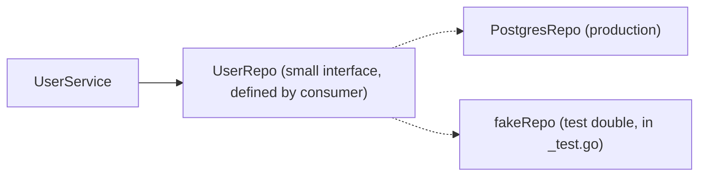

# Testing in Go

Testing is built into Go's toolchain — no framework required. `go test` discovers `_test.go` files, and the `testing` package covers unit tests, benchmarks, and fuzzing. This guide focuses on the patterns interviewers expect you to write on the spot: table-driven tests with subtests, benchmarks, interface-based mocking, plus the pragmatic ecosystem (testify) and coverage tooling.

## The testing Package

A test is any function `TestXxx(t *testing.T)` in a `_test.go` file of the same package:

```go
// mathx/mathx.go
package mathx

func Abs(x int) int {
    if x < 0 { return -x }
    return x
}

// mathx/mathx_test.go
package mathx

import "testing"

func TestAbs(t *testing.T) {
    got := Abs(-5)
    if got != 5 {
        t.Errorf("Abs(-5) = %d; want 5", got) // Errorf: report and continue
    }
}
```

```bash
go test ./...          # run all tests in the module
go test -v -run Abs    # verbose, filter by regexp
go test -race ./...    # ALWAYS use -race in CI
```

Key `t` methods: `t.Errorf` (fail, keep going), `t.Fatalf` (fail, stop this test — use when continuing is pointless, e.g., setup failed), `t.Helper()` (marks a helper so failures report the caller's line), `t.Cleanup(f)` (deferred teardown, runs even on failure), `t.Parallel()` (run alongside other parallel tests), `t.TempDir()` (auto-cleaned scratch directory).

Note there are no assertion keywords — plain `if` plus `t.Errorf` with a `got/want` message is the standard-library style, and Go interviews accept (often prefer) it.

## Table-Driven Tests: The Canonical Pattern

The single most idiomatic Go testing pattern — a slice of cases, one loop, one assertion body:

```go
func TestParseSize(t *testing.T) {
    tests := []struct {
        name    string
        input   string
        want    int64
        wantErr bool
    }{
        {name: "plain bytes", input: "512", want: 512},
        {name: "kilobytes", input: "4K", want: 4096},
        {name: "megabytes", input: "2M", want: 2 << 20},
        {name: "empty input", input: "", wantErr: true},
        {name: "negative", input: "-1K", wantErr: true},
    }

    for _, tt := range tests {
        t.Run(tt.name, func(t *testing.T) {   // subtest per case
            got, err := ParseSize(tt.input)
            if (err != nil) != tt.wantErr {
                t.Fatalf("ParseSize(%q) error = %v, wantErr %v", tt.input, err, tt.wantErr)
            }
            if !tt.wantErr && got != tt.want {
                t.Errorf("ParseSize(%q) = %d, want %d", tt.input, got, tt.want)
            }
        })
    }
}
```

Why interviewers love it: adding a case is one line; each case has a name that shows up in failures (`TestParseSize/empty_input`); `go test -run 'TestParseSize/kilo'` runs one case; edge cases become impossible to forget.

### Subtests

`t.Run` creates named subtests that can nest, run in parallel, and be filtered individually:

```go
func TestStore(t *testing.T) {
    store := newTestStore(t)                 // shared setup

    t.Run("get missing key", func(t *testing.T) {
        t.Parallel()                         // subtests can parallelize
        if _, ok := store.Get("nope"); ok {
            t.Error("expected miss")
        }
    })
    t.Run("set then get", func(t *testing.T) { ... })
}
```

## Benchmarks

`BenchmarkXxx(b *testing.B)` functions measure performance; the framework calibrates `b.N` automatically:

```go
func BenchmarkConcatPlus(b *testing.B) {
    for i := 0; i < b.N; i++ {
        s := ""
        for j := 0; j < 100; j++ { s += "x" }   // quadratic: allocates every +=
        _ = s
    }
}

func BenchmarkConcatBuilder(b *testing.B) {
    for i := 0; i < b.N; i++ {
        var sb strings.Builder
        for j := 0; j < 100; j++ { sb.WriteString("x") }
        _ = sb.String()
    }
}
```

```bash
go test -bench=. -benchmem
# BenchmarkConcatPlus-8      50000    25000 ns/op   53000 B/op   99 allocs/op
# BenchmarkConcatBuilder-8  2000000     600 ns/op     504 B/op    6 allocs/op
```

`-benchmem` reveals allocations per op — usually the real story. Use `b.ResetTimer()` after expensive setup, `b.ReportAllocs()`, and compare runs statistically with `benchstat`.

## Fuzzing

Built in since Go 1.18: the engine mutates inputs to find panics and property violations:

```go
func FuzzParseSize(f *testing.F) {
    f.Add("4K")                       // seed corpus
    f.Add("512")
    f.Fuzz(func(t *testing.T, input string) {
        size, err := ParseSize(input)
        if err == nil && size < 0 {   // property: no negative sizes without error
            t.Errorf("ParseSize(%q) = %d, negative without error", input, size)
        }
    })
}
// go test -fuzz=FuzzParseSize -fuzztime=30s ; failing inputs are saved to testdata/
```

Fuzzing shines on parsers, decoders, and validators — anything consuming untrusted bytes. Round-trip properties (`decode(encode(x)) == x`) make excellent fuzz targets.

## Mocking via Interfaces

Go's testing story for dependencies is *interfaces + hand-written fakes* — no mocking framework needed. Design code to depend on small interfaces, then substitute a fake in tests:



```go
// Production code depends on the interface it needs — not on *sql.DB.
type UserRepo interface {
    FindByID(ctx context.Context, id int64) (*User, error)
}

type UserService struct{ repo UserRepo }

func (s *UserService) DisplayName(ctx context.Context, id int64) (string, error) {
    u, err := s.repo.FindByID(ctx, id)
    if err != nil {
        return "", fmt.Errorf("display name: %w", err)
    }
    return strings.TrimSpace(u.Name), nil
}

// Test double — a few lines, no framework:
type fakeRepo struct {
    users map[int64]*User
    err   error
}

func (f *fakeRepo) FindByID(_ context.Context, id int64) (*User, error) {
    if f.err != nil { return nil, f.err }
    u, ok := f.users[id]
    if !ok { return nil, ErrNotFound }
    return u, nil
}

func TestDisplayName(t *testing.T) {
    svc := &UserService{repo: &fakeRepo{users: map[int64]*User{7: {Name: "  Ann "}}}}
    got, err := svc.DisplayName(context.Background(), 7)
    if err != nil { t.Fatal(err) }
    if got != "Ann" { t.Errorf("got %q, want %q", got, "Ann") }
}
```

For HTTP, the stdlib provides `httptest`:

```go
srv := httptest.NewServer(http.HandlerFunc(func(w http.ResponseWriter, r *http.Request) {
    fmt.Fprint(w, `{"status":"ok"}`)
}))
defer srv.Close()
resp, _ := http.Get(srv.URL)   // a real server on a random port — no mocks
```

Generated mocks (`mockgen`, `moq`) exist for large interfaces, but hand-written fakes are the idiomatic default.

## testify

`github.com/stretchr/testify` is the most popular third-party assertion library:

```go
import (
    "github.com/stretchr/testify/assert"
    "github.com/stretchr/testify/require"
)

func TestWithTestify(t *testing.T) {
    got, err := ParseSize("4K")
    require.NoError(t, err)                 // require: stop on failure (like Fatal)
    assert.Equal(t, int64(4096), got)       // assert: record and continue
    assert.Contains(t, []string{"a", "b"}, "a")
}
```

`require` for preconditions, `assert` for the actual checks. Testify also offers `suite` (setup/teardown lifecycles) and `mock`. Many teams use it; many (including the stdlib) don't — be comfortable both ways in interviews.

## Coverage

```bash
go test -cover ./...                          # summary percentage
go test -coverprofile=cover.out ./...
go tool cover -html=cover.out                 # line-by-line browser view
go test -covermode=atomic -race ./...         # accurate counts under parallelism
```

Coverage tells you what you *forgot to exercise*; it does not prove correctness. Healthy Go teams treat it as a discovery tool (find untested error paths) rather than a target to game. Real-world CI typically gates on `go vet`, `-race`, and a coverage floor.

## Best Practices

- Default to table-driven tests with named subtests; name cases by behavior ("empty input"), not numbers.
- Write failure messages as `got X, want Y` including inputs — a failing test should be debuggable from its output alone.
- Use `t.Fatalf` only when continuing is meaningless; prefer `t.Errorf` so one run reports all failures.
- Mark helpers with `t.Helper()` and use `t.Cleanup`/`t.TempDir` instead of manual teardown.
- Depend on small consumer-defined interfaces so hand-written fakes stay trivial; don't mock what you can use for real (`httptest`, in-memory SQLite).
- Test through the public API (`package foo_test`) by default; test internals only when the algorithm warrants it.
- Run `-race` always; add `-benchmem` to every benchmark; keep benchmarks honest with `b.ResetTimer`.
- Avoid time.Sleep synchronization in tests — inject clocks or synchronize on channels; sleeps create flakes.

## Interview Questions

<details>
<summary>1. What is a table-driven test and why is it the canonical Go pattern?</summary>

A slice of anonymous-struct test cases (name, inputs, expected outputs) iterated in a loop, with each case run via `t.Run(tt.name, ...)` as a named subtest. Benefits: adding a case is one line, so edge cases actually get added; the assertion logic exists once, so all cases are checked identically; failures name the exact case (`TestX/empty_input`); and individual cases can be filtered with `-run` or parallelized. It reflects Go's preference for plain data + plain loops over DSLs.
</details>

<details>
<summary>2. When do you use t.Errorf vs t.Fatalf?</summary>

`t.Errorf` marks the test failed but continues executing, letting one run surface multiple independent failures — right for the assertion phase. `t.Fatalf` marks it failed and stops that test (goroutine) immediately — right when proceeding is meaningless or dangerous: setup failed, an unexpected error occurred, or a value you're about to dereference is nil. In table tests: `Fatalf` inside a subtest kills only that subtest. Caveat: `Fatalf` must not be called from goroutines the test spawned — it calls `runtime.Goexit` on the wrong goroutine.
</details>

<details>
<summary>3. How do you mock dependencies in Go without a mocking framework?</summary>

Design the consumer to depend on a small interface it defines (e.g., `UserRepo` with just `FindByID`), inject the implementation via constructor, and in tests supply a hand-written fake — a struct with a map of canned data or configurable function fields (`type fakeRepo struct { findFn func(...) }`). Because Go interfaces are satisfied implicitly and are ideally 1-3 methods, fakes cost a few lines. For HTTP dependencies use `httptest.NewServer`; for time inject a clock. Codegen mocks exist but idiomatic Go leans on fakes.
</details>

<details>
<summary>4. How does b.N work in benchmarks, and what mistakes invalidate benchmark results?</summary>

The framework runs your benchmark function repeatedly, increasing `b.N` (1, 100, 10000, ...) until the timed loop runs long enough (~1s) for a statistically stable ns/op. Mistakes: doing expensive setup inside the timed region (fix: `b.ResetTimer()` after setup); letting the compiler optimize away the work because results are unused (fix: assign to a package-level sink or use the result); measuring with a cold cache once instead of letting calibration work; ignoring allocations (`-benchmem`); and comparing single runs instead of using `benchstat` across multiple runs.
</details>

<details>
<summary>5. What is fuzzing and what kinds of code benefit most?</summary>

Fuzzing (native since Go 1.18) executes a property-checking function `f.Fuzz(func(t *testing.T, input ...))` against engine-mutated inputs derived from seed corpus entries, guided by coverage feedback, hunting for panics, hangs, or property violations; failing inputs are minimized and saved to `testdata` as regression tests. It excels on code parsing untrusted input — decoders, parsers, validators, protocol handlers — and on round-trip properties like `Unmarshal(Marshal(x)) == x`. It complements table tests by finding the cases you didn't think of.
</details>

<details>
<summary>6. What is the difference between assert and require in testify?</summary>

Both provide the same assertion set, but on failure `assert.*` records the error and lets the test continue (like `t.Errorf`), while `require.*` stops the test immediately (like `t.Fatalf`). Convention: `require` for preconditions whose failure invalidates everything after them (`require.NoError(t, err)` before using the result), `assert` for independent checks so one run reports them all. Mixing them deliberately makes tests both safe and informative.
</details>

<details>
<summary>7. What does the _test package suffix (package foo_test) do and why use it?</summary>

Files in `foo_test` package (allowed in the same directory as `foo`) can only access `foo`'s exported API — black-box testing. Benefits: tests document and verify the public contract exactly as consumers experience it; refactoring internals doesn't break tests; it also breaks import cycles when tests need a package that itself imports `foo`. White-box tests of unexported details stay in `package foo`; a common hybrid is a small `export_test.go` exposing internals only to tests.
</details>

<details>
<summary>8. Your test suite is flaky under -race and parallel execution. What are the usual suspects?</summary>

(1) Shared mutable package-level state between tests (globals, seeded rand, env vars) — parallel tests stomp each other; (2) `time.Sleep`-based synchronization — replace with channels, `sync.WaitGroup`, or polling with timeout; (3) goroutines started by a test outliving it and touching `t` after completion (also: calling `t.Fatal` from a spawned goroutine); (4) table tests capturing the loop variable in parallel subtests (pre-Go 1.22, each iteration needed `tt := tt`); (5) real time/network dependencies. Fixes: inject dependencies, isolate state per test with `t.TempDir`/`t.Setenv`, synchronize explicitly, and treat every race report as a product bug, not a test bug.
</details>
