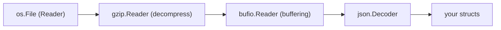

# Go Standard Library and Tooling

Go's standard library is famously "batteries included" for server software: production-grade HTTP, JSON, and I/O primitives ship in the box, and the toolchain includes formatting, static analysis, and profiling. Interviews routinely ask you to build a small HTTP service from the stdlib alone, explain `io.Reader` composition, and describe how you'd profile a slow endpoint.

## net/http: Server

A production-shaped server needs nothing outside the stdlib:

```go
package main

import (
    "encoding/json"
    "log"
    "net/http"
    "time"
)

type UserHandler struct{ store *Store }

func (h *UserHandler) ServeHTTP(w http.ResponseWriter, r *http.Request) {
    id := r.PathValue("id")               // Go 1.22+ pattern routing
    u, err := h.store.Find(r.Context(), id) // propagate the request context!
    if err != nil {
        http.Error(w, "not found", http.StatusNotFound)
        return
    }
    w.Header().Set("Content-Type", "application/json")
    json.NewEncoder(w).Encode(u)
}

func main() {
    mux := http.NewServeMux()
    mux.Handle("GET /users/{id}", &UserHandler{store: newStore()})
    mux.HandleFunc("GET /healthz", func(w http.ResponseWriter, r *http.Request) {
        w.WriteHeader(http.StatusOK)
    })

    srv := &http.Server{                  // never use http.ListenAndServe defaults in prod:
        Addr:         ":8080",            // they have NO timeouts
        Handler:      mux,
        ReadTimeout:  5 * time.Second,
        WriteTimeout: 10 * time.Second,
        IdleTimeout:  60 * time.Second,
    }
    log.Fatal(srv.ListenAndServe())
}
```

Facts interviewers probe: every request runs in **its own goroutine** (concurrency is free, but shared state needs synchronization); `http.Handler` is a one-method interface, so middleware is just a function from Handler to Handler:

```go
func logging(next http.Handler) http.Handler {
    return http.HandlerFunc(func(w http.ResponseWriter, r *http.Request) {
        start := time.Now()
        next.ServeHTTP(w, r)
        log.Printf("%s %s %v", r.Method, r.URL.Path, time.Since(start))
    })
}
// srv.Handler = logging(mux)  — middleware chains are plain composition
```

## net/http: Client

```go
client := &http.Client{Timeout: 10 * time.Second} // default client has NO timeout — always set one

ctx, cancel := context.WithTimeout(context.Background(), 3*time.Second)
defer cancel()
req, _ := http.NewRequestWithContext(ctx, http.MethodGet, "https://api.example.com/users", nil)

resp, err := client.Do(req)
if err != nil {
    return err
}
defer resp.Body.Close()                 // ALWAYS close — leaks connections otherwise
if resp.StatusCode != http.StatusOK {
    return fmt.Errorf("unexpected status: %s", resp.Status)
}
var users []User
if err := json.NewDecoder(resp.Body).Decode(&users); err != nil {
    return fmt.Errorf("decode users: %w", err)
}
```

Classic pitfalls: forgetting `resp.Body.Close()` (connection pool exhaustion), forgetting a timeout (goroutines stuck forever on a dead upstream), and not draining/closing the body on non-200 paths.

## encoding/json

Struct tags control marshaling:

```go
type User struct {
    ID        int64      `json:"id"`
    Name      string     `json:"name"`
    Email     string     `json:"email,omitempty"`   // omitted when zero value
    Password  string     `json:"-"`                 // never serialized
    CreatedAt time.Time  `json:"created_at"`
    Nickname  *string    `json:"nickname"`          // pointer: distinguishes null/absent from ""
}

data, err := json.Marshal(u)                    // struct -> []byte
err = json.Unmarshal(data, &u)                  // []byte -> struct (pass a POINTER)

// Streaming variants for readers/writers (no intermediate buffer):
json.NewDecoder(r.Body).Decode(&u)
json.NewEncoder(w).Encode(u)
```

Gotchas worth naming in interviews: only **exported** fields marshal (a struct of lowercase fields silently produces `{}`); unknown incoming fields are ignored by default (`dec.DisallowUnknownFields()` to reject); JSON numbers decode into `any` as `float64`; `omitempty` treats zero values as empty, so `0` and `false` vanish too — use pointers when "absent" and "zero" must differ.

## io.Reader / io.Writer Composition

The most important interfaces in Go:

```go
type Reader interface { Read(p []byte) (n int, err error) }
type Writer interface { Write(p []byte) (n int, err error) }
```

Everything that produces or consumes bytes implements them — files, sockets, HTTP bodies, buffers, compressors, hashers — so small pieces compose like Unix pipes:



```go
f, err := os.Open("events.json.gz")
if err != nil { return err }
defer f.Close()

gz, err := gzip.NewReader(f)            // wraps a Reader, is a Reader
if err != nil { return err }
defer gz.Close()

dec := json.NewDecoder(bufio.NewReader(gz)) // buffered, streaming decode
for dec.More() {
    var e Event
    if err := dec.Decode(&e); err != nil { return err }
    process(e)                          // constant memory, any file size
}

// Other composition workhorses:
n, err := io.Copy(dst, src)             // pump Reader -> Writer
tee := io.TeeReader(src, hasher)        // read while hashing
mw := io.MultiWriter(file, os.Stdout)   // write to many at once
lim := io.LimitReader(conn, 1<<20)      // cap untrusted input at 1MB
```

This is why Go functions should accept `io.Reader`/`io.Writer` rather than filenames or byte slices — callers can then plug in files, network streams, or in-memory buffers (crucial for tests).

## time

```go
now := time.Now()
deadline := now.Add(30 * time.Second)
elapsed := time.Since(start)                    // convenience for Now().Sub(start)

// Formatting uses the REFERENCE date: Mon Jan 2 15:04:05 MST 2006 (1 2 3 4 5 6 7)
s := now.Format("2006-01-02 15:04")
t2, err := time.Parse(time.RFC3339, "2026-01-02T15:04:05Z")

// Timers and tickers
timer := time.NewTimer(5 * time.Second)         // fires once on timer.C
ticker := time.NewTicker(time.Second)           // fires repeatedly on ticker.C
defer ticker.Stop()                             // stop tickers or they leak

select {
case <-work:
case <-timer.C:                                 // timeout branch
}
```

Know that `time.Time` contains both a wall clock and a monotonic clock reading — `time.Since` uses the monotonic part, so NTP adjustments can't produce negative durations.

## Tooling: gofmt, vet, staticcheck

```bash
gofmt -l -w .        # canonical formatting (goimports also fixes imports)
go vet ./...         # official static analysis: printf arg mismatches, copied mutexes,
                     # unreachable code, bad struct tags, lost cancel funcs...
staticcheck ./...    # third-party (honnef.co): ~150 extra checks — unused code,
                     # deprecated APIs, simplifications, subtle bugs (SA* checks)
```

The culture point matters in interviews: formatting is non-negotiable and automated, `go vet` runs in every serious CI pipeline, and `staticcheck` (or `golangci-lint`, which aggregates many linters) is the de facto extended standard. Code review in Go teams is about design, not style.

## pprof: Profiling Basics

Go has first-class production profiling. For services, expose the HTTP endpoints:

```go
import _ "net/http/pprof"   // registers /debug/pprof/* on DefaultServeMux

go func() { log.Println(http.ListenAndServe("localhost:6060", nil)) }()
```

```bash
go tool pprof http://localhost:6060/debug/pprof/profile?seconds=30  # CPU
go tool pprof http://localhost:6060/debug/pprof/heap                # live memory
go tool pprof http://localhost:6060/debug/pprof/goroutine           # goroutine dump (leak hunting)
# inside pprof: top, list FuncName, web (flame graph in browser: -http=:8081)

go test -cpuprofile=cpu.out -memprofile=mem.out -bench=.            # profile benchmarks
```

Workflow for "the endpoint is slow": reproduce under load, capture a 30s CPU profile, `top`/flame-graph to find the hot function, check the heap profile for allocation pressure (GC time often *is* the CPU cost), fix, re-benchmark with `benchstat`. The goroutine profile is the tool for leak diagnosis — a count that only grows is a leak. `runtime/trace` goes deeper for latency/scheduling mysteries.

Real-world: this stack (pprof + flame graphs in production) is standard operating procedure at Google, Uber, and Cloudflare — continuous profilers like Parca/Pyroscope build directly on Go's pprof format.

## Best Practices

- Always configure `http.Server` and `http.Client` timeouts; the zero-value defaults are infinite and will eventually take down a service.
- Propagate `r.Context()` into every downstream call so client disconnects cancel work.
- Always `defer resp.Body.Close()`, and read bodies to EOF so connections return to the pool.
- Accept `io.Reader`/`io.Writer` in APIs instead of `[]byte`/filenames; stream instead of buffering whole payloads.
- Use `json.NewDecoder/Encoder` on streams; reserve `Marshal/Unmarshal` for in-memory data.
- Use pointers (or `json.RawMessage`) when JSON null/absent must be distinguishable from zero values.
- Wire `gofmt` + `go vet` + `staticcheck` (or golangci-lint) into CI from day one.
- Add the pprof endpoint (on a localhost-only or internal port) to every long-running service *before* you need it.

## Interview Questions

<details>
<summary>1. How does net/http handle concurrent requests, and what does that imply for your code?</summary>

The server accepts each connection and serves each request in its own goroutine — concurrency is automatic and effectively unbounded. Implications: handlers must be safe for concurrent execution, so any shared state (caches, counters, maps) needs mutexes or channels; per-request state should live in local variables or the request context, never in handler struct fields; and you should bound expensive downstream fan-out yourself (worker pools, semaphores) because the server won't. A data race in a handler is the classic production Go bug.
</details>

<details>
<summary>2. Why must you set timeouts on http.Server and http.Client, and which ones matter?</summary>

The zero values mean *no timeout*: a slow-loris client can hold server connections open forever (fd/goroutine exhaustion), and a hung upstream leaves client calls blocked eternally. Server: `ReadTimeout`/`ReadHeaderTimeout` (slow request bodies/headers), `WriteTimeout` (slow readers), `IdleTimeout` (keep-alive lifetime). Client: either `http.Client.Timeout` for a whole-request cap or per-request `context.WithTimeout` for finer control (plus transport-level dial/TLS timeouts). In production both sides get timeouts, always.
</details>

<details>
<summary>3. Explain omitempty, the json:"-" tag, and why a struct might marshal to {}.</summary>

`json:"name,omitempty"` drops the field when it holds its type's empty value (zero number, "", false, nil, empty slice/map) — beware that legitimate `0`/`false` values disappear too; use pointer fields when absence must be distinct. `json:"-"` excludes a field entirely (a field literally named "-" needs `json:"-,"`). A struct marshals to `{}` when all its fields are unexported — `encoding/json` uses reflection and can only see exported fields; this silent failure is a favorite debugging question.
</details>

<details>
<summary>4. Why do so many Go APIs take io.Reader instead of []byte or a filename?</summary>

Three wins. Generality: one function works with files, sockets, HTTP bodies, gzip streams, and in-memory buffers — anything with a `Read` method. Memory: streaming processes arbitrarily large inputs in constant memory instead of slurping everything into a slice. Testability: tests pass `strings.NewReader("input")` with no filesystem. Composition multiplies the value — wrap the reader in `bufio`, `gzip`, `io.LimitReader`, or `io.TeeReader` without the consumer changing at all. Same reasoning applies to `io.Writer` on the output side.
</details>

<details>
<summary>5. What is special about Go's time formatting, and what do timers/tickers leak if mishandled?</summary>

Go formats times with a reference-date layout instead of format codes: the layout string is how the specific moment `Mon Jan 2 15:04:05 MST 2006` would appear (chosen because the fields count 1-2-3-4-5-6-7) — e.g., `"2006-01-02"` means YYYY-MM-DD. For tickers: `time.NewTicker` must be `Stop()`ped or its goroutine/timer runs for the process lifetime; pre-1.23, abandoned `time.After` timers also lingered until firing, so long-lived loops preferred `NewTimer` with explicit `Stop`. (Go 1.23 made unreferenced timers collectable, but explicit Stop remains good practice.)
</details>

<details>
<summary>6. What classes of bugs do go vet and staticcheck catch? Give concrete examples.</summary>

`go vet` (official, CI-standard): `Printf` format/argument mismatches, copying a struct containing a `sync.Mutex`, malformed struct tags, unreachable code, `context.WithCancel`'s cancel func discarded, misuse of `sync.WaitGroup.Add` in the wrong place. `staticcheck` adds ~150 checks: unused variables/functions, deprecated API usage, always-true/false conditions, wrong `time.Duration` arithmetic, inefficient string conversions, and subtle correctness issues (the SA class) like deferring `resp.Body.Close` before checking the error. They're static complements to the dynamic `-race` detector.
</details>

<details>
<summary>7. An endpoint's p99 latency spiked. Walk me through diagnosing it with pprof.</summary>

Confirm and reproduce under representative load. Capture a CPU profile (`/debug/pprof/profile?seconds=30`) during the spike and read the flame graph (`-http=`) for hot frames — is time in your code, serialization, GC (`runtime.gcBgMarkWorker`), or lock contention (`sync.(*Mutex)`)? If GC dominates, take a heap profile with `-alloc_space` to find allocation-heavy call sites and reduce them (preallocation, pooling, streaming). If neither, check the goroutine profile for pile-ups (thousands blocked on one mutex or an upstream call — a contention or dependency problem, not CPU) and `block`/`mutex` profiles for waiting. Fix, then verify with benchmarks (`benchstat`) and a fresh profile.
</details>

<details>
<summary>8. What happens if you forget resp.Body.Close(), and why must you drain the body too?</summary>

Each unclosed body pins its underlying TCP connection: it can't return to the `http.Transport` keep-alive pool, so the client dials new connections until it exhausts file descriptors or trips `MaxConnsPerHost` — a slow, production-only leak. Draining matters because a connection is only reused if the response has been fully read; closing with bytes unread may kill the connection instead of pooling it. Idiom: `defer resp.Body.Close()` immediately after the error check, and on paths that ignore the payload, `io.Copy(io.Discard, resp.Body)` before close to keep keep-alive effective.
</details>
