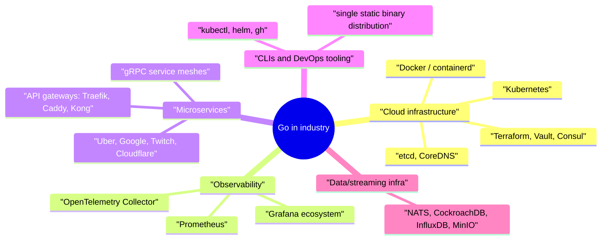

# Go Best Practices and Ecosystem

Writing Go that compiles is easy; writing *idiomatic* Go is what interviews and code reviews actually assess. This guide distills the idioms the community enforces — small interfaces, explicit errors, sensible project layout — then maps the ecosystem: where Go dominates in industry, the libraries you're expected to recognize, and the performance techniques that matter in practice.

## Idiomatic Go

### Accept interfaces, return structs

```go
// GOOD: caller can pass a file, network stream, buffer, or test fake.
func ParseReport(r io.Reader) (*Report, error) { ... }

// The constructor returns the concrete type — callers keep full access,
// and can wrap it in their own interface if they want abstraction.
func NewClient(cfg Config) *Client { ... }

// BAD: returning an interface hides methods and freezes your API.
func NewClient(cfg Config) ClientInterface { ... }
```

### Small interfaces, defined by the consumer

The standard library's crown jewels are one-method interfaces: `io.Reader`, `io.Writer`, `http.Handler`, `fmt.Stringer`. Define the interface where it is *used*, containing only what that consumer needs:

```go
// package report — the consumer declares its own minimal dependency:
type UserFinder interface {
    FindUser(ctx context.Context, id int64) (*User, error)
}

func BuildReport(ctx context.Context, uf UserFinder, id int64) (*Report, error) { ... }
// package storage doesn't know report exists — implicit satisfaction wires them up.
```

This inverts the Java habit of producer-side `FooService`/`FooServiceImpl` pairs and is a strong signal of Go fluency in interviews.

### Error handling style

```go
// Guard clauses: handle errors early, keep the happy path un-indented.
f, err := os.Open(path)
if err != nil {
    return fmt.Errorf("open %s: %w", path, err)
}
defer f.Close()
// happy path continues at top level...
```

Wrap with context, handle each error once, never ignore errors silently — see the [Error Handling guide](04-Error-Handling.md).

### Naming and style

- Short names in small scopes (`i`, `r`, `buf`), descriptive names for exported API (`ReadTimeout`).
- No `Get` prefix for getters: `user.Name()`, not `user.GetName()`.
- Package names are short, lowercase, singular, and not repeated in identifiers: `bytes.Buffer`, never `bytes.BytesBuffer`; avoid `util`, `common`, `helpers`.
- MixedCaps, never snake_case; acronyms keep their case (`ServeHTTP`, `userID`, `parseURL`).
- Comments on exported identifiers are full sentences starting with the name: `// Client manages connections to ...`.

### Project layout

Go rewards starting flat and growing structure only when needed:

```text
myservice/
├── go.mod
├── cmd/
│   └── myservice/
│       └── main.go          # thin main: flags, wiring, calls into internal
├── internal/                # compiler-enforced private packages
│   ├── server/              # HTTP handlers, middleware
│   ├── store/               # data access
│   └── billing/             # domain logic, grouped by capability
└── api/                     # OpenAPI/proto definitions (if any)
```

Points to make in interviews: `internal/` gives compiler-enforced privacy; `cmd/<name>` holds one thin `main` per binary; organize packages by **domain capability** (`billing`, `store`), not by layer (`models`, `controllers`); a small library is often best as a single package at the repo root. There is no official "standard layout" — over-structured empty scaffolding is itself an anti-pattern.

## Where Go Dominates



Why Go wins in these niches: static binaries deploy trivially in containers; goroutines make high-concurrency network servers straightforward; fast compiles keep huge monorepos productive; and the GC's low pause times suit latency-sensitive gateways. Nearly the entire CNCF landscape is Go — if a company runs Kubernetes, Go literacy is assumed. Where Go is *not* the default: GUI apps, heavy numerical/ML work (Python/C++), hard-real-time systems (no GC allowed), and domains where rich type-level modeling pays (Rust/Haskell niches).

## Popular Libraries You Should Recognize

| Area | Library | Notes |
|---|---|---|
| Web frameworks | **gin**, **echo**, **chi** | gin/echo: full-featured routers with middleware; chi: minimal, stdlib-compatible. Since Go 1.22 pattern routing, many teams use plain `net/http` |
| RPC | **google.golang.org/grpc** + protobuf | The lingua franca of Go microservices; interceptors = middleware |
| CLIs | **cobra** (+ viper for config) | Powers kubectl, helm, gh; subcommands, flags, completions |
| Database | **pgx**, **sqlx**, **sqlc**, **GORM**, **ent** | Spectrum from raw SQL (pgx) through codegen (sqlc) to full ORM (GORM/ent); many teams deliberately stay close to SQL |
| Logging | **log/slog** (stdlib, 1.21+), **zap**, **zerolog** | Structured logging is the norm; slog is the new default answer |
| Testing | **testify**, **gomock/moq**, **testcontainers-go** | See the [Testing guide](09-Testing-in-Go.md) |
| Concurrency/util | **golang.org/x/sync** (errgroup, semaphore), **samber/lo** | errgroup is near-standard |
| Observability | **prometheus/client_golang**, **OpenTelemetry** | Metrics endpoint + tracing are table stakes in services |

A strong interview answer names the trade-off, e.g.: "We used chi because it stays close to `net/http` — handlers remain `http.Handler`, so middleware and testing use the standard ecosystem; gin is faster on microbenchmarks but brings its own context type."

## Performance Tips

Measure first — `pprof` and benchmarks before belief. Then, the usual wins:

```go
// 1. Preallocate when sizes are known — avoids repeated growth copies.
out := make([]Item, 0, len(input))
m := make(map[string]int, expected)

// 2. strings.Builder for accumulation — string concat in a loop is O(n²).
var sb strings.Builder
for _, p := range parts { sb.WriteString(p) }
s := sb.String()

// 3. Reuse hot-path buffers with sync.Pool (used by fmt, http internally).
var bufPool = sync.Pool{New: func() any { return new(bytes.Buffer) }}
buf := bufPool.Get().(*bytes.Buffer)
buf.Reset()
defer bufPool.Put(buf)

// 4. Avoid unnecessary interface boxing / reflection in hot loops
//    (fmt.Sprintf is expensive; strconv.Itoa is ~10x cheaper than Sprintf("%d")).

// 5. Stream with io.Reader/Writer instead of slurping []byte.
```

Systemic levers: reduce allocation rate (the GC bill is paid in CPU), set `GOMEMLIMIT`/right-size `GOMAXPROCS` in containers, batch small I/O with `bufio`, and shard or narrow lock scopes under contention. Escape-analysis awareness (`-gcflags=-m`) explains *why* an allocation exists. But the golden rule stands: clear code first, profile, then optimize the proven hot 3%.

## Best Practices

- Run `gofmt`/`goimports`, `go vet`, `staticcheck` (or golangci-lint), and `go test -race` in CI — the standard Go quality gate.
- Accept the narrowest interface that works; return concrete types; define interfaces consumer-side.
- Keep `main` thin: parse config, wire dependencies (plain constructor injection — no DI framework), call `run(ctx) error`.
- Use `internal/` aggressively; export the minimum surface.
- Structure packages by domain, not by technical layer; avoid `utils`.
- Pass `context.Context` first-parameter through every request path; never store it in structs.
- Prefer stdlib + small libraries over frameworks; every dependency is a liability you audit (`go mod tidy`, dependabot, `govulncheck`).
- Log structured (slog/zap), expose Prometheus metrics and pprof in every service from day one.
- Write the obvious code; let benchmarks and profiles — not intuition — justify cleverness.

## Interview Questions

<details>
<summary>1. What does "accept interfaces, return structs" mean, and when would you break the rule?</summary>

Parameters should be the smallest interface expressing what the function needs (`io.Reader`, a one-method `UserFinder`), maximizing caller flexibility and testability; returns should be concrete structs so callers get full functionality and adding methods isn't a breaking change. Legitimate exceptions: returning `error` (an interface, by convention), factory functions that genuinely return different implementations chosen at runtime, and cases where you must hide the implementation entirely (e.g., `sql.DB` wrapping drivers). The rule's spirit: don't preemptively abstract your return values.
</details>

<details>
<summary>2. Why does Go favor many small interfaces over few large ones?</summary>

A one/two-method interface (`io.Reader`, `http.Handler`) is satisfied — often accidentally — by many types, making implementations, fakes, and composition (wrapping/middleware) trivial; a 15-method interface is satisfied by nearly nothing and forces every fake to stub 14 irrelevant methods. Small interfaces also document precisely what a consumer depends on. Rob Pike's proverb summarizes it: "The bigger the interface, the weaker the abstraction." Combined with implicit satisfaction and consumer-side definition, this is Go's answer to dependency inversion without ceremony.
</details>

<details>
<summary>3. How would you structure a new Go microservice repository?</summary>

Start minimal: `go.mod`, `cmd/<service>/main.go` as a thin entrypoint (config, wiring, `run(ctx)`), and `internal/` packages organized by domain capability — e.g., `internal/server` (HTTP/gRPC transport), `internal/store` (persistence), `internal/orders` (business logic). Add `api/` for proto/OpenAPI specs. Key principles: `internal/` for compiler-enforced privacy, package-by-domain rather than package-by-layer, no `pkg/` cargo-culting or empty scaffold directories, and constructor-based dependency injection in `main` rather than a framework. Grow structure only when a package actually gets crowded.
</details>

<details>
<summary>4. Why is Go the dominant language of cloud-native infrastructure?</summary>

A confluence of fit: single static binaries make container images tiny and deployment dependency-free (crucial for tools like kubectl and for `FROM scratch` images); goroutines + the netpoller give massive network concurrency with simple blocking-style code — exactly the shape of proxies, API servers, and controllers; fast compilation and a simple language scale to big teams and monorepos; a low-pause concurrent GC suits latency-sensitive gateways; and gofmt/vet uniformity eases open-source collaboration. Docker and Kubernetes choosing Go created a network effect: the entire CNCF ecosystem followed, making Go the default for anything that talks to Kubernetes.
</details>

<details>
<summary>5. gin vs plain net/http — how do you choose?</summary>

Since Go 1.22, `net/http`'s mux supports methods and path parameters (`GET /users/{id}`), so plain stdlib now covers most REST services with zero dependencies and maximal ecosystem compatibility (`http.Handler` middleware everywhere). gin/echo add convenience — binding/validation, rich middleware catalogs, slightly faster routing — at the cost of framework-specific handler signatures and context types that couple your code to them. chi is the middle path: fancier routing while keeping stdlib handler types. Reasonable answer: stdlib or chi by default; gin/echo when the team values batteries-included productivity over minimal coupling.
</details>

<details>
<summary>6. What is sync.Pool and when is it the right tool?</summary>

A pool of temporary objects the runtime may reclaim between GCs, used to amortize allocation of large, frequently-recreated hot-path objects — byte buffers, encoder scratch space (fmt and net/http use it internally). Right when profiling shows allocation/GC pressure from short-lived objects at high frequency. Caveats: always `Reset()` on Get (stale state bugs), never pool objects holding external resources, don't assume items persist (GC can empty the pool), and don't bother for small/infrequent allocations — the pool's synchronization can cost more than allocating. It optimizes measured problems, not hypothetical ones.
</details>

<details>
<summary>7. Why is string concatenation in a loop O(n²), and what is the fix?</summary>

Go strings are immutable, so `s += part` allocates a brand-new string and copies both operands every iteration — total copying is 1+2+...+n bytes, i.e., quadratic. `strings.Builder` maintains an internal growable byte slice, appending in amortized O(1) and producing the final string with a single (unsafe, copy-free) conversion — overall O(n). Related idioms: `strings.Join` when parts are already a slice; preallocate with `sb.Grow(n)` when total size is known; `bytes.Buffer` when you need a Writer or the result as bytes.
</details>

<details>
<summary>8. How do you manage dependencies safely in a production Go project?</summary>

Modules give reproducibility by default: `go.mod` pins minimum versions (MVS resolution), `go.sum` cryptographically verifies every download, and the module proxy/checksum DB protects against tampering and vanishing upstreams. Practice: keep the tree small (`go mod tidy`, prefer stdlib), review before adopting (maintenance health, transitive deps, license), scan continuously with `govulncheck` (which flags only vulnerabilities your code actually reaches), automate bumps with dependabot/renovate, and upgrade deliberately (`go get -u=patch` conservatively). For extreme supply-chain caution, `go mod vendor` checks dependencies into the repo.
</details>
