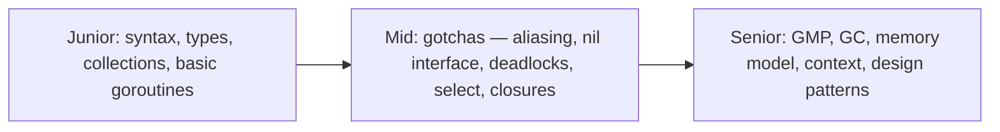

# Go Interview Questions

A curated bank of 30+ Go interview questions with detailed answers, grouped by difficulty. Junior questions test language mechanics, mid-level questions test the famous gotchas (slice aliasing, nil interfaces, channel deadlocks), and senior questions test runtime internals and concurrent system design. Try to answer each aloud before expanding the collapsible.



---

## Junior Level

<details>
<summary>1. What is the difference between = and := ?</summary>

`:=` is the short variable declaration: it declares *and* initializes with an inferred type, and is only allowed inside functions. `=` assigns to an already-declared variable. In a multi-variable `:=`, at least one variable on the left must be new; the others are assigned. Shadowing pitfall: `if v, err := f(); ...` declares a *new* `err` inside the if-scope, which can hide an outer `err` — a classic subtle bug flagged by linters.
</details>

<details>
<summary>2. What are Go's zero values, and how do nil slices differ from nil maps?</summary>

Every declared variable gets its type's zero value: 0, "", false, or nil for pointers, slices, maps, channels, functions, and interfaces; structs zero each field. Critical asymmetry: a nil slice is fully usable — `len` is 0, `range` iterates zero times, and `append` works (allocating as needed). A nil map is readable (returns zero values) but *writing panics*. So `var s []int; s = append(s, 1)` is idiomatic, while `var m map[string]int; m["k"]=1` crashes — initialize maps with `make` or a literal.
</details>

<details>
<summary>3. How do you handle multiple return values and what does the underscore mean?</summary>

Go functions can return multiple values, conventionally `(result, error)` or `(value, ok)`. Callers must use every declared variable, so the blank identifier `_` explicitly discards values you don't need: `v, _ := strconv.Atoi(s)`. Discarding errors with `_` compiles but is a code smell — reviewers expect either handling or a comment justifying the ignore. Named return values exist and enable a bare `return`, but are best reserved for documentation or `defer`-based error modification.
</details>

<details>
<summary>4. What is the difference between an array and a slice?</summary>

An array's length is part of its type (`[3]int`), fixed at compile time, and arrays are values — assignment copies all elements. A slice is a three-word descriptor (pointer, length, capacity) over a backing array: dynamically sized via `append`, cheap to pass (header copy), and multiple slices can share one array. Practically, Go code uses slices almost exclusively; arrays appear mainly as backing storage, in fixed-size domains (e.g., `[16]byte` for a UUID), and as comparable map keys.
</details>

<details>
<summary>5. How does defer work, and in what order do multiple defers run?</summary>

`defer` schedules a function call to run when the enclosing *function* returns — on normal return, early return, or panic. Multiple defers run LIFO (stack order), which naturally unwinds acquisitions in reverse: open A, open B → close B, close A. Two subtleties: deferred arguments are evaluated immediately at the defer statement (only the call is postponed), and a deferred closure can modify *named* return values — the mechanism behind wrapping errors on the way out.
</details>

<details>
<summary>6. What is a goroutine and what happens to running goroutines when main returns?</summary>

A goroutine is a runtime-managed concurrent function started with `go f()` — starting one costs a ~2 KB growable stack, and the scheduler multiplexes them over OS threads. When `main` returns, the process exits *immediately*: no other goroutine is waited for or cleaned up; they simply cease to exist. Hence every program that spawns goroutines needs explicit synchronization — `sync.WaitGroup`, channels, or `errgroup.Wait()` — before main exits. `time.Sleep` "synchronization" is a red flag.
</details>

<details>
<summary>7. What's the difference between a method and a function, and what is a receiver?</summary>

A method is a function bound to a named type via a receiver — the parameter written before the name: `func (c *Counter) Inc()`. The receiver is either a value (`c Counter` — method operates on a copy) or a pointer (`c *Counter` — method can mutate the original and avoids copying). Methods define a type's method set, which determines interface satisfaction. Any named type can have methods — not just structs: `type Celsius float64` can have `func (c Celsius) String() string`.
</details>

<details>
<summary>8. How do you write and run a basic test in Go?</summary>

Create a file ending in `_test.go` in the same package containing functions of the form `func TestXxx(t *testing.T)`; check outcomes with plain conditionals and report failures via `t.Errorf` (continue) or `t.Fatalf` (stop). Run with `go test ./...` — no framework or runner installation needed. The idiomatic structure is a table-driven test: a slice of named cases looped with `t.Run(name, ...)` subtests, enabling `-run TestX/case_name` filtering. Add `-v` for verbosity, `-race` for the race detector, `-cover` for coverage.
</details>

<details>
<summary>9. What is the comma-ok idiom and where does it appear?</summary>

A two-value form that turns "might not be there" into an explicit boolean instead of a panic or ambiguity. Four places: map lookup — `v, ok := m[key]` distinguishes "absent" from "stored zero value"; type assertion — `s, ok := i.(string)` avoids the panic of the single-value form; channel receive — `v, ok := <-ch` where `ok=false` means closed-and-drained; and (with different semantics) range over maps yielding key/value. The pattern embodies Go's philosophy: failure modes are ordinary values you check, not exceptions.
</details>

<details>
<summary>10. What is an interface in Go, and how does a type "implement" one?</summary>

An interface is a named set of method signatures; any type whose method set includes all of them satisfies the interface *implicitly* — there is no `implements` keyword, and the type's author needn't know the interface exists. This is structural typing checked at compile time. Values of interface type hold a (dynamic type, value) pair and dispatch method calls dynamically. Idioms follow: keep interfaces small (`io.Reader` has one method), define them next to the code that consumes them, and use them for behavior abstraction and test fakes.
</details>

---

## Mid Level

<details>
<summary>11. Slice puzzle: what does this print, and why?

```go
a := []int{1, 2, 3, 4, 5}
b := a[1:3]
b = append(b, 100)
fmt.Println(a)
b = append(b, 200, 300)
b[0] = -1
fmt.Println(a)
```
</summary>

Both prints show `[1 2 3 100 5]`. Step by step: `b := a[1:3]` covers elements {2, 3} with len 2 and cap 4 (b's view runs from a[1] to the end of a's backing array). `append(b, 100)` fits within capacity, so it writes 100 into the shared array at the position corresponding to a[3], overwriting the 4 — hence the first print `[1 2 3 100 5]`. Next, `append(b, 200, 300)` needs len 5, which exceeds cap 4, so b reallocates onto its own fresh array `{2, 3, 100, 200, 300}` — from this moment a and b are independent. `b[0] = -1` therefore touches only b's new array, and the second print of a is unchanged: `[1 2 3 100 5]`. The lesson: in-capacity appends mutate the shared backing array; over-capacity appends silently detach. Defend with three-index slicing (`a[1:3:3]` caps capacity, forcing reallocation on append) or an explicit `copy`.
</details>

<details>
<summary>12. The nil interface gotcha: why does this print "got an error"?

```go
type MyErr struct{ msg string }
func (e *MyErr) Error() string { return e.msg }

func doWork() *MyErr { return nil }

func main() {
    var err error = doWork()
    if err != nil {
        fmt.Println("got an error")
    }
}
```
</summary>

An interface value is a (dynamic type, dynamic value) pair, and it equals nil only when *both* are nil. Assigning the `*MyErr` nil pointer to `error` produces the pair (type=`*MyErr`, value=nil) — the type word is non-nil, so `err != nil` is true. Worse, calling `err.Error()` would execute the method with a nil receiver (fine here, panic if it dereferences fields). Fixes: functions should declare `error` return types (not concrete error types) and return the literal `nil`; never launder possibly-nil concrete pointers through interfaces you compare to nil. This exact bug ships to production constantly and is probably the single most asked Go gotcha.
</details>

<details>
<summary>13. Spot the deadlock: what happens and how do you fix it?

```go
func main() {
    ch := make(chan int)
    ch <- 42
    fmt.Println(<-ch)
}
```
</summary>

Fatal error: "all goroutines are asleep - deadlock!". `ch` is unbuffered, so `ch <- 42` blocks until another goroutine is simultaneously receiving — but the only goroutine (main) is the one blocked; the receive on the next line is never reached. The runtime detects that every goroutine is blocked and aborts. Fixes: (1) `make(chan int, 1)` — the send completes into the buffer; (2) move send or receive to another goroutine: `go func() { ch <- 42 }()`. The underlying lesson: unbuffered channel operations are rendezvous points requiring two concurrent parties.
</details>

<details>
<summary>14. Closure-over-loop-variable: what did this print before Go 1.22, and what changed?

```go
for i := 0; i < 3; i++ {
    go func() { fmt.Print(i, " ") }()
}
time.Sleep(time.Second)
```
</summary>

Before Go 1.22: there was *one* variable `i` shared by all iterations, and the closures captured it by reference. The goroutines typically ran after the loop finished, printing `3 3 3` (or other combinations — also a data race). The classic fixes: pass it as an argument (`go func(i int) {...}(i)`) or shadow per iteration (`i := i`). Go 1.22 changed the language spec: each iteration of a `for` loop gets a *fresh* copy of the loop variable, so this now prints some ordering of `0 1 2` with no race. Interviewers still ask both epochs — mention the version boundary explicitly, and note the same bug applied to `for _, v := range` closures and to `t.Parallel()` subtests.
</details>

<details>
<summary>15. What does select do when: (a) several cases are ready, (b) none are ready, (c) there's a default, (d) a case's channel is nil?</summary>

(a) Picks uniformly at random among ready cases — deliberate, to prevent starvation of later-listed channels; you cannot rely on ordering for priority. (b) Blocks until at least one becomes ready (a `select{}` with no cases blocks forever). (c) With `default`, select never blocks: if nothing is ready, the default runs immediately — the basis of non-blocking try-send/try-receive. (d) Operations on a nil channel block forever, so that case is simply never chosen — an idiom for dynamically disabling cases: after an input channel closes in a fan-in loop, set its variable to nil so the select stops spinning on the closed channel's zero values.
</details>

<details>
<summary>16. Explain the behavior of send, receive, and close on closed and nil channels.</summary>

Closed channel: send panics ("send on closed channel"); receive never blocks — it drains any buffered values normally (`ok=true`), then returns zero values with `ok=false` forever; closing again panics. Nil channel: send and receive block forever; close panics. Consequences: only senders close channels (receivers can't know when a sender might still send); `range ch` terminates only when the channel is closed and drained — forgetting to close is a classic goroutine leak where the ranging consumer blocks forever; and `close` is a broadcast: all blocked receivers wake at once, which is why `close(done)` is the cancellation idiom.
</details>

<details>
<summary>17. Why does this WaitGroup program sometimes print nothing, and what are the two bugs?

```go
func main() {
    var wg sync.WaitGroup
    for i := 0; i < 3; i++ {
        go func() {
            wg.Add(1)
            defer wg.Done()
            fmt.Println("worker", i)
        }()
    }
    wg.Wait()
}
```
</summary>

Bug 1: `wg.Add(1)` is called *inside* the goroutines. `main` can reach `wg.Wait()` before any goroutine has run, see counter 0, and return immediately — exiting the process before workers print. `Add` must be called in the spawning goroutine, before `go`. Bug 2 (pre-Go 1.22): all closures share loop variable `i`, printing wrong/duplicate values and racing. Corrected form: `wg.Add(1)` (or `Add(3)` once) before each `go`, `defer wg.Done()` first line inside, and pass `i` as a parameter on older Go. This question tests whether you understand that `Add`/`Wait` form a happens-before contract that must be established before waiting begins.
</details>

<details>
<summary>18. How do errors.Is, errors.As, and %w interact? Give a realistic flow.</summary>

`fmt.Errorf("load user %d: %w", id, err)` creates an error implementing `Unwrap() error`, forming a chain. `errors.Is(err, target)` walks the chain comparing each link to a sentinel (using `==` or a link's custom `Is` method); `errors.As(err, &target)` walks it looking for a link assignable to the target's concrete type, extracting it. Flow: repository returns `sql.ErrNoRows` wrapped with query context → service checks `errors.Is(err, sql.ErrNoRows)` and returns its own wrapped `ErrUserNotFound` → HTTP layer checks `errors.Is(err, domain.ErrUserNotFound)` → 404, or `errors.As(err, &validationErr)` → 400 with field details. String matching on `err.Error()` is always the wrong answer.
</details>

<details>
<summary>19. A map read and write from two goroutines crashes with "fatal error: concurrent map writes" — but it "worked in dev". Explain and fix.</summary>

Go maps are not thread-safe; the runtime has a lightweight detector that crashes (unrecoverably — not a panic) when it observes concurrent write access. It is probabilistic: low traffic in dev may never interleave badly, while production load triggers it — the signature of a data race. Fixes, in order of preference: (1) restructure so one goroutine owns the map and others communicate via channels; (2) guard with `sync.Mutex`/`RWMutex` in a small wrapper type; (3) `sync.Map` only for its niche (mostly-read caches, disjoint keys); (4) sharding for extreme contention. And run `go test -race` in CI so this class of bug never reaches production.
</details>

<details>
<summary>20. What is the difference between buffered channel of size 1 and an unbuffered channel? When does the difference matter?</summary>

Unbuffered: a send completes only when a receiver takes the value simultaneously — every transfer synchronizes both parties, and after `ch <- v` returns, you *know* the value was received. Buffered size 1: the first send completes immediately into the buffer, so sender and receiver are decoupled by one slot; the sender knows nothing about receipt. It matters for: one-shot results where the receiver might abandon (a goroutine sending its result into a size-1 buffer can always complete and exit — with unbuffered it would leak if the receiver timed out); semaphores (`chan struct{}` with capacity N bounds concurrency); and any protocol relying on send-completion as an acknowledgment, which only unbuffered provides.
</details>

<details>
<summary>21. How does context cancellation propagate, and what must every function in the call chain do to honor it?</summary>

Contexts form a tree via `WithCancel`/`WithTimeout`/`WithDeadline`; cancelling a node closes the `Done()` channel of that node and *all descendants* — never ancestors. Propagation is cooperative: cancellation doesn't kill goroutines; each function must (1) accept `ctx` as its first parameter, (2) pass it into every downstream call (DB drivers, `http.NewRequestWithContext`, gRPC — these check it internally), and (3) in its own loops/selects, include `case <-ctx.Done(): return ctx.Err()`. Server frameworks wire it end-to-end: `r.Context()` is cancelled when the client disconnects, so honoring ctx means abandoned requests stop consuming DB and CPU resources. Always `defer cancel()` to release timer/tree resources.
</details>

<details>
<summary>22. Value receiver vs pointer receiver: what does this print and why?

```go
type T struct{ n int }
func (t T) IncV()  { t.n++ }
func (t *T) IncP() { t.n++ }

func main() {
    t := T{}
    t.IncV(); t.IncP()
    fmt.Println(t.n)

    var i interface{ IncV() } = t
    _ = i
}
```
</summary>

Prints `1`. `IncV` receives a copy — its increment is discarded; `IncP` receives `&t` (Go auto-addresses the addressable variable) and mutates the original. Deeper follow-ups: the method set of `T` is {IncV}; the method set of `*T` is {IncV, IncP}. So `T` satisfies only interfaces requiring `IncV`, while `*T` satisfies both — `var x interface{ IncP() } = t` would not compile (a value inside an interface isn't addressable, so Go can't synthesize `&t`). Practical rule: methods that mutate need pointer receivers, and a type should use consistent receiver kinds throughout.
</details>

---

## Senior Level

<details>
<summary>23. Explain the GMP scheduler: what are G, M, P, and how does work stealing keep cores busy?</summary>

G = goroutine (stack + program counter + state); M = OS thread; P = logical processor, of which there are exactly GOMAXPROCS — a P holds a local run queue and must be held by an M to execute Go code. Scheduling: a P runs Gs from its local queue (lock-free, fast); when empty it checks the global queue, polls the netpoller, then steals half of a random P's queue — decentralized load balancing without a contended global lock. Blocking behaves differently by kind: channel/mutex/network blocking parks the G in user space, freeing the M+P instantly; a blocking *syscall* takes the M down with it, so the runtime hands the P to another M to preserve parallelism. Since Go 1.14 the runtime also preempts long-running Gs asynchronously via signals, so tight loops can't starve the scheduler or delay GC.
</details>

<details>
<summary>24. Describe Go's garbage collector. What are the write barrier and mark assists for, and what do GOGC and GOMEMLIMIT tune?</summary>

Concurrent, non-generational, non-compacting tri-color mark-sweep. Two sub-millisecond STW pauses bracket a concurrent mark phase: objects go white→grey→black as reachability is traced while the program keeps running. The write barrier intercepts pointer stores during marking to preserve the tri-color invariant (no black→white pointer without a grey path) — without it, a mutator could hide a live object behind an already-scanned object and get it freed. Mark assists throttle allocation: goroutines allocating heavily during marking are forced to contribute marking work, preventing the mutator from outrunning the collector. `GOGC` (default 100) sets heap-growth trigger: next GC when the live heap doubles — raise it to trade memory for less GC CPU. `GOMEMLIMIT` (1.19+) is a soft ceiling making the GC increasingly aggressive near the limit — essential in containers to avoid the OOM killer.
</details>

<details>
<summary>25. What is escape analysis, and how would you find and eliminate excessive heap allocations in a hot path?</summary>

The compiler proves whether each value's lifetime is confined to its frame; confined values live on the stack (near-free), others escape to the heap and cost GC. Find: `go build -gcflags=-m` prints escape decisions; benchmarks with `-benchmem` show allocs/op; pprof heap profiles (`-alloc_space`) rank allocation sites in production. Eliminate: preallocate and reuse buffers (possibly `sync.Pool`); avoid boxing into interfaces in hot loops (`fmt.Sprintf`, `any` params force escapes); return values instead of pointers to small structs; keep sizes compile-time-constant where possible; use `strings.Builder` with `Grow`. Verify each change with benchstat — escape analysis is version-dependent, so measure, don't assume.
</details>

<details>
<summary>26. Under the Go memory model, why can a reader goroutine loop forever on a plain boolean flag set by a writer, and what are three correct alternatives?</summary>

Without a synchronization edge, there is no guarantee a write ever becomes visible to another goroutine: the compiler may hoist the flag load out of the loop (reading it once), and CPU store buffers/reordering can defer or reorder the store — plus a concurrent unsynchronized read/write is a data race, which Go defines as undefined behavior. Happens-before edges come only from synchronization operations. Three fixes: (1) channel — writer `close(done)`, reader `<-done` (close happens-before receive); (2) mutex — both sides lock around access (unlock happens-before subsequent lock); (3) `atomic.Bool` — atomics are sequentially consistent among themselves and make data written *before* the atomic store visible to a reader observing it. This question separates people who've read the memory model from people who've been lucky.
</details>

<details>
<summary>27. Design: implement a rate-limited, cancellable parallel URL fetcher — max 5 concurrent fetches, stop everything on first error. Which primitives and why?</summary>

`errgroup` with `SetLimit` is the canonical answer:

```go
func FetchAll(ctx context.Context, urls []string) ([]Result, error) {
    g, ctx := errgroup.WithContext(ctx)
    g.SetLimit(5)                          // bounded concurrency
    results := make([]Result, len(urls))   // distinct index per goroutine: no locks
    for i, u := range urls {
        g.Go(func() error {
            req, err := http.NewRequestWithContext(ctx, "GET", u, nil)
            if err != nil { return err }
            resp, err := http.DefaultClient.Do(req)  // ctx aborts in-flight fetches
            if err != nil { return fmt.Errorf("fetch %s: %w", u, err) }
            defer resp.Body.Close()
            results[i] = parse(resp)
            return nil
        })
    }
    if err := g.Wait(); err != nil { return nil, err }
    return results, nil
}
```

Why: `errgroup.WithContext` cancels the shared ctx on first error, and passing it into each request makes in-flight HTTP calls abort (real cancellation, not just skipping new work); `SetLimit` bounds concurrency without a hand-rolled semaphore; writing to `results[i]` with unique indices avoids result-channel plumbing and locks. Mention alternatives to show depth: manual worker pool + done channel (pre-errgroup), or a `chan struct{}` semaphore — then explain why errgroup is less error-prone.
</details>

<details>
<summary>28. What is a goroutine leak? Show a leaky timeout implementation and a correct one.</summary>

A leak is a goroutine blocked (or looping) forever with no path to termination, pinning its stack and everything it references. Leaky classic:

```go
func fetch() (Result, error) {
    ch := make(chan Result)               // unbuffered!
    go func() { ch <- slowQuery() }()     // if we time out, this send blocks FOREVER
    select {
    case r := <-ch:
        return r, nil
    case <-time.After(time.Second):
        return Result{}, ErrTimeout       // worker goroutine leaks
    }
}
```

Every timeout strands the worker on the unbuffered send. Fix 1 (minimal): `make(chan Result, 1)` — the send always completes; the abandoned value is GC'd with the channel. Fix 2 (better): pass a context into `slowQuery` so the work itself stops, not just the delivery. Detection: goroutine count metrics, pprof's goroutine profile diffing, and `goleak` in tests. The design principle: never start a goroutine without a guaranteed termination path (input closure, context cancellation, or a buffered one-shot result).
</details>

<details>
<summary>29. sync.RWMutex vs Mutex vs atomic vs sync.Map — how do you choose for a read-heavy in-memory cache?</summary>

Start with `Mutex`: simplest, and for short critical sections its raw cost (~tens of ns uncontended) is often lower than RWMutex's extra bookkeeping. Move to `RWMutex` when profiling shows contention *and* reads vastly outnumber writes *and* the read section does real work — many concurrent readers then proceed in parallel (beware: RWMutex reader counts have their own contention at very high core counts). `atomic.Pointer` to an immutable map (copy-on-write) is the read-optimal pattern for rarely-updated config/routing tables: reads are a single atomic load, updates rebuild the map and swap. `sync.Map` targets two specific patterns — keys written once and read many times, or goroutines operating on disjoint key sets — and is often slower than a locked map outside them. Senior answer: state the decision criteria, note that correctness requires the mutex to also cover any multi-step invariants, and insist on benchmarking with realistic read/write ratios before choosing the exotic options.
</details>

<details>
<summary>30. Puzzle: what are the possible outputs, and why?

```go
func main() {
    ch := make(chan int, 2)
    ch <- 1
    ch <- 2
    close(ch)
    for v := range ch {
        fmt.Print(v, " ")
    }
    v, ok := <-ch
    fmt.Println(v, ok)
}
```
</summary>

Deterministic output: `1 2 0 false`. Buffered values survive close: `range` drains 1 then 2 in FIFO order, then terminates because the channel is closed and empty. The post-loop receive on the closed, drained channel returns immediately with the zero value and `ok=false` — it does not panic (only *send* on a closed channel panics, and re-closing panics). This tests three rules at once: close doesn't discard buffered data, range ends at closed-and-drained, and receives from closed channels are always non-blocking zero-value returns.
</details>

<details>
<summary>31. How would you implement graceful shutdown for an HTTP service with background workers?</summary>

Wire OS signals into a context and give every component a shutdown path:

```go
func main() {
    ctx, stop := signal.NotifyContext(context.Background(), os.Interrupt, syscall.SIGTERM)
    defer stop()

    srv := &http.Server{Addr: ":8080", Handler: mux()}
    g, ctx := errgroup.WithContext(ctx)

    g.Go(func() error { return runWorkers(ctx) })      // workers select on ctx.Done()
    g.Go(func() error {
        err := srv.ListenAndServe()
        if errors.Is(err, http.ErrServerClosed) { return nil }
        return err
    })
    g.Go(func() error {
        <-ctx.Done()                                    // signal received (or a component failed)
        shCtx, cancel := context.WithTimeout(context.Background(), 10*time.Second)
        defer cancel()
        return srv.Shutdown(shCtx)                      // stop accepting; drain in-flight requests
    })
    if err := g.Wait(); err != nil { log.Fatal(err) }
}
```

Key points: `signal.NotifyContext` converts SIGTERM into context cancellation; `srv.Shutdown` stops accepting connections and waits (bounded by its own timeout) for in-flight requests; workers exit via `ctx.Done()`; `errgroup` ties it together so any component's failure triggers coordinated shutdown. In Kubernetes this dance is what makes rolling deploys lossless: SIGTERM arrives, readiness fails, connections drain within `terminationGracePeriodSeconds`.
</details>

<details>
<summary>32. Both goroutines below deadlock — explain why, then fix it without adding buffering.

```go
func main() {
    a, b := make(chan int), make(chan int)
    go func() {
        a <- 1        // goroutine G blocks here
        v := <-b
        fmt.Println(v)
    }()
    b <- 2            // main blocks here
    fmt.Println(<-a)
}
```
</summary>

Circular wait: G blocks sending on `a` (no one is receiving yet — main hasn't reached `<-a`), while main blocks sending on `b` (G hasn't reached `<-b` because it's stuck on `a <- 1`). Each waits for the other to advance: deadlock, and the runtime aborts. Fixes without buffers: reorder one side so the operations pair up — e.g., main does `fmt.Println(<-a)` *before* `b <- 2` (main receives G's send on `a`, then G proceeds to receive on `b`); or make one party use a `select` over both operations. General lesson: with unbuffered channels, the global order of sends/receives across goroutines must admit a pairing — cycles in "who waits for whom" are deadlocks, exactly like lock-ordering cycles.
</details>

<details>
<summary>33. When Go 1.22 changed loop variable semantics, why was it safe to change the language, and how does it interact with the race detector and t.Parallel tests?</summary>

Pre-1.22, one loop variable per loop meant closures/goroutines captured the same storage — the source of the `3 3 3` bug and of parallel subtests all testing the final case. The change gives each iteration a fresh variable, so captures are per-iteration. It was deemed safe because extensive analysis (Google's codebase + open source) showed code depending on the *old* semantics was almost always already buggy; the change is gated on the module's `go` directive version, so old modules keep old behavior until they opt in by bumping `go 1.22` — a controlled, per-module migration rather than a flag day. Effects: the classic goroutine race disappears (the race detector stops flagging those), `tt := tt` shadowing becomes unnecessary in `t.Parallel()` table tests, and a `go vet` loopclosure check that flagged the old pattern was retuned. Knowing the mechanism (per-iteration copy + go.mod gating) rather than just "it's fixed now" is the senior signal.
</details>

<details>
<summary>34. You see high tail latency; pprof shows significant time in runtime.gcBgMarkWorker and mallocgc. Walk through your remediation strategy.</summary>

Diagnosis: the service is allocation-bound — GC cycles run frequently (heap doubles fast at default GOGC=100) and mark work + assists steal CPU from request goroutines, inflating tails. Steps: (1) Quantify with `GODEBUG=gctrace=1` (cycle frequency, assist time) and a heap profile in `-alloc_space` mode to rank allocating call sites. (2) Cut allocation at the top sites: preallocate slices/maps with capacity, reuse buffers via `sync.Pool`, switch `fmt.Sprintf`/reflection-heavy serialization for cheaper paths, stream instead of materializing payloads, check `-gcflags=-m` for accidental escapes (interface boxing in hot loops). (3) Tune: raise GOGC (trade RAM for fewer cycles) and set GOMEMLIMIT to spend the container's memory budget safely; ensure GOMAXPROCS matches the CPU quota so marking doesn't fight throttling. (4) Verify: benchstat on service-level benchmarks plus production p99 dashboards. Order matters — reducing allocation is a real fix; GC tuning is a lever with trade-offs; both beat cargo-cult `runtime.GC()` calls.
</details>

<details>
<summary>35. Compare Go's concurrency model with async/await (JavaScript/Python) and raw threads (Java). What trade-offs did Go choose?</summary>

Versus async/await: Go has no function coloring — any function may block, and the runtime (netpoller + parking) makes blocking cheap, so the entire ecosystem composes without `async` variants of every API; sequential-looking code replaces promise/await chains, and the scheduler adds true parallelism, which single-threaded event loops lack. Cost: less explicit visibility into suspension points, and shared-memory races become possible (hence the race detector), whereas a single-threaded event loop can't race on memory. Versus raw threads: goroutines are two to three orders of magnitude cheaper (2 KB vs MBs, user-space scheduling vs kernel context switches), so "one goroutine per request/connection" scales to millions where thread-per-request dies; channels + select give first-class communication primitives instead of wait/notify. Go's bet: make concurrency cheap, structured, and uniform (CSP-flavored), accept a GC and a runtime in exchange, and provide tooling (race detector, pprof) for the shared-memory hazards that remain.
</details>

<details>
<summary>36. What ordering guarantee does a channel send/receive give beyond transferring the value? Show how it replaces an explicit lock.</summary>

The Go memory model guarantees: a send on a channel happens-before the corresponding receive completes. Everything the sender wrote to memory *before* the send is visible to the receiver *after* the receive — the channel transfers not just the value but a full visibility frontier. This enables the ownership-passing pattern: build an object, send a pointer to it, and the receiver may use it without any locks, provided the sender stops touching it after sending — the send/receive edge synchronizes all prior writes:

```go
type Job struct{ payload []byte; result string }

jobs := make(chan *Job)
go func() {                      // worker: exclusive owner after receive
    for j := range jobs {
        j.result = process(j.payload)  // no locks: ownership was transferred
        done <- j                       // hand ownership back
    }
}()
```

The discipline "at most one goroutine owns the data at a time, ownership moves via channels" is the meaning of "share memory by communicating". Additional edges worth citing: close happens-before a receive that observes closure, and for unbuffered channels the receive also happens-before the send *completes*, making the rendezvous bidirectional.
</details>
