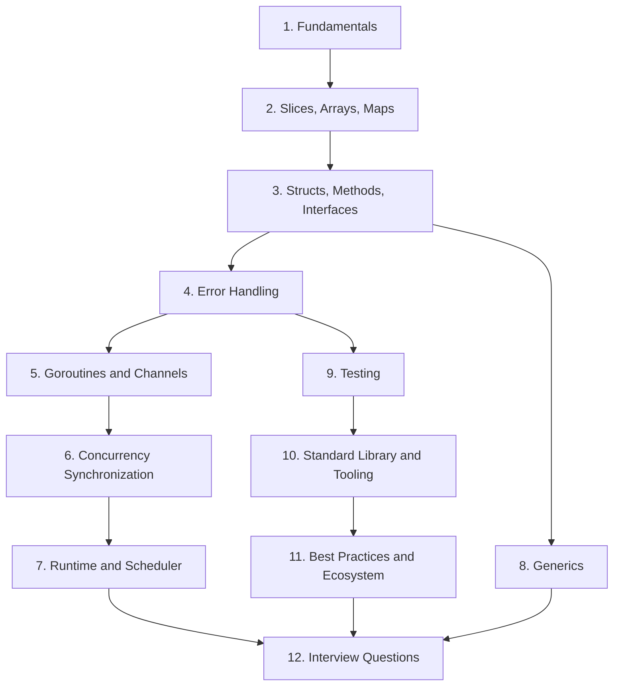

# Go (Golang) Interview Preparation Guide

Go is a statically typed, compiled language designed at Google for building simple, reliable, and efficient software. It has become the dominant language of cloud-native infrastructure — Kubernetes, Docker, Terraform, Prometheus, and etcd are all written in Go — which makes it one of the most frequently tested languages in backend and infrastructure interviews. Interviewers love Go because its small surface area lets them probe deep topics quickly: slice internals, interface mechanics, goroutine scheduling, and channel-based concurrency.

## Why Go Comes Up in Interviews

- **Simplicity by design.** Go has ~25 keywords, one loop construct, and no inheritance. Interviewers expect you to know the *whole* language, not a subset.
- **First-class concurrency.** Goroutines and channels are built into the language, and concurrency questions are the single most common category of Go interview question.
- **Cloud-native dominance.** If a company runs Kubernetes, writes microservices, or builds CLIs and infrastructure tooling, there is a good chance Go is in their stack.
- **Performance with productivity.** Compiled, garbage-collected, fast to build, and produces single static binaries — a favorite talking point in system design discussions.

## Table of Contents

| # | Guide | What You Will Learn |
|---|-------|---------------------|
| 1 | [Go Fundamentals](01-Go-Fundamentals.md) | Modules, packages, visibility, zero values, constants and `iota`, control flow, static binaries |
| 2 | [Slices, Arrays, and Maps](02-Slices-Arrays-and-Maps.md) | Slice internals (pointer/len/cap), append growth, aliasing bugs, map internals and iteration order |
| 3 | [Structs, Methods, and Interfaces](03-Structs-Methods-and-Interfaces.md) | Embedding, value vs pointer receivers, implicit interfaces, the nil-interface gotcha |
| 4 | [Error Handling](04-Error-Handling.md) | Errors as values, wrapping with `%w`, `errors.Is`/`errors.As`, panic vs recover |
| 5 | [Goroutines and Channels](05-Goroutines-and-Channels.md) | Goroutines vs threads, buffered/unbuffered channels, `select`, worker pools, fan-in/fan-out, pipelines |
| 6 | [Concurrency Synchronization](06-Concurrency-Synchronization.md) | `sync` package, atomics, the race detector, `context`, memory model, `errgroup` |
| 7 | [Go Runtime and Scheduler](07-Go-Runtime-and-Scheduler.md) | The GMP model, growable stacks, the tri-color concurrent GC, escape analysis |
| 8 | [Generics in Go](08-Generics-in-Go.md) | Type parameters, constraints, generics vs interfaces, real examples and limitations |
| 9 | [Testing in Go](09-Testing-in-Go.md) | Table-driven tests, subtests, benchmarks, fuzzing, testify, mocking via interfaces |
| 10 | [Standard Library and Tooling](10-Go-Standard-Library-and-Tooling.md) | `net/http`, `encoding/json`, `io.Reader`/`io.Writer`, gofmt/vet/staticcheck, pprof |
| 11 | [Best Practices and Ecosystem](11-Go-Best-Practices-and-Ecosystem.md) | Idiomatic Go, project layout, where Go dominates, gin/gRPC/cobra, performance tips |
| 12 | [Go Interview Questions](12-Go-Interview-Questions.md) | 30+ curated questions with answers: junior, mid, and senior level |

## Suggested Study Order

1. **Week 1 — Language core (guides 1–4).** Get fluent in slices, maps, interfaces, and error handling. Most "write code on a whiteboard" Go questions live here.
2. **Week 2 — Concurrency (guides 5–7).** This is where Go interviews are won or lost. Practice writing worker pools and pipelines from scratch, and be able to sketch the GMP scheduler.
3. **Week 3 — Breadth (guides 8–11).** Generics, testing, the standard library, and ecosystem knowledge round out mid/senior interviews and system design discussions.
4. **Final pass — guide 12.** Drill the curated questions. Cover the answers and try to explain each one aloud before revealing it.

## How to Practice

- Run every snippet. All examples in these guides are runnable — paste them into a `main.go` or the [Go Playground](https://go.dev/play/) and experiment.
- Always run your practice code with `go run -race` so data races surface early.
- After each guide, attempt its "Interview Questions" section from memory before opening the collapsibles.

Good luck — Go's small spec is your friend: it is one of the few languages you can genuinely master before an interview.
