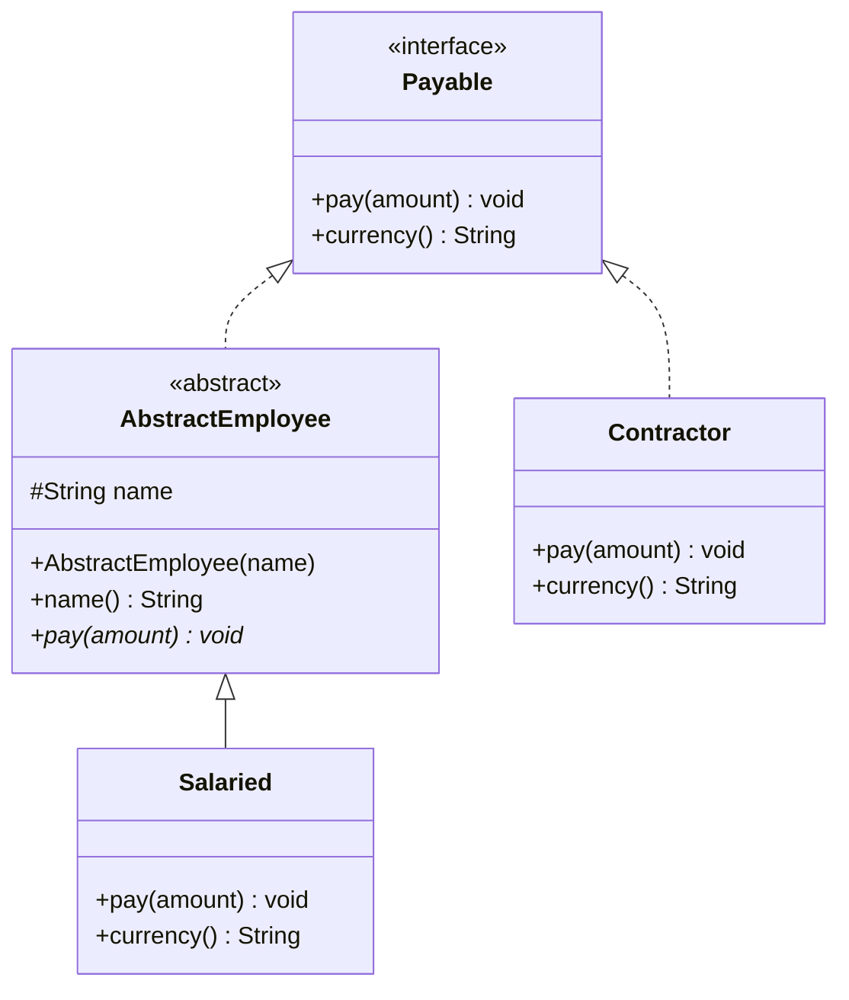
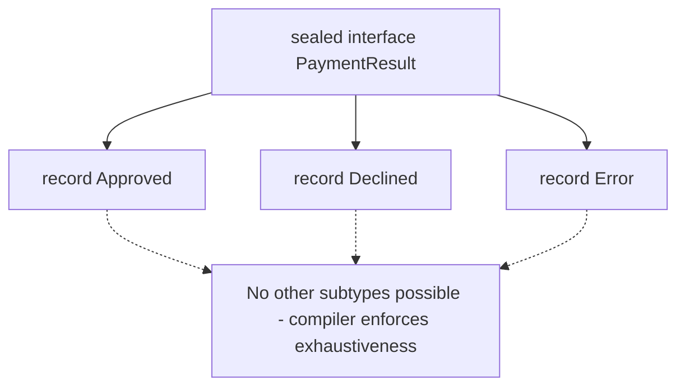

# Object-Oriented Programming in Java

Java was designed around object-oriented programming, and interviews probe the four pillars — encapsulation, inheritance, polymorphism, abstraction — through very concrete language questions: interface vs abstract class, overriding vs overloading, static vs instance. Modern Java adds records and sealed classes, which increasingly show up in interviews as "do you keep up with the language?" checks. This guide covers all of it with runnable examples.

## Classes and Encapsulation

Encapsulation means bundling state with behavior and hiding the state behind a controlled interface. In Java: private fields, public methods, and invariants enforced in one place.

```java
public class BankAccount {
    private final String id;      // final: set once in the constructor
    private long balanceCents;    // private: nobody can corrupt it directly

    public BankAccount(String id, long openingCents) {
        if (openingCents < 0) throw new IllegalArgumentException("negative opening balance");
        this.id = id;
        this.balanceCents = openingCents;
    }

    public void deposit(long cents) {
        if (cents <= 0) throw new IllegalArgumentException("deposit must be positive");
        balanceCents += cents;    // invariant enforced HERE, in one place
    }

    public long balanceCents() { return balanceCents; }
}
```

Avoid the anti-pattern of a public getter *and setter* for every field — that is encapsulation theater. Expose operations (`deposit`), not raw state (`setBalance`).

## Inheritance and Polymorphism

Inheritance (`extends`) creates an is-a relationship; polymorphism means a call through a supertype reference dispatches to the *runtime* type's override (dynamic dispatch).

```java
public abstract class Shape {
    public abstract double area();              // no implementation: subclasses must provide

    public String describe() {                  // shared behavior
        return getClass().getSimpleName() + " with area " + area();
    }
}

public class Circle extends Shape {
    private final double r;
    public Circle(double r) { this.r = r; }
    @Override public double area() { return Math.PI * r * r; }
}

public class Rect extends Shape {
    private final double w, h;
    public Rect(double w, double h) { this.w = w; this.h = h; }
    @Override public double area() { return w * h; }
}

List<Shape> shapes = List.of(new Circle(1), new Rect(2, 3));
for (Shape s : shapes) {
    System.out.println(s.describe()); // dispatches to Circle.area() / Rect.area()
}
```

### Overriding vs Overloading

```java
class Parent {
    Number get() { return 1; }
}
class Child extends Parent {
    @Override
    Integer get() { return 2; }   // OK: covariant return type (Integer is-a Number)

    // Overloading: same name, DIFFERENT parameter list, resolved at COMPILE time
    Integer get(String key) { return 3; }
}
```

- **Overriding** = same signature, subclass replaces behavior, resolved at *runtime* by the receiver's actual type.
- **Overloading** = same name, different parameters, resolved at *compile time* by the declared argument types.
- `static` methods are never overridden — they are *hidden*, and calls resolve by the reference's declared type. Always call them via the class name to avoid this trap.

## Interfaces vs Abstract Classes



| | Interface | Abstract class |
|---|---|---|
| State | Only `public static final` constants | Instance fields of any kind |
| Constructors | No | Yes |
| Methods | Abstract, `default`, `static`, `private` (Java 9+) | Any, including final and protected |
| Multiple inheritance | A class can implement many | Only one superclass |
| Meaning | A *capability/contract* ("can do") | A *partial implementation* ("is a") |

Rule of thumb: default to interfaces. Reach for an abstract class only when subclasses must share *state* or non-public helper logic.

```java
public interface Auditable {
    // default methods (Java 8+) let interfaces evolve without breaking implementors
    default String auditTag() { return "audit:" + getClass().getSimpleName(); }
}
```

A classic follow-up: if a class implements two interfaces with the same `default` method, it *must* override it (and may delegate with `InterfaceName.super.method()`), otherwise it will not compile — Java's answer to the diamond problem.

## Static vs Instance

- **Instance** members belong to each object; **static** members belong to the class, shared by all instances, and exist even with zero instances.
- Static methods cannot use `this` or access instance members directly.
- Static state is effectively global state — a testing and concurrency hazard. Use it for true constants, pure utility methods, and factory methods.

```java
public class Counter {
    private static int created = 0;   // shared across ALL Counters
    private int value = 0;            // per-object

    public Counter() { created++; }   // note: NOT thread-safe; use AtomicInteger if it matters
    public static int totalCreated() { return created; }
}
```

## Nested and Inner Classes

```java
public class Outer {
    private int secret = 42;

    // STATIC nested class: no hidden reference to Outer; the default choice.
    public static class Builder { }

    // INNER (non-static) class: captures a reference to its Outer instance.
    public class Inner {
        int peek() { return secret; }   // can read outer's private state
    }

    public void demo() {
        // Local class: declared inside a method.
        class Local { }

        // Anonymous class: one-off implementation (mostly replaced by lambdas).
        Runnable r = new Runnable() {
            @Override public void run() { System.out.println(secret); }
        };
    }
}

Outer.Inner inner = new Outer().new Inner();  // inner needs an outer instance
```

Pitfall: a non-static inner class holds an implicit reference to its enclosing instance. If the inner object outlives the outer one (e.g., registered as a long-lived listener, or a `Handler` in Android), the outer object cannot be garbage collected — a classic memory leak. Prefer `static` nested classes unless you *need* the outer reference.

## Records (Java 16+)

Records are concise, immutable data carriers. The compiler generates the constructor, accessors, `equals`, `hashCode`, and `toString` from the header.

```java
public record Point(int x, int y) {
    // Compact constructor: validate/normalize without repeating parameters
    public Point {
        if (x < 0 || y < 0) throw new IllegalArgumentException("negative coordinate");
    }

    public Point translate(int dx, int dy) {   // extra methods are fine
        return new Point(x + dx, y + dy);      // immutable: return a new instance
    }
}

Point p = new Point(1, 2);
System.out.println(p.x());          // accessor is x(), not getX()
System.out.println(p);              // Point[x=1, y=2]
```

Records are implicitly `final`, cannot extend a class (they extend `java.lang.Record`), but can implement interfaces. They shine as DTOs, map keys, and multi-value returns.

## Sealed Classes (Java 17+)

Sealed types restrict who may extend/implement them, giving you a closed hierarchy the compiler can reason about — the foundation of exhaustive pattern matching.

```java
public sealed interface PaymentResult permits Approved, Declined, Error {}
public record Approved(String txId) implements PaymentResult {}
public record Declined(String reason) implements PaymentResult {}
public record Error(Exception cause) implements PaymentResult {}

// Exhaustive switch: no default needed, and adding a new subtype
// becomes a COMPILE error everywhere you switch - this is the point.
static String describe(PaymentResult r) {
    return switch (r) {
        case Approved a -> "OK: " + a.txId();
        case Declined d -> "Declined: " + d.reason();
        case Error e    -> "Error: " + e.cause().getMessage();
    };
}
```

Real-world use: modeling domain results, events, and AST nodes — anywhere you would use an algebraic data type in Kotlin/Scala/Rust. Frameworks like Spring increasingly pattern-match over sealed hierarchies for API result modeling.



## Best Practices

- Program to interfaces (`List<String> list = new ArrayList<>()`), not implementations.
- Favor composition over inheritance: inject collaborators instead of extending them; inheritance couples you to superclass internals (see the classic `HashSet`/`addAll` self-use bug in Effective Java).
- Design for inheritance or prohibit it: make classes `final` or `sealed` by default; document self-use if you allow extension.
- Always use `@Override` — it turns a silent overload typo into a compile error.
- Prefer records for immutable data carriers; hand-written getter/setter beans should be the exception.
- Keep static state out of business logic; static mutable fields sabotage tests and thread safety.
- Prefer `static` nested classes over inner classes unless you need the enclosing instance.

## Interview Questions

<details>
<summary>1. When would you choose an abstract class over an interface?</summary>

Choose an abstract class when subclasses must share *state* (instance fields) or protected/non-public helper implementation, or when you need constructors to enforce invariants. Choose interfaces for contracts and capabilities: they allow multiple inheritance of type, keep hierarchies flexible, and since Java 8 can carry default method implementations. In modern Java the practical gap has narrowed to "fields and constructors."
</details>

<details>
<summary>2. Explain the difference between method overriding and overloading, including when each is resolved.</summary>

Overloading: same method name, different parameter lists, in the same class (or inherited); the compiler picks the target based on the *declared* types of the arguments — compile-time (static) resolution. Overriding: a subclass redefines a method with the same signature; the JVM dispatches based on the *runtime* type of the receiver — dynamic dispatch. Related trap: `static` methods can only be hidden, not overridden, and are resolved by the reference's declared type.
</details>

<details>
<summary>3. Can you override a private or static method?</summary>

No to both. Private methods are not inherited, so a same-named method in a subclass is simply a new, unrelated method. Static methods belong to the class, not instances; a subclass declaring the same static signature *hides* the parent's method, and which one runs depends on the compile-time type of the reference — no polymorphism involved.
</details>

<details>
<summary>4. What is the diamond problem, and how does Java handle it?</summary>

The diamond problem arises when a type inherits the same method from two paths, making the choice ambiguous. Java avoids it for state by forbidding multiple class inheritance. For behavior, since default methods (Java 8) a class implementing two interfaces with conflicting defaults *must* override the method — the compiler forces an explicit resolution, and the override can delegate via `InterfaceA.super.method()`.
</details>

<details>
<summary>5. What do records give you, and what are their limitations?</summary>

A record declares immutable components in its header and the compiler generates: a canonical constructor, per-component accessors (`x()`), value-based `equals`/`hashCode`, and `toString`. You can add validation in a compact constructor, plus extra methods and static factories. Limitations: implicitly final, cannot extend another class, all "fields" are final (shallow immutability only — a `record Holder(List<String> items)` still exposes a mutable list unless you defensively copy), and no settable properties for frameworks that require mutable beans.
</details>

<details>
<summary>6. Why do sealed classes exist when we already have final?</summary>

`final` is all-or-nothing: no one can extend. Sealed types occupy the middle ground: *these specific types and no others* may extend me (`permits` list). That gives you a closed, known set of subtypes, which enables compiler-checked exhaustive `switch` pattern matching — add a new permitted subtype and every non-exhaustive switch fails to compile, turning a runtime bug into a compile error. It is Java's version of algebraic data types.
</details>

<details>
<summary>7. What is the risk of non-static inner classes holding references?</summary>

Every instance of a non-static inner class carries a hidden reference to its enclosing instance. If the inner instance is long-lived (registered as a listener, scheduled task, cached callback), it pins the entire outer object — and everything the outer object references — in memory, causing leaks. This is the notorious Android `Handler` leak. Fix: use a static nested class and pass in exactly what it needs (possibly via `WeakReference`).
</details>

<details>
<summary>8. How does polymorphism actually work at the JVM level?</summary>

Instance method calls compile to `invokevirtual` (or `invokeinterface` for interface types). At runtime the JVM looks up the target in the receiver object's class vtable (virtual method table) — each class has a table of method pointers, and overrides replace the parent's entry. The JIT often optimizes monomorphic call sites (only one receiver type seen) by inlining with a cheap type guard, which is why polymorphism is nearly free in hot code.
</details>
