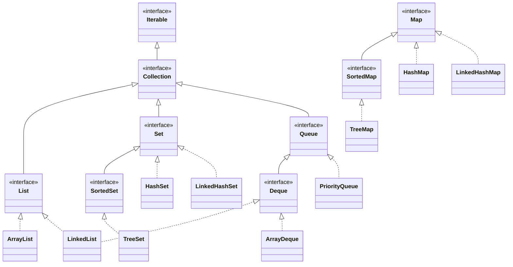
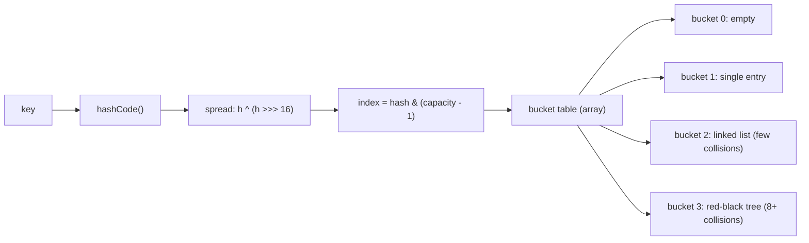
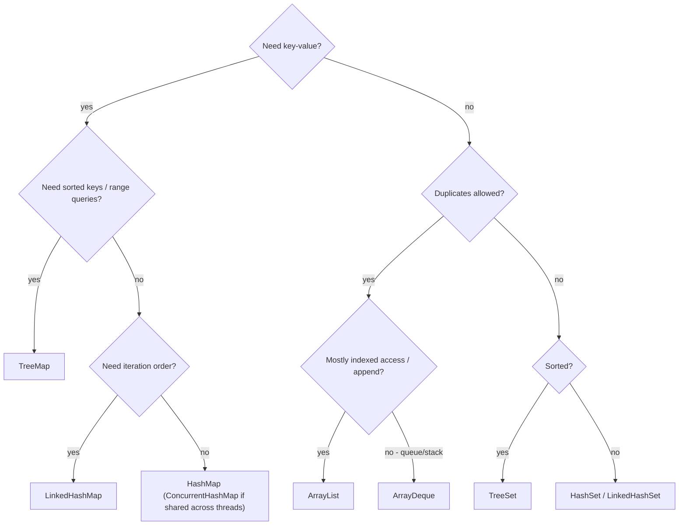

# Java Collections Framework

The Collections Framework is the most frequently tested Java topic in interviews: pick the right data structure, explain its complexity, and — the perennial favorite — walk through HashMap's internals. This guide maps the hierarchy, contrasts the workhorse implementations, and digs into buckets, hashing, and treeification at the level interviewers expect.

## The Hierarchy

`Collection` is the root of the container types (`List`, `Set`, `Queue`); `Map` is a separate hierarchy because a map is not a collection of single elements.



Quick semantic map:

- **List** — ordered by index, duplicates allowed: `ArrayList`, `LinkedList`.
- **Set** — no duplicates: `HashSet` (no order), `LinkedHashSet` (insertion order), `TreeSet` (sorted).
- **Queue/Deque** — FIFO / double-ended: `ArrayDeque`, `PriorityQueue` (heap-ordered), `LinkedList`.
- **Map** — key to value: `HashMap`, `LinkedHashMap`, `TreeMap`, plus `ConcurrentHashMap` for threads.

## ArrayList vs LinkedList

`ArrayList` is a resizable array; `LinkedList` is a doubly linked list (and a `Deque`).

```java
List<Integer> arrayList = new ArrayList<>();   // contiguous memory, O(1) get(i)
List<Integer> linkedList = new LinkedList<>(); // node objects, O(n) get(i)

arrayList.add(42);        // amortized O(1): occasionally grows by ~1.5x and copies
linkedList.addFirst(42);  // O(1): just relink head (via Deque interface)
```

| Operation | ArrayList | LinkedList |
|---|---|---|
| `get(i)` / `set(i)` | O(1) | O(n) |
| `add(e)` at end | amortized O(1) | O(1) |
| add/remove at front | O(n) (shift all) | O(1) |
| insert/remove middle (by index) | O(n) shift | O(n) traversal + O(1) relink |
| Memory per element | element ref only | node + two pointers + element ref |
| Cache friendliness | Excellent (contiguous) | Poor (pointer chasing) |

The honest interview answer: **ArrayList wins almost always in practice**. Even for frequent middle insertion, finding the position dominates, and CPU caches love contiguous arrays. `LinkedList`'s legitimate niche is O(1) removal *via an iterator you already hold*, or deque behavior — and `ArrayDeque` beats it there too.

## HashMap Internals — The Big One

A `HashMap` is an array of buckets. A key's `hashCode()` is *spread* (XOR-folded: `h ^ (h >>> 16)`) and masked by `(capacity - 1)` to pick a bucket. Colliding entries in one bucket form a linked list; since Java 8, a list longer than 8 (with table size ≥ 64) is converted to a red-black tree — **treeification** — turning worst-case O(n) lookups into O(log n).



Key parameters:

- **Default capacity 16**, always a power of two (so `hash & (cap-1)` works as a fast modulo).
- **Load factor 0.75**: when `size > capacity * 0.75`, the table doubles and all entries are rehashed into the new table — O(n), which is why presizing (`new HashMap<>(expectedSize / 0.75f + 1)`) matters for large maps.
- **Treeify threshold 8, untreeify 6, min table size for treeify 64.** Treeification requires keys to be `Comparable` for good tree ordering; otherwise identity hash tiebreaks.

```java
Map<String, Integer> ages = new HashMap<>();
ages.put("amina", 30);          // spread(hash("amina")) & 15 -> bucket index
ages.put("brian", 25);
ages.get("amina");              // hash to bucket, then equals() scan within bucket

// Handy modern APIs:
ages.getOrDefault("zoe", 0);
ages.putIfAbsent("brian", 99);              // keeps 25
ages.computeIfAbsent("zoe", k -> 18);       // lazily compute + insert
ages.merge("amina", 1, Integer::sum);       // increment pattern
```

### The equals/hashCode Contract

`HashMap` finds the bucket with `hashCode` and the exact entry with `equals`. Break the contract — equal objects with different hash codes — and your keys vanish:

```java
class BadKey {
    final String name;
    BadKey(String name) { this.name = name; }
    @Override public boolean equals(Object o) {
        return o instanceof BadKey b && name.equals(b.name);
    }
    // BUG: hashCode not overridden -> identity hash -> equal keys land in different buckets
}

Map<BadKey, Integer> m = new HashMap<>();
m.put(new BadKey("x"), 1);
System.out.println(m.get(new BadKey("x")));  // null! Key is "lost".
```

Equally dangerous: **mutating a key after insertion**. The map stored it under the old hash; lookups compute the new hash and search the wrong bucket. Use immutable keys (String, Integer, records).

## HashSet, TreeMap, and Friends

- **HashSet** is literally a `HashMap` with a dummy shared value object — same O(1) behavior, same hashing rules.
- **LinkedHashMap / LinkedHashSet** add a doubly linked list through entries, preserving insertion order (or access order — the basis of easy LRU caches via `removeEldestEntry`).
- **TreeMap / TreeSet** are red-black trees: sorted by natural order or a `Comparator`, O(log n) operations, plus navigation queries.

```java
TreeMap<Integer, String> events = new TreeMap<>();
events.put(10, "start"); events.put(20, "checkpoint"); events.put(30, "end");

events.firstKey();          // 10
events.floorKey(25);        // 20 - greatest key <= 25 (range queries!)
events.ceilingKey(25);      // 30 - least key >= 25
events.headMap(30);         // {10=start, 20=checkpoint} - view, not copy
// TreeMap needs keys to be Comparable (or a Comparator) - and BEWARE:
// TreeMap uses compareTo, not equals, to decide key equality.
```

## Complexity Cheat Sheet

| Structure | Access | Search/contains | Insert | Delete | Ordering |
|---|---|---|---|---|---|
| `ArrayList` | O(1) | O(n) | O(1) amortized (end) | O(n) | index |
| `LinkedList` | O(n) | O(n) | O(1) at ends | O(1) at ends | index |
| `ArrayDeque` | O(1) ends | O(n) | O(1) ends | O(1) ends | FIFO/LIFO |
| `HashMap`/`HashSet` | — | O(1) avg, O(log n) worst | O(1) avg | O(1) avg | none |
| `LinkedHashMap` | — | O(1) avg | O(1) avg | O(1) avg | insertion/access |
| `TreeMap`/`TreeSet` | — | O(log n) | O(log n) | O(log n) | sorted |
| `PriorityQueue` | O(1) peek | O(n) | O(log n) | O(log n) poll | heap (min at head) |

## Fail-Fast Iterators and ConcurrentModificationException

Most non-concurrent collections keep a `modCount`; iterators snapshot it at creation and check it on every `next()`. Structural modification outside the iterator changes `modCount`, and the iterator throws `ConcurrentModificationException` — *fail-fast*, best effort, single-threaded misuse included.

```java
List<String> names = new ArrayList<>(List.of("a", "b", "c"));

// WRONG: modifying the list while iterating it
for (String n : names) {
    if (n.equals("b")) names.remove(n);   // ConcurrentModificationException
}

// RIGHT: remove through the iterator...
for (Iterator<String> it = names.iterator(); it.hasNext(); ) {
    if (it.next().equals("b")) it.remove();
}
// ...or, more idiomatically:
names.removeIf(n -> n.equals("b"));
```

Concurrent collections behave differently: `ConcurrentHashMap` iterators are *weakly consistent* (never throw, may or may not see concurrent updates), and `CopyOnWriteArrayList` iterates a snapshot.

## Choosing a Collection — Real-World Guide



Real-world notes: `LinkedHashMap` with access order is the textbook in-process LRU cache; `TreeMap.floorEntry` powers time-series lookups ("latest price at or before t"); `PriorityQueue` drives schedulers and Dijkstra; `ArrayDeque` is the standard BFS queue and stack replacement.

## Best Practices

- Declare variables by interface type (`Map<K,V> m = new HashMap<>()`); switch implementations without touching call sites.
- Presize `HashMap`/`ArrayList` when you know the element count — resizing/rehashing large structures is real cost in hot paths.
- Use immutable objects as map keys and set elements; never mutate a key while it is in the map.
- Always override `equals` and `hashCode` *together* (records and IDEs do this for you).
- Use `List.of` / `Map.of` / `Set.of` for small immutable collections, and `List.copyOf` for defensive copies — but remember they reject `null` and throw `UnsupportedOperationException` on mutation.
- Reach for `ArrayDeque`, not `Stack` (legacy, synchronized) or `LinkedList`.
- Never iterate-and-modify without the iterator; prefer `removeIf` and `replaceAll`.
- `Collections.synchronizedMap` wraps every call in one lock — fine for low contention; use `ConcurrentHashMap` for anything hot.

## Interview Questions

<details>
<summary>1. Walk me through what happens on <code>map.put(key, value)</code> in a HashMap.</summary>

(1) Compute `key.hashCode()`, spread it with `h ^ (h >>> 16)` so high bits affect bucket choice. (2) Index = `hash & (capacity - 1)`. (3) If the bucket is empty, insert a new node. (4) Otherwise scan the bucket comparing hash then `equals`; if a match is found, replace the value; if not, append to the list (or insert into the tree if treeified). (5) If the list reaches 8 nodes and the table has ≥ 64 buckets, treeify the bucket into a red-black tree. (6) If `++size` exceeds `capacity * loadFactor` (0.75), double the table and redistribute all entries.
</details>

<details>
<summary>2. Why must capacity be a power of two, and why the hash "spreading"?</summary>

With power-of-two capacity, `hash & (capacity - 1)` is a one-cycle bitmask equivalent of `hash % capacity`. But masking uses only the low bits, so keys whose hash codes differ only in high bits would collide; the spread step XORs the high 16 bits into the low 16 so all 32 bits influence the bucket. Cheap defense against poor hash distributions.
</details>

<details>
<summary>3. When does ArrayList actually lose to LinkedList?</summary>

Rarely. LinkedList wins when you hold an iterator (or `ListIterator`) at a position and do many O(1) inserts/removals *there*, or when you need constant-time removal of the first element without an ArrayDeque. For everything else — random access, iteration, even most middle insertion — ArrayList's cache locality and lower per-element memory win. Strong answer: "I would benchmark, but my default is ArrayList, and for deque workloads ArrayDeque."
</details>

<details>
<summary>4. What is fail-fast vs fail-safe iteration?</summary>

Fail-fast iterators (ArrayList, HashMap, etc.) detect structural modification via `modCount` and throw `ConcurrentModificationException` on a best-effort basis — even in a single thread. "Fail-safe" (better: weakly consistent or snapshot) iterators never throw: `CopyOnWriteArrayList` iterates an immutable snapshot; `ConcurrentHashMap` iterators are weakly consistent, reflecting some but not necessarily all concurrent changes. Trade-off: safety vs seeing stale data and (for COW) copy cost per mutation.
</details>

<details>
<summary>5. Why did Java 8 add treeification to HashMap?</summary>

Adversarial or unlucky keys with identical hashes previously degraded a bucket to a long linked list — O(n) lookups, and a real denial-of-service vector (attackers sending crafted colliding keys to web servers hashing request parameters). Converting buckets past 8 entries to red-black trees caps the damage at O(log n). Threshold 8 was chosen because with decent hashing, bucket lengths follow a Poisson distribution and 8 collisions are astronomically unlikely (~1 in 10 million), so trees stay rare.
</details>

<details>
<summary>6. HashMap vs Hashtable vs ConcurrentHashMap?</summary>

`Hashtable` is the legacy (Java 1.0) synchronized map — one lock for the whole table, no nulls, obsolete. `HashMap` is unsynchronized, allows one null key and null values, and is the single-threaded default. `ConcurrentHashMap` provides thread safety with fine-grained per-bin locking plus CAS (no global lock since Java 8), forbids null keys/values (nulls would be ambiguous under concurrency), offers atomic compound ops (`compute`, `merge`, `putIfAbsent`), and weakly consistent iterators. Under threads: ConcurrentHashMap, full stop.
</details>

<details>
<summary>7. Why does TreeMap not require hashCode, and what subtle equality bug does it introduce?</summary>

TreeMap is a red-black tree ordered by `compareTo`/`Comparator` — it never hashes; navigation is by comparison. The subtlety: TreeMap considers keys equal when `compareTo` returns 0, *ignoring* `equals`. If your comparator is inconsistent with equals (e.g., `String.CASE_INSENSITIVE_ORDER`), "Foo" and "foo" are one key in a TreeMap but two in a HashMap — the same data structure choice silently changes your program's semantics.
</details>

<details>
<summary>8. How would you build an LRU cache using standard collections?</summary>

Extend `LinkedHashMap` with access-order mode: `new LinkedHashMap<>(capacity, 0.75f, true)` moves each accessed entry to the tail, then override `removeEldestEntry(Map.Entry)` to `return size() > capacity;` — eviction becomes automatic on insert. All operations O(1). For concurrent use, wrap it in a lock or use a purpose-built cache (Caffeine) since LinkedHashMap is not thread-safe.
</details>
