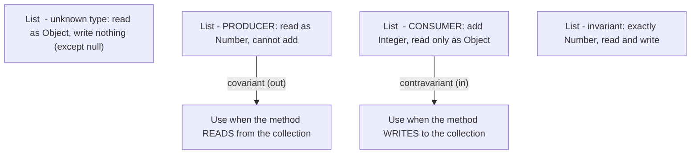
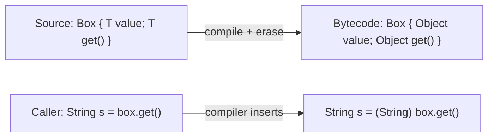

# Generics in Java

Generics, added in Java 5, let you parameterize types (`List<String>`) so the compiler catches type errors that used to explode as `ClassCastException` at runtime. Interviews focus on three things: bounded type parameters, wildcards and the PECS rule, and — the depth question — type erasure and everything it breaks. This guide covers each with examples you can run and reason about.

## Why Generics Exist

```java
// Pre-generics (Java 1.4): everything is Object, casts everywhere, bugs at runtime
List names = new ArrayList();
names.add("amina");
names.add(42);                          // compiles fine...
String s = (String) names.get(1);       // ...ClassCastException at RUNTIME

// With generics: the bug is caught at COMPILE time
List<String> safe = new ArrayList<>();
safe.add("amina");
// safe.add(42);                        // compile error - exactly what we want
String t = safe.get(0);                 // no cast needed
```

## Generic Classes and Methods

```java
// Generic class: T is a type parameter, bound at instantiation
public class Box<T> {
    private T value;
    public void put(T value) { this.value = value; }
    public T get() { return value; }
}

Box<String> box = new Box<>();          // diamond operator infers <String>

// Generic METHOD: its own type parameter, declared before the return type,
// inferred from the arguments - independent of any class-level parameter.
public static <T> T firstOrDefault(List<T> list, T fallback) {
    return list.isEmpty() ? fallback : list.get(0);
}

// Multiple parameters:
public static <K, V> Map<V, K> invert(Map<K, V> map) {
    Map<V, K> out = new HashMap<>();
    map.forEach((k, v) -> out.put(v, k));
    return out;
}
```

## Bounded Type Parameters

Bounds constrain what a type parameter can be, and *unlock the bound's API* inside the generic code.

```java
// T must be Comparable to itself (or a supertype - see below), so we may call compareTo.
public static <T extends Comparable<? super T>> T max(List<T> list) {
    T best = list.get(0);
    for (T item : list) {
        if (item.compareTo(best) > 0) best = item;   // legal because of the bound
    }
    return best;
}

// Multiple bounds: one class (first) plus any number of interfaces
public static <T extends Number & Comparable<T>> T clamp(T v, T lo, T hi) {
    if (v.compareTo(lo) < 0) return lo;
    if (v.compareTo(hi) > 0) return hi;
    return v;
}
```

`Comparable<? super T>` is the production-grade bound: it accepts a `T` whose *superclass* implements `Comparable` (e.g., a `LocalDateTime` subclass), which a plain `Comparable<T>` bound would reject.

## Wildcards and PECS

Generics are **invariant**: `List<Integer>` is *not* a `List<Number>`, even though `Integer` is a `Number`. If it were, you could sneak a `Double` into a list of `Integer`s. Wildcards restore controlled flexibility.



**PECS: Producer Extends, Consumer Super** (from Effective Java).

```java
// PRODUCER: we only READ Numbers out of src -> ? extends Number.
// Accepts List<Integer>, List<Double>, List<Number>...
static double sum(List<? extends Number> src) {
    double total = 0;
    for (Number n : src) total += n.doubleValue();
    // src.add(1);          // compile error: could be a List<Double>!
    return total;
}

// CONSUMER: we only WRITE Integers into dst -> ? super Integer.
// Accepts List<Integer>, List<Number>, List<Object>...
static void fillWithSquares(List<? super Integer> dst, int n) {
    for (int i = 1; i <= n; i++) dst.add(i * i);
    // Integer x = dst.get(0);  // compile error: reads come back as Object
}

// The JDK itself is the best example - Collections.copy:
// public static <T> void copy(List<? super T> dest, List<? extends T> src)
```

Rules of thumb:

- Method *parameter* you read from → `? extends T`.
- Method *parameter* you write into → `? super T`.
- You do both → exact type `T` (no wildcard).
- *Return types* should almost never use wildcards — they force every caller to deal with them.
- Arrays, by contrast, are covariant (`Integer[]` **is a** `Number[]`) — and pay for it with runtime `ArrayStoreException`. Generics moved that check to compile time; that is why generic arrays are forbidden.

## Type Erasure

The compiler enforces generics, then *erases* them: type parameters are replaced by their bound (`Object` if unbounded), and casts are inserted at use sites. At runtime, a `List<String>` and a `List<Integer>` are the same class.

```java
List<String> a = new ArrayList<>();
List<Integer> b = new ArrayList<>();
System.out.println(a.getClass() == b.getClass());   // true - erasure!
```



### Consequences of Erasure

```java
public class Erasure<T> {
    // 1. Cannot instantiate a type parameter - T is Object at runtime
    // T make() { return new T(); }                 // compile error

    // 2. Cannot create generic arrays
    // T[] arr = new T[10];                          // compile error
    // Workaround: pass a factory or Class<T> token:
    T[] makeArray(Class<T> type, int n) {
        return (T[]) java.lang.reflect.Array.newInstance(type, n);
    }

    // 3. Cannot use instanceof with a parameterized type
    static boolean check(Object o) {
        // return o instanceof List<String>;         // compile error
        return o instanceof List<?>;                 // only the raw shape is testable
    }

    // 4. No primitives as type arguments: List<int> is illegal -> List<Integer> + boxing
    //    (Project Valhalla aims to fix this with specialized generics.)

    // 5. Overloads that erase to the same signature clash:
    // void f(List<String> x) {}
    // void f(List<Integer> x) {}                    // compile error: same erasure

    // 6. Static fields are shared across ALL parameterizations - there is no
    //    "per-T" static state, because there is only one class.
}
```

**Bridge methods**: when a class implements `Comparable<Person>`, erasure would break override resolution (`compareTo(Person)` vs the erased `compareTo(Object)`), so the compiler generates a synthetic *bridge method* `compareTo(Object)` that casts and delegates. You will meet these in stack traces and reflection.

**Super type tokens**: erasure means `new TypeReference<List<String>>() {}` (Jackson) works by capturing the generic type in the *superclass declaration*, which **is** retained in class metadata — the one place generic types survive erasure. This is how JSON libraries deserialize `List<User>` correctly.

## Real-World Relevance

- Every collections and streams API you use daily is generics; reading JDK signatures (`Collectors.toMap`, `Comparator.comparing`) fluently is an interview skill in itself.
- PECS appears verbatim in library design questions: "design a method that merges two lists of events" is a wildcard question in disguise.
- Erasure explains everyday friction: why Jackson needs `TypeReference`, why Mockito needs `@Captor` for generic captors, and why you cannot overload on `List<String>` vs `List<Integer>`.

## Best Practices

- Never use raw types (`List list`) — they silently disable *all* generic checking, not just for that variable. `List<?>` is the safe "don't know, don't care" type.
- Apply PECS to every public API taking collections; it maximizes caller flexibility at zero runtime cost.
- Prefer generic methods with inferred parameters over casting; suppress warnings (`@SuppressWarnings("unchecked")`) only on the smallest possible scope, with a comment proving safety.
- Do not return wildcard types from public methods.
- Use bounded parameters to express requirements (`T extends Comparable<? super T>`) instead of casting inside the method.
- Favor `List<T>` over `T[]` in APIs — lists are invariant and erase safely; arrays are covariant and reified, and the two models fight each other.

## Interview Questions

<details>
<summary>1. What is type erasure, and why did Java choose it?</summary>

After compile-time checking, the compiler removes generic type information: parameters become their bounds (`Object` if unbounded) and casts are inserted at call sites, so at runtime `List<String>` and `List<Integer>` are one class. Java chose erasure for *migration compatibility*: Java 5 generics had to interoperate with a decade of existing binaries and raw-type code without recompilation. The cost is no runtime generic type info — no `new T()`, no `instanceof List<String>`, no generic arrays.
</details>

<details>
<summary>2. Explain PECS with an example.</summary>

Producer Extends, Consumer Super. If a parameter *produces* values you read, type it `? extends T` — `sum(List<? extends Number>)` accepts `List<Integer>` and `List<Double>`. If it *consumes* values you write, type it `? super T` — `fill(List<? super Integer>)` accepts `List<Number>` and `List<Object>`. `Collections.copy(List<? super T> dest, List<? extends T> src)` shows both at once. If you read *and* write, use the exact type.
</details>

<details>
<summary>3. Why can't you add anything (except null) to a <code>List&lt;? extends Number&gt;</code>?</summary>

The wildcard means "a list of *some specific unknown* subtype of Number" — maybe `List<Integer>`, maybe `List<Double>`. Adding an `Integer` would corrupt a `List<Double>`, and the compiler cannot know which one it has, so it forbids all additions. `null` is allowed because null is a member of every reference type. Reads are safe: whatever the element is, it *is a* Number.
</details>

<details>
<summary>4. Why is <code>List&lt;Integer&gt;</code> not a subtype of <code>List&lt;Number&gt;</code>, when <code>Integer[]</code> IS a subtype of <code>Number[]</code>?</summary>

Generics are invariant to preserve compile-time safety: if the subtyping held, you could pass a `List<Integer>` where `List<Number>` is expected and `add(3.14)` into it. Arrays are covariant for historical reasons (pre-generics polymorphic methods like `Arrays.sort(Object[])` needed it) and compensate with a *runtime* store check — assigning a Double into what is really an `Integer[]` throws `ArrayStoreException`. Generics moved that error to compile time, which is strictly better.
</details>

<details>
<summary>5. What are bridge methods?</summary>

Compiler-synthesized methods that keep polymorphism working after erasure. `class Person implements Comparable<Person>` declares `compareTo(Person)`, but the erased interface method is `compareTo(Object)`. The compiler generates a hidden `compareTo(Object)` in Person that casts to Person and delegates. Without it, dynamic dispatch through the erased interface signature would not find your method. They surface in reflection (`Method.isBridge()`) and occasionally in stack traces.
</details>

<details>
<summary>6. How do libraries like Jackson deserialize <code>List&lt;User&gt;</code> if generics are erased?</summary>

Generic types *are* recorded in class-file metadata for field declarations, method signatures, and superclass declarations — erasure only removes them from runtime objects. The super-type-token trick creates an anonymous subclass, `new TypeReference<List<User>>() {}`; the parameterization `List<User>` is baked into the anonymous class's generic superclass info, retrievable via `getGenericSuperclass()` as a `ParameterizedType`. Jackson reads that to know the element type.
</details>

<details>
<summary>7. What is the difference between <code>List&lt;?&gt;</code>, <code>List&lt;Object&gt;</code>, and raw <code>List</code>?</summary>

`List<Object>` is a list that truly holds Objects — you can add anything, but only an actual `List<Object>` can be passed to it (invariance). `List<?>` is a list of some unknown specific type — any `List<T>` can be passed, but you cannot add (except null); it is the type-safe "any list." Raw `List` opts out of generics entirely: everything compiles with warnings and type safety is gone — never use it in new code.
</details>

<details>
<summary>8. Why does <code>void f(List&lt;String&gt;)</code> alongside <code>void f(List&lt;Integer&gt;)</code> fail to compile?</summary>

Overload resolution and method signatures in the class file use *erased* types. Both methods erase to `f(List)` — identical signatures — so the class would contain duplicate methods. This is a direct, commonly-tested consequence of erasure; the fix is different method names or a common bounded generic method.
</details>
