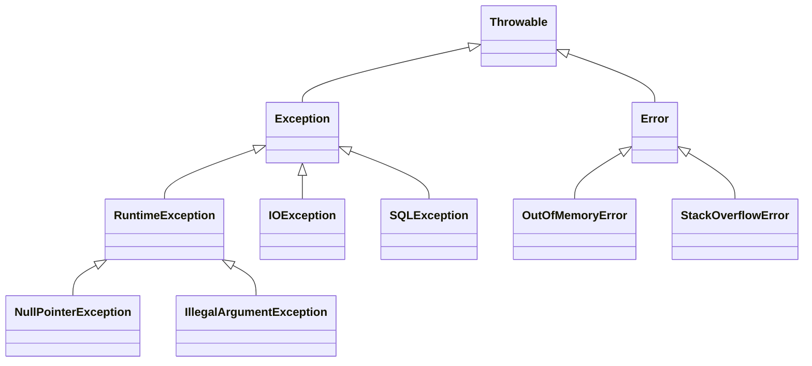
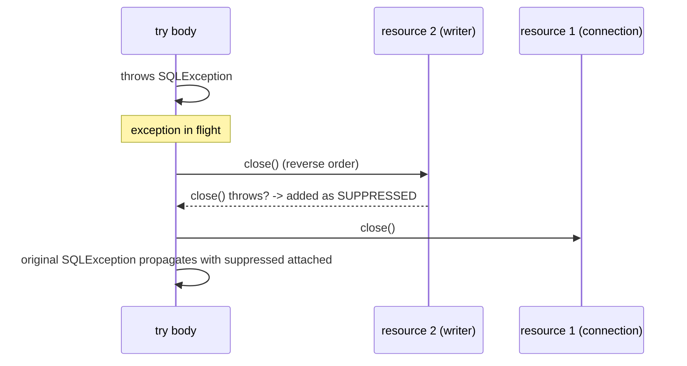

# Exception Handling in Java

Exceptions are Java's mechanism for signaling and recovering from abnormal conditions, and Java is unusual among mainstream languages in having *checked* exceptions enforced by the compiler. Interviews test the hierarchy, checked vs unchecked trade-offs, try-with-resources mechanics, and whether you can design clean error handling rather than sprinkle `catch (Exception e) {}` everywhere. This guide covers all of it.

## The Exception Hierarchy



- **`Error`** — serious JVM-level failures (`OutOfMemoryError`, `StackOverflowError`). Do not catch these in normal code; the JVM is usually in an unrecoverable state.
- **Checked exceptions** — `Exception` and subclasses *except* `RuntimeException` (e.g., `IOException`, `SQLException`). The compiler forces you to catch or declare them (`throws`). Meant for *recoverable, anticipated* conditions: file missing, network timeout.
- **Unchecked exceptions** — `RuntimeException` and subclasses (`NullPointerException`, `IllegalArgumentException`, `IndexOutOfBoundsException`). No compiler enforcement. Meant for *programming errors*: broken preconditions, bugs.

The design intent (per Effective Java): use checked exceptions when the caller can realistically recover; use unchecked for violations of the API contract. Modern practice has drifted toward unchecked-mostly — Spring, for instance, wraps `SQLException` into unchecked `DataAccessException` — because checked exceptions compose poorly (especially with lambdas and streams).

## Try / Catch / Finally Mechanics

```java
public static String readFirstLine(Path path) {
    try {
        return Files.readAllLines(path).get(0);
    } catch (IOException e) {
        // Catch the MOST SPECIFIC exception you can handle meaningfully
        throw new UncheckedIOException("Could not read " + path, e);   // wrap, keep cause
    } catch (IndexOutOfBoundsException e) {
        return "";                                    // empty file: a real, local recovery
    } finally {
        // Runs whether we return, throw, or fall through - for cleanup only.
        // PITFALL: never return or throw from finally; it SWALLOWS the
        // in-flight exception or return value:
        // return "oops";  // would silently discard the IOException above!
    }
}

// Multi-catch (Java 7+): one handler for several exception types
try {
    parseAndStore(payload);
} catch (JsonProcessingException | SQLTransientException e) {
    log.warn("Retryable failure", e);
    retryQueue.add(payload);
}
```

Rules interviewers check:

- Catch blocks are tested top-down; a broader type before a narrower one is a *compile error* ("exception has already been caught").
- `finally` runs even after `return` in `try` — the return value is computed first, then finally runs, then the value is returned. It does *not* run after `System.exit()` or JVM crash.
- Multi-catch types may not be in a subclass relationship with each other, and the caught variable is implicitly final.

## Try-with-Resources (Java 7+)

Any `AutoCloseable` declared in the try header is closed automatically, in **reverse order** of declaration, even on exception. This replaced the error-prone `finally { if (x != null) x.close(); }` dance.

```java
// Both resources are ALWAYS closed - writer first, then connection.
try (Connection conn = dataSource.getConnection();
     PreparedStatement ps = conn.prepareStatement("INSERT INTO logs(msg) VALUES (?)")) {
    ps.setString(1, "hello");
    ps.executeUpdate();
}   // no finally needed

// Suppressed exceptions: if the body throws AND close() throws, the body's
// exception wins and close()'s is attached to it:
catch (SQLException e) {
    for (Throwable sup : e.getSuppressed()) {
        log.warn("also failed during close", sup);
    }
}
```



Writing your own resource is trivial — implement `AutoCloseable`:

```java
public class Timer implements AutoCloseable {
    private final long start = System.nanoTime();
    private final String label;
    public Timer(String label) { this.label = label; }
    @Override public void close() {
        System.out.printf("%s took %d ms%n", label, (System.nanoTime() - start) / 1_000_000);
    }
}

try (var t = new Timer("batch-import")) {
    importBatch();
}   // prints timing automatically, even if importBatch throws
```

## Custom Exceptions

Create custom exceptions to carry domain meaning and structured data — not to rename existing ones.

```java
// Unchecked domain exception with structured context
public class InsufficientFundsException extends RuntimeException {
    private final String accountId;
    private final long requestedCents;
    private final long availableCents;

    public InsufficientFundsException(String accountId, long requested, long available) {
        super("Account %s: requested %d, available %d".formatted(accountId, requested, available));
        this.accountId = accountId;
        this.requestedCents = requested;
        this.availableCents = available;
    }

    public String accountId() { return accountId; }
    public long shortfallCents() { return requestedCents - availableCents; }
}

// Wrapping lower layers: ALWAYS pass the cause - lost causes destroy debuggability.
try {
    repo.save(order);
} catch (SQLException e) {
    throw new OrderPersistenceException("saving order " + order.id(), e);  // cause chained
}
```

Guidelines: provide the standard constructors (message, message+cause), make them serializable-friendly, prefer extending `RuntimeException` for domain errors in modern services, and end class names with `Exception`.

## Common Anti-Patterns

```java
// 1. SWALLOWING - the cardinal sin. The failure vanishes.
try { process(); } catch (Exception e) { }                // never do this

// 2. catch (Exception) / catch (Throwable) as a habit - also catches NPEs and
//    hides bugs. Catch specific types; broad catches belong ONLY at top-level
//    boundaries (request handler, thread loop) where you log and translate.

// 3. Exceptions for control flow - expensive (stack trace capture) and unclear:
try { return Integer.parseInt(s); } catch (NumberFormatException e) { return 0; }
// Better where an API exists: validate first, or use OptionalInt-style helpers.

// 4. log-and-rethrow at every layer - the same error gets logged five times.
//    Either handle it, or enrich-and-rethrow, or let it propagate. Log ONCE,
//    at the boundary that handles it.

// 5. Losing the cause:
catch (SQLException e) { throw new RuntimeException("db error"); }   // WHERE? WHY?
catch (SQLException e) { throw new RuntimeException("db error", e); } // correct
```

## Exceptions and Real Systems

At service boundaries, exceptions become HTTP responses: Spring's `@ControllerAdvice`/`@ExceptionHandler` maps `InsufficientFundsException` to a 422 with a problem-details body, while unexpected `RuntimeException`s become 500s with an alert. Well-designed exception hierarchies (one base domain exception, specific subclasses) make this mapping a few lines. In performance-critical paths (serialization loops, parsers), the cost of *filling in stack traces* is why some frameworks reuse pre-allocated exceptions or override `fillInStackTrace()` — worth mentioning at senior level.

## Best Practices

- Catch narrowly, handle meaningfully; if you can't add value, don't catch — let it propagate.
- Always chain causes when wrapping; never log *and* rethrow the same exception.
- Use try-with-resources for every `AutoCloseable`; treat a bare `close()` in `finally` as a code smell.
- Prefer unchecked exceptions for domain and infrastructure failure in application code; reserve checked exceptions for truly recoverable, caller-actionable conditions in libraries.
- Never catch `Error` or `Throwable` except at a top-level "log and die/restart" boundary.
- Throw early (validate inputs at method entry with `Objects.requireNonNull`, `IllegalArgumentException`), catch late (at the boundary that can actually respond).
- Keep `finally` free of `return`/`throw`; keep exception messages rich in context (ids, values) but free of secrets.
- Document unchecked exceptions your API throws with `@throws` Javadoc — the compiler won't tell your callers, so you must.

## Interview Questions

<details>
<summary>1. Checked vs unchecked exceptions — difference, and when to use each?</summary>

Checked exceptions (extending `Exception` but not `RuntimeException`) must be caught or declared; the compiler enforces it. Unchecked (`RuntimeException` and subclasses) propagate freely. Intended split: checked for recoverable, anticipated conditions the caller should handle (file not found); unchecked for programming errors (null argument, bad index). Modern practice leans unchecked for application/domain errors because checked exceptions clutter signatures and break down with lambdas/streams — note how Spring translates `SQLException` to unchecked `DataAccessException`.
</details>

<details>
<summary>2. What happens if both the try block and close() throw in try-with-resources?</summary>

The try block's exception propagates as the *primary* exception; the exception from `close()` is attached to it as a *suppressed* exception, retrievable via `getSuppressed()`. This is the opposite of the old finally idiom, where the close() exception would replace and destroy the original. Resources are closed in reverse declaration order, and each close runs even if a previous one threw.
</details>

<details>
<summary>3. Does finally always execute? What if try contains a return?</summary>

`finally` runs on normal completion, exception, and `return`/`break`/`continue` out of the try. With a return: the return expression is evaluated, its value saved, finally runs, then the saved value is returned — unless finally itself returns or throws, which *overrides* the pending result (a well-known trap; never do it). finally does not run if the JVM exits (`System.exit`, crash) or the thread is killed.
</details>

<details>
<summary>4. Why can't you catch IOException before FileNotFoundException?</summary>

Catch blocks are matched top-down against the runtime type. `FileNotFoundException` extends `IOException`, so a preceding `catch (IOException)` would match every `FileNotFoundException`, making the later block unreachable — and Java makes unreachable catch blocks a compile-time error. Always order catches from most specific to most general.
</details>

<details>
<summary>5. What is exception chaining and why does it matter?</summary>

Passing the original exception as the `cause` when wrapping: `throw new ServiceException("ctx", e)`. The full chain, with every stack trace, prints as "Caused by:" sections. It matters because layered systems translate exceptions at each boundary (JDBC → repository → service); without chaining, the root cause — the actual SQL error — is destroyed, and production debugging becomes guesswork. Rule: never wrap without the cause.
</details>

<details>
<summary>6. Are exceptions expensive? What is the costly part?</summary>

The costly part is *construction*, specifically `fillInStackTrace()` walking the entire call stack — throwing/catching itself is cheap, and non-thrown try blocks cost essentially nothing (zero-cost try, table-based dispatch). Consequences: don't use exceptions for expected control flow in hot paths; for extreme cases you can construct with `super(msg, cause, true, false)` to disable stack trace capture (JVM internals and some frameworks do this). Also note the JVM may throw pre-allocated, stack-trace-less exceptions for hot implicit NPEs (`-XX:-OmitStackTraceInFastThrow` disables this — a classic "why does my NPE have no stack trace" debugging question).
</details>

<details>
<summary>7. How do checked exceptions interact with lambdas and streams?</summary>

Badly. `Function<T,R>` and friends declare no `throws`, so a lambda body that throws a checked exception will not compile inside `map`/`forEach`. Options: try/catch inside the lambda and wrap into an unchecked exception (most common), write/use a `ThrowingFunction` wrapper utility, or restructure so the checked-throwing work happens outside the stream. This friction is a major reason modern APIs favor unchecked exceptions.
</details>

<details>
<summary>8. Design the exception strategy for a REST microservice.</summary>

One unchecked base class per service (`AppException`) with specific subclasses carrying structured fields (`NotFoundException`, `ValidationException`, `ConflictException`). Business code throws them freely, never logs-and-rethrows. A single global boundary handler (Spring `@ControllerAdvice`) maps each type to an HTTP status and RFC 7807 problem-details body, logs *once* — warn for client errors, error with alerting for unexpected `RuntimeException` (mapped to 500 with no internal details leaked). Third-party checked exceptions are wrapped with cause at the adapter layer. Result: no try/catch noise in business logic, consistent API errors, one log line per failure.
</details>
