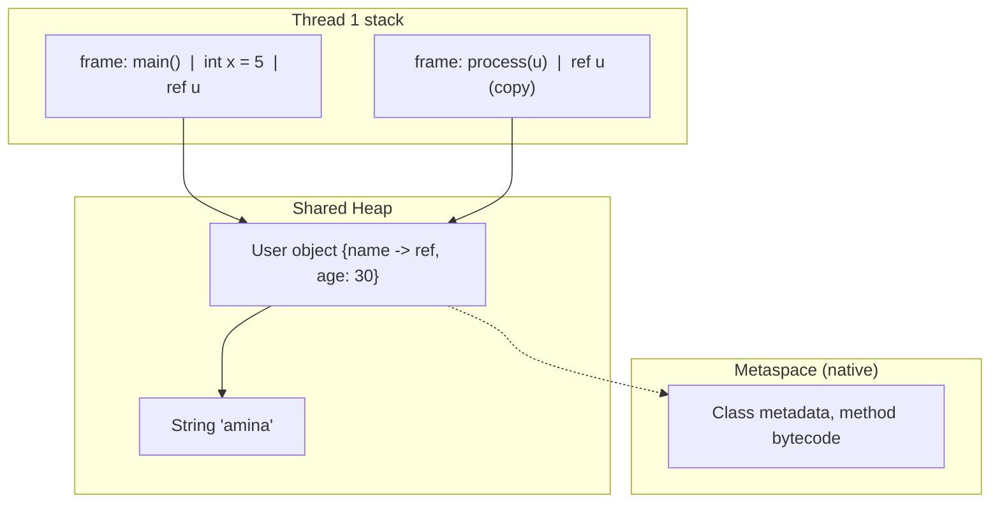
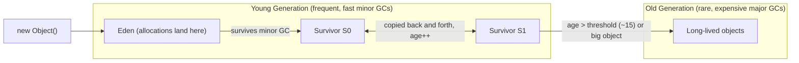

# Java Memory Management

Java frees you from manual `malloc`/`free`, but interviews expect you to understand exactly what the runtime does instead: how the heap and stacks are organized, how generational garbage collection works, which collector to pick, and how "automatic memory management" can still leak. This is a core topic for backend and senior roles, where GC pauses translate directly into latency SLOs.

## Heap vs Stack

Each thread gets its own **stack** — a chain of frames holding local variables, primitives, and *references*. All objects live on the shared **heap** (modulo escape-analysis scalar replacement — see JVM Internals). Class metadata lives in **Metaspace** (native memory, replaced PermGen in Java 8).



```java
void demo() {
    int x = 5;                      // primitive: value on the stack
    User u = new User("amina", 30); // 'u' (reference) on stack; User object on heap
}   // frame popped -> x and the REFERENCE die instantly;
    // the User OBJECT becomes unreachable and is reclaimed later, by GC
```

- Stack memory is reclaimed instantly and deterministically (frame pop); overflow gives `StackOverflowError` (deep/infinite recursion). Size per thread: `-Xss` (defaults ~512KB-1MB).
- Heap exhaustion gives `OutOfMemoryError: Java heap space`. Size: `-Xms` (initial) / `-Xmx` (max).

## Generational Garbage Collection

GC starts from **GC roots** (thread stacks, static fields, JNI refs) and keeps everything reachable; the rest is garbage. The **weak generational hypothesis** — most objects die young — drives the classic heap layout:



- **Minor GC**: Eden fills → live objects copied to a survivor space (copying collection is proportional to *live* data, which is tiny — that's why it's fast); dead objects cost nothing.
- Objects surviving enough minor GCs are **promoted (tenured)** to the old generation.
- **Major/Full GC**: collects the old generation (and typically young too) — much more expensive; frequent full GCs are the classic symptom of a leak or an undersized heap.
- **Stop-the-world (STW)**: phases where all application threads pause. Collector evolution is largely the story of shrinking STW pauses.

## The Collectors

| Collector | Flag | Design | Pause profile | Choose when |
|---|---|---|---|---|
| Serial | `-XX:+UseSerialGC` | Single-threaded, STW | Long | Tiny heaps, single-CPU containers, CLI tools |
| Parallel | `-XX:+UseParallelGC` | Multi-threaded STW, throughput-first | Long but efficient | Batch jobs where total throughput beats latency (ETL, Spark-style workloads) |
| G1 | `-XX:+UseG1GC` (default since 9) | Heap split into ~2048 regions; concurrent marking; evacuates garbage-first regions to meet a pause target | Target-driven, default 200ms | General-purpose services; the sensible default |
| ZGC | `-XX:+UseZGC` | Colored pointers + load barriers; (almost) fully concurrent, generational since 21 | Sub-millisecond, independent of heap size | Latency-critical services with big heaps (trading, low-latency APIs); multi-TB heaps |
| Shenandoah | `-XX:+UseShenandoahGC` | Brooks/ barrier-based concurrent compaction | Low ms | Similar niche to ZGC (Red Hat builds) |

Real-world selection: a typical Spring microservice ships with default G1 and a pause target; an ad-exchange bidder or exchange matching engine with a 10ms p99 budget moves to ZGC; an overnight ETL job picks Parallel for maximum throughput per CPU-hour; a 128MB-container sidecar may be best with Serial.

G1 in one paragraph: the heap becomes equal-sized regions, each acting as Eden/survivor/old/humongous as needed. Concurrent marking tracks per-region liveness; at pause time G1 evacuates the regions with the most garbage first ("garbage first"), compacting as a side effect, and sizes each collection to respect `-XX:MaxGCPauseMillis`.

## Reference Types

Four reachability strengths let you cooperate with the GC:

```java
// STRONG - the default; object lives while reachable.
User u = new User("amina", 30);

// SOFT - cleared only under memory pressure; memory-sensitive caching.
SoftReference<byte[]> thumbnail = new SoftReference<>(loadThumbnail());
byte[] data = thumbnail.get();          // may be null after a memory squeeze

// WEAK - cleared at the NEXT GC once no strong refs remain;
// canonical maps that must not pin their keys.
WeakReference<Session> ref = new WeakReference<>(session);
Map<Key, Value> canon = new WeakHashMap<>();   // entries vanish when key is unreferenced

// PHANTOM - get() always returns null; enqueued after finalization-readiness.
// Used with a ReferenceQueue for post-mortem cleanup of native resources
// (the machinery behind java.lang.ref.Cleaner - the finalize() replacement).
PhantomReference<Buffer> ph = new PhantomReference<>(buf, queue);
```

Order of strength: strong > soft > weak > phantom. Interview shorthand: soft = "keep while memory allows" (caches), weak = "don't let *me* keep it alive" (metadata maps, listeners), phantom/Cleaner = "tell me after it's gone" (native cleanup). `ThreadLocal` uses weak keys internally — and misuse in thread pools is a famous leak (below).

## Memory Leaks in Java

GC collects *unreachable* objects; a leak is memory that stays *reachable* but will never be used again.

```java
// 1. The static collection that only grows
static final Map<String, Result> CACHE = new HashMap<>();   // no eviction, ever
// Fix: bounded cache (LinkedHashMap LRU, Caffeine), or WeakHashMap when appropriate.

// 2. Unremoved listeners/callbacks - publisher pins every subscriber
bus.register(this);      // ...and nobody ever calls unregister -> 'this' lives forever

// 3. ThreadLocal in thread pools - pool threads never die, so per-thread
// values survive across requests indefinitely:
static final ThreadLocal<byte[]> BUF = ThreadLocal.withInitial(() -> new byte[1 << 20]);
// Fix: try { use(BUF.get()); } finally { BUF.remove(); }

// 4. Non-static inner classes / lambdas capturing 'this' registered in
//    long-lived structures (schedulers, caches) pin the whole outer object.

// 5. Unclosed resources - connections, streams, native buffers:
//    always try-with-resources.
```

Diagnosis workflow worth reciting: symptoms (rising old-gen after every full GC, eventual OOM) → capture heap dump (`-XX:+HeapDumpOnOutOfMemoryError -XX:HeapDumpPath=...` or `jcmd <pid> GC.heap_dump`) → open in Eclipse MAT/VisualVM → dominator tree shows the few objects retaining the most memory → "path to GC roots" reveals *who* is holding the reference.

## JVM Tuning Flags

The flags every candidate should recognize:

```bash
# Heap sizing - in containers, set Xms = Xmx to avoid resize churn
java -Xms2g -Xmx2g \
# or container-aware percentage sizing:
     -XX:MaxRAMPercentage=75.0 \
# Collector choice + pause goal
     -XX:+UseG1GC -XX:MaxGCPauseMillis=100 \
# Post-mortem essentials (cheap; always on in prod)
     -XX:+HeapDumpOnOutOfMemoryError -XX:HeapDumpPath=/dumps \
# GC observability (unified logging, Java 9+)
     -Xlog:gc*:file=gc.log:time,uptime,level,tags \
# Per-thread stack size; Metaspace cap if classloader leaks are a risk
     -Xss1m -XX:MaxMetaspaceSize=256m \
     -jar app.jar
```

Golden rule: **measure before tuning**. Modern JVMs are container-aware (they read cgroup limits) and G1's defaults are good; most "tuning" in the wild is fixing an undersized heap or an actual leak, not exotic flags.

## Best Practices

- Let escape analysis and the GC do their jobs — do not pool small objects or call `System.gc()` (disable external triggers with `-XX:+DisableExplicitGC` if needed).
- Set `-Xms == -Xmx` in containers, plus `MaxRAMPercentage` awareness; remember heap ≠ process memory (Metaspace, thread stacks, native buffers all add up).
- Always enable heap-dump-on-OOM and GC logging in production; they cost almost nothing and save incident hours.
- Every cache needs a bounded size and eviction policy; "static HashMap as cache" should fail code review.
- Clean up `ThreadLocal`s in pooled-thread environments; deregister listeners; try-with-resources everything closeable.
- Choose collectors by SLO: G1 by default, ZGC for strict latency on large heaps, Parallel for throughput batch — and validate with GC logs under production-like load.
- Prefer `Cleaner` over `finalize()` (deprecated for removal) for native-resource cleanup.

## Interview Questions

<details>
<summary>1. What lives on the stack vs the heap?</summary>

Each thread's stack holds frames: local primitives, local references, parameters, and return addresses — reclaimed deterministically on frame pop. All objects (and their instance fields, including primitive fields) live on the shared heap, reclaimed by GC when unreachable. Class metadata sits in Metaspace. Nuance for senior candidates: JIT escape analysis can scalar-replace non-escaping objects so they effectively live in registers/stack — an optimization, not a language rule.
</details>

<details>
<summary>2. Explain generational GC and why it is effective.</summary>

Empirically most objects die young (weak generational hypothesis), so the heap is split: allocations go to Eden; frequent minor GCs *copy the few survivors* out (cost proportional to live data, so dead objects are free) between survivor spaces; objects surviving several cycles are promoted to the old generation, which is collected rarely with more expensive algorithms. The result: the common case (short-lived garbage) is collected almost for free, and expensive whole-heap work is rare.
</details>

<details>
<summary>3. When would you choose G1 vs ZGC vs Parallel?</summary>

G1 (the default): balanced latency/throughput for general services, tunable pause target (~100-200ms), fine up to large heaps. ZGC: when p99 latency is the SLO — sub-millisecond pauses independent of heap size (generational since JDK 21), chosen for trading systems, low-latency APIs, multi-hundred-GB heaps; costs some throughput to its load barriers. Parallel: pure throughput with no latency requirement — overnight batch, ETL — highest work-done-per-CPU at the price of long STW pauses. Serial: tiny single-CPU containers.
</details>

<details>
<summary>4. GC exists — how can Java still leak memory, and how do you find a leak?</summary>

GC frees only *unreachable* objects; a leak is unneeded-but-still-referenced memory: ever-growing static caches, unremoved listeners, `ThreadLocal` values on pool threads, inner classes pinning outer instances, unclosed resources. Diagnosis: watch old-gen occupancy after full GCs trend upward in GC logs; take a heap dump (`jcmd GC.heap_dump` or `-XX:+HeapDumpOnOutOfMemoryError`); analyze the dominator tree in Eclipse MAT; follow "path to GC roots" from the biggest retainer to the offending reference; fix and re-measure.
</details>

<details>
<summary>5. Explain strong, soft, weak, and phantom references with a use case each.</summary>

Strong: normal references — object lives while reachable. Soft: cleared only under memory pressure — memory-sensitive caches that shrink instead of OOMing. Weak: cleared at the next GC once only weakly reachable — `WeakHashMap` for metadata keyed by objects you must not pin; also ThreadLocal's internal keys. Phantom: `get()` is always null; enqueued on a `ReferenceQueue` when the object is reclaimable — post-mortem cleanup of native memory, the mechanism behind `Cleaner`, the modern replacement for `finalize()`.
</details>

<details>
<summary>6. What is a stop-the-world pause and what have modern collectors done about it?</summary>

An STW pause halts every application thread at safepoints so the collector can work on a consistent heap. Serial/Parallel do all work inside STW. G1 moved *marking* concurrent and bounds evacuation pauses to a target by collecting incrementally, region by region. ZGC/Shenandoah made marking *and compaction* concurrent using load barriers and colored pointers, leaving only sub-millisecond pauses for root scanning — pause time no longer scales with heap size.
</details>

<details>
<summary>7. What is Metaspace, and how does OOM: Metaspace differ from OOM: heap space?</summary>

Metaspace (Java 8+, replacing PermGen) stores class metadata in *native* memory, growing by default until `MaxMetaspaceSize` or OS limits. `OutOfMemoryError: Java heap space` means live objects exceed `-Xmx` (leak or undersizing). `OutOfMemoryError: Metaspace` means too many *classes* — typically a classloader leak: repeated redeployments in an app server, or runtime class generation (proxies, lambdas, bytecode generation) where loaders can't be collected because something references their classes.
</details>

<details>
<summary>8. Why is ThreadLocal a leak risk in thread pools, and what is the fix?</summary>

A ThreadLocal value is stored in a map attached to the *thread*. Pool threads live for the application's lifetime, so a value set during one task remains referenced after the task ends — leaking the value (and everything it references) and, worse, *bleeding state into the next task that reuses the thread*, a correctness bug beyond the leak. The entry's key is weak but the value reference is strong, so it is not collected reliably. Fix: `finally { threadLocal.remove(); }` at the end of each task, or avoid ThreadLocal in favor of explicit parameter passing / scoped values (JEP 481).
</details>
