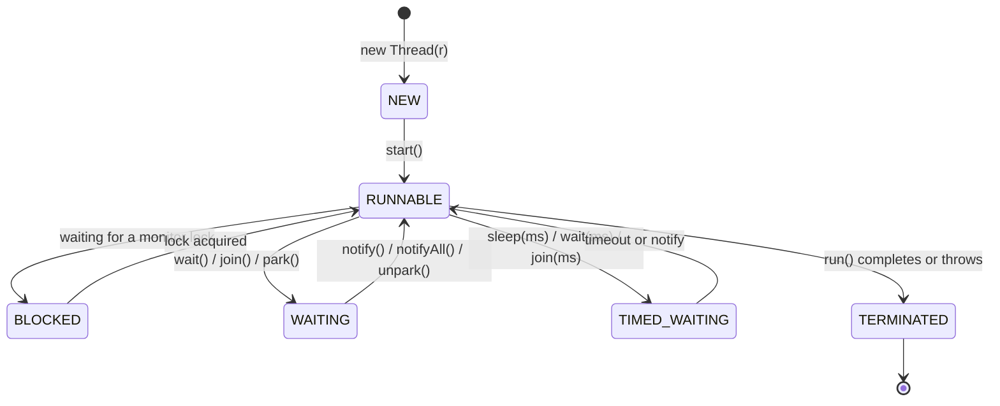
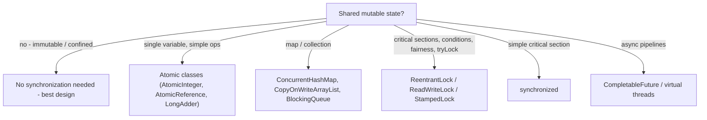

# Concurrency and Multithreading in Java

Concurrency is the topic that most reliably separates senior from junior candidates: anyone can start a thread, but interviews probe visibility, atomicity, the memory model, and the java.util.concurrent toolbox. This guide walks the thread lifecycle, the low-level primitives (`synchronized`, `volatile`), the high-level utilities you should actually use, and the virtual threads that are reshaping Java server design.

## Thread Lifecycle



`RUNNABLE` covers both "running on a CPU" and "ready, waiting for a CPU" — the OS scheduler decides. Calling `start()` twice throws `IllegalThreadStateException`; calling `run()` directly just executes it on the *current* thread (a classic trick question).

## Creating Work: Runnable, Callable, Threads

```java
// Runnable: no result, no checked exceptions
Runnable task = () -> System.out.println("on " + Thread.currentThread().getName());
new Thread(task).start();

// Callable: returns a value, may throw - used with executors
Callable<Integer> compute = () -> expensiveCount();

ExecutorService pool = Executors.newFixedThreadPool(4);
Future<Integer> future = pool.submit(compute);
Integer result = future.get(2, TimeUnit.SECONDS);   // blocks; TimeoutException if late
pool.shutdown();                                     // always shut pools down
```

Never create raw threads per task in a server — use an `ExecutorService` (pooling, bounded queues, lifecycle) and prefer the explicit `ThreadPoolExecutor` constructor in production so queue size and rejection policy are deliberate, not unbounded defaults.

## The Two Problems: Atomicity and Visibility

Concurrent bugs come in two flavors:

1. **Atomicity** — `count++` is read-modify-write; two threads interleave and lose updates.
2. **Visibility** — without synchronization, a write by one thread may *never be seen* by another (caches, compiler reordering).

### synchronized — atomicity + visibility

```java
public class Counter {
    private int count = 0;

    public synchronized void increment() { count++; }       // locks 'this'
    public synchronized int get() { return count; }         // readers must lock too!
}

// Block form with a private lock object (better: nobody outside can lock it):
private final Object lock = new Object();
public void transfer(Account from, Account to, long cents) {
    synchronized (lock) {
        from.withdraw(cents);
        to.deposit(cents);
    }
}
```

`synchronized` provides *mutual exclusion* (one thread in the critical section) **and** a *happens-before* edge: everything done before releasing a monitor is visible to the next thread that acquires it. Locks are reentrant (a thread can re-acquire its own monitor).

### volatile — visibility only

```java
public class Worker implements Runnable {
    private volatile boolean running = true;   // without volatile, the loop may NEVER stop:
                                               // the JIT can hoist the read out of the loop
    public void stop() { running = false; }

    @Override public void run() {
        while (running) { doUnitOfWork(); }
    }
}

// PITFALL: volatile does NOT make compound operations atomic
private volatile int hits = 0;
void hit() { hits++; }    // still a lost-update race! Use AtomicInteger.
```

`volatile` guarantees that reads see the latest write and forbids reordering around the access — but provides *no* mutual exclusion.

### Happens-Before in One Breath

The Java Memory Model defines *happens-before*: if action A happens-before B, A's effects are visible to B. Key edges: program order within a thread; monitor unlock → subsequent lock of the same monitor; volatile write → subsequent volatile read; `Thread.start()` → everything in the started thread; everything in a thread → `join()` returning; and transitivity. **If two threads access shared mutable state and no happens-before edge orders a write with a read, you have a data race** — the fundamental rule.

## The java.util.concurrent Toolbox



```java
// Atomics: lock-free CAS (compare-and-set) under the hood
AtomicInteger counter = new AtomicInteger();
counter.incrementAndGet();
counter.compareAndSet(5, 6);          // succeed only if current value is 5
LongAdder adder = new LongAdder();    // better than AtomicLong under heavy contention
adder.increment();                     // (striped cells, sum() to read)

// ReentrantLock: like synchronized plus tryLock, timeouts, interruptibility, fairness
private final ReentrantLock lock = new ReentrantLock();
if (lock.tryLock(100, TimeUnit.MILLISECONDS)) {   // deadlock-avoidance tool
    try { critical(); } finally { lock.unlock(); } // ALWAYS unlock in finally
}

// ConcurrentHashMap: atomic compound operations - never check-then-act manually
ConcurrentHashMap<String, LongAdder> stats = new ConcurrentHashMap<>();
stats.computeIfAbsent("requests", k -> new LongAdder()).increment();   // atomic per key

// BlockingQueue: the producer-consumer backbone
BlockingQueue<Job> queue = new ArrayBlockingQueue<>(1024);  // bounded = backpressure
queue.put(job);          // blocks when full
Job next = queue.take(); // blocks when empty

// Coordination: CountDownLatch (one-shot), CyclicBarrier (reusable), Semaphore (permits)
CountDownLatch ready = new CountDownLatch(3);
// each worker: ready.countDown();  main: ready.await();
```

### CompletableFuture — async composition

`CompletableFuture` shines when you fan out independent I/O calls and combine results — the classic "page assembly" pattern in API gateways and e-commerce backends (fetch price, inventory, reviews concurrently; combine; overall latency = slowest call, not the sum).

```java
CompletableFuture<Price> price = CompletableFuture.supplyAsync(() -> priceSvc.get(id), ioPool);
CompletableFuture<Stock> stock = CompletableFuture.supplyAsync(() -> stockSvc.get(id), ioPool);

CompletableFuture<Page> page = price
    .thenCombine(stock, (p, s) -> render(p, s))     // combine two futures
    .orTimeout(800, TimeUnit.MILLISECONDS)          // deadline the pipeline
    .exceptionally(ex -> Page.fallback());          // graceful degradation

Page result = page.join();
// Pitfalls: default async pool is ForkJoinPool.commonPool() - pass your own
// executor for blocking I/O; exceptions surface wrapped in CompletionException.
```

## Deadlock

```java
// Thread A: lock(a) then lock(b). Thread B: lock(b) then lock(a). -> deadlock
static void transfer(Account a, Account b, long cents) {
    synchronized (a) {
        synchronized (b) { a.debit(cents); b.credit(cents); }
    }
}
// FIX: impose a GLOBAL LOCK ORDER, e.g., by account id:
static void transferSafe(Account x, Account y, long cents) {
    Account first  = x.id() < y.id() ? x : y;
    Account second = x.id() < y.id() ? y : x;
    synchronized (first) {
        synchronized (second) { x.debit(cents); y.credit(cents); }
    }
}
```

Four Coffman conditions (mutual exclusion, hold-and-wait, no preemption, circular wait); break any one — in practice: consistent lock ordering, `tryLock` with timeout, or redesign to a single lock/queue. Diagnose live deadlocks with `jstack <pid>`, which prints "Found one Java-level deadlock" with both stacks.

## Virtual Threads (Project Loom, Java 21+)

Platform threads wrap expensive OS threads (~1MB stack each; ~thousands max). **Virtual threads** are cheap JVM-managed threads (millions possible) multiplexed over a small pool of carrier threads; when a virtual thread blocks on I/O, it *unmounts*, freeing the carrier.

```java
// One virtual thread per task - blocking style, async scalability
try (var executor = Executors.newVirtualThreadPerTaskExecutor()) {
    List<Future<String>> results = urls.stream()
        .map(url -> executor.submit(() -> fetch(url)))   // 10,000 concurrent fetches? Fine.
        .toList();
}

Thread.startVirtualThread(() -> handle(request));   // direct API
```

Implications interviewers want you to articulate: thread-per-request servers (classic servlet model) now scale like async ones *without* CompletableFuture gymnastics — Spring Boot and Helidon expose one-liner switches. Caveats: `synchronized` blocks used to *pin* the carrier during blocking (largely fixed in JDK 24, JEP 491); virtual threads don't help CPU-bound work; don't pool them (create per task); ThreadLocal-heavy code gets expensive at millions of threads (hence Scoped Values).

## Best Practices

- Prefer no shared mutable state at all: immutable objects, message passing, thread confinement beat clever locking.
- Use the highest-level tool that fits: streams/structured executors > CompletableFuture > concurrent collections/atomics > locks > `wait/notify` (never in application code).
- Bound everything: thread pools, queues, timeouts on every blocking call — unbounded queues turn overload into OOM.
- One consistent lock-acquisition order across the codebase; document it.
- Lock on `private final` objects, never on `this`, strings, or boxed primitives.
- `volatile` only for simple flags/single-writer handoffs; reach for atomics or locks for anything compound.
- Name your threads (`ThreadFactory`) — future-you debugging a thread dump will be grateful.
- Adopt virtual threads for I/O-heavy request handling on Java 21+; keep CPU-bound work on a sized platform pool (`availableProcessors()`).

## Interview Questions

<details>
<summary>1. What's the difference between synchronized and volatile?</summary>

`synchronized` provides mutual exclusion *and* visibility: one thread in the critical section, with a happens-before edge from unlock to the next lock. `volatile` provides visibility and ordering only — reads always see the latest write, no reordering around the access — but no atomicity for compound actions: `volatile int x; x++` still races. Use volatile for single-variable flags/handoffs with a single writer; use synchronized (or atomics/locks) whenever a read-modify-write or multi-variable invariant is involved.
</details>

<details>
<summary>2. Explain happens-before in the Java Memory Model.</summary>

Happens-before is the JMM's ordering relation: if A happens-before B, A's writes are visible to and ordered before B. Core edges: program order within a thread; monitor unlock → later lock of the same monitor; volatile write → later volatile read of the same variable; `start()` → actions of the started thread; a thread's actions → `join()` returning; transitive closure of all these. A write and a read of shared state not ordered by any happens-before edge constitute a data race with undefined visibility — the compiler and CPUs are then free to cache and reorder.
</details>

<details>
<summary>3. How does ConcurrentHashMap achieve thread safety without a global lock?</summary>

Since Java 8: reads are lock-free (volatile reads of the bucket table); writes CAS the first node into an empty bucket and otherwise synchronize on the bucket's head node only, so contention is per-bin, not per-map. Resizing is cooperative — multiple threads help transfer bins. Nulls are banned (ambiguity under concurrency), and compound atomic operations (`computeIfAbsent`, `merge`) run atomically per key. Iterators are weakly consistent rather than fail-fast. Contrast: `Hashtable`/`synchronizedMap` serialize every operation on one lock.
</details>

<details>
<summary>4. Write code that deadlocks, then fix it.</summary>

Deadlock: thread 1 does `synchronized(a){ synchronized(b){...} }` while thread 2 does `synchronized(b){ synchronized(a){...} }` — each holds one lock and waits for the other (circular wait). Fixes: (1) global lock ordering — always acquire the lock with the smaller id first, eliminating the cycle; (2) `ReentrantLock.tryLock` with timeout and back-off, breaking hold-and-wait; (3) restructure to one lock or a single-threaded queue. Detection: `jstack` reports Java-level deadlocks explicitly.
</details>

<details>
<summary>5. Runnable vs Callable vs Future vs CompletableFuture?</summary>

`Runnable`: `void run()`, no checked exceptions — fire-and-forget work. `Callable<V>`: `V call() throws Exception` — a result-bearing task for executors. `Future<V>`: a handle to a pending result — but only blocking `get()`, no composition. `CompletableFuture<V>`: a Future you can complete manually and *compose* — `thenApply`, `thenCompose` (flat-map for async chains), `thenCombine`, `allOf`, plus timeouts and `exceptionally` for error recovery — enabling non-blocking pipelines such as parallel fan-out to services with result combination.
</details>

<details>
<summary>6. What are virtual threads and how do they change server design?</summary>

Virtual threads (Java 21) are lightweight JVM-scheduled threads — millions per JVM — mounted on a few OS carrier threads; on blocking I/O the virtual thread unmounts, freeing the carrier. Consequence: the simple thread-per-request blocking style scales like async/reactive code without callback/operator complexity, largely obviating reactive frameworks for plain I/O concurrency. Caveats: no benefit for CPU-bound work; never pool them; historic carrier-pinning inside `synchronized` during blocking (fixed by JEP 491 in JDK 24); heavy ThreadLocal use needs rethinking (Scoped Values).
</details>

<details>
<summary>7. Why use LongAdder over AtomicLong for a hot counter?</summary>

`AtomicLong` funnels all threads through CAS on a single memory location; under heavy contention threads spin retrying failed CASes and the cache line ping-pongs between cores. `LongAdder` stripes the value across multiple cells — threads hit different cells (chosen by a per-thread probe), and `sum()` adds them up on read. Massively better write throughput when contended, at the cost of a slightly more expensive, non-atomic-snapshot read — perfect for metrics/counters, wrong for "exact value needed at every read" logic like sequence generation.
</details>

<details>
<summary>8. What is a race condition vs a data race?</summary>

A *data race* is a JMM term: two conflicting accesses (at least one write) to the same variable, unordered by happens-before — undefined visibility results. A *race condition* is a higher-level logic error where correctness depends on timing — the classic check-then-act: `if (!map.containsKey(k)) map.put(k, v)` can interleave even if every individual operation is synchronized (no data race, still broken). Fixes for race conditions are atomic compound operations (`putIfAbsent`, `computeIfAbsent`) or holding one lock across the whole check-and-act sequence.
</details>
