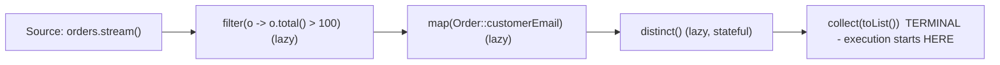

# Functional Java and the Stream API

Java 8 (2014) brought lambdas, functional interfaces, and streams, changing everyday Java from index loops to declarative pipelines. Interviewers use this topic to check fluency with the modern idiom: can you write a clean stream pipeline, explain lazy evaluation, and know when *not* to use streams or Optional? This guide covers the full functional toolkit.

## Lambdas and Functional Interfaces

A lambda is a concise implementation of a **functional interface** — an interface with exactly one abstract method (SAM). `@FunctionalInterface` makes the intent compile-checked.

```java
// Before: anonymous class boilerplate
Comparator<String> byLen1 = new Comparator<String>() {
    @Override public int compare(String a, String b) { return a.length() - b.length(); }
};
// After: lambda
Comparator<String> byLen2 = (a, b) -> Integer.compare(a.length(), b.length());
// Best: composed from library building blocks
Comparator<String> byLen3 = Comparator.comparingInt(String::length);
```

The core interfaces in `java.util.function` — know these cold:

| Interface | Signature | Typical use |
|---|---|---|
| `Supplier<T>` | `() -> T` | Lazy values, factories |
| `Consumer<T>` | `T -> void` | forEach, callbacks |
| `Function<T,R>` | `T -> R` | map, transformations |
| `Predicate<T>` | `T -> boolean` | filter, validation |
| `UnaryOperator<T>` | `T -> T` | replaceAll |
| `BiFunction<T,U,R>` | `(T,U) -> R` | merge, combine |
| `IntFunction`, `ToIntFunction`, ... | primitive variants | avoid boxing in hot paths |

Lambdas may capture local variables only if **effectively final** — the variable is a *value copy*; allowing mutation would create shared-mutable-state races between the lambda and the enclosing method.

```java
int base = 10;                          // effectively final: never reassigned
Function<Integer, Integer> add = x -> x + base;   // OK
// base = 20;                           // uncommenting breaks the lambda - compile error
```

### Method References

Four flavors, all sugar for a lambda:

```java
Function<String, Integer> parse = Integer::parseInt;   // 1. static method
Function<String, Integer> len   = String::length;      // 2. instance method of the PARAMETER
Predicate<String> isValid       = validator::check;    // 3. instance method of a CAPTURED object
Supplier<ArrayList<String>> mk  = ArrayList::new;      // 4. constructor
```

## The Stream API

A stream is a *one-shot, lazy pipeline* over a data source — not a data structure. Pipelines have three parts: source → intermediate operations (lazy, return a stream) → one terminal operation (triggers execution).



```java
record Order(String customerEmail, String category, double total) {}

List<String> bigSpenders = orders.stream()
    .filter(o -> o.total() > 100)         // intermediate: keep matching elements
    .map(Order::customerEmail)            // intermediate: transform
    .distinct()                           // intermediate: stateful (needs seen-set)
    .sorted()                             // intermediate: stateful (buffers all)
    .collect(Collectors.toList());        // terminal: materialize

// flatMap: one element -> many (flatten nested structure)
List<String> allTags = posts.stream()
    .flatMap(p -> p.tags().stream())
    .distinct()
    .toList();                            // Java 16+ shortcut (unmodifiable)

// Numeric streams avoid boxing and add statistics
IntSummaryStatistics stats = orders.stream()
    .mapToInt(o -> (int) o.total())
    .summaryStatistics();                 // min, max, sum, average, count in one pass
```

### Laziness and Short-Circuiting

Intermediate ops do nothing until a terminal op pulls elements through — one element travels the whole pipeline at a time, and short-circuiting ops (`limit`, `findFirst`, `anyMatch`) stop early.

```java
Optional<String> first = Stream.of("alpha", "beta", "gamma", "delta")
    .peek(s -> System.out.println("inspect " + s))   // proves laziness
    .filter(s -> s.startsWith("g"))
    .findFirst();                                     // prints alpha, beta, gamma - then STOPS
// "delta" is never inspected. Without a terminal op, NOTHING prints at all.
```

Streams are single-use: a second terminal operation on the same stream throws `IllegalStateException`.

## Collectors — the Power Tool

```java
import static java.util.stream.Collectors.*;

// groupingBy: the interview favorite
Map<String, List<Order>> byCategory = orders.stream()
    .collect(groupingBy(Order::category));

// Downstream collectors: group AND aggregate
Map<String, Double> revenueByCategory = orders.stream()
    .collect(groupingBy(Order::category, summingDouble(Order::total)));

Map<String, Long> countByCategory = orders.stream()
    .collect(groupingBy(Order::category, counting()));

// partitioningBy: exactly two groups, keyed true/false
Map<Boolean, List<Order>> bigVsSmall = orders.stream()
    .collect(partitioningBy(o -> o.total() > 100));

// toMap - PITFALL: throws IllegalStateException on duplicate keys
Map<String, Double> latestByEmail = orders.stream()
    .collect(toMap(Order::customerEmail, Order::total,
                   (oldV, newV) -> newV));            // ALWAYS supply a merge function

// joining
String csv = orders.stream().map(Order::category).distinct()
    .collect(joining(", ", "[", "]"));

// reduce for custom folds (prefer specialized ops when they exist)
double totalRevenue = orders.stream().mapToDouble(Order::total).sum();
```

### Parallel Streams — Use With Care

`parallelStream()` splits work across `ForkJoinPool.commonPool()`. It pays off only for CPU-bound work on large datasets with cheap splitting (arrays, ArrayList) and *no shared mutable state or I/O* in the lambdas. Common failure modes: parallelizing tiny collections (overhead dominates), blocking I/O starving the shared common pool for the whole JVM, and racy accumulators. Default to sequential; parallelize after measuring.

```java
// WRONG: shared mutable state in a parallel stream
List<String> out = new ArrayList<>();
items.parallelStream().map(String::toUpperCase).forEach(out::add);  // race - corrupt list
// RIGHT: let the collector manage concurrency
List<String> ok = items.parallelStream().map(String::toUpperCase).toList();
```

## Optional

`Optional<T>` is a return-type container that makes "no result" explicit, replacing null-return ambiguity.

```java
Optional<User> user = repo.findByEmail(email);

// Functional style - no isPresent/get staircase:
String city = repo.findByEmail(email)
    .map(User::address)
    .map(Address::city)
    .orElse("unknown");

user.ifPresentOrElse(
    u -> log.info("found {}", u.id()),
    () -> log.warn("no user for {}", email));

User u = user.orElseThrow(() -> new NotFoundException(email));

// orElse vs orElseGet - a classic trap:
config.orElse(loadDefaults());        // loadDefaults() runs EVEN IF PRESENT (eager arg)
config.orElseGet(() -> loadDefaults()); // runs only when empty (lazy supplier)
```

Anti-patterns: `opt.get()` without checking (just moves the NPE), `Optional` fields or method parameters (it is not `Serializable` and clutters call sites — designed for *return types*), and `if (opt.isPresent()) opt.get()` instead of `map`/`orElse` chains.

## Real-World Notes

Streams are the backbone of in-memory data shaping in services (DTO mapping, report aggregation) and pair with modern APIs everywhere: JPA/Spring Data return `Stream<T>` for large result sets, `Files.lines()` streams a file lazily (close it — use try-with-resources!), and Kafka Streams/Spark borrowed the same mental model for distributed data. Collectors like `groupingBy` + downstream aggregation routinely replace 20-line loop-and-map code in code review.

## Best Practices

- Keep lambdas tiny and side-effect-free; extract anything multi-line into a named method and use a method reference.
- Prefer `toList()`, `groupingBy`, `toMap` (always with a merge function) over hand-rolled accumulation; never mutate external state from inside a pipeline.
- Streams for transformation, loops for imperative logic: complex control flow, early exit with side effects, or index-based access reads better as a loop — do not force streams everywhere.
- Use primitive streams (`IntStream`, `mapToLong`) in numeric hot paths to avoid boxing.
- `Optional` for return types only; never for fields or parameters; never call bare `get()`.
- Don't reuse streams; don't parallelize without a measurement; never do blocking I/O in `parallelStream` lambdas.
- Close streams over resources (`Files.lines`) with try-with-resources.

## Interview Questions

<details>
<summary>1. Intermediate vs terminal operations — and what does lazy evaluation mean here?</summary>

Intermediate ops (`filter`, `map`, `sorted`) return a stream and are lazy: they only record what to do. A terminal op (`collect`, `forEach`, `reduce`, `findFirst`) triggers execution, pulling elements through the whole pipeline — typically one element at a time through all stages (except stateful barriers like `sorted`). Benefits: no intermediate collections, and short-circuiting terminals (`findFirst`, `anyMatch`) can stop after examining only a few elements. With no terminal op, nothing executes at all.
</details>

<details>
<summary>2. map vs flatMap?</summary>

`map` transforms each element one-to-one: `Stream<Order> -> Stream<String>`. `flatMap` transforms each element into a *stream* and flattens the results into one stream — one-to-many: `Stream<Post> -> flatMap(p -> p.tags().stream()) -> Stream<String>` of all tags. Without flatMap you would get `Stream<Stream<String>>`. Same distinction in Optional: `Optional.map` would nest `Optional<Optional<T>>` where `flatMap` flattens.
</details>

<details>
<summary>3. What is a functional interface, and can it have more than one method?</summary>

An interface with exactly one *abstract* method — the SAM — which is the signature a lambda implements. It may additionally have any number of `default` and `static` methods, and abstract methods matching `public` methods of `Object` (like `equals`) don't count. `@FunctionalInterface` asks the compiler to enforce the single-abstract-method rule. Examples: `Runnable`, `Comparator` (note its many defaults — still functional), `Function`.
</details>

<details>
<summary>4. Why must captured local variables be effectively final?</summary>

The lambda receives a *copy* of the local's value: locals live on a stack frame that may be gone when the lambda later runs (or run concurrently on another thread). Allowing mutation would either require heap-allocating the variable (Java chose not to, unlike closures in JS) or create the illusion of shared state that isn't shared. Requiring effective finality keeps the copy semantics honest and race-free. Workarounds (mutable holder arrays, AtomicInteger) exist but usually signal the code wants a reduction/collector instead.
</details>

<details>
<summary>5. When are parallel streams a bad idea?</summary>

(1) Small datasets — splitting/merging overhead exceeds the work; (2) I/O-bound lambdas — they block workers of the JVM-wide `ForkJoinPool.commonPool()`, starving every other parallel stream and CompletableFuture default async task; (3) shared mutable state in lambdas — data races; (4) order-sensitive, stateful ops (`limit` on ordered streams) which parallelize poorly; (5) sources that split badly (LinkedList, iterate-based streams). Good fit: large in-memory arrays/ArrayLists with pure, CPU-heavy per-element work. Always benchmark; consider a dedicated pool if you must control placement.
</details>

<details>
<summary>6. Explain the difference between orElse and orElseGet.</summary>

`orElse(value)` evaluates its argument *eagerly* — the expression runs whether or not the Optional is empty, so `opt.orElse(expensiveDefault())` always pays the cost (and any side effects always fire). `orElseGet(supplier)` takes a `Supplier` invoked *only when empty*. Rule: constants with `orElse`, anything computed or side-effecting with `orElseGet`. A favorite trap question because code with side effects in `orElse` misbehaves in subtle ways.
</details>

<details>
<summary>7. What goes wrong with Collectors.toMap and how do you fix it?</summary>

Two classics: (1) duplicate keys throw `IllegalStateException` — fix by passing the third argument, a merge function `(oldV, newV) -> ...`, to decide winners; (2) null values throw `NullPointerException` (HashMap-backed collector rejects null via `merge`) — fix by filtering nulls first or collecting differently. Bonus: pass a fourth argument (`TreeMap::new`, `LinkedHashMap::new`) to control the map implementation and ordering.
</details>

<details>
<summary>8. How would you compute "top 3 categories by revenue" from a list of orders?</summary>

Two-stage pipeline: first aggregate, then rank the aggregate. `orders.stream().collect(groupingBy(Order::category, summingDouble(Order::total)))` yields `Map<String, Double>`; then `map.entrySet().stream().sorted(Map.Entry.<String,Double>comparingByValue().reversed()).limit(3).map(Map.Entry::getKey).toList()`. Talking points: `groupingBy` with a downstream collector does the aggregation in one pass; you cannot sort by an aggregate until it exists, hence the second stream over the entry set; `limit(3)` short-circuits the ranking.
</details>
