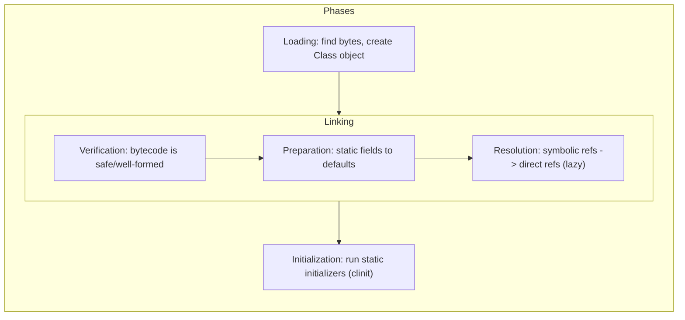
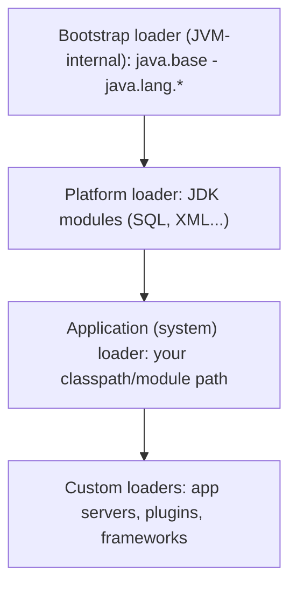
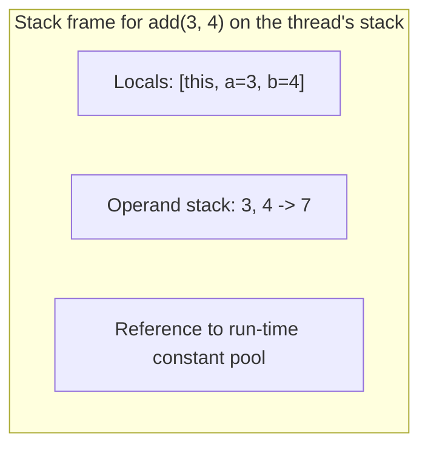
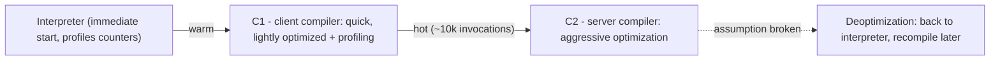

# JVM Internals

Understanding what the JVM does with your `.class` files — loading, verifying, interpreting, JIT-compiling, and optimizing — is what turns "I write Java" into "I understand Java" in senior interviews. This guide covers the class-loading pipeline, bytecode execution on stack frames, method dispatch, JIT tiers, and escape analysis, with the practical hooks (flags, tools) that make the knowledge concrete.

## Class Loading

Classes load lazily, on first use, through a three-phase pipeline run by a hierarchy of class loaders.





The key protocol is **parent delegation**: a loader first asks its parent to load a class, and only loads it itself if the parent chain fails. This guarantees `java.lang.String` always comes from the bootstrap loader — no application jar can spoof core classes (security), and core classes exist exactly once (consistency).

Two facts that win interview points:

- **Class identity = (class name, defining loader).** The same bytes loaded by two loaders are two *different* classes — assigning between them throws `ClassCastException`. This is how app servers isolate deployments (each webapp gets its own loader) and how hot reload works (throw away the loader, make a new one). It is also the root of "ClassCastException: X cannot be cast to X" bugs.
- **Initialization triggers** are precise: first instantiation, static member access, reflection, or a subclass's initialization — not mere reference. `Class.forName("X")` initializes; `ClassLoader.loadClass` does not. Static initializers run once, under a JVM-managed lock — the basis of the *initialization-on-demand holder* singleton idiom.

```java
public class Lazy {
    static { System.out.println("Lazy initialized"); }   // <clinit>
    static final Config CONFIG = Config.load();          // runs at initialization time
}
// Holder idiom: thread-safe lazy singleton with ZERO synchronization code
public class Service {
    private Service() {}
    private static class Holder { static final Service INSTANCE = new Service(); }
    public static Service instance() { return Holder.INSTANCE; }  // triggers Holder's <clinit> once
}
```

## Bytecode and Stack Frames

The JVM is a **stack machine**: each method invocation pushes a frame holding a *local variable array* and an *operand stack*; instructions pop operands, compute, and push results.

```java
int add(int a, int b) { return a + b; }
```

compiles to (see for yourself with `javap -c`):

```text
iload_1      // push local 1 (a) onto the operand stack
iload_2      // push local 2 (b)
iadd         // pop two ints, push their sum
ireturn      // pop and return
```



Frame facts: local slot 0 holds `this` for instance methods; `long`/`double` occupy two slots; the verifier proves stack depths and types are consistent before the code ever runs — one reason malformed bytecode cannot corrupt the JVM.

## Method Dispatch

Five invoke instructions, and knowing which is which explains Java performance and semantics:

| Instruction | Used for | Dispatch |
|---|---|---|
| `invokestatic` | static methods | compile-time target |
| `invokespecial` | constructors, `private`, `super.` calls | compile-time target |
| `invokevirtual` | normal instance methods | runtime, via class **vtable** |
| `invokeinterface` | calls through interface types | runtime, via **itable** search |
| `invokedynamic` | lambdas, string concat, dynamic languages | user-defined bootstrap, then linked call site |

`invokevirtual` looks up the receiver's class vtable — an array of method pointers where overrides replace superclass entries — a constant-time indexed load. `invokeinterface` is more complex (a class's interface methods have no fixed slot), and `invokedynamic` is why lambdas are *not* anonymous-class sugar: the first call runs a bootstrap method (`LambdaMetafactory`) that spins a lightweight class and links the call site permanently.

## JIT Compilation — Tiered Execution

HotSpot starts by *interpreting* bytecode, profiles what actually runs, and compiles hot methods to native code — first with the fast C1 compiler (with profiling instrumentation), then the optimizing C2 for the truly hot code (default threshold ~10,000 invocations).



C2's headline optimizations — all profile-guided:

- **Inlining** (the mother of optimization: exposes everything else) — small/hot methods are pasted into callers.
- **Monomorphic call-site devirtualization**: if profiling shows one receiver class at a virtual call, C2 inlines it behind a cheap type check; the check failing triggers **deoptimization** — throw away the compiled code, fall back to the interpreter, recompile with new knowledge. This speculative optimize/deopt cycle is *why* JVMs can rival C++ on dynamic-dispatch-heavy code.
- **Loop unrolling, vectorization, lock elision/coarsening, dead-code elimination.**

Practical consequences: JVM apps need *warmup* (hence why benchmarks use JMH, and why latency-critical shops pre-warm or use AOT); `-XX:+PrintCompilation` shows the JIT working; CDS/AppCDS and modern Project Leyden AOT caches attack startup time; GraalVM Native Image trades JIT peak performance for instant start (popular for serverless/CLI).

## Escape Analysis

Before allocating an object on the heap, C2 asks: does this object *escape* the compiled scope (get stored in a field, passed out, returned)? If not:

- **Scalar replacement**: the object is never allocated; its fields become locals in registers. Zero allocation, zero GC pressure.
- **Lock elision**: synchronizing on a non-escaping object is provably uncontended — the lock is removed entirely.

```java
// Looks like 10 million allocations - after inlining + escape analysis,
// Point never escapes distance(), so NO heap allocation happens at all.
record Point(double x, double y) {}
double total = 0;
for (int i = 0; i < 10_000_000; i++) {
    Point p = new Point(i, i + 1);       // scalar-replaced: p.x, p.y live in registers
    total += Math.hypot(p.x(), p.y());
}
```

This is the standard answer to "aren't all those immutable objects and iterators expensive?" — in hot compiled code, short-lived non-escaping objects are frequently free. It only works after inlining (the object must not escape the *compiled unit*), which is another reason small methods are performance-friendly. Toggle for experiments: `-XX:-DoEscapeAnalysis` (never in production).

## Tools Worth Naming in Interviews

```bash
javap -c -p MyClass          # disassemble bytecode
jcmd <pid> Thread.print      # thread dump (also jstack)
jcmd <pid> GC.heap_dump d.hprof
jconsole / VisualVM / JDK Mission Control (JFR)   # live inspection, flight recording
java -XX:+PrintCompilation -XX:+UnlockDiagnosticVMOptions -XX:+PrintInlining ...
```

Java Flight Recorder (JFR) deserves a special mention: production-grade, ~1% overhead, continuous profiling — the standard first tool for "the JVM is slow in prod."

## Best Practices

- Write small, focused methods — they inline, and inlining unlocks every other JIT optimization including escape analysis.
- Don't fight the JIT: avoid "clever" manual micro-optimizations (object pooling of small objects, hand-unrolled loops); profile-guided compiled code usually beats them.
- Benchmark only with JMH — naive timing loops measure the interpreter, dead-code elimination, and on-stack replacement artifacts, not your code.
- Know your startup story: CDS archives and (JDK 24+) AOT method caches for faster JVM start; GraalVM Native Image where cold start rules (serverless).
- Treat "ClassCastException: X cannot be cast to X" and `NoClassDefFoundError` as class-loader identity/visibility problems — check *which loader* loaded each side.
- Use JFR in production continuously; reach for `jcmd` before restarting a sick JVM — dumps first, restart second.

## Interview Questions

<details>
<summary>1. Describe what happens between "java MyApp" and your main method running.</summary>

The launcher starts the JVM (loads libjvm, parses flags), creates the bootstrap loader, and loads core modules. The application loader loads `MyApp`: loading (bytes → Class object), linking — verification (bytecode safety proofs), preparation (statics to default values), lazy resolution of symbolic references — then initialization (`<clinit>`: static initializers/assignments). The JVM then invokes `main(String[])` via the interpreter; as code gets hot, tiered JIT compilation kicks in. Class loading continues lazily throughout execution as new classes are first used.
</details>

<details>
<summary>2. What is parent delegation and why does it exist?</summary>

Each class loader asks its parent to load a class before attempting it itself: application → platform → bootstrap. Guarantees: core classes (`java.lang.String`) always resolve to the trusted bootstrap versions, so untrusted jars cannot substitute core classes (security), and each class exists once per hierarchy branch (consistency). Frameworks deliberately break it in controlled ways — servlet containers prefer webapp-local classes for app isolation, JDBC uses the thread context loader — which is exactly where the classic `ClassNotFoundException`/duplicate-class bugs live.
</details>

<details>
<summary>3. How do lambdas differ from anonymous inner classes at the JVM level?</summary>

Anonymous classes are compiled to separate `.class` files eagerly at compile time. Lambdas compile the body to a private synthetic method plus an `invokedynamic` instruction; at first execution, the `LambdaMetafactory` bootstrap generates a small implementation class *at runtime* and links the call site — subsequent calls are direct. Benefits: no class-file explosion, stateless lambdas can be cached singletons, and the strategy can improve in future JDKs without recompiling your code. Also semantics: a lambda's `this` is the enclosing instance, not the lambda object.
</details>

<details>
<summary>4. What is tiered compilation and deoptimization?</summary>

HotSpot executes new code in the interpreter while gathering counters; warm methods compile with C1 (fast compile, light optimization, keeps profiling); hot methods recompile with C2 (aggressive, profile-guided). C2 makes speculative assumptions — e.g., "this virtual call always sees class X, inline it" — guarded by cheap checks. When an assumption breaks, the JVM *deoptimizes*: discards the compiled code mid-execution (on-stack replacement back to the interpreter) and later recompiles with updated profiles. This speculate-and-recover loop is how the JVM optimizes dynamic code nearly like static code.
</details>

<details>
<summary>5. Explain escape analysis and its two payoffs.</summary>

The JIT analyzes whether an allocated object can *escape* the compiled scope — stored to a field/static, passed to a non-inlined method, returned, or reachable by another thread. If it provably cannot: (1) *scalar replacement* — no allocation; the object's fields become register-resident locals, eliminating GC pressure entirely; (2) *lock elision* — synchronization on a non-escaping object is removed since no other thread can contend. It depends on inlining (escape is judged within the compiled unit), which is a key reason small methods are fast in Java.
</details>

<details>
<summary>6. Why can the same class loaded twice cause ClassCastException?</summary>

Runtime class identity is the pair (fully qualified name, *defining class loader*). Two loaders defining `com.acme.User` from identical bytes yield two distinct runtime classes; instances of one are not instances of the other, so casting across them throws `ClassCastException: com.acme.User cannot be cast to com.acme.User`. Seen in app servers with per-webapp loaders, OSGi/plugin systems, and when a library leaks across loader boundaries. Fix: ensure the shared type is loaded once by a common parent loader.
</details>

<details>
<summary>7. Why do JVM benchmarks need warmup, and what tool do you use?</summary>

First executions run interpreted, then C1, then C2 — early iterations can be 10-100x slower than steady state, and the JIT may also dead-code-eliminate a benchmark whose result is unused, or constant-fold inputs. JMH (Java Microbenchmark Harness) is the standard: it runs warmup iterations to reach steady state, forks JVMs to isolate profiles, and provides `Blackhole` to defeat dead-code elimination. Any hand-rolled `System.nanoTime()` loop result should be treated as noise.
</details>

<details>
<summary>8. Where does invokedynamic show up in plain Java?</summary>

Despite being added (Java 7) for dynamic languages, plain Java uses it heavily: lambda creation (`LambdaMetafactory`), string concatenation since Java 9 (`StringConcatFactory` picks optimal strategies, replacing StringBuilder chains in bytecode), records' generated `equals`/`hashCode`/`toString` (`ObjectMethods` bootstrap), and pattern-matching switch dispatch (`SwitchBootstraps`). The common theme: defer choosing the implementation strategy to runtime, letting the JDK improve it without recompiling user code.
</details>
