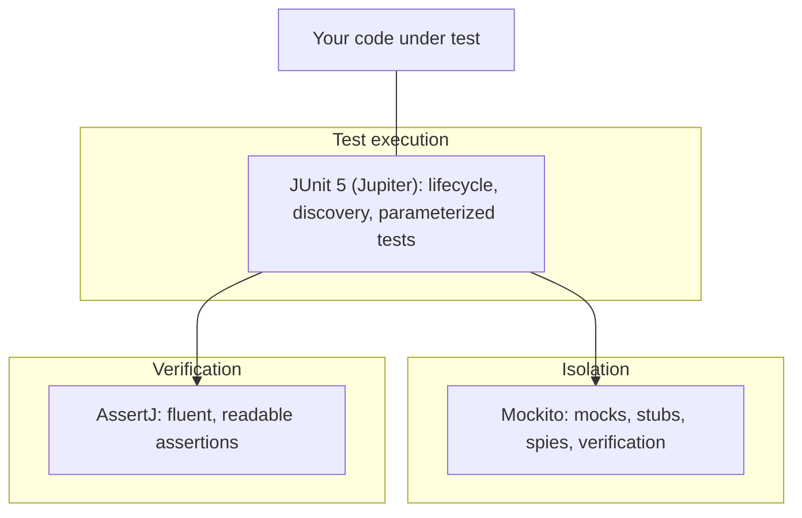
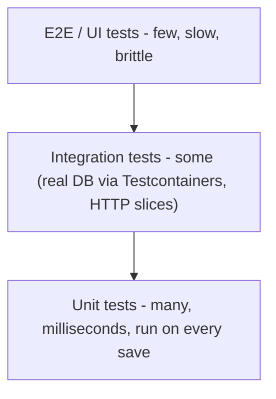

# Testing in Java

Modern Java testing rests on three libraries you will meet in nearly every codebase: JUnit 5 as the test engine, Mockito for test doubles, and AssertJ for fluent assertions. Interviews for mid and senior roles increasingly include "how do you test this?" as a design question — knowing the tools *and* the philosophy (fast, isolated, behavior-focused tests) is expected. This guide covers both.

## The Testing Stack at a Glance





The classic test pyramid still holds: lots of fast unit tests, fewer integration tests (real database in Docker via Testcontainers, Spring slice tests), a handful of end-to-end flows.

## JUnit 5 Essentials

JUnit 5 = **Platform** (launcher build tools hook into) + **Jupiter** (the API you write against) + **Vintage** (runs old JUnit 4 tests).

```java
import org.junit.jupiter.api.*;
import static org.assertj.core.api.Assertions.*;

class BankAccountTest {

    private BankAccount account;

    @BeforeEach                      // fresh fixture per test - tests stay independent
    void setUp() { account = new BankAccount("acc-1", 10_00); }

    @Test
    @DisplayName("deposit increases the balance")
    void depositIncreasesBalance() {
        // Arrange - Act - Assert: the universal test structure
        account.deposit(5_00);                                // Act
        assertThat(account.balanceCents()).isEqualTo(15_00);  // Assert
    }

    @Test
    void depositRejectsNonPositiveAmounts() {
        assertThatThrownBy(() -> account.deposit(0))
            .isInstanceOf(IllegalArgumentException.class)
            .hasMessageContaining("positive");
    }

    @Nested                          // group related scenarios; reads like a spec
    @DisplayName("when the account is empty")
    class WhenEmpty {
        @Test void balanceIsZero() {
            assertThat(new BankAccount("acc-2", 0).balanceCents()).isZero();
        }
    }

    @Test
    @Disabled("flaky on CI - see ISSUE-421")   // always say WHY
    void slowNetworkScenario() { }
}
```

Lifecycle: `@BeforeAll` (static, once) → `@BeforeEach` → `@Test` → `@AfterEach` → `@AfterAll`. By default JUnit creates a *new test-class instance per test method* — instance fields are automatically isolated between tests.

### Parameterized Tests

One test method, many cases — the cure for copy-pasted tests:

```java
class PasswordValidatorTest {

    @ParameterizedTest
    @ValueSource(strings = {"", "short", "no-digits-here"})
    void rejectsInvalidPasswords(String candidate) {
        assertThat(PasswordValidator.isValid(candidate)).isFalse();
    }

    @ParameterizedTest(name = "{0} + {1} = {2}")
    @CsvSource({
        "1, 2, 3",
        "0, 0, 0",
        "-5, 5, 0"
    })
    void addsNumbers(int a, int b, int expected) {
        assertThat(Calculator.add(a, b)).isEqualTo(expected);
    }

    @ParameterizedTest
    @MethodSource("timezoneCases")               // complex objects come from a factory
    void convertsTimezones(ZonedDateTime in, String zone, ZonedDateTime expected) {
        assertThat(Times.convert(in, zone)).isEqualTo(expected);
    }
    static Stream<Arguments> timezoneCases() {
        return Stream.of(
            Arguments.of(zdt("2026-01-01T12:00Z"), "Africa/Nairobi", zdt("2026-01-01T15:00+03:00"))
        );
    }

    @ParameterizedTest
    @EnumSource(value = DayOfWeek.class, names = {"SATURDAY", "SUNDAY"})
    void weekendsAreNotBusinessDays(DayOfWeek day) {
        assertThat(Calendar.isBusinessDay(day)).isFalse();
    }
}
```

## Mockito — Isolating the Unit

Mocks replace collaborators so the test exercises *one* unit and controls its environment.

```java
import static org.mockito.Mockito.*;
import org.mockito.junit.jupiter.MockitoExtension;

@ExtendWith(MockitoExtension.class)
class OrderServiceTest {

    @Mock  PaymentGateway gateway;         // a collaborator we don't want to hit for real
    @Mock  OrderRepository repo;
    @InjectMocks OrderService service;     // real class under test, mocks injected

    @Test
    void chargesAndPersistsSuccessfulOrder() {
        // STUB: define behavior (given/when style)
        when(gateway.charge("card-9", 25_00)).thenReturn(new Charge("tx-1", APPROVED));

        service.place(new Order("card-9", 25_00));

        // VERIFY: assert the interaction happened
        verify(repo).save(argThat(o -> o.txId().equals("tx-1")));
        verify(gateway, times(1)).charge("card-9", 25_00);
        verifyNoMoreInteractions(gateway);
    }

    @Test
    void doesNotPersistWhenPaymentFails() {
        when(gateway.charge(any(), anyLong())).thenThrow(new PaymentDeclinedException("insufficient"));

        assertThatThrownBy(() -> service.place(new Order("card-9", 25_00)))
            .isInstanceOf(PaymentDeclinedException.class);

        verify(repo, never()).save(any());   // the important business rule!
    }

    @Test
    void capturesWhatWasSaved() {
        var captor = org.mockito.ArgumentCaptor.forClass(Order.class);
        when(gateway.charge(any(), anyLong())).thenReturn(new Charge("tx-2", APPROVED));

        service.place(new Order("card-1", 10_00));

        verify(repo).save(captor.capture());
        assertThat(captor.getValue().txId()).isEqualTo("tx-2");  // inspect the argument
    }
}
```

Vocabulary that interviewers probe: a **stub** returns canned answers (state you *arrange*); a **mock** additionally records interactions you *verify*; a **spy** (`spy(realObject)`) wraps a real object, delegating by default with selective stubbing — a code smell when overused. Guidance: verify interactions only when the interaction *is* the contract (e.g., "repo.save was never called on failure"); prefer asserting on returned state otherwise. Don't mock types you don't own (mock your `PaymentGateway` port, not the HTTP client), and never mock value objects.

## AssertJ — Readable Assertions

```java
import static org.assertj.core.api.Assertions.*;

assertThat(names)
    .hasSize(3)
    .containsExactly("amina", "brian", "chao")   // order matters
    .allMatch(n -> n.equals(n.toLowerCase()));

assertThat(user)
    .extracting(User::name, User::age)
    .containsExactly("amina", 30);

assertThat(orders)
    .filteredOn(o -> o.total() > 100)
    .extracting(Order::category)
    .containsOnly("electronics");

// Rich failure messages are the point: expected vs actual with diffs,
// instead of JUnit's assertTrue(false) telling you nothing.
```

## Testing Best Practices in Action

```java
// SMELL: testing private methods / internals -> brittle
// If a private method needs its own tests, extract it into a class.

// SMELL: multiple unrelated behaviors in one test - fails tell you nothing precise
@Test void testEverything() { /* create, update, delete, email... */ }

// GOOD: one behavior per test, named as the behavior
@Test void expiredCouponsAreRejectedAtCheckout() { }

// SMELL: time/randomness hardwired -> flaky
var service = new TrialService();                      // internally calls Instant.now()
// GOOD: inject a Clock (java.time was designed for this)
var fixed = Clock.fixed(Instant.parse("2026-01-01T00:00:00Z"), ZoneOffset.UTC);
var svc = new TrialService(fixed);                     // deterministic forever
```

For integration tests, name **Testcontainers**: spin up a real PostgreSQL/Kafka in Docker per test class — realistic without shared-environment flakiness. In Spring, know the slices: `@WebMvcTest` (controllers only), `@DataJpaTest` (repositories), full `@SpringBootTest` sparingly.

## Best Practices

- Structure every test as Arrange-Act-Assert (or Given-When-Then); one logical behavior and ideally one logical assertion block per test.
- Name tests as behavior statements (`rejectsExpiredCoupon`), not method names (`testProcess2`).
- Tests must be F.I.R.S.T: Fast, Independent (any order, no shared mutable fixtures), Repeatable (no real network/clock/random — inject them), Self-validating, Timely.
- Test behavior through the public API; if you're reaching for reflection or testing privates, the design wants refactoring.
- Mock at architectural boundaries (ports: repositories, gateways); use real objects for everything cheap and deterministic.
- Prefer parameterized tests over copy-paste; prefer AssertJ over bare assertEquals for failure diagnostics.
- Treat flaky tests as production bugs: quarantine, fix, or delete — a suite people ignore is worse than none.
- Measure coverage as a *gap finder*, never as a target; 80% with meaningful assertions beats 100% of assert-free execution.

## Interview Questions

<details>
<summary>1. Mock vs stub vs spy — when do you use each?</summary>

A stub provides canned responses so the unit can run (`when(repo.find(id)).thenReturn(user)`) — used for *state-based* testing where you assert on outputs. A mock also records calls for *interaction* verification (`verify(mailer).send(...)`) — used when the side-effecting call itself is the contract. A spy wraps a real object, running real code unless selectively stubbed — occasionally useful for legacy code, but needing one usually signals the class does too much. Default to stubs + state assertions; verify interactions only for genuine outbound effects.
</details>

<details>
<summary>2. How does JUnit 5 differ from JUnit 4?</summary>

Architecture: JUnit 5 splits into Platform (launcher/engine SPI), Jupiter (new API), and Vintage (runs JUnit 4). Practical differences: `@BeforeEach/@AfterEach/@BeforeAll/@AfterAll` replace `@Before/@After/@BeforeClass/@AfterClass`; the single `@RunWith` runner is replaced by composable `@ExtendWith` extensions (you can combine Mockito + Spring); rich `@ParameterizedTest` sources replace clunky Parameterized runner; `assertThrows`/`assertAll` replace `@Test(expected=...)`; plus `@Nested`, `@DisplayName`, `@Tag`, conditional execution, and Java 8+ lambda-friendly APIs.
</details>

<details>
<summary>3. Your test suite is flaky. Root causes and fixes?</summary>

Usual suspects: (1) order dependence via shared state — static fields, reused DB rows; fix with per-test fixtures and independent data; (2) real time — `Instant.now()`, sleeps as synchronization; fix by injecting `Clock` and awaiting conditions (Awaitility) instead of sleeping; (3) unseeded randomness — inject seeded `Random`; (4) real network/external services — replace with mocks/WireMock/Testcontainers; (5) concurrency races in the code itself — a genuine bug the flake just revealed. Process: reproduce with repeated runs, quarantine so CI stays trusted, fix root cause, never `@Disabled`-and-forget.
</details>

<details>
<summary>4. How do you test code that depends on the current time?</summary>

Inject a `java.time.Clock` instead of calling `Instant.now()`/`LocalDate.now()` directly — every `now()` overload accepts one. Production wiring passes `Clock.systemUTC()`; tests pass `Clock.fixed(instant, zone)` for determinism or a mutable/offset clock to simulate passage of time. This turns "is the trial expired 30 days from signup" into a millisecond-fast deterministic test. Same principle generalizes: randomness (inject `Random`/seed), UUIDs (inject a supplier), environment (inject config).
</details>

<details>
<summary>5. What should you mock, and what should you never mock?</summary>

Mock architectural boundaries you own the *interface* to: repositories, payment gateways, message publishers, external-service ports — things that are slow, nondeterministic, or side-effecting. Don't mock: value objects and data holders (construct them), the class under test, JDK/collection types, and — per "don't mock what you don't own" — third-party clients directly; instead wrap them in your own port and mock that (with a real-implementation integration test against WireMock/Testcontainers). Over-mocking couples tests to implementation and makes refactoring break dozens of tests without any behavior change.
</details>

<details>
<summary>6. Explain @ParameterizedTest sources and when to use them.</summary>

`@ValueSource` for a single-argument primitive/String list; `@CsvSource`/`@CsvFileSource` for small multi-column tables inline or in a file; `@EnumSource` to sweep enum constants (with include/exclude filters); `@MethodSource` referencing a static factory returning `Stream<Arguments>` for complex objects; `@NullSource`/`@EmptySource` for edge cases. Use them whenever multiple inputs exercise the same behavior — boundary values, valid/invalid partitions — replacing copy-pasted tests, with `name = "..."` templates keeping failures readable per case.
</details>

<details>
<summary>7. Unit vs integration test — where is the boundary, and what is Testcontainers?</summary>

A unit test exercises one unit in isolation, all collaborators replaced, in-memory, milliseconds. An integration test verifies real collaboration — actual database, real HTTP serialization, real message broker — catching what mocks hide: SQL syntax, schema mismatches, transaction and serialization behavior. Testcontainers is the JVM library that starts throwaway Docker containers (PostgreSQL, Kafka, Redis) per test run, giving integration tests production-like dependencies that are still isolated and CI-friendly — the modern replacement for "shared staging DB" and for H2-pretending-to-be-Postgres discrepancies.
</details>

<details>
<summary>8. What is Arrange-Act-Assert, and why one behavior per test?</summary>

AAA structures every test into: Arrange (build fixtures, stub collaborators), Act (invoke the behavior — ideally one line), Assert (verify outcome). Given-When-Then is the same idea in BDD clothing. One behavior per test means a failure identifies the broken rule by test name alone, tests stay independent of each other's state, and the suite documents the spec — each test name reads as a requirement. Multi-behavior tests fail ambiguously, stop at the first broken assertion (hiding later failures), and rot into un-debuggable scripts.
</details>
