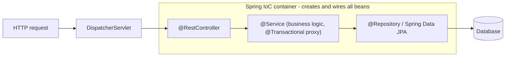

# Java Best Practices and the Ecosystem

Knowing Java the language is half the interview; the other half is writing *idiomatic* Java (the Effective Java canon), keeping up with modern features, and navigating the ecosystem — build tools, Spring, and where Java actually runs in industry. This guide compresses those three areas into interview-ready form.

## Effective Java Idioms

### Immutability First

Immutable objects are thread-safe for free, safe as map keys, and trivially cacheable and shareable.

```java
// The classic recipe: final class, final fields, no setters, defensive copies.
public final class Money {
    private final long cents;
    private final Currency currency;

    public Money(long cents, Currency currency) {
        this.cents = cents;
        this.currency = Objects.requireNonNull(currency);
    }
    public Money plus(Money other) {                 // "mutators" return new instances
        requireSame(other.currency);
        return new Money(cents + other.cents, currency);
    }
    // ... equals, hashCode, toString
}

// PITFALL: shallow immutability. final field, mutable contents:
public final class Team {
    private final List<String> members;
    public Team(List<String> members) {
        this.members = List.copyOf(members);         // defensive copy IN
    }
    public List<String> members() { return members; } // List.copyOf is already unmodifiable
}
```

Since Java 16, `record` gives you the whole recipe in one line — but *you* still own defensive copies of mutable components.

### The Builder Pattern

For types with many (especially optional) parameters, telescoping constructors are unreadable and error-prone; builders name every value:

```java
public class HttpRequestCfg {
    private final String url;          // required
    private final int timeoutMs;       // optional with defaults
    private final int retries;
    private final boolean followRedirects;

    private HttpRequestCfg(Builder b) {
        this.url = b.url; this.timeoutMs = b.timeoutMs;
        this.retries = b.retries; this.followRedirects = b.followRedirects;
    }
    public static Builder builder(String url) { return new Builder(url); }

    public static final class Builder {
        private final String url;
        private int timeoutMs = 5_000;
        private int retries = 0;
        private boolean followRedirects = true;

        private Builder(String url) { this.url = Objects.requireNonNull(url); }
        public Builder timeoutMs(int v) { this.timeoutMs = v; return this; }   // fluent
        public Builder retries(int v) { this.retries = v; return this; }
        public Builder followRedirects(boolean v) { this.followRedirects = v; return this; }
        public HttpRequestCfg build() {
            if (timeoutMs <= 0) throw new IllegalStateException("timeout must be positive");
            return new HttpRequestCfg(this);         // validation at one choke point
        }
    }
}

var cfg = HttpRequestCfg.builder("https://api.example.com")
    .timeoutMs(2_000)
    .retries(3)
    .build();
```

You use this daily without noticing: `StringBuilder`, `Stream.Builder`, `HttpRequest.newBuilder()`, Lombok's `@Builder`.

### The equals/hashCode Contract

The contract: equals must be reflexive, symmetric, transitive, consistent, and false vs null; **equal objects must have equal hash codes**. Break it and hash collections silently lose your objects.

```java
public final class Isbn {
    private final String value;
    public Isbn(String value) { this.value = value.replace("-", ""); }

    @Override public boolean equals(Object o) {
        if (this == o) return true;                      // fast path
        if (!(o instanceof Isbn other)) return false;    // pattern matching, handles null
        return value.equals(other.value);
    }
    @Override public int hashCode() { return value.hashCode(); }  // SAME fields as equals
}
```

Rules worth reciting: always override both or neither; use the same fields in both; beware `instanceof` vs `getClass()` in hierarchies (symmetry breaks when subclasses add fields — prefer composition or final classes); records generate correct implementations; never use mutable fields that change while the object sits in a HashSet.

## Modern Java Features (Interview Checklist)

```java
// var (10): local-variable type inference - types are inferred, still static
var users = new HashMap<String, List<Order>>();   // great: removes redundancy
// var x = service.process();                     // bad: reader can't tell the type

// Text blocks (15): multi-line strings, no escape soup
String query = """
    SELECT id, total
    FROM orders
    WHERE status = ?
    """;

// Records (16) + pattern matching for instanceof (16)
record Point(int x, int y) {}
if (obj instanceof Point p && p.x() > 0) { use(p); }   // test + cast + bind in one step

// Switch expressions (14): expression form, arrows, no fall-through, exhaustive
String size = switch (grams) {
    case Integer g when g < 100 -> "small";    // guarded patterns (21)
    case Integer g when g < 1000 -> "medium";
    default -> "large";
};

// Record patterns + sealed exhaustiveness (21): data-oriented programming
sealed interface Shape permits Circle, Rect {}
record Circle(double r) implements Shape {}
record Rect(double w, double h) implements Shape {}

double area(Shape s) {
    return switch (s) {
        case Circle(double r) -> Math.PI * r * r;       // destructuring!
        case Rect(double w, double h) -> w * h;
    };                                                   // no default: compiler-checked
}
```

Release model: a feature release every six months, an LTS every two years — 8, 11, 17, 21, 25 are the LTS milestones enterprises sit on. Being able to say "records and sealed types landed in 16/17, virtual threads in 21" signals you keep current.

## Build Tools: Maven and Gradle

| | Maven | Gradle |
|---|---|---|
| Config | XML (`pom.xml`), declarative, rigid lifecycle | Kotlin/Groovy DSL (`build.gradle.kts`), programmable |
| Strength | Convention, predictability, universal support | Speed (incremental builds, build cache, daemon), flexibility |
| Typical home | Enterprise backends, libraries | Android (standard), large multi-module builds |

Both resolve dependencies from Maven Central, share the standard layout (`src/main/java`, `src/test/java`), and matter in interviews mainly through dependency concepts: **transitive dependencies**, **scopes** (`compile`/`implementation`, `test`, `provided`/`runtimeOnly`), version conflict resolution ("nearest wins" in Maven vs "newest wins" in Gradle), and BOMs for aligning versions (`spring-boot-dependencies`).

```xml
<dependency>
    <groupId>org.springframework.boot</groupId>
    <artifactId>spring-boot-starter-web</artifactId>   <!-- one starter pulls a curated tree -->
</dependency>
```

## Spring at a Glance

Spring is the de facto enterprise framework; Spring Boot is Spring with auto-configuration and embedded servers ("convention over configuration"). The two ideas to explain in interviews:

- **Inversion of Control / Dependency Injection**: the container instantiates your objects (*beans*) and injects their dependencies — you declare *what* you need, not *how* to construct it. Prefer **constructor injection**: dependencies are explicit, final, and testable without the container.
- **Declarative cross-cutting behavior** via annotations and proxies: `@Transactional`, `@Cacheable`, security — implemented by wrapping your bean in a proxy (which is why self-invocation of a `@Transactional` method bypasses the transaction — a favorite senior question).

```java
@RestController
@RequestMapping("/orders")
public class OrderController {
    private final OrderService service;               // constructor injection - no @Autowired
    public OrderController(OrderService service) { this.service = service; }

    @PostMapping
    public ResponseEntity<OrderDto> place(@Valid @RequestBody PlaceOrderRequest req) {
        return ResponseEntity.status(HttpStatus.CREATED).body(service.place(req));
    }
}

@Service
public class OrderService {
    @Transactional                                    // proxy opens/commits/rolls back
    public OrderDto place(PlaceOrderRequest req) { /* ... */ }
}
```



## Where Java Lives in Industry

- **Banking and fintech** — core banking, payments, risk engines (predictability, ecosystem maturity, JIT throughput); low-latency trading shops run tuned JVMs with ZGC/Zing.
- **Big data infrastructure** — Kafka, Hadoop, Spark (JVM), Elasticsearch, Cassandra, Flink are all Java/JVM projects.
- **Enterprise microservices** — Spring Boot dominates; Quarkus/Micronaut + GraalVM native images target Kubernetes/serverless cold starts.
- **Android** — Java/Kotlin on ART.
- **E-commerce and streaming scale** — Amazon, Netflix, LinkedIn, Uber run enormous Java estates (Netflix's Spring-based stack being the canonical case study).

## Best Practices

- Default to immutability: records/final fields, `List.copyOf` at boundaries; introduce mutability only with a reason.
- Constructor injection everywhere; no field `@Autowired`, no service locators, no static singletons for dependencies.
- Minimize scope and visibility (package-private by default); program to interfaces at architectural seams, not reflexively for every class.
- Follow Effective Java's greatest hits: static factory methods with good names, builders past ~4 constructor params, `Optional` returns over null, prefer composition, enforce invariants in constructors.
- Use `Objects.requireNonNull` with messages at public entry points; fail fast.
- Keep dependencies deliberate: BOM-managed versions, run `mvn dependency:tree`/`gradle dependencies` when conflicts bite, and patch CVEs promptly (know the log4shell lesson).
- Adopt static analysis (ErrorProne, SpotBugs, Checkstyle) and a formatter in CI — style debates belong to machines.
- Track LTS releases; upgrading 8 → 17/21 is a real interview topic (module system friction, removed internals, new GC defaults).

## Interview Questions

<details>
<summary>1. Why is immutability such a big deal in Java, and how do you build an immutable class?</summary>

Immutable objects cannot change after construction, so they are inherently thread-safe (no synchronization, no visibility issues — safe publication is enough), reliable as HashMap/HashSet keys, freely shareable and cacheable, and simple to reason about. Recipe: `final` class (or sealed/records), all fields `private final`, no setters, validate in the constructor, defensive-copy mutable inputs in (`List.copyOf`) and never leak mutable internals out. `record` automates the boilerplate but not the defensive copies of mutable components.
</details>

<details>
<summary>2. When do you reach for the builder pattern over constructors?</summary>

When a type has many parameters — especially optional ones with defaults — telescoping constructors (`new Cfg(url)`, `new Cfg(url, timeout)`, ...) explode combinatorially and positional arguments of the same type are swappable bugs waiting to happen. A builder gives named, fluent, order-independent parameters, defaults in one place, and a single `build()` choke point for cross-field validation, producing an immutable result. Cost: boilerplate (Lombok `@Builder` or records-with-defaults mitigate). JDK examples: `HttpRequest.newBuilder()`, `Stream.Builder`.
</details>

<details>
<summary>3. State the equals/hashCode contract and what breaks when it's violated.</summary>

equals must be reflexive, symmetric, transitive, consistent, and non-null-false; and objects equal under equals must return the same hashCode (unequal objects may share a hash). Violations break hash collections: a key stored under one hash and looked up under another is simply not found (`map.get` returns null for a key that is "in" the map), `HashSet` accepts duplicates, caches leak. Subtler trap: subclass equals with `instanceof` breaks symmetry when the subclass adds fields; mutable fields used in hashCode break lookup after mutation.
</details>

<details>
<summary>4. What modern Java features (9-21) would you highlight, and why do they matter?</summary>

`var` (10) removes declaration redundancy; switch expressions (14) kill fall-through bugs and return values; text blocks (15) make SQL/JSON literals readable; records (16) erase data-class boilerplate with correct equals/hashCode; pattern matching for instanceof (16) merges test-cast-bind; sealed types (17) enable closed hierarchies; record patterns + pattern-matching switch (21) bring compiler-checked exhaustive data-oriented code; virtual threads (21) make thread-per-request scale to millions of concurrent I/O tasks. Collectively: less boilerplate, more compile-time safety, simpler concurrency.
</details>

<details>
<summary>5. Maven vs Gradle — how would you choose?</summary>

Maven: declarative XML, fixed lifecycle, extremely predictable, universally understood — great for libraries and conservative enterprise services where convention beats flexibility. Gradle: programmable Kotlin/Groovy DSL, much faster on large builds (incremental compilation, build cache, daemon), the Android standard, better for complex multi-module monorepos and custom build logic — at the cost of more ways to write an unmaintainable build. Both use the same repositories and dependency model. Honest answer: team familiarity and existing estate usually decide; the dependency-management concepts (scopes, transitives, BOMs, conflict resolution) matter more than the tool.
</details>

<details>
<summary>6. Explain IoC and dependency injection, and why constructor injection is preferred.</summary>

Inversion of Control: instead of objects constructing their own dependencies, a container builds the object graph and hands each bean what it declares — decoupling use from construction and making swapping implementations (real vs mock, Postgres vs in-memory) a wiring concern. Constructor injection is preferred because dependencies become explicit and `final` (immutable, thread-safe wiring), the class is unusable in an invalid half-injected state, circular dependencies surface immediately as errors, and tests can `new` the class with fakes — no container or reflection required. Field injection hides dependencies and welds tests to the framework.
</details>

<details>
<summary>7. Why does a @Transactional method calling another @Transactional method in the same class sometimes not start a new transaction?</summary>

Spring implements `@Transactional` with a proxy wrapped around the bean; the transaction logic runs only when a call passes *through the proxy*. Self-invocation (`this.otherMethod()`) is a plain Java call on the target object, bypassing the proxy — so the annotation on the inner method (including a different propagation like `REQUIRES_NEW`) is ignored. Fixes: move the inner method to another bean, inject the bean into itself (self-reference through the proxy), or use AspectJ weaving. The same logic explains `@Cacheable`/`@Async` self-invocation surprises — it is a proxy question, not a transaction question.
</details>

<details>
<summary>8. Where is Java used at scale today, and why do those industries choose it?</summary>

Banking/fintech and insurance (core ledgers, payments, risk): mature ecosystem, static typing, decades of libraries, JIT throughput, hireable talent. Big data infra: Kafka, Spark, Elasticsearch, Cassandra, Flink are JVM projects — operating them means JVM literacy (GC tuning, heap sizing). Enterprise microservices: Spring Boot as the default, with Quarkus/Micronaut + GraalVM native for fast-cold-start Kubernetes/serverless. Android apps. Tech at scale: Netflix, Amazon, LinkedIn, Uber run massive Java fleets. Common thread: long-lived, high-throughput server systems where reliability, tooling (JFR, profilers), and backward compatibility dominate.
</details>
