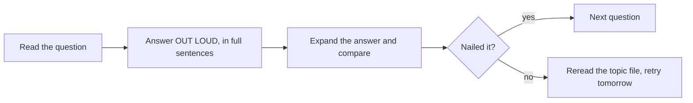

# Java Interview Questions

This is the drill file: 36 questions with detailed answers, grouped by difficulty, covering the whole guide plus the tricky classics — `==` vs `equals`, String interning, HashMap collisions, deadlocks, and memory visibility. Practice answering each out loud *before* expanding the answer; interviewers grade the explanation, not the keyword.

How to use this file:



---

## Junior Level

<details>
<summary>1. What is the difference between == and equals()?</summary>

`==` compares *values* for primitives, and *references* (same object identity) for objects. `equals()` is a method — `Object`'s default is identity (same as `==`), but classes like `String`, `Integer`, and all records override it to compare *contents*.

```java
String a = new String("hi");
String b = new String("hi");
a == b;        // false - two distinct objects
a.equals(b);   // true  - same characters
```

Traps to mention: string *literals* may compare `==`-equal due to the string pool (never rely on it); `Integer` `==` works for -128..127 due to the valueOf cache and fails beyond (always use equals); `Objects.equals(a, b)` handles nulls safely.
</details>

<details>
<summary>2. Why does "a" == "a" print true but new String("a") == "a" print false?</summary>

String literals are *interned*: the compiler places them in the string pool and every use of the literal `"a"` resolves to the same pooled object, so `==` (reference comparison) is true. `new String("a")` explicitly allocates a fresh heap object distinct from the pooled one, so `==` against the literal is false while `equals` is true. `new String("a").intern()` returns the pooled instance, making `==` true again. Compile-time constant expressions (`"a" + "b"`) are folded and pooled; runtime concatenation is not.
</details>

<details>
<summary>3. What are the eight primitive types, and why do wrappers exist?</summary>

`byte, short, int, long, float, double, char, boolean`. Primitives are raw values — fast, non-null, no methods. Wrappers (`Integer`, `Double`, ...) are objects wrapping a primitive, needed because generics and collections work only with reference types (`List<Integer>`, never `List<int>`), because a value may need to be null (nullable DB column), and to host utility methods (`Integer.parseInt`). Autoboxing converts automatically — with the costs of allocation in hot loops, NPE on unboxing null, and the `==` cache trap.
</details>

<details>
<summary>4. What is the difference between an ArrayList and an array?</summary>

An array is fixed-length, lives with that length forever, works with primitives (`int[]`) and objects, and is covariant with runtime store checks. `ArrayList` is a resizable list backed by an internal array that grows (~1.5x) as needed, works only with reference types (autoboxing bridges primitives), integrates with the Collections API (iteration, sorting, streams), and tracks a logical `size` separate from capacity. Use arrays for fixed-size, performance-critical, or primitive-heavy data; ArrayList for everything list-shaped.
</details>

<details>
<summary>5. Explain method overloading vs overriding.</summary>

Overloading: same method name, different parameter lists, resolved at *compile time* from declared argument types — a convenience for related operations (`println(int)`, `println(String)`). Overriding: a subclass redefines an inherited method with the same signature, resolved at *runtime* by the receiver's actual class — the mechanism of polymorphism. Supporting rules: overrides may narrow the return type (covariant), may not throw broader checked exceptions, may not reduce visibility, and should always carry `@Override` so a signature typo becomes a compile error instead of a silent overload.
</details>

<details>
<summary>6. What is the difference between an interface and an abstract class?</summary>

Abstract class: single inheritance, may hold instance state, constructors, any visibility, both abstract and concrete methods — a *partial implementation* shared by an is-a family. Interface: multiple implementation allowed, no instance state (only constants), no constructors; abstract methods plus `default`/`static`/`private` methods since Java 8/9 — a *contract or capability*. Modern rule: default to interfaces; use an abstract class only when subclasses must share fields or protected helpers.
</details>

<details>
<summary>7. What does static mean, and what are the restrictions on static methods?</summary>

`static` members belong to the class rather than to instances: one shared copy, accessible without an object, existing from class initialization. Static methods cannot use `this`/`super` or directly touch instance members (there is no instance), and they are not polymorphic — a subclass redeclaring one *hides* rather than overrides it, with resolution by the reference's compile-time type. Good uses: pure utilities, factory methods, constants. Danger: static mutable state is global state — a concurrency and testability hazard.
</details>

<details>
<summary>8. What is a constructor? Can it be final, static, or inherited?</summary>

A constructor initializes a new instance; it has the class's name, no return type, and runs after field defaults and initializers. It cannot be `final`, `static`, or `abstract` (it is not an inherited, overridable method), and constructors are *not* inherited — a subclass declares its own and its first act is calling a superclass constructor (`super(...)`, implicit no-arg if omitted, compile error if the parent lacks one). If you write no constructor, the compiler adds a public no-arg default; write any constructor and the default disappears.
</details>

<details>
<summary>9. What is the difference between String, StringBuilder, and StringBuffer?</summary>

`String` is immutable — concatenation in a loop builds a new String each pass, O(n²) copying. `StringBuilder` is a mutable buffer with amortized O(1) append — the default for building strings. `StringBuffer` is StringBuilder's older synchronized twin; per-method locks rarely give the atomicity you actually need, so it is effectively legacy. One-expression concatenation (`a + b + c`) is fine — the compiler lowers it to a builder (or an `invokedynamic` strategy since Java 9).
</details>

<details>
<summary>10. What are checked and unchecked exceptions? Give examples.</summary>

Checked exceptions extend `Exception` (but not `RuntimeException`) — `IOException`, `SQLException` — and the compiler forces callers to catch or declare them; they model anticipated, recoverable failures. Unchecked exceptions extend `RuntimeException` — `NullPointerException`, `IllegalArgumentException`, `IndexOutOfBoundsException` — and propagate freely; they model programming errors. `Error` (`OutOfMemoryError`) is for JVM-level failures you should not catch. Modern practice favors unchecked for application errors (see Spring's `DataAccessException` translation) because checked exceptions compose poorly with lambdas.
</details>

<details>
<summary>11. What does final mean in its three uses?</summary>

`final` variable: assigned exactly once — for fields this means set by construction time; note it makes the *reference* constant, not the object (`final List` can still be added to). `final` method: cannot be overridden — protects an invariant implementation. `final` class: cannot be extended (`String`, `Integer`, all records) — enables safe immutability and lets the JIT devirtualize calls. Related interview nugget: lambdas can only capture (effectively) final locals.
</details>

<details>
<summary>12. How does a for-each loop work under the hood, and when can't you use it?</summary>

`for (T x : coll)` compiles to `Iterator<T> it = coll.iterator(); while (it.hasNext()) { T x = it.next(); ... }` for any `Iterable` (plain index loops for arrays). Limitations: no access to the index, no removal (structural modification during iteration throws `ConcurrentModificationException` — use `it.remove()` or `removeIf`), no parallel iteration of two collections, and you cannot reassign elements. Use an explicit iterator or index loop for those cases.
</details>

---

## Mid Level

<details>
<summary>13. Explain how HashMap works internally.</summary>

An array of buckets, default capacity 16 (always a power of two), load factor 0.75. `put`: spread the key's hashCode (`h ^ (h >>> 16)`), index with `hash & (capacity-1)`, then insert into the bucket — empty bucket gets a node; occupied bucket is scanned by hash-then-equals, replacing on match or appending on miss. Collided entries chain as a linked list; a chain past 8 nodes (table ≥ 64) converts to a red-black tree — *treeification* — capping worst-case lookup at O(log n). Exceeding `capacity × 0.75` doubles the table and rehashes everything, which is why presizing big maps matters. Requirements: keys immutable, equals/hashCode consistent.
</details>

<details>
<summary>14. What exactly happens when two keys collide in a HashMap? And what if hashCode is broken?</summary>

Same bucket index: the map walks the bucket comparing stored hash values first (cheap) then `equals`. Equal key → value replaced; unequal → new node appended to the chain (or tree). Performance degrades gracefully: list scan O(k) for chain length k, tree O(log k). Pathology 1 — all keys return the same hashCode (legal but terrible): the map becomes one bucket; treeification saves you to O(log n). Pathology 2 — equal objects with *different* hashCodes (contract violation): the key is stored in one bucket and searched in another, so `get` returns null for a key that is present — data is silently "lost."
</details>

<details>
<summary>15. When would you use TreeMap or LinkedHashMap over HashMap?</summary>

`TreeMap` (red-black tree, O(log n)): when you need sorted keys or *range/navigation* queries — `firstKey`, `floorEntry(k)` (greatest key ≤ k — think "price at or before this timestamp"), `subMap`. Caveat: key equality is decided by `compareTo`, not equals. `LinkedHashMap` (hash table + linked list, O(1)): when iteration order matters — insertion order for predictable output, or access order plus `removeEldestEntry` override for an instant LRU cache. `HashMap` otherwise: fastest, no ordering promises.
</details>

<details>
<summary>16. Explain generics wildcards and the PECS rule.</summary>

Generics are invariant (`List<Integer>` is not a `List<Number>`), so flexible APIs need wildcards. PECS — Producer Extends, Consumer Super: a parameter you *read* T's from is `? extends T` (accepts lists of any subtype; additions forbidden because the exact element type is unknown); a parameter you *write* T's into is `? super T` (accepts lists of any supertype; reads come back as Object). `Collections.copy(List<? super T> dest, List<? extends T> src)` demonstrates both. Use exact `T` when you read and write; keep wildcards out of return types.
</details>

<details>
<summary>17. What is type erasure and name three practical consequences.</summary>

After compile-time checking, generic type arguments are erased — parameters become their bounds (Object if unbounded), casts are inserted at use sites; at runtime `List<String>` and `List<Integer>` are the same class. Consequences: (1) no `new T()`, `T.class`, `instanceof List<String>`, or `new T[]` — no runtime knowledge of T; (2) overloads clashing after erasure (`f(List<String>)` vs `f(List<Integer>)`) won't compile; (3) frameworks need tricks to recover types — Jackson's `TypeReference` super-type token reads generic info preserved in class metadata; also bridge methods appear in stack traces. Chosen for migration compatibility with pre-generics code.
</details>

<details>
<summary>18. Describe the Java memory areas and what lives in each.</summary>

Per-thread *stacks*: frames with local primitives and references — reclaimed on return; overflow → `StackOverflowError`. Shared *heap*: all objects and arrays, divided generationally (Eden, survivors, old gen) for GC — exhaustion → `OOM: Java heap space`. *Metaspace* (native memory): class metadata — classloader leaks → `OOM: Metaspace`. Plus the code cache (JIT output) and native/direct buffers. Key clarification interviewers listen for: "objects on the heap, references on the stack," and heap size (`-Xmx`) is only part of the process's real memory.
</details>

<details>
<summary>19. How does generational garbage collection work?</summary>

Premise (weak generational hypothesis): most objects die young. Allocation goes to Eden; when Eden fills, a *minor GC* copies the few live objects to a survivor space — cost proportional to survivors, so the mostly-dead majority is free. Objects surviving ~15 minor GCs (or large ones directly) are promoted to the old generation, collected rarely by *major/full GCs* with heavier algorithms. Collectors differ in how they do this: Parallel (STW throughput), G1 (region-based, pause-target-driven, default), ZGC (concurrent, sub-ms pauses, huge heaps). Rising old-gen after every full GC = the classic leak signature.
</details>

<details>
<summary>20. What is the difference between Runnable and Callable, and between submit and execute?</summary>

`Runnable.run()`: void, no checked exceptions — fire-and-forget. `Callable.call()`: returns `V`, may throw — result-bearing tasks. `Executor.execute(Runnable)`: void; an uncaught exception hits the thread's uncaught-exception handler (it is loud). `ExecutorService.submit(...)`: wraps the task in a `FutureTask` and returns a `Future`; exceptions are *captured* in the Future and only surface when you call `get()` (as `ExecutionException`) — the infamous silently-swallowed-exception trap when nobody calls get.
</details>

<details>
<summary>21. What is volatile, and what does it NOT give you?</summary>

`volatile` guarantees *visibility* and *ordering*: a read always sees the most recent write (writes go to and reads come from shared memory, no register/cache staleness), and a volatile write happens-before subsequent volatile reads of that variable, forbidding harmful reordering around it. It does NOT give atomicity: `volatile int x; x++` is read-modify-write and still loses updates under contention. Use for single-writer flags (`running = false`) and safe publication of immutable objects; use `AtomicInteger`/locks for any compound operation.
</details>

<details>
<summary>22. Show a memory-visibility bug and two ways to fix it.</summary>

```java
class Flag {
    private boolean stop = false;          // NOT volatile
    void runLoop() { while (!stop) work(); }   // may loop FOREVER
    void shutdown() { stop = true; }
}
```

Without synchronization there is no happens-before edge between the write and the reads, so the JIT may hoist `stop` into a register and never reread it — the loop legally never observes the write. Fixes: (1) declare `stop` `volatile` (visibility edge, right tool here); (2) guard reads and writes with the same lock (`synchronized` accessors) — unlock/lock creates the edge; (3) use `AtomicBoolean`. Broader lesson: "it works on my machine" concurrency is undefined behavior under the JMM until a happens-before edge orders write and read.
</details>

<details>
<summary>23. Explain intermediate vs terminal stream operations, and why streams are lazy.</summary>

Intermediate ops (`filter`, `map`, `sorted`, `distinct`) return a stream and merely describe the pipeline; nothing touches the source. One terminal op (`collect`, `reduce`, `forEach`, `findFirst`, `count`) triggers execution, pulling elements through all stages, typically one element at a time. Laziness enables: fusion (no intermediate collections between stages), short-circuiting (`findFirst`/`anyMatch`/`limit` stop early — provable with a `peek` print), and infinite sources (`Stream.iterate` + `limit`). Streams are single-use: a second terminal op throws `IllegalStateException`.
</details>

<details>
<summary>24. What is Optional for, and what are its anti-patterns?</summary>

`Optional<T>` is a return type that makes absence explicit and chainable — `findUser(id).map(User::email).orElse("n/a")` — replacing ambiguous null returns and pushing callers to handle the empty case. Anti-patterns: `opt.get()` without checking (relocated NPE — use `orElseThrow` with a meaningful exception); `isPresent()`+`get()` staircases instead of `map`/`filter`/`ifPresent`; Optional fields and method parameters (not serializable, clutters call sites — it was designed for returns); `orElse(expensiveCall())` where the argument is evaluated eagerly even when present — use `orElseGet(() -> ...)`; and wrapping collections (return an empty collection instead).
</details>

<details>
<summary>25. How do records differ from Lombok @Data classes or hand-written beans?</summary>

Records are a *language* feature (16+): the header declares immutable components, and the compiler generates canonical constructor, accessors (`x()` not `getX()`), value-based equals/hashCode/toString — with semantics guaranteed by the spec, understood by pattern matching (record deconstruction in switch), reflection (`RecordComponent`), and serialization frameworks. Lombok generates similar boilerplate via annotation-processor bytecode magic but produces *mutable* beans by default (`@Data` includes setters), adds a build-time dependency, and has no language-level semantics. Records also enforce shallow immutability by construction; the remaining programmer duty is defensive copies of mutable components.
</details>

---

## Senior Level

<details>
<summary>26. Write code that deadlocks, explain why, and give two production-grade fixes.</summary>

```java
final Object lockA = new Object(), lockB = new Object();
// T1
new Thread(() -> { synchronized (lockA) { sleep(50); synchronized (lockB) {} } }).start();
// T2
new Thread(() -> { synchronized (lockB) { sleep(50); synchronized (lockA) {} } }).start();
```

Each thread holds one lock and waits forever for the other: all four Coffman conditions hold (mutual exclusion, hold-and-wait, no preemption, circular wait). Fixes: (1) *global lock ordering* — every code path acquires locks in one canonical order (e.g., by `System.identityHashCode` or entity id), eliminating cycles; (2) *tryLock with timeout* (`ReentrantLock.tryLock(t, unit)`) plus release-and-retry with backoff, breaking hold-and-wait; (3) architecturally, shrink to a single lock or serialize through a queue/actor. Detection: `jstack` prints "Found one Java-level deadlock"; `ThreadMXBean.findDeadlockedThreads()` enables runtime monitoring.
</details>

<details>
<summary>27. Explain happens-before and use it to justify why double-checked locking needs volatile.</summary>

Happens-before is the JMM relation guaranteeing ordering and visibility: program order, unlock→lock on the same monitor, volatile write→read, start→thread actions→join, transitivity. Double-checked locking:

```java
private static volatile Service instance;
static Service get() {
    if (instance == null)
        synchronized (Service.class) {
            if (instance == null) instance = new Service();
        }
    return instance;
}
```

Without `volatile`, the unsynchronized first read has no happens-before edge with the write: `instance = new Service()` can be reordered so the reference is published *before* the constructor's writes, letting another thread observe a non-null, half-constructed object. The volatile write→read edge forbids that reordering. Cleaner alternatives: the initialization-on-demand holder idiom (class-init locking does the work) or an enum singleton.
</details>

<details>
<summary>28. How does ConcurrentHashMap differ from Collections.synchronizedMap, and when is it still not enough?</summary>

`synchronizedMap` wraps every method in one mutex — correct but fully serialized, and *iteration still requires manual client-side locking*. `ConcurrentHashMap` (Java 8+): lock-free volatile reads; writes CAS into empty bins or lock only the bucket's head node; cooperative multi-threaded resizing; weakly consistent iterators (no CME); atomic per-key compound ops (`computeIfAbsent`, `merge`); nulls banned. Still not enough when an invariant spans *multiple keys or multiple operations*: check-then-act sequences like "if A exists and B doesn't, move value" are not atomic on any concurrent map — you need an external lock, a single-key redesign (composite keys), or transactional storage. Also `size()` is an estimate under concurrency.
</details>

<details>
<summary>29. Walk through choosing and validating a garbage collector for a service with a 50ms p99 latency SLO on a 32GB heap.</summary>

Start with the default G1: set `-Xms=-Xmx=32g`, a pause goal (`-XX:MaxGCPauseMillis=30`, leaving headroom under 50ms), and enable `-Xlog:gc*` plus JFR. Load-test at production-like allocation rates; inspect the pause distribution — if p99.9 pauses (especially mixed collections or humongous-object churn) breach the budget, move to generational ZGC (`-XX:+UseZGC -XX:+ZGenerational`): sub-millisecond pauses independent of heap size, trading ~5-10% throughput to load barriers — the standard choice in trading/low-latency APIs. Also attack the *cause*: cut allocation rate (profiling, object reuse where measured, primitive streams), avoid humongous allocations (>50% region size in G1), and verify no leak (old-gen trend). Validate continuously: GC logs + JFR in prod, alert on pause SLO, re-test after every JDK upgrade.
</details>

<details>
<summary>30. Your service OOMs every three days. Take me through your diagnosis.</summary>

(1) Confirm the failure mode from logs: `Java heap space` vs `Metaspace` vs `GC overhead limit` vs container OOM-kill (exit 137 — native memory, not heap). (2) Ensure `-XX:+HeapDumpOnOutOfMemoryError` is set; grab the dump, plus GC logs — a saw-tooth whose floor rises after every full GC confirms a leak rather than undersizing. (3) Open the dump in Eclipse MAT: dominator tree ranks retained sizes; typically a handful of objects retain gigabytes. (4) "Path to GC roots" on the biggest retainer identifies the holder — usual suspects: unbounded static caches/maps, listener registries, ThreadLocals on pool threads, unclosed resources, queues without consumers. (5) Fix (bounded cache with eviction, remove(), try-with-resources), then *prove* it: soak test comparing old-gen floor over days. If heap is clean but RSS grows: native leak — direct ByteBuffers, JNI, zip streams — use NMT (`-XX:NativeMemoryTracking`) and jcmd.
</details>

<details>
<summary>31. Compare platform threads, virtual threads, and CompletableFuture-based async as concurrency models for an I/O-heavy API service.</summary>

Platform thread-per-request: simplest code, but ~1MB stacks and OS scheduling cap you at low thousands of concurrent requests — the pool becomes the bottleneck while CPUs idle on blocked I/O. CompletableFuture/reactive: scales by never blocking threads, but fragments logic into callback/operator chains — harder debugging (stack traces cross thread hops), infectious API (`Future` all the way down), easy misuse of the common pool for blocking calls. Virtual threads (21+): keep the blocking thread-per-request style; the JVM unmounts a virtual thread from its carrier during blocking I/O, so millions of concurrent requests run over a few carrier threads — async scalability with synchronous readability, working stack traces, and standard debugging. Choose virtual threads for I/O concurrency on modern JDKs; CompletableFuture still shines for *composing* parallel fan-out with timeouts/fallbacks; reactive remains for true streaming/backpressure. Caveats: CPU-bound work still needs a sized platform pool; historic pinning in `synchronized` (fixed JDK 24); never pool virtual threads.
</details>

<details>
<summary>32. How would you design an immutable public API class that wraps mutable inputs? Where do people get it wrong?</summary>

```java
public final class Schedule {
    private final List<LocalDate> dates;
    public Schedule(List<LocalDate> dates) {
        this.dates = List.copyOf(dates);          // defensive copy IN (also null-hostile)
    }
    public List<LocalDate> dates() { return dates; }  // already unmodifiable - safe OUT
}
```

Rules: `final` class (no malicious subclass overriding accessors), `private final` fields, copy mutable constructor inputs (`List.copyOf`, `new ArrayList<>(...)` wrapped unmodifiable, `clone()` for arrays), and never return internal mutable state directly. Classic mistakes: storing the caller's list by reference (caller mutates your "immutable" object later); returning the internal array (`return dates;` for `Date[]` — caller mutates internals); forgetting that `final` fields don't make *referenced objects* immutable; records giving false confidence (`record R(List<X> xs)` still needs `List.copyOf` in the compact constructor); and deep structures needing recursive immutability. Payoff: free thread safety, safe hash keys, no defensive copies at every use site.
</details>

<details>
<summary>33. A senior asks: "Streams are slower than loops, so ban them." How do you respond?</summary>

Partially true, wrong conclusion. Facts: a sequential stream adds abstraction overhead (lambda invocation, spliterator machinery, boxing if misused) — measurable in *nanosecond-scale hot loops*, and JIT inlining often erases most of it after warmup; `IntStream` avoids boxing entirely. In real services, I/O and allocation dominate — the stream-vs-loop delta is noise, while streams reduce off-by-one and mutation bugs and state intent (`groupingBy` beats 15 lines of map-juggling in review). Engineering answer: default to the clearest form; in *measured* hot paths (JMH, profiler evidence — not intuition), hand-optimize to loops/primitive streams locally and comment why. Also push back on the inverse dogma: complex control flow, early exit with side effects, or checked exceptions read better as loops. Bans in either direction replace measurement with folklore.
</details>

<details>
<summary>34. Explain how a lambda becomes an object at runtime, and why that design was chosen over anonymous classes.</summary>

The compiler emits the lambda body as a private synthetic method and, at the use site, an `invokedynamic` instruction referencing the `LambdaMetafactory` bootstrap. On first execution, the bootstrap generates a small class implementing the functional interface (via hidden classes), links the call site to its factory, and subsequent executions are a direct, JIT-inlinable path; stateless lambdas are cached as singletons, capturing lambdas allocate per capture. Versus compile-time anonymous classes: no per-lambda class files bloating jars, less eager class loading, and — the strategic reason — the translation strategy lives in the JDK, so it can improve (and has) without recompiling user code. Semantic differences worth knowing: a lambda's `this` refers to the enclosing instance, not the lambda; no shadowing scope of its own.
</details>

<details>
<summary>35. How do you make an ordinary Spring service testable, and what does that reveal about DI?</summary>

Constructor-inject every collaborator as an interface the service owns (`OrderRepository`, `PaymentGateway`, `Clock`); keep fields `final`; no static access, no `new` of infrastructure inside business logic, no field `@Autowired`. Then a unit test is plain Java: `new OrderService(mockRepo, mockGateway, fixedClock)` — no Spring context, millisecond tests, deterministic time. Integration slices (`@DataJpaTest` + Testcontainers) cover the real adapters separately. The reveal: DI is not about the container — it is the *dependency inversion principle*; Spring only automates wiring at scale. A design needing `@SpringBootTest` for every test has hidden its dependencies (statics, self-construction, field injection), and slow contexts are the tax. Corollary trap to mention: `@Transactional` self-invocation bypassing the proxy — another reason to keep beans small and boundaries explicit.
</details>

<details>
<summary>36. equals/hashCode: design them for a class with an inheritance hierarchy. What breaks, and what are the options?</summary>

The problem: `Point` and `ColorPoint extends Point`. `instanceof`-based equals breaks *symmetry* (point.equals(colorPoint) true, reverse false once color is compared) or *transitivity* if you try mixed-type comparisons. `getClass()`-based equals restores symmetry but violates Liskov substitution — a trivial subclass (adding a method only) stops equaling its parent, breaking collections that mix them. Options: (1) *composition over inheritance* — ColorPoint HAS a Point, no equals inheritance problem (Effective Java's recommendation); (2) make the class `final` (or a record) so the hierarchy can't exist; (3) `getClass()` equality with the documented LSP trade-off; (4) "canEqual" pattern (Scala-style) allowing subclasses to opt out symmetrically. Whatever the choice: same fields in equals and hashCode, fields immutable while hashed, and document the decision — silent hash-collection misbehavior is the failure mode.
</details>

---

## Rapid-Fire Round

Quick one-liners to have ready — expand any of them on request:

| Question | One-line answer |
|---|---|
| Can an interface have a constructor? | No — interfaces cannot be instantiated and hold no per-instance state. |
| Is `String s = null; s + "x"` an NPE? | No — concatenation converts null to the string "null". |
| Can `finally` be skipped? | Only by `System.exit`, JVM crash, or killing the thread. |
| Why no multiple class inheritance? | Diamond-problem ambiguity for state; interfaces + default methods cover behavior. |
| `Comparable` vs `Comparator`? | Natural order implemented *by* the class vs external, composable orderings. |
| Why are Java arrays covariant? | Pre-generics polymorphism needed it; runtime `ArrayStoreException` is the price. |
| `wait()` vs `sleep()`? | wait releases the monitor and needs one; sleep holds everything and belongs to Thread. |
| Can you start a thread twice? | No — second `start()` throws `IllegalThreadStateException`. |
| What is `transient`? | Field excluded from Java serialization. |
| HashMap null keys? | One null key allowed (bucket 0); Hashtable and ConcurrentHashMap allow none. |

Interview strategy reminder: for every "what" answer, attach a "why" and, at senior level, a trade-off. "HashMap is O(1)" is junior; "amortized O(1) assuming good hash distribution, degrading to O(log n) per bucket after treeification, with resize costs that make presizing worthwhile" is the answer that gets the offer.
