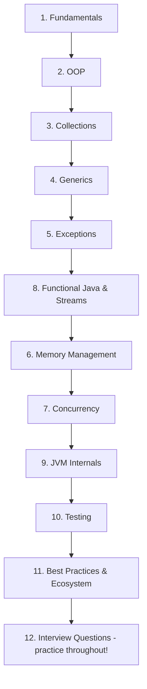

# Java Interview Preparation Guide

Java remains one of the most heavily tested languages in software engineering interviews, powering everything from Android apps to the backend systems of banks, e-commerce giants, and big-data platforms (Kafka, Hadoop, Elasticsearch are all JVM projects). Interviewers use Java questions to probe not just syntax, but your understanding of memory, concurrency, and object-oriented design. This guide takes you from fundamentals through JVM internals to a curated question bank, with diagrams and runnable code throughout.

## Table of Contents

| # | Guide | What you'll learn |
|---|-------|-------------------|
| 1 | [Java Fundamentals](01-Java-Fundamentals.md) | JVM/JRE/JDK, bytecode, primitives vs wrappers, String pool, pass-by-value |
| 2 | [OOP in Java](02-OOP-in-Java.md) | Inheritance, interfaces vs abstract classes, polymorphism, records, sealed classes |
| 3 | [Collections Framework](03-Collections-Framework.md) | List/Set/Map/Queue, HashMap internals, complexity table, fail-fast iterators |
| 4 | [Generics](04-Generics.md) | Type parameters, bounded types, wildcards (PECS), type erasure |
| 5 | [Exception Handling](05-Exception-Handling.md) | Checked vs unchecked, try-with-resources, custom exceptions |
| 6 | [Java Memory Management](06-Java-Memory-Management.md) | Heap vs stack, GC algorithms (Serial to ZGC), reference types, JVM tuning |
| 7 | [Concurrency and Multithreading](07-Concurrency-and-Multithreading.md) | Thread lifecycle, synchronized, volatile, java.util.concurrent, virtual threads |
| 8 | [Functional Java and Streams](08-Functional-Java-and-Streams.md) | Lambdas, functional interfaces, Stream API, Optional, collectors |
| 9 | [JVM Internals](09-JVM-Internals.md) | Class loading, JIT compilation, stack frames, method dispatch, escape analysis |
| 10 | [Testing in Java](10-Testing-in-Java.md) | JUnit 5, Mockito, AssertJ, parameterized tests, testing best practices |
| 11 | [Best Practices and Ecosystem](11-Java-Best-Practices-and-Ecosystem.md) | Effective Java idioms, modern language features, Maven/Gradle, Spring |
| 12 | [Interview Questions](12-Java-Interview-Questions.md) | 30+ questions with detailed answers, grouped junior / mid / senior |

## Suggested Study Order

**If you are short on time**, prioritize in this order:

1. **Collections + HashMap internals** — asked in nearly every Java interview.
2. **Concurrency** — the classic differentiator between junior and senior candidates.
3. **Fundamentals** (String pool, `==` vs `equals`, pass-by-value) — quick wins that trip up many candidates.
4. **Memory management / GC** — expected for backend and senior roles.

## How to Use This Guide

- Read each topic file top to bottom, then attempt its **Interview Questions** section before peeking at the answers.
- Type out the code examples yourself — muscle memory matters in whiteboard and CoderPad interviews.
- Finish with [12-Java-Interview-Questions.md](12-Java-Interview-Questions.md) as a mock-interview drill: answer out loud, in full sentences, as you would to an interviewer.

Good luck — and remember, interviewers care more about *why* than *what*. Every file here emphasizes the reasoning behind Java's design decisions, because that is what you will be asked to explain.
