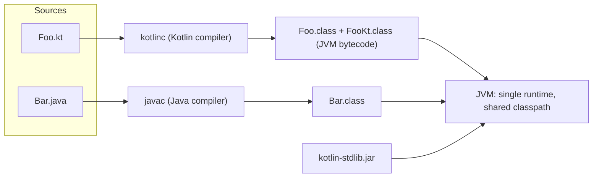
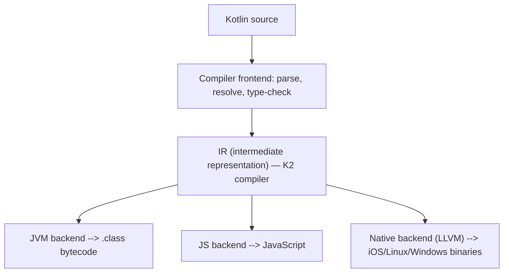

# Kotlin Fundamentals

Kotlin is a statically typed language developed by JetBrains that compiles to JVM bytecode, JavaScript, and native binaries. This chapter covers the core building blocks — variables, types, string templates, and program structure — plus the compilation model and Java interop story that interviewers frequently probe. If you are coming from Java, pay attention to how much ceremony Kotlin removes while *adding* compile-time safety.

## val vs var

Kotlin distinguishes between read-only and mutable references at the language level:

```kotlin
val name = "Ada"        // read-only reference: cannot be reassigned
var counter = 0         // mutable reference: can be reassigned

counter = 1             // OK
// name = "Grace"       // Compile error: Val cannot be reassigned
```

Key nuance interviewers test: **`val` means the *reference* is read-only, not that the object is immutable.**

```kotlin
val list = mutableListOf(1, 2, 3)
list.add(4)             // OK! The reference is fixed, the object is mutable.
// list = mutableListOf() // Compile error — cannot reassign the reference
```

A `val` is roughly equivalent to a Java `final` local variable. For true immutability you combine `val` with immutable/read-only types (`List`, not `MutableList`).

## Type Inference and Basic Types

Kotlin infers types from initializers, so explicit annotations are usually optional:

```kotlin
val age = 30              // Int
val pi = 3.14             // Double
val letter = 'K'          // Char
val isReady = true        // Boolean
val big = 3_000_000_000   // Long (too big for Int, inferred automatically)
val price: Float = 9.99f  // Explicit annotation when you need a specific type

val scores: List<Int> = listOf(90, 85)  // annotation useful on public APIs
```

Unlike Java, Kotlin has **no primitive types at the language level** — everything is an object (`Int`, `Double`, `Boolean`...). The compiler still uses JVM primitives (`int`, `double`) under the hood whenever possible, boxing only when a value is used as a nullable type or a generic type argument:

```kotlin
val a: Int = 1        // compiles to primitive int
val b: Int? = 1       // compiles to boxed java.lang.Integer (nullable requires a reference)
```

There are **no implicit widening conversions**. You must convert explicitly:

```kotlin
val i: Int = 7
// val l: Long = i        // Compile error in Kotlin (legal in Java)
val l: Long = i.toLong()  // Explicit and intentional
```

## String Templates

String templates replace verbose concatenation:

```kotlin
val user = "Grace"
val items = 3

println("Hello, $user!")                       // simple variable
println("You have ${items * 2} items total")   // arbitrary expression
println("Name length: ${user.length}")         // property access

// Raw strings: no escaping, great for JSON/regex/SQL
val json = """
    {
        "name": "$user",
        "items": $items
    }
""".trimIndent()
```

## Nullability Basics

Kotlin's type system distinguishes nullable from non-nullable types (covered in depth in [02-Null-Safety.md](02-Null-Safety.md)):

```kotlin
var nonNull: String = "hello"
// nonNull = null           // Compile error!

var maybe: String? = "hi"   // The ? makes the type nullable
maybe = null                // OK

// The compiler forces you to handle null before use:
val length = maybe?.length ?: 0
```

This single feature eliminates the majority of `NullPointerException`s at compile time — the "billion dollar mistake" is caught before the code runs.

## Packages, Imports, and the main Function

```kotlin
package com.example.demo

import kotlin.math.max

// Top-level function: no class wrapper needed (unlike Java)
fun main(args: Array<String>) {
    println("Max: ${max(3, 7)}")
}

// A no-argument main is also valid since Kotlin 1.3:
// fun main() { ... }
```

Unlike Java, the package does not have to match the directory structure (though by convention it does), and functions, properties, and constants can live at the **top level** of a file — no `Utils` class full of static methods required.

```kotlin
// Top-level declarations — idiomatic Kotlin
const val MAX_RETRIES = 3               // compile-time constant

fun retryDelay(attempt: Int): Long = 100L * attempt
```

## How Kotlin Compiles: JVM Bytecode and Java Interop

The Kotlin compiler (`kotlinc`) produces standard `.class` files that run on any JVM. This is the foundation of Kotlin's seamless two-way interop with Java.



Key facts that come up in interviews:

- **Top-level functions** in `Foo.kt` compile to static methods on a synthetic class `FooKt` (customizable with `@file:JvmName("Foo")`).
- Kotlin ships a small runtime library, `kotlin-stdlib`, that must be on the classpath.
- Kotlin bytecode targets Java 8+ by default and can target newer versions; it works with existing Java frameworks (Spring, JUnit) because from the JVM's perspective it *is* Java bytecode.
- Mixed projects compile fine: Gradle/Maven invoke `kotlinc` in a mode that understands Java sources, so Kotlin can call Java and Java can call Kotlin in the same module.
- On Android, the bytecode is further transformed to DEX (Dalvik Executable) by D8/R8.



The single IR feeding multiple backends is what powers **Kotlin Multiplatform**: share business logic across Android, iOS, server, and web.

## Statements vs Expressions

In Kotlin, `if`, `when`, and `try` are **expressions** — they return values. This enables a concise, expression-oriented style:

```kotlin
val grade = if (score >= 90) "A" else "B"   // no ternary operator needed — if IS the ternary

val description = when (grade) {
    "A" -> "Excellent"
    "B" -> "Good"
    else -> "Keep practicing"
}
```

## Common Pitfalls

```kotlin
// PITFALL 1: val does not mean deep immutability
val users = mutableListOf("a")
users.clear()  // legal! Prefer: val users: List<String> = listOf("a")

// PITFALL 2: == vs === (opposite of Java instincts)
val s1 = "kotlin".uppercase()
val s2 = "kotlin".uppercase()
println(s1 == s2)   // true  — structural equality, calls equals()
println(s1 === s2)  // false — referential equality (same object?)
// In Java, == on objects compares references. In Kotlin, == calls equals().

// PITFALL 3: Integer division truncates, same as Java
val ratio = 3 / 4        // 0, not 0.75
val real = 3.0 / 4       // 0.75

// PITFALL 4: boxed Int identity is unreliable
val a: Int? = 1000
val b: Int? = 1000
println(a == b)    // true
println(a === b)   // false (or true for small cached values) — never use === on boxed numbers
```

## Real-World Context

- **Android**: every new Android project defaults to Kotlin; `val`-first style and null safety directly reduce crash rates (Google reported ~20% fewer NPE crashes in apps that adopted Kotlin).
- **Backend**: Spring Boot and Ktor services are written with the same fundamentals; top-level functions make small services and utilities extremely compact.
- **Tooling**: Gradle build scripts themselves can be written in Kotlin (`build.gradle.kts`), so these fundamentals carry into your build system.

## Best Practices

- **Default to `val`.** Reach for `var` only when reassignment is genuinely required; most code reviews flag unnecessary `var`s.
- **Let inference work locally, annotate publicly.** Omit types for local variables; declare explicit return types on public functions and properties so the API contract is visible and stable.
- **Use `===` almost never.** Structural equality (`==`) is what you want 99% of the time; reserve `===` for identity checks in caches or frameworks.
- **Prefer top-level functions over util classes.** `StringUtils.capitalize(s)` becomes a top-level or extension function — less ceremony, easier discovery.
- **Use raw strings for embedded languages** (JSON, SQL, regex) with `trimIndent()` to keep code readable.
- **Convert numbers explicitly** and be deliberate about `Int` vs `Long` at API boundaries (IDs should almost always be `Long`).

## Interview Questions

<details>
<summary>1. What is the difference between <code>val</code> and <code>var</code>? Does <code>val</code> make an object immutable?</summary>

`val` declares a read-only reference (like Java's `final`) — it cannot be reassigned. `var` declares a mutable reference. `val` does **not** make the referenced object immutable: `val list = mutableListOf(1)` still allows `list.add(2)`. True immutability requires combining `val` with immutable or read-only types such as `List` instead of `MutableList`.
</details>

<details>
<summary>2. How does <code>==</code> differ from <code>===</code> in Kotlin, and how does that compare to Java?</summary>

In Kotlin `==` is structural equality — it compiles to a null-safe call to `equals()`. `===` is referential equality — true only if both references point to the same object. This is the reverse of Java instinct, where `==` on objects compares references and you must call `.equals()` for content comparison. Kotlin removes the classic Java bug of comparing strings with `==`.
</details>

<details>
<summary>3. Does Kotlin have primitive types? What happens at the bytecode level?</summary>

At the language level, no — everything is an object (`Int`, `Double`, etc.), giving a uniform type system with methods on numbers. At the bytecode level, the compiler optimizes: `Int` compiles to the JVM primitive `int` where possible, and boxes to `java.lang.Integer` only when necessary — e.g., when used as `Int?` (null needs a reference type) or as a generic type argument like `List<Int>`.
</details>

<details>
<summary>4. Where do top-level functions go when Kotlin compiles to JVM bytecode?</summary>

The JVM has no concept of functions outside classes, so top-level functions in `Utils.kt` compile to `public static` methods on a synthetic class `UtilsKt`. Java code calls them as `UtilsKt.myFunction(...)`. You can rename the facade class with `@file:JvmName("Utils")` at the top of the file to make the Java-facing API cleaner.
</details>

<details>
<summary>5. Why does Kotlin forbid implicit number widening (e.g., assigning an <code>Int</code> to a <code>Long</code>)?</summary>

Because implicit conversions combined with boxed types and equality checks produce subtle bugs (`Integer.valueOf(1).equals(1L)` is false in Java). Kotlin makes all conversions explicit (`i.toLong()`) so the programmer states intent, and mixed-type arithmetic is resolved by overloaded operators rather than silent coercion. It trades a little verbosity for predictability.
</details>

<details>
<summary>6. What is the difference between <code>const val</code> and <code>val</code>?</summary>

`const val` is a compile-time constant: its value must be a `String` or primitive known at compile time, it must live at the top level or in an `object`/`companion object`, and the compiler inlines its value at call sites (like Java's `static final` constants). A plain `val` is initialized at runtime and can hold any type, including results of function calls. Use `const` for true constants like `MAX_RETRIES` or config keys.
</details>

<details>
<summary>7. Can Kotlin and Java files live in the same project and call each other? How does the build work?</summary>

Yes — this is Kotlin's core adoption strategy. Both compilers produce standard JVM `.class` files sharing one classpath. In a mixed module, the build tool runs `kotlinc` with the Java sources visible (so Kotlin can resolve Java symbols), then `javac` compiles Java against the produced Kotlin classes. This enables incremental, file-by-file migration of Java codebases to Kotlin.
</details>
