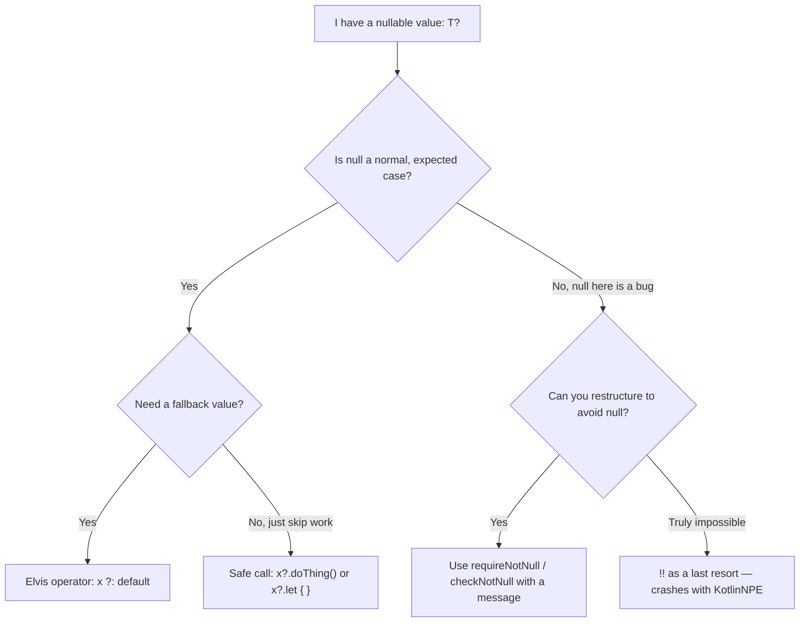
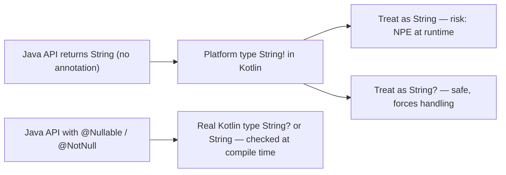

# Null Safety

Null safety is Kotlin's signature feature: the type system distinguishes nullable from non-nullable types, turning `NullPointerException`s from runtime crashes into compile-time errors. This chapter covers the full toolkit — safe calls, the Elvis operator, `!!`, scope functions for null handling, `lateinit` vs `lazy`, and the platform types that appear at the Java boundary.

## Nullable and Non-Nullable Types

Every Kotlin type comes in two flavors: `T` (never null) and `T?` (may be null).

```kotlin
var city: String = "Nairobi"
// city = null                 // Compile error: null cannot be a value of String

var nickname: String? = null   // OK — the ? admits null

// The compiler blocks unsafe access:
// println(nickname.length)    // Compile error: nickname might be null
```

The compiler tracks nullability through **smart casts**: once you check for null, the type is narrowed inside that branch.

```kotlin
fun describe(s: String?): String {
    if (s != null) {
        return "Length is ${s.length}"   // s smart-cast to String here
    }
    return "No value"
}
```

Smart casts only work when the compiler can *prove* the value cannot change between check and use — so they work on `val` locals but not on mutable properties another thread could mutate:

```kotlin
class Holder(var text: String?) {
    fun printLength() {
        if (text != null) {
            // println(text.length)          // Compile error: text could change after the check
            text?.let { println(it.length) } // Fix: capture a snapshot
        }
    }
}
```

## The Null-Handling Toolkit



### Safe Calls (`?.`)

`a?.b` evaluates to `a.b` if `a` is non-null, otherwise to `null` — without throwing.

```kotlin
data class Address(val city: String?)
data class User(val address: Address?)

val user: User? = fetchUser()
val city: String? = user?.address?.city   // whole chain short-circuits on the first null
```

### Elvis Operator (`?:`)

Provides a default when the left side is null. It can also `return` or `throw`, which is idiomatic for guard clauses:

```kotlin
val display = user?.address?.city ?: "Unknown"

fun process(order: Order?) {
    val o = order ?: return                       // early exit guard
    val id = o.id ?: throw IllegalStateException("Order has no id")
    println("Processing $id")
}
```

### The `!!` Operator — Use Sparingly

`x!!` asserts "I promise this is not null" and throws `NullPointerException` if you are wrong. It converts a compile-time safety net into a runtime crash.

```kotlin
// BAD: silences the compiler, keeps the crash
val name = intent.getStringExtra("name")!!.uppercase()

// BETTER: fail with a meaningful message, or handle the null
val name = requireNotNull(intent.getStringExtra("name")) { "name extra missing" }
```

In code review, `!!` is a smell. Legitimate uses are rare — mostly test code and interop corners where the API's nullability annotation is wrong.

### let / also for Null Handling

`?.let { }` runs a block only when the value is non-null, with the value bound to `it`:

```kotlin
val email: String? = readEmail()

email?.let { sendWelcome(it) }             // executes only if email != null

// let returns the lambda result — useful for transformation:
val domain: String? = email?.let { it.substringAfter("@") }

// also returns the original value — useful for side effects mid-chain:
val validated = email
    ?.also { log.debug("validating {}", it) }
    ?.takeIf { it.contains("@") }
```

Do not overuse `?.let` where a simple `if` is clearer — deeply nested `let`s are their own pitfall:

```kotlin
// BAD: nested lets are hard to read
a?.let { x -> b?.let { y -> combine(x, y) } }

// BETTER: one explicit check
if (a != null && b != null) combine(a, b) else null
```

## lateinit vs lazy

Both defer initialization, but they solve different problems:

| | `lateinit var` | `val by lazy { }` |
|---|---|---|
| Mutability | `var` only | `val` only |
| Types | Non-null reference types only (no primitives like `Int`) | Any type |
| Initialized by | You, explicitly, before first use | The lambda, automatically on first access |
| If accessed too early | `UninitializedPropertyAccessException` | Never — lambda runs on demand |
| Thread safety | Your responsibility | Synchronized by default |
| Typical use | DI/framework injection, Android views, test fixtures | Expensive objects, caching, config |

```kotlin
class UserRepositoryTest {
    private lateinit var repo: UserRepository   // set in @BeforeEach, promised before use

    @BeforeEach
    fun setup() { repo = UserRepository(FakeDb()) }
}

class ReportService {
    // Created once, on first access, thread-safe:
    private val heavyParser: Parser by lazy { Parser.buildWithGrammar() }
}

// You can check lateinit initialization state:
// if (::repo.isInitialized) { ... }
```

Pitfall: `lateinit` moves a compile-time guarantee to a runtime one. Prefer constructor injection (`class Service(private val repo: Repo)`) whenever the framework allows it; use `lateinit` only where object lifecycle genuinely prevents constructor initialization (classic example: Android `Activity` fields created in `onCreate`).

## Platform Types: The Java Boundary

When Kotlin calls Java code without nullability annotations, the compiler cannot know whether a value can be null. Such values get a **platform type**, written `String!` in error messages (you cannot write it yourself).



```kotlin
// Java: public String findName(long id) { return map.get(id); }  // may return null!

val name = javaService.findName(42)      // type is String! — compiler trusts you
println(name.length)                      // compiles fine, may throw NPE at runtime

// Defensive, correct approach — declare the nullable type yourself:
val safeName: String? = javaService.findName(42)
println(safeName?.length ?: 0)
```

Practical guidance: when consuming un-annotated Java, **explicitly type the result as nullable** unless documentation guarantees non-null. When you own the Java code, add JSR-305/JetBrains annotations (`@Nullable`, `@NotNull`) so Kotlin sees real types — this is one of the highest-value steps when migrating a codebase.

Note that Kotlin *does* insert runtime checks at the boundary: parameters of public Kotlin functions declared non-null get an automatic `Intrinsics.checkNotNullParameter` check, so Java callers passing null fail fast with a clear message rather than corrupting state deep inside your code.

## Nullability in Collections

```kotlin
val a: List<Int?> = listOf(1, null, 3)    // list of nullable ints
val b: List<Int>? = null                   // nullable list of ints
val c: List<Int?>? = null                  // both

val cleaned: List<Int> = a.filterNotNull() // [1, 3] — idiomatic null stripping
val firstOrNothing: Int? = a.firstOrNull() // safe access instead of first()
```

## Real-World Context

- **Android**: null safety is the main reason Google adopted Kotlin — NPEs were historically the #1 crash category in Play Console. Views, intent extras, and bundle values are all nullable APIs that force explicit handling.
- **Backend**: request DTOs deserialized from JSON have genuinely-optional fields; modeling them as `String?` with Elvis defaults beats Java's `Optional` gymnastics or defensive null checks scattered through service layers.
- **Interop-heavy code**: teams migrating legacy Java see most of their remaining NPEs at platform-type boundaries — which is why annotating Java code matters.

## Best Practices

- **Design APIs non-null first.** Make parameters and return types non-null unless null is a meaningful state; use empty collections and default values instead of null where possible.
- **Ban `!!` in production code** (many teams enforce this with detekt). Use `requireNotNull`/`checkNotNull` with a message when you must assert.
- **Prefer `?:` early returns** for guard clauses — they keep the happy path unindented.
- **Do not chain `?.let` when a plain `if (x != null)` reads better**, especially with multiple nullable values.
- **Annotate your Java** (`@Nullable`/`@NotNull`) before or during migration so platform types disappear.
- **Prefer constructor injection over `lateinit`**; reach for `lateinit` only when the platform lifecycle forces it, and for `lazy` when initialization is expensive or order-dependent.
- **Use `filterNotNull()`, `firstOrNull()`, `getOrNull()`** rather than index/`first()` calls that throw.

## Interview Questions

<details>
<summary>1. How does Kotlin's null safety work at the type-system level?</summary>

Every type has a non-nullable form `T` and a nullable form `T?`. Assigning null to `T` is a compile error, and members of `T?` cannot be accessed without first handling the null case (safe call `?.`, Elvis `?:`, explicit check with smart cast, or `!!`). Nullability is thus encoded in the type and checked by the compiler, moving most NPEs from runtime to compile time.
</details>

<details>
<summary>2. What is the Elvis operator and what are its idiomatic uses beyond providing defaults?</summary>

`a ?: b` evaluates to `a` if non-null, else `b`. Beyond defaults, its right side can be a `return` or `throw` because those are expressions of type `Nothing`, which is a subtype of every type. This enables one-line guard clauses: `val user = findUser(id) ?: return null` or `val id = order.id ?: throw IllegalStateException("no id")`.
</details>

<details>
<summary>3. When do smart casts fail, and why?</summary>

Smart casts require the compiler to prove the value cannot change between the null check and the use. They fail for: mutable properties (`var` members — another thread or a custom getter could change them), properties with custom getters, properties from other modules, and delegated properties. The fix is to snapshot into a local `val` or use `?.let { }`, which captures the value once.
</details>

<details>
<summary>4. Compare <code>lateinit</code> and <code>by lazy</code>. When would you choose each?</summary>

`lateinit var` is a mutable, non-null reference property you promise to initialize before use (framework/DI injection, Android lifecycle, test setup); accessing it early throws `UninitializedPropertyAccessException`, and it cannot be used with primitives or `val`. `by lazy { }` is a read-only `val` whose initializer runs on first access, thread-safe by default — ideal for expensive objects. Rule of thumb: `lazy` when *you* can compute the value on demand; `lateinit` when an external party sets it; constructor injection when possible beats both.
</details>

<details>
<summary>5. What are platform types and what risk do they carry?</summary>

Platform types (`String!`) arise when Kotlin consumes Java declarations lacking nullability annotations. The compiler relaxes checking: you may treat the value as nullable or non-null, and if you guess wrong you get a runtime NPE — the one hole in Kotlin's null safety. Mitigations: explicitly type results from Java as nullable, and annotate Java sources with `@Nullable`/`@NotNull` so Kotlin sees real types.
</details>

<details>
<summary>6. Why is <code>!!</code> discouraged, and what should you use instead?</summary>

`!!` suppresses the compiler's null analysis and reintroduces the exact runtime crash null safety exists to prevent, with a stack trace but no context. Instead: restructure so the value is non-null by construction; use `?:` with a default, early return, or throw; or use `requireNotNull(x) { "helpful message" }` which documents the invariant and produces a diagnosable error. Acceptable `!!` is mostly confined to tests.
</details>

<details>
<summary>7. Does Kotlin protect you when Java code passes null into a Kotlin function?</summary>

Yes, partially. For public Kotlin functions with non-null parameters, the compiler generates `Intrinsics.checkNotNullParameter` assertions at the top of the method, so a Java caller passing null fails immediately with a descriptive exception instead of an NPE deep inside the method. This is fail-fast protection, not compile-time protection — Java callers are not checked at their compile time.
</details>

<details>
<summary>8. What is the type of <code>null</code> in Kotlin, and what is <code>Nothing?</code>?</summary>

The literal `null` has type `Nothing?`, which is a subtype of every nullable type — that is why null is assignable to any `T?`. `Nothing` itself is the empty type (no values) used for expressions that never return normally, like `throw` or a `fail()` function; because `Nothing` is a subtype of everything, `val x = y ?: throw ...` type-checks with `x` non-null.
</details>
