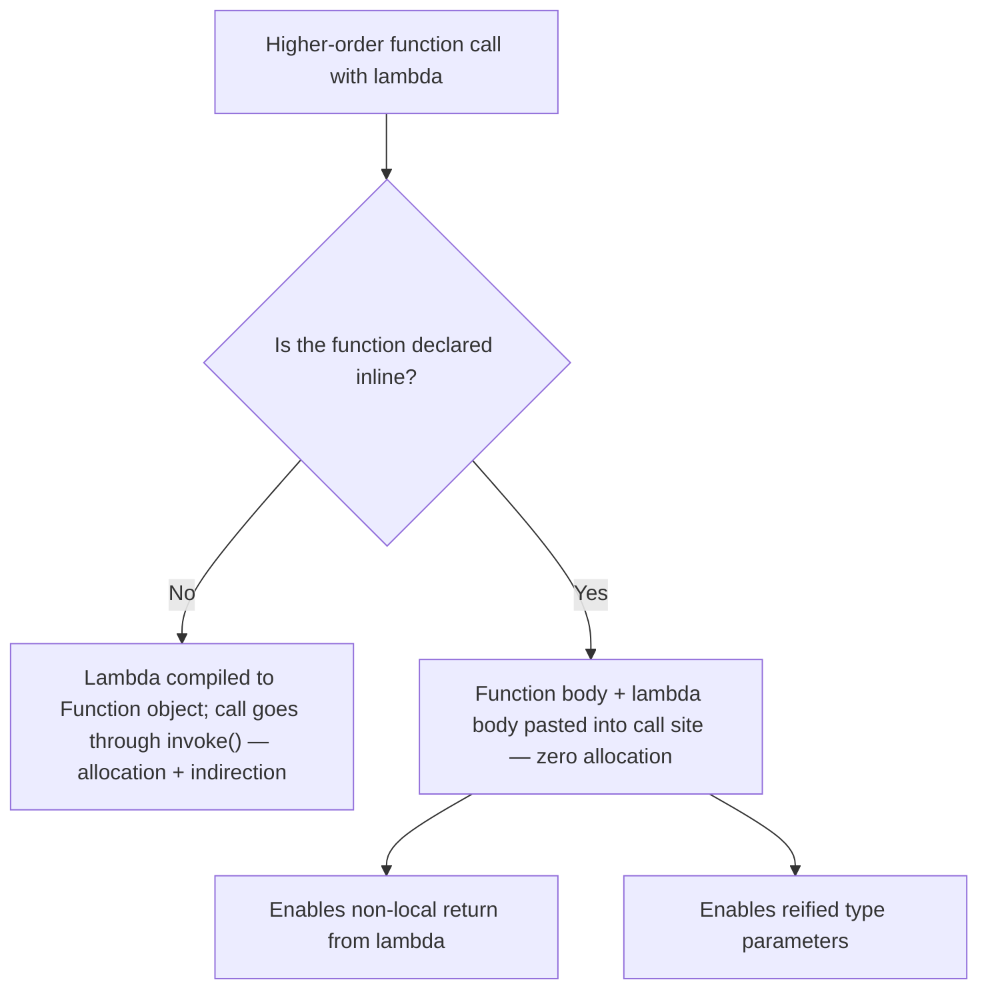

# Functions and Lambdas

Functions are first-class citizens in Kotlin: they can live at the top level, be stored in variables, passed as arguments, and extended onto existing types. This chapter covers the function features that make Kotlin code concise and expressive — default/named arguments, extension and infix functions, higher-order functions and lambdas, and the `inline`/`reified` machinery that makes them cheap at runtime.

## Default and Named Arguments

Default arguments eliminate most overload boilerplate; named arguments make call sites self-documenting:

```kotlin
fun connect(
    host: String,
    port: Int = 5432,
    useTls: Boolean = true,
    timeoutMs: Long = 30_000
): Connection { /* ... */ }

// Call sites:
connect("db.prod")                          // defaults for everything else
connect("db.prod", 5433)                    // positional
connect("db.prod", useTls = false)          // skip middle params by naming
connect(host = "db.prod", timeoutMs = 5000) // fully named — order-free
```

Compare with Java, where this requires four overloads or a builder. Pitfall: default arguments are not visible to Java callers unless you add `@JvmOverloads` (see [09-Kotlin-vs-Java-Interop.md](09-Kotlin-vs-Java-Interop.md)).

## Single-Expression Functions

When a function is one expression, drop the braces and `return`; the return type can be inferred:

```kotlin
fun square(x: Int) = x * x

fun isValidEmail(s: String): Boolean = s.contains("@") && s.contains(".")

// Works beautifully with when:
fun httpMessage(code: Int) = when (code) {
    200 -> "OK"
    404 -> "Not Found"
    500 -> "Server Error"
    else -> "Unknown"
}
```

## Extension Functions

Extension functions let you add methods to existing types — including types you do not own — without inheritance or wrappers. Inside the function, `this` is the receiver.

```kotlin
fun String.isPalindrome(): Boolean = this == this.reversed()

fun List<Int>.secondLargest(): Int? = this.distinct().sortedDescending().getOrNull(1)

println("racecar".isPalindrome())        // true
println(listOf(3, 1, 4, 1, 5).secondLargest())  // 4

// Extension properties also exist:
val String.wordCount: Int
    get() = trim().split(Regex("\\s+")).size
```

Two crucial facts interviewers test:

1. **Extensions are resolved statically** (by the declared type, not the runtime type) — they are compiled to plain static functions taking the receiver as the first parameter. They do not actually modify the class and cannot be overridden polymorphically.
2. **Member functions always win** over extensions with the same signature.

```kotlin
open class Shape
class Circle : Shape()

fun Shape.name() = "shape"
fun Circle.name() = "circle"

val s: Shape = Circle()
println(s.name())   // "shape" — static dispatch on the DECLARED type, not the runtime type!
```

Much of the Kotlin standard library (all of `map`, `filter`, etc.) is extension functions on collection interfaces — this is how Kotlin adds a rich API to Java's collections without changing them.

## Infix Functions

Member or extension functions with exactly one parameter can be marked `infix` and called without dot or parentheses:

```kotlin
infix fun Int.pow(exp: Int): Long {
    var result = 1L
    repeat(exp) { result *= this }
    return result
}

val big = 2 pow 10           // 1024

// Standard library examples you already use:
val pair = "key" to "value"          // infix fun <A, B> A.to(that: B): Pair<A, B>
val inRange = 5 in 1..10             // operator, similar spirit
val masked = 0b1010 and 0b0110       // bitwise ops are infix functions
```

Use infix sparingly — it shines in DSLs (`"GET" to handler`, kotest's `result shouldBe 4`) and hurts readability elsewhere.

## Function Types and Higher-Order Functions

A higher-order function takes functions as parameters or returns them. Function types are written `(Params) -> Return`:

```kotlin
// A function type as a parameter:
fun <T> List<T>.countWhere(predicate: (T) -> Boolean): Int {
    var n = 0
    for (item in this) if (predicate(item)) n++
    return n
}

val evens = listOf(1, 2, 3, 4).countWhere { it % 2 == 0 }   // 2

// Storing functions in variables:
val validator: (String) -> Boolean = { it.length >= 8 }
val doubler: (Int) -> Int = Int::times.let { { x -> x * 2 } } // or simply { it * 2 }

// Function references:
fun isPositive(x: Int) = x > 0
val positives = listOf(-1, 2, 3).filter(::isPositive)

// Returning a function (closure captures `factor`):
fun multiplierOf(factor: Int): (Int) -> Int = { it * factor }
val triple = multiplierOf(3)
println(triple(7))   // 21

// Receiver types: (used everywhere in DSLs — see apply/with)
val buildGreeting: StringBuilder.() -> Unit = { append("Hello") }
```

## Lambda Syntax and Conventions

```kotlin
val sum: (Int, Int) -> Int = { a, b -> a + b }

// Single parameter: implicit name `it`
listOf(1, 2, 3).map { it * it }

// Trailing lambda: if the last parameter is a function, move it outside the parens
list.fold(0) { acc, x -> acc + x }

// Unused parameters: underscore
map.forEach { (_, value) -> println(value) }
```

Pitfall — `return` inside a lambda returns from the **enclosing function** (non-local return) only when the lambda is inlined; use a labeled return to exit just the lambda:

```kotlin
fun findFirstNegative(nums: List<Int>): Int? {
    nums.forEach {
        if (it < 0) return it        // non-local: returns from findFirstNegative (forEach is inline)
    }
    return null
}

fun printPositives(nums: List<Int>) {
    nums.forEach {
        if (it < 0) return@forEach   // labeled: acts like `continue`
        println(it)
    }
}
```

## Inline Functions and Reified Generics

Every lambda is normally compiled to a (possibly cached) object implementing a `FunctionN` interface — an allocation plus an indirect call. `inline` tells the compiler to copy the function body *and* the lambda body into the call site, eliminating that overhead:



```kotlin
inline fun measure(label: String, block: () -> Unit) {
    val start = System.nanoTime()
    block()
    println("$label took ${(System.nanoTime() - start) / 1_000_000} ms")
}

measure("query") { repository.loadAll() }   // no lambda object allocated
```

Modifiers for lambda parameters of inline functions:

- `noinline` — this particular lambda is *not* inlined (needed if you store it or pass it along as an object).
- `crossinline` — the lambda is inlined but forbidden from doing non-local returns (needed if it will run in another execution context, e.g. inside a nested lambda or a `Runnable`).

```kotlin
inline fun transaction(
    crossinline onCommit: () -> Unit,
    noinline onError: (Throwable) -> Unit,   // stored, so cannot be inlined
    block: () -> Unit
) {
    errorHandlers.add(onError)
    try {
        block()
        runLater { onCommit() }   // lambda used inside another lambda -> crossinline
    } catch (t: Throwable) { onError(t) }
}
```

### Reified Type Parameters

Generics are erased on the JVM — normally you cannot do `T::class` or `x is T`. But since an `inline` function's body is copied to the call site, the compiler *knows* the concrete type there and can substitute it. That is `reified`:

```kotlin
inline fun <reified T> Gson.fromJson(json: String): T =
    fromJson(json, T::class.java)              // T survives erasure via inlining!

val user: User = gson.fromJson(jsonString)     // no need to pass User::class.java

inline fun <reified T> List<Any>.filterIsInstanceOf(): List<T> =
    filter { it is T }.map { it as T }         // `is T` legal only because T is reified
```

Without `reified`, the Java-style workaround is passing `Class<T>` explicitly. This pattern is everywhere in real code: JSON deserialization, `startActivity<DetailActivity>()` in Android (Anko/ktx style), and dependency-injection lookups like Koin's `get<UserRepo>()`.

Pitfall: do not inline large functions (bytecode bloat — the body is copied to every call site), and inlining is only worth it for functions taking lambdas or needing reified types.

## Real-World Context

- **Android**: extension functions power `androidx.core:core-ktx` (`view.isVisible = true`, `context.getColorCompat(...)`); lambdas replace anonymous listener classes (`button.setOnClickListener { }`).
- **Backend**: Ktor routing is built from higher-order functions with receivers: `routing { get("/users") { call.respond(users) } }`.
- **Collections everywhere**: `map`/`filter`/`fold` are inline higher-order extension functions — understanding this section explains why idiomatic Kotlin has negligible overhead versus hand-written loops.

## Best Practices

- **Use default + named arguments instead of overloads and builders**; name arguments at call sites when passing literals (`retry(times = 3)` reads better than `retry(3)`).
- **Keep extension functions focused and discoverable**: extend the most specific sensible type, put them near their domain, and avoid extending common types (`String`, `Any`) with domain-specific logic in shared modules.
- **Do not use infix or operator overloading for cleverness** — only where the notation is conventional (DSLs, math types).
- **Prefer `it` only for tiny lambdas**; name the parameter once a lambda exceeds a couple of lines or nests.
- **Mark a function `inline` only when it takes lambdas** (or needs `reified`); measure before inlining for "performance," and keep inline bodies small.
- **Watch non-local returns** in inlined lambdas — an accidental `return` inside `forEach` exits the whole function. Prefer `for` loops or labeled returns when in doubt.

## Interview Questions

<details>
<summary>1. How are extension functions implemented, and can they be overridden polymorphically?</summary>

An extension `fun String.foo()` compiles to a static method `foo(String receiver)` — the class is never modified. Because dispatch is static, the extension called is chosen by the *declared* (compile-time) type of the expression, not the runtime type, so they cannot be overridden polymorphically. Also, a member function with the same signature always takes precedence over an extension.
</details>

<details>
<summary>2. What problem do default and named arguments solve compared to Java?</summary>

They replace telescoping overloads and most builder patterns. One Kotlin function with defaults covers what would be N Java overloads, and named arguments let callers skip any subset of defaulted parameters while keeping call sites readable and order-independent. For Java callers you add `@JvmOverloads` to generate the overload set at compile time.
</details>

<details>
<summary>3. What does <code>inline</code> do, and what are its costs and benefits?</summary>

`inline` copies the function body — and the bodies of its lambda arguments — directly into each call site. Benefits: no `Function` object allocation, no virtual `invoke` call, non-local returns from lambdas become possible, and type parameters can be `reified`. Costs: bytecode duplication at every call site (code bloat if the body is large), and inability to store the lambda as an object unless marked `noinline`. It pays off mainly for small, frequently-called functions taking lambdas — like the stdlib's collection operators.
</details>

<details>
<summary>4. Explain <code>noinline</code> and <code>crossinline</code>.</summary>

Within an `inline` function: `noinline` opts a specific lambda parameter out of inlining so it can be treated as a normal object (stored in a field, passed to a non-inline function). `crossinline` keeps the lambda inlined but bans non-local returns from it — required when the lambda will execute in a different frame, e.g., inside a nested lambda, a `Runnable`, or a callback, where returning from the original caller would be impossible.
</details>

<details>
<summary>5. Why do reified type parameters require inline functions?</summary>

JVM generics are erased at runtime, so an ordinary generic function has no concrete `T` to inspect — `T::class` and `x is T` are illegal. Inlining copies the function body into the call site, where the compiler statically knows the actual type argument and can substitute it into the copied body. So `reified` is not runtime magic — it is compile-time code substitution, which is why it only works with `inline`.
</details>

<details>
<summary>6. What does <code>return</code> inside a lambda do?</summary>

Inside a lambda passed to an *inline* function, a bare `return` is non-local: it returns from the nearest enclosing declared function (e.g., `return` inside `forEach { }` exits your whole function — this makes `forEach` behave like a `for` loop). To exit only the lambda, use a labeled return: `return@forEach`. In lambdas passed to non-inline functions, bare `return` is a compile error; only labeled returns are allowed.
</details>

<details>
<summary>7. What is a function type with receiver, and where is it used?</summary>

`A.() -> B` is a function type whose body executes with an `A` instance as `this` (the receiver), so members of `A` are called unqualified. It is the foundation of scope functions (`apply` takes `T.() -> Unit`) and Kotlin DSLs — Ktor's `routing { get("/") { ... } }`, Gradle's Kotlin DSL, and HTML builders all work by nesting lambdas with receivers so each block "speaks the language" of its receiver object.
</details>
