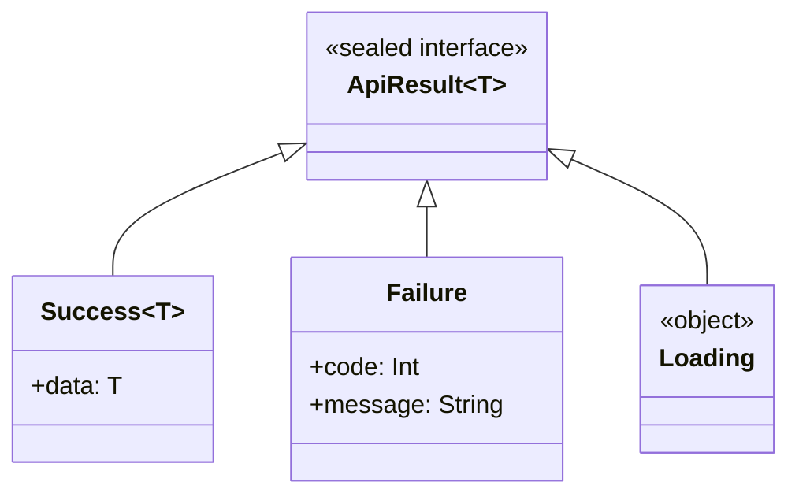
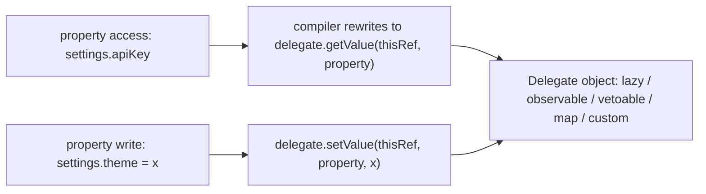

# Classes and Objects

Kotlin's class system removes Java boilerplate (getters, setters, `equals`/`hashCode`, static members) while adding powerful constructs: data classes, sealed hierarchies, object declarations, and first-class delegation. This chapter walks through constructors and initialization, the special class kinds, and the `by` keyword — all staple interview topics.

## Primary and Secondary Constructors, init Blocks

The primary constructor lives in the class header; `val`/`var` in it declares *and* initializes properties in one line:

```kotlin
class User(
    val id: Long,                    // property + constructor param
    var email: String,               // mutable property
    displayName: String? = null      // plain param: usable only during initialization
) {
    val display: String = displayName ?: email.substringBefore("@")

    init {                           // runs as part of the primary constructor
        require(email.contains("@")) { "Invalid email: $email" }
    }

    // Secondary constructor MUST delegate to the primary with this(...)
    constructor(id: Long, email: String, legacyCode: Int) : this(id, email) {
        println("Migrated user with legacy code $legacyCode")
    }
}
```

Initialization order: property initializers and `init` blocks run **top to bottom in declaration order**, then the secondary constructor body. Idiomatic Kotlin rarely needs secondary constructors — default arguments and factory functions in a `companion object` usually replace them.

```kotlin
// Classes are FINAL by default — must opt in to inheritance:
open class Repository(protected val db: Database) {
    open fun findAll(): List<Row> = db.query("SELECT *")
}

class CachedRepository(db: Database) : Repository(db) {
    override fun findAll(): List<Row> = cache.getOrPut("all") { super.findAll() }
}
```

Pitfall — calling an `open` function from a constructor invokes the override before the subclass is initialized:

```kotlin
open class Base {
    init { render() }                       // DANGER
    open fun render() { }
}
class Child : Base() {
    val title: String = "Hello"
    override fun render() { println(title.length) }  // NPE: title not yet assigned!
}
```

## Data Classes

`data class` generates `equals`, `hashCode`, `toString`, `copy`, and `componentN` functions from the **primary-constructor properties**:

```kotlin
data class Money(val amount: Long, val currency: String)

val a = Money(500, "KES")
val b = Money(500, "KES")

println(a == b)              // true — structural equality on all primary-ctor props
println(a)                   // Money(amount=500, currency=KES)

val discounted = a.copy(amount = 450)     // immutable update pattern
val (amount, currency) = a                // destructuring via component1/component2
```

Crucial nuance: **only properties in the primary constructor participate** in the generated methods:

```kotlin
data class Session(val id: String) {
    var lastAccess: Long = 0             // body property: IGNORED by equals/hashCode/copy
}
val s1 = Session("x").apply { lastAccess = 1 }
val s2 = Session("x").apply { lastAccess = 999 }
println(s1 == s2)                        // true! lastAccess is invisible to equals
```

Other pitfalls: `copy` is shallow; data classes cannot be `abstract`, `open`, `sealed`, or `inner`; and putting arrays in data classes breaks equality (`Array.equals` is referential — prefer `List`).

## Sealed Classes and Interfaces

A `sealed` type restricts its subtypes to the same package/module, giving the compiler a **closed hierarchy** it can check exhaustively in `when`:

```kotlin
sealed interface ApiResult<out T> {
    data class Success<T>(val data: T) : ApiResult<T>
    data class Failure(val code: Int, val message: String) : ApiResult<Nothing>
    object Loading : ApiResult<Nothing>
}

fun <T> render(result: ApiResult<T>): String = when (result) {
    is ApiResult.Success -> "Got ${result.data}"        // smart cast to Success
    is ApiResult.Failure -> "Error ${result.code}"
    ApiResult.Loading    -> "Spinner..."
    // No else needed — compiler KNOWS all subtypes. Adding a new subtype
    // breaks this `when` at compile time: exhaustiveness as a safety net.
}
```



Sealed hierarchies are the idiomatic way to model state machines, UI states (Android `ViewState`), and result/error types on the backend — a lightweight alternative to exceptions for expected failures.

**Sealed vs enum**: enum instances are singletons with the same shape; sealed subtypes are full classes — each can carry *different* data and there can be many instances of each subtype.

## Enum Classes

```kotlin
enum class Status(val httpCode: Int) {
    ACTIVE(200),
    SUSPENDED(403) {
        override fun describe() = "Account suspended — contact support"
    },
    DELETED(410);

    open fun describe(): String = "Status $name ($httpCode)"
}

val s = Status.valueOf("ACTIVE")       // throws if unknown
val all = Status.entries               // Kotlin 1.9+: preferred over values()
val nice = Status.ACTIVE.describe()
```

Enums can implement interfaces, hold state, and have per-constant behavior — and `when` over an enum is exhaustively checked just like sealed types.

## Object Declarations and Companion Objects

`object` declares a class and its **single instance** simultaneously — a thread-safe, lazily-initialized singleton:

```kotlin
object AppConfig {                     // singleton
    val version = "2.1.0"
    fun flag(name: String): Boolean = flags[name] ?: false
    private val flags = mapOf("dark_mode" to true)
}

println(AppConfig.version)
```

A `companion object` is a singleton bound to a class — Kotlin's replacement for `static`:

```kotlin
class PaymentIntent private constructor(val id: String, val amountCents: Long) {
    companion object {
        private var counter = 0L

        // Factory function pattern — replaces secondary constructors nicely:
        fun create(amountCents: Long): PaymentIntent {
            require(amountCents > 0)
            return PaymentIntent("pi_${counter++}", amountCents)
        }
    }
}

val intent = PaymentIntent.create(5_000)   // called like a static method
```

Companions are real objects: they can implement interfaces and be passed around. For Java interop, members need `@JvmStatic` to appear as true static methods.

**Object expressions** are Kotlin's anonymous classes:

```kotlin
val listener = object : MouseAdapter() {
    override fun mouseClicked(e: MouseEvent) { println("click") }
}
```

## Visibility Modifiers

| Modifier | Top-level declarations | Class members |
|---|---|---|
| `public` (default) | Visible everywhere | Visible everywhere |
| `internal` | Visible within the same **module** (Gradle module / compilation unit) | Same |
| `protected` | Not allowed | Visible in subclasses (NOT same-package like Java) |
| `private` | Visible within the file | Visible within the class |

`internal` is the interesting one: it has no Java equivalent (Java's package-private does not exist in Kotlin) and is ideal for hiding implementation details of a library module while keeping them testable within the module.

## Delegation with `by`

Kotlin supports the delegation pattern natively — `by` forwards interface implementation to another object, replacing fragile implementation inheritance:

```kotlin
interface AuditLog { fun record(event: String) }

class ConsoleAuditLog : AuditLog {
    override fun record(event: String) = println("[AUDIT] $event")
}

// OrderService IS-A AuditLog, but all methods forward to the delegate:
class OrderService(log: AuditLog) : AuditLog by log {
    fun placeOrder(id: String) {
        record("order placed: $id")   // delegated method, but we can also override selectively
    }
}
```

**Property delegation** uses the same keyword for properties whose get/set logic is reusable:

```kotlin
class Settings {
    val apiKey: String by lazy { loadFromVault("api-key") }   // computed once, on demand

    var theme: String by observable("light") { _, old, new ->
        println("theme: $old -> $new")
    }

    var cachedUser: String by map                              // e.g., backed by a Map
}

// Custom delegate: anything with getValue/setValue operators
class Trimmed : ReadWriteProperty<Any?, String> {
    private var value = ""
    override fun getValue(thisRef: Any?, property: KProperty<*>) = value
    override fun setValue(thisRef: Any?, property: KProperty<*>, v: String) {
        value = v.trim()
    }
}
var title: String by Trimmed()
```



Real-world delegates: `by lazy` everywhere, Android's `by viewModels()`, `by remember` in Compose, and Gradle Kotlin DSL's `by project`.

## Real-World Context

- **Android**: sealed `ViewState`/`UiEvent` hierarchies drive MVI/MVVM screens; `object` for app-wide singletons; `by viewModels()` delegation is standard.
- **Backend**: data classes are the default for DTOs and JPA projections; sealed `Result` types model expected failures without exceptions in service layers.
- **Libraries**: interface delegation composes behaviors (logging, caching wrappers) without inheritance chains.

## Best Practices

- **Keep classes final** (the default); design for inheritance deliberately with `open`/`abstract`, or prefer composition + delegation (`by`).
- **Data classes should be fully immutable**: all `val`, no body properties that affect meaning, `List` not `Array`, and use `copy` for updates.
- **Model closed state spaces with sealed types** and let exhaustive `when` (without `else`) turn missing cases into compile errors.
- **Prefer companion-object factory functions** (with meaningful names like `of`, `parse`, `create`) over secondary constructors.
- **Never call open members from constructors/init blocks.**
- **Use `internal`** to keep module implementation details out of your public API.
- **Reach for property delegates** when get/set logic repeats (lazy init, observation, preference storage) instead of hand-writing it in every property.

## Interview Questions

<details>
<summary>1. What exactly does a data class generate, and from which properties?</summary>

`equals`, `hashCode`, `toString`, `copy`, and `componentN` destructuring functions — all derived **only from properties declared in the primary constructor**. Properties declared in the class body are excluded from every generated function, which is a classic source of surprising equality bugs. Data classes also cannot be `open`, `abstract`, `sealed`, or `inner`.
</details>

<details>
<summary>2. Sealed class vs enum class — when do you choose each?</summary>

Use an enum when you need a fixed set of *constant singletons* sharing the same shape (days, statuses, config keys). Use a sealed hierarchy when the alternatives need *different data per case* or multiple instances — e.g., `Success(data)` vs `Failure(code, message)`. Both give exhaustive `when` checking. Sealed types are strictly more expressive; enums are simpler, serialize naturally, and support `entries`/`valueOf`.
</details>

<details>
<summary>3. How does <code>companion object</code> differ from Java <code>static</code>?</summary>

A companion is a real singleton object associated with the class — it can implement interfaces, be passed as a value, and hold state, none of which statics can do. Its members are called like statics from Kotlin (`ClassName.member`), but at the bytecode level they are instance members of the `Companion` object; Java callers see `ClassName.Companion.member()` unless you annotate with `@JvmStatic`/`@JvmField` to generate genuine static members.
</details>

<details>
<summary>4. Explain class delegation with <code>by</code> and why it beats implementation inheritance.</summary>

`class A(b: B) : Iface by b` makes the compiler generate forwarding methods for every `Iface` member to the delegate `b`, while letting you override selected members. Compared to inheritance it avoids the fragile base class problem (you depend only on the interface, not on superclass internals), works with final classes, and lets you compose multiple behaviors by delegating different interfaces to different objects — real composition with inheritance-level convenience.
</details>

<details>
<summary>5. What is the initialization order when constructing a Kotlin class with a superclass, init blocks, and a secondary constructor?</summary>

1) Superclass constructor runs first (including its property initializers and init blocks). 2) The subclass's primary constructor parameter properties are assigned. 3) Property initializers and `init` blocks run in declaration order, top to bottom. 4) The secondary constructor body runs last, after its delegation to the primary. This ordering is why calling an `open` function from a constructor is dangerous — the override runs before the subclass's properties are initialized.
</details>

<details>
<summary>6. What does <code>internal</code> visibility mean, and how does it appear to Java?</summary>

`internal` restricts visibility to the compilation module (a Gradle/Maven module, roughly). Kotlin has no package-private. Because the JVM has no "module-private" access flag, `internal` members compile to `public` bytecode with mangled names (e.g., `method$moduleName`) — so Java code in another module *can technically* call them, but the mangling and IDE discourage it. It is a compile-time contract enforced by the Kotlin compiler, not the JVM.
</details>

<details>
<summary>7. Why does <code>when</code> over a sealed type not need an <code>else</code> branch, and why is that valuable?</summary>

The compiler knows the complete set of subtypes (they must be declared in the same module/package), so it can verify every case is covered. Omitting `else` turns the `when` into an exhaustiveness check: when someone adds a new subtype, every non-exhaustive `when` in the codebase becomes a compile error, forcing each handling site to be updated. With an `else` branch, new cases silently fall into the default — a major maintenance hazard in state machines and result types.
</details>

<details>
<summary>8. How do property delegates work under the hood?</summary>

`var x: T by d` compiles to a hidden field holding `d`, with the property's getter calling `d.getValue(thisRef, property)` and the setter `d.setValue(thisRef, property, value)` — resolved by operator convention (the delegate just needs those operator functions, or can implement `ReadWriteProperty`). The `KProperty` argument gives the delegate reflection metadata (name, etc.), which is how `Delegates.observable`, `by map`, and Android's `by viewModels()` know which property they serve.
</details>
