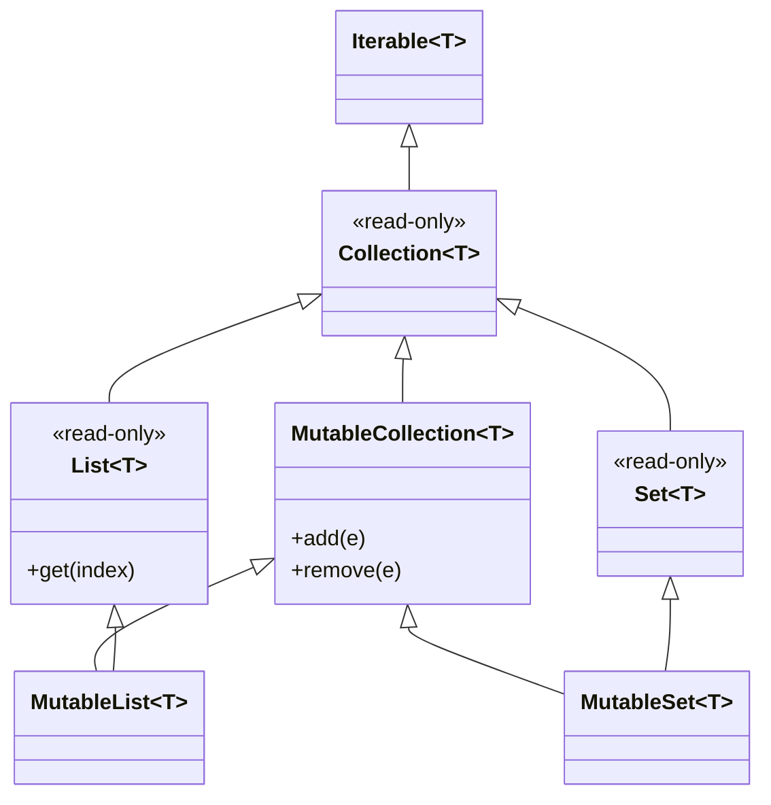
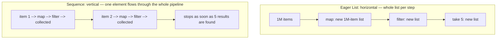

# Collections and Sequences

Kotlin's collection library layers a rich functional API over the JVM's collection classes, with a crucial twist: the type system separates *read-only* interfaces from *mutable* ones. This chapter covers List/Set/Map and their mutable variants, the essential transformation operators, eager collections versus lazy sequences, and destructuring.

## Read-Only vs Mutable Collections

Kotlin splits every collection interface into a read-only parent and a mutable child:



```kotlin
val readOnly: List<Int> = listOf(1, 2, 3)      // no add/remove in the API
val mutable: MutableList<Int> = mutableListOf(1, 2, 3)
mutable.add(4)

// A read-only reference can VIEW a mutable list:
val view: List<Int> = mutable
mutable.add(5)
println(view)    // [1, 2, 3, 4, 5] — read-only is not immutable!
```

Key interview point: `List` is **read-only, not immutable**. It is an interface without mutators; the underlying object may still be mutated through another reference (or by a Java caller, since the JVM types are plain `java.util.List`). True immutability needs `toList()` defensive copies or the immutable collections library. The read-only/mutable split is about *API intent*: a function accepting `List<T>` promises not to modify it.

```kotlin
// Creation cheat sheet:
val list = listOf("a", "b")                 // read-only list
val mList = mutableListOf("a")              // ArrayList under the hood
val set = setOf(1, 2, 2)                    // {1, 2} — preserves insertion order (LinkedHashSet)
val map = mapOf("a" to 1, "b" to 2)         // Pair-based construction
val mMap = mutableMapOf<String, Int>()
val empty = emptyList<String>()             // shared singleton, cheap
val built = buildList {                      // builder: mutate inside, read-only result
    add(1)
    addAll(listOf(2, 3))
}
```

## Essential Collection Operations

These operators come up constantly in interviews — both as API knowledge and as tools for solving algorithm questions concisely.

```kotlin
data class Employee(val name: String, val dept: String, val salary: Int)

val staff = listOf(
    Employee("Asha", "Eng", 120),
    Employee("Ben", "Eng", 100),
    Employee("Cara", "Sales", 90),
    Employee("Dan", "Sales", 95),
)

// map — transform each element
val names: List<String> = staff.map { it.name }

// filter — keep matching elements
val engineers = staff.filter { it.dept == "Eng" }

// fold — reduce with an initial accumulator (reduce = no initial value, throws on empty!)
val payroll = staff.fold(0) { acc, e -> acc + e.salary }        // 405
val payroll2 = staff.sumOf { it.salary }                        // idiomatic shortcut

// groupBy — Map<Key, List<T>>
val byDept: Map<String, List<Employee>> = staff.groupBy { it.dept }

// associateBy — Map<Key, T> (last write wins on duplicate keys — pitfall!)
val byName: Map<String, Employee> = staff.associateBy { it.name }

// flatMap — map each element to a collection, then flatten
val teams = listOf(listOf("a", "b"), listOf("c"))
val flat = teams.flatten()                                       // [a, b, c]
val chars = listOf("hi", "yo").flatMap { it.toList() }           // [h, i, y, o]

// sortedBy / sortedWith — sorted copies (sortedBy does NOT mutate)
val bySalary = staff.sortedByDescending { it.salary }
val multiKey = staff.sortedWith(compareBy({ it.dept }, { -it.salary }))

// Aggregations and queries
val top = staff.maxByOrNull { it.salary }        // Employee? — null-safe variant
val anySales = staff.any { it.dept == "Sales" }  // true
val allPaid = staff.all { it.salary > 0 }        // true
val count = staff.count { it.salary > 95 }       // 2

// partition — split into (matching, rest)
val (highPaid, others) = staff.partition { it.salary >= 100 }

// zip / windowed / chunked
val pairs = listOf(1, 2, 3).zip(listOf("a", "b", "c"))   // [(1,a), (2,b), (3,c)]
val windows = listOf(1, 2, 3, 4).windowed(2)             // [[1,2],[2,3],[3,4]]
val chunks = listOf(1, 2, 3, 4, 5).chunked(2)            // [[1,2],[3,4],[5]]
```

Pitfalls worth naming in an interview:

```kotlin
// reduce on an empty list throws; fold with an initial value is safe
emptyList<Int>().fold(0) { a, b -> a + b }     // 0
// emptyList<Int>().reduce { a, b -> a + b }   // UnsupportedOperationException!

// first()/last()/single() throw when unmatched; use the *OrNull variants
val found = staff.firstOrNull { it.salary > 200 }   // null, no exception

// Maps: indexing returns nullable
val salaryMap = mapOf("Asha" to 120)
val s: Int? = salaryMap["Ben"]                       // null
val s2: Int = salaryMap.getOrDefault("Ben", 0)
val s3: Int = salaryMap.getValue("Asha")             // throws if absent — explicit choice
```

## Sequences: Lazy Evaluation

Every chained collection operation on a `List` **eagerly creates a new intermediate list**. `Sequence` evaluates lazily, element by element, only when a terminal operation runs:



```kotlin
val result = (1..1_000_000).asSequence()
    .map { it * it }              // intermediate: lazy, nothing computed yet
    .filter { it % 3 == 0 }       // intermediate: lazy
    .take(5)                      // intermediate: lazy
    .toList()                     // terminal: NOW elements flow — only ~9 elements ever processed

// Same code without asSequence() would build two million-element lists
// before take(5) discards almost everything.
```

Order of operations differs too: sequences process **vertically** (each element passes through all steps before the next element starts), lists **horizontally** (each step processes all elements). Vertical processing is what enables short-circuiting with `take`, `first`, `any`.

### When Each Wins

- **Use plain collections (eager)** for small/medium data and short chains — they are simpler, debuggable, and avoid the per-element lambda-invocation overhead of sequences. For a 10-element list, a sequence is *slower*.
- **Use sequences** for large data, long operator chains (each eager step allocates a full list), short-circuiting terminals (`first { }`, `take(n)`), or infinite generators:

```kotlin
val fibs = generateSequence(Pair(0L, 1L)) { (a, b) -> Pair(b, a + b) }
    .map { it.first }
val firstTen = fibs.take(10).toList()    // [0, 1, 1, 2, 3, 5, 8, 13, 21, 34]

// Lazily read a large file (sequence tied to the reader's lifetime):
File("big.log").useLines { lines ->
    val errors = lines.filter { "ERROR" in it }.take(100).toList()
}
```

Note: sequences are Kotlin's analog of Java 8 Streams, but single-threaded; they also can typically be iterated only once if built from an iterator. For asynchronous streams, use `Flow` (see [07-Coroutines.md](07-Coroutines.md)).

## Destructuring

Destructuring unpacks objects that provide `componentN()` functions — data classes, `Pair`, `Triple`, and `Map.Entry`:

```kotlin
data class Point(val x: Int, val y: Int)
val (x, y) = Point(3, 4)

// In loops — especially maps:
val scores = mapOf("math" to 90, "cs" to 95)
for ((subject, score) in scores) {
    println("$subject: $score")
}

// In lambdas:
scores.forEach { (subject, score) -> println("$subject -> $score") }
val labels = scores.map { (k, v) -> "$k=$v" }

// Skip components with underscore:
val (_, yOnly) = Point(1, 2)

// From functions returning Pair (use sparingly — a data class is clearer for 3+ values):
fun minMax(nums: List<Int>) = Pair(nums.min(), nums.max())
val (lo, hi) = minMax(listOf(3, 1, 4))
```

Pitfall: destructuring is **positional**, not name-based. `val (y, x) = point` silently swaps values — reordering data-class properties breaks destructuring call sites without a compile error (unless types differ).

## Real-World Context

- **Android**: RecyclerView adapters and Compose lists are fed by `map`/`filter`/`groupBy` chains transforming domain models into UI models.
- **Backend**: request handlers aggregate and reshape database rows with `groupBy`/`associateBy`; `sequence`/`useLines` processes large exports without loading them in memory.
- **Everywhere**: accepting `List` (read-only) in function signatures while using `MutableList` privately is the standard encapsulation pattern.

## Best Practices

- **Expose read-only types (`List`, `Map`) in public APIs**; keep mutability private. Return defensive copies (`toList()`) if the backing collection mutates.
- **Prefer transformation chains over manual loops** for clarity — but keep chains short (3-5 steps); extract named intermediate values when logic grows.
- **Reach for `*OrNull` variants** (`firstOrNull`, `maxByOrNull`, `singleOrNull`) instead of exception-throwing accessors.
- **Use `asSequence()` deliberately**: large inputs, long chains, or short-circuiting — not by default. Always end with a terminal operation.
- **Prefer `fold`/`sumOf` over `reduce`** unless you can prove the collection is non-empty.
- **Watch `associateBy` on duplicate keys** (silent overwrites — use `groupBy` when duplicates are possible).
- **Avoid `Pair`/`Triple` in public signatures**; a small data class documents what the components mean.

## Interview Questions

<details>
<summary>1. Is a Kotlin <code>List</code> immutable? Explain the read-only vs immutable distinction.</summary>

No — `List` is *read-only*: the interface exposes no mutators, but the underlying object may be a mutable list reachable through another reference (or mutated by Java code, since at runtime it is `java.util.ArrayList`). Read-only is a compile-time API contract about what *this reference* can do, not a guarantee about the object. For real immutability, make a defensive copy (`toList()`) or use the kotlinx immutable-collections library.
</details>

<details>
<summary>2. What is the difference between <code>map</code>+<code>filter</code> on a List versus a Sequence?</summary>

On a `List`, each operator eagerly produces a complete intermediate list (horizontal evaluation: step by step over the whole collection). On a `Sequence`, intermediate operators are lazy — nothing executes until a terminal operation, and then each element flows through the entire pipeline individually (vertical evaluation). Sequences avoid intermediate allocations and enable short-circuiting (`take`, `first`), but add per-element overhead, so they win on large data/long chains and lose on small collections.
</details>

<details>
<summary>3. When does <code>reduce</code> throw, and how does <code>fold</code> differ?</summary>

`reduce` uses the first element as the initial accumulator, so it throws `UnsupportedOperationException` on an empty collection, and its accumulator type must be the element type. `fold` takes an explicit initial value, works on empty collections, and allows the accumulator to be a different type (e.g., folding `List<String>` into an `Int` length total). Default to `fold` (or `sumOf`/dedicated aggregators) unless non-emptiness is guaranteed.
</details>

<details>
<summary>4. Compare <code>groupBy</code> and <code>associateBy</code>.</summary>

Both build maps from a key selector. `groupBy` returns `Map<K, List<T>>` — every element is kept, grouped into lists. `associateBy` returns `Map<K, T>` — one element per key, and on duplicate keys **later elements silently overwrite earlier ones**. Use `associateBy` only when keys are known unique (e.g., indexing by ID); otherwise `groupBy` prevents silent data loss.
</details>

<details>
<summary>5. How does destructuring work under the hood, and what is its main hazard?</summary>

`val (a, b) = obj` compiles to `val a = obj.component1(); val b = obj.component2()`. Data classes auto-generate `componentN()` for primary-constructor properties in declaration order; `Pair`, `Triple`, and `Map.Entry` provide them too. The hazard: it is positional. Reordering the data class's properties re-binds every destructuring site by position — silently, if adjacent properties share a type.
</details>

<details>
<summary>6. How would you process a 10 GB log file in Kotlin without exhausting memory?</summary>

Stream it lazily: `File("big.log").useLines { lines -> lines.filter { "ERROR" in it }.map(::parse).take(...) ... }`. `useLines` exposes the file as a `Sequence<String>` that reads line by line and closes the reader afterward; combined with lazy operators and a short-circuiting or aggregating terminal operation, memory stays constant regardless of file size. (For async/multi-source streaming, `Flow` is the coroutine-based equivalent.)
</details>

<details>
<summary>7. Why do Kotlin map lookups return a nullable type, and what are the alternatives?</summary>

`map[key]` returns `V?` because the key may be absent — Kotlin encodes the miss in the type instead of Java's silent `null` returns. Alternatives express intent: `getOrDefault(key, d)` for fallbacks, `getOrElse(key) { compute() }` for lazy defaults, `getValue(key)` to throw `NoSuchElementException` when absence is a bug, and `getOrPut(key) { ... }` on mutable maps for cache patterns.
</details>
