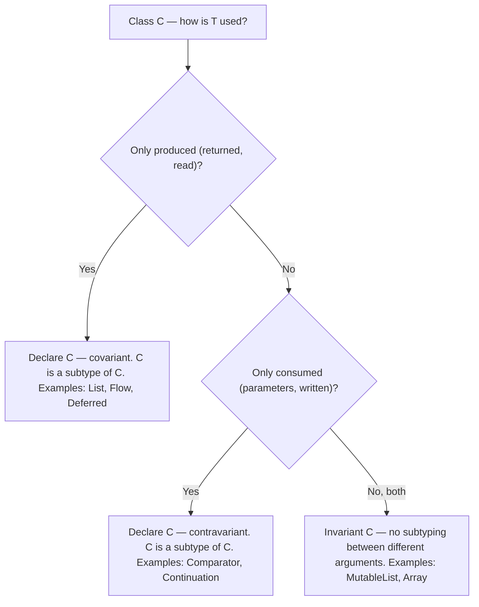

# Generics and Variance

Generics let you write type-safe, reusable code, and *variance* controls how generic types relate when their type arguments do (`List<Cat>` vs `List<Animal>`). Kotlin's declaration-site variance (`in`/`out`) is cleaner than Java's use-site wildcards and is a favorite topic for mid/senior interviews. This chapter covers generic functions and classes, variance, star projections, reified type parameters, and the Java comparison.

## Generic Functions and Classes

```kotlin
// Generic function — type parameter before the name
fun <T> firstOrDefault(list: List<T>, default: T): T =
    if (list.isEmpty()) default else list[0]

// Generic class
class Box<T>(val value: T) {
    fun <R> mapContents(transform: (T) -> R): Box<R> = Box(transform(value))
}

// Constraints: upper bounds
fun <T : Comparable<T>> largest(a: T, b: T): T = if (a >= b) a else b

// Multiple constraints via where
fun <T> process(item: T) where T : Runnable, T : AutoCloseable {
    item.use { it.run() }
}

// Nullability: a bare T can be nullable! Constrain with : Any to forbid null
fun <T : Any> requireItem(item: T) { /* item can never be null */ }
```

Like Java, Kotlin generics are **erased at runtime** on the JVM: a `List<String>` and a `List<Int>` are the same class at runtime, so `x is List<String>` is illegal (only `x is List<*>` compiles). The escape hatch is `reified` (below).

## The Variance Problem

Is a `List<Cat>` a `List<Animal>`? It depends on what the type *does* with `T`:

```kotlin
open class Animal(val name: String)
class Cat(name: String) : Animal(name)

// Kotlin's read-only List<out E> IS covariant — this compiles:
val cats: List<Cat> = listOf(Cat("Miu"))
val animals: List<Animal> = cats            // safe: you can only READ Animals out

// MutableList<E> is invariant — this does NOT compile:
val mCats: MutableList<Cat> = mutableListOf(Cat("Miu"))
// val mAnimals: MutableList<Animal> = mCats   // Error! Why?
// If allowed: mAnimals.add(Dog("Rex")) would put a Dog in a list of Cats.
```



## Declaration-Site Variance: out and in

Kotlin lets the **class author** declare variance once, at the declaration:

### `out T` — Covariance (Producer)

```kotlin
interface Producer<out T> {
    fun produce(): T                 // T in "out" position: OK
    // fun consume(item: T)          // Compile error: T in "in" position forbidden
}

val catProducer: Producer<Cat> = object : Producer<Cat> {
    override fun produce() = Cat("Miu")
}
val animalProducer: Producer<Animal> = catProducer   // safe — it only gives you Cats,
                                                     // and every Cat IS an Animal
```

### `in T` — Contravariance (Consumer)

```kotlin
interface Consumer<in T> {
    fun consume(item: T)             // T in "in" position: OK
    // fun produce(): T              // Compile error
}

val animalFeeder: Consumer<Animal> = object : Consumer<Animal> {
    override fun consume(item: Animal) = println("feeding ${item.name}")
}
val catFeeder: Consumer<Cat> = animalFeeder   // safe — something that can feed ANY
                                              // animal can certainly feed cats

// Real stdlib example:
// Comparator<in T> — a Comparator<Any> works wherever Comparator<String> is needed
val byHash: Comparator<Any> = compareBy { it.hashCode() }
val strings: List<String> = listOf("b", "a").sortedWith(byHash)
```

Mnemonic: **PECS** in Java ("Producer Extends, Consumer Super") becomes simply **"out = produces, in = consumes"** in Kotlin.

### Function Types Have Built-In Variance

`Function1<in P, out R>` — parameters are contravariant, returns covariant:

```kotlin
val f: (Cat) -> Animal = { it }
val g: (Cat) -> Any = f          // OK: return type widened (out)
val h: (Cat) -> Animal = { a: Animal -> a } as (Cat) -> Animal  // conceptually: param narrowed (in)
```

## Use-Site Variance and Star Projection

When a class must be invariant (like `MutableList`), you can still apply variance at the **use site** (type projection):

```kotlin
// Copy from any producer of T into any consumer of T:
fun <T> copy(from: MutableList<out T>, to: MutableList<in T>) {
    for (item in from) to.add(item)
}

val cats = mutableListOf(Cat("Miu"))
val animals = mutableListOf<Animal>()
copy(from = cats, to = animals)     // MutableList<out Animal> accepts MutableList<Cat>
```

`MutableList<out T>` at a use site is exactly Java's `List<? extends T>`; `MutableList<in T>` is `List<? super T>`.

### Star Projection (`*`)

`*` means "some specific but unknown type argument" — safe, limited access:

```kotlin
fun printAll(list: List<*>) {              // list of SOMETHING
    for (item in list) println(item)       // reads come out as Any?
    // list is List<out Any?> effectively
}

fun clearAll(list: MutableList<*>) {
    // list.add("x")     // Compile error — can't write (unknown T); only Nothing would be safe
    list.clear()          // OK — doesn't involve T
}

// Star projection is also how you type-check erased generics:
if (x is List<*>) { /* legal */ }
// if (x is List<String>) { }   // illegal: cannot check erased type argument
```

`Foo<*>` differs from `Foo<Any?>`: `MutableList<Any?>` accepts writes of anything; `MutableList<*>` accepts no writes because the actual argument is unknown.

## Reified Type Parameters

Because of erasure, ordinary generic functions cannot inspect `T` at runtime. `inline` + `reified` fixes this by substituting the real type at each call site:

```kotlin
inline fun <reified T> typeName(): String = T::class.simpleName ?: "?"

println(typeName<String>())   // "String" — T survives because the body is inlined

inline fun <reified T> List<Any>.firstOfType(): T? =
    firstOrNull { it is T } as T?      // `is T` legal only with reified

// Real-world: JSON, DI, Android intents
inline fun <reified T> ObjectMapper.readValueTyped(json: String): T =
    readValue(json, T::class.java)
val user: User = mapper.readValueTyped(body)
```

Limits: `reified` works only in `inline` functions (not classes), and such functions are awkward to call from Java (no real generic method exists to call).

## Kotlin vs Java: Side-by-Side

| Concept | Java | Kotlin |
|---|---|---|
| Covariant use | `List<? extends Animal>` at every use site | `List<out E>` declared once (`List` is covariant already) |
| Contravariant use | `Comparator<? super Cat>` | `Comparator<in T>` declared once |
| Unknown argument | `List<?>` | `List<*>` |
| Arrays | Covariant (unsound — `ArrayStoreException` at runtime) | `Array<T>` invariant (sound at compile time) |
| Runtime type of T | Erased; pass `Class<T>` tokens | Erased, but `inline + reified` recovers it |
| Raw types | Exist (legacy) | Do not exist |

The array row is a classic question: Java's `String[]` **is a** `Object[]`, so `objects[0] = 42` compiles and explodes at runtime with `ArrayStoreException`. Kotlin makes `Array<T>` invariant, catching the same mistake at compile time — variance done in the type system rather than with runtime checks.

## Real-World Context

- **Android/UI**: sealed result types are declared `ApiResult<out T>` so `ApiResult<Nothing>` objects (`Loading`, errors) can be used wherever any `ApiResult<T>` is expected.
- **Coroutines**: `Deferred<out T>` is covariant (you only read the result); `SendChannel<in E>` is contravariant (you only write).
- **Libraries**: serialization and DI frameworks (Jackson/kotlinx.serialization, Koin) lean on `reified` to remove `Class` tokens from user-facing APIs.

## Best Practices

- **Declare variance at the class when possible** (`out` for producers, `in` for consumers) — it documents the design and saves every caller from wildcard noise.
- **Keep public APIs read-only and covariant** (`List<out T>` semantics) unless mutation is part of the contract.
- **Use `T : Any`** when your generic must not accept nullable types — a bare `T` includes `String?`.
- **Reach for use-site projections (`out`/`in` at the parameter) for invariant types** like `MutableList` and `Array` when a function only reads or only writes.
- **Prefer `reified` inline helpers over passing `Class<T>`/`KClass<T>`**, but keep them thin wrappers so Java callers still have a non-reified overload to use.
- **Never unchecked-cast around variance errors** (`as MutableList<Animal>`) — the compiler error is telling you about a real heap-pollution risk.

## Interview Questions

<details>
<summary>1. Why is <code>MutableList</code> invariant while <code>List</code> is covariant in Kotlin?</summary>

`List<out E>` only ever *produces* E (reads), so treating a `List<Cat>` as `List<Animal>` is safe — everything you take out is an Animal. `MutableList` both produces and consumes E: if `MutableList<Cat>` were usable as `MutableList<Animal>`, you could `add(Dog())` into a list of cats, breaking type safety on later reads. Invariance blocks that at compile time; the split read-only/mutable hierarchy is what lets Kotlin make `List` covariant at the declaration.
</details>

<details>
<summary>2. Explain declaration-site vs use-site variance and Kotlin's advantage over Java.</summary>

Java only has use-site variance: every method signature repeats wildcards (`List<? extends T>`), and forgetting them causes needless invariance. Kotlin lets the class author declare variance once — `interface Producer<out T>` — after which `Producer<Cat>` is a `Producer<Animal>` everywhere with no annotations at call sites. Kotlin still supports use-site projections (`MutableList<out T>`) for types that must stay invariant. Result: variance intent lives with the type's design, and the compiler enforces that `out` types never appear in consuming positions.
</details>

<details>
<summary>3. What positions can <code>out T</code> and <code>in T</code> appear in, and why does the compiler enforce this?</summary>

With `out T`, T may appear only in "out" positions — return types, `val` properties (and generic out-positions like `List<T>` returns); with `in T`, only in "in" positions — function parameters. The compiler enforces this because variance safety depends on it: covariance is only sound if clients can never feed a T in (which would allow a wrong subtype in), and contravariance is only sound if clients never take a T out. Private members are exempt since no external client can misuse them.
</details>

<details>
<summary>4. What is a star projection and how does <code>List&lt;*&gt;</code> differ from <code>List&lt;Any?&gt;</code>?</summary>

`List<*>` means "a list of some *specific but unknown* type" — reads yield `Any?`, and writes involving the type parameter are forbidden (the unknown type can't be satisfied). `List<Any?>` is a list explicitly of anything — you can write any value into a `MutableList<Any?>`. For read-only `List` they behave similarly, but for mutable types the difference is critical: `MutableList<*>` rejects `add("x")` while `MutableList<Any?>` accepts it. Star projection is also the only legal form in erased type checks: `x is List<*>`.
</details>

<details>
<summary>5. Why are Java arrays covariant and Kotlin arrays invariant, and which is safer?</summary>

Java made arrays covariant (`String[]` is an `Object[]`) before generics existed so polymorphic array utilities could be written; soundness is patched at runtime — every array store is checked, and a wrong-type write throws `ArrayStoreException`. Kotlin's `Array<T>` is invariant, so the same bad assignment is a compile error. Kotlin's choice is safer (errors surface at compile time, no per-store runtime checks); generic collections with declaration-site variance cover the legitimate use cases arrays' covariance was for.
</details>

<details>
<summary>6. How does type erasure affect Kotlin, and how does <code>reified</code> work around it?</summary>

On the JVM, type arguments are erased: at runtime `List<String>` is just `List`, so `x is List<String>`, `T::class`, and `T()` are impossible in ordinary generic code. `reified` on an `inline` function's type parameter works around it: the compiler pastes the function body into each call site where the actual type argument is statically known and substitutes it, so `T::class` and `is T` compile to concrete types. It is purely a compile-time transformation — which is why it requires `inline` and cannot apply to classes or non-inline functions.
</details>

<details>
<summary>7. Variance puzzle: will <code>fun feed(consumers: List&lt;Consumer&lt;Cat&gt;&gt;)</code> accept a <code>List&lt;Consumer&lt;Animal&gt;&gt;</code>?</summary>

Yes — through two layers of variance. `Consumer<in T>` is contravariant, so `Consumer<Animal>` is a *subtype* of `Consumer<Cat>` (an animal-feeder can feed cats). `List<out E>` is covariant, so a `List` of a subtype (`Consumer<Animal>`) is a subtype of `List<Consumer<Cat>>`. Chaining: `List<Consumer<Animal>> <: List<Consumer<Cat>>`, so the call compiles. These composed-variance puzzles are common senior-level questions — reason position by position.
</details>
