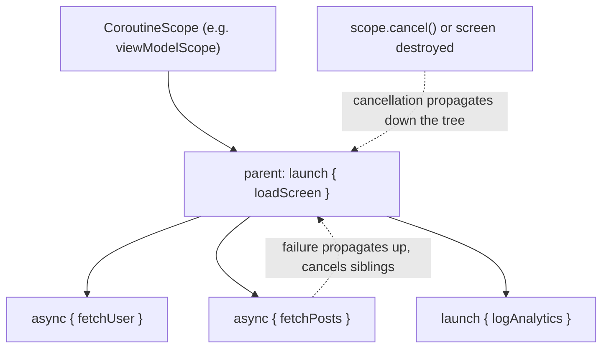
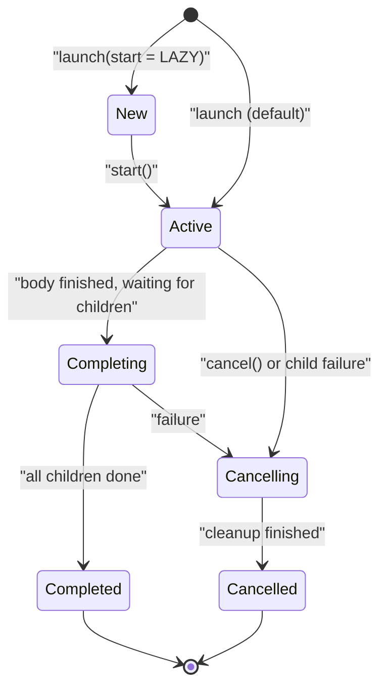

# Coroutines

Coroutines are Kotlin's answer to asynchronous programming: lightweight, suspendable computations that let you write non-blocking code in a sequential style — no callback pyramids, no manual thread juggling. This is the most heavily probed topic in Kotlin interviews (Android and backend alike), covering suspend functions, structured concurrency, dispatchers, cancellation, exception handling, `Flow`, and channels.

## Suspend Functions

A `suspend` function can pause without blocking its thread and resume later. The compiler transforms it (continuation-passing style) so the thread is freed at every suspension point:

```kotlin
suspend fun fetchUser(id: Long): User {
    val response = httpClient.get("/users/$id")   // suspends here; thread is released
    return response.body()                         // resumes here, possibly on another thread
}

// Sequential-looking composition of async work:
suspend fun loadProfile(id: Long): Profile {
    val user = fetchUser(id)              // await-like, no callbacks
    val posts = fetchPosts(user.id)
    return Profile(user, posts)
}
```

Rules: a suspend function can only be called from another suspend function or inside a coroutine. Under the hood, each suspend function receives a hidden `Continuation` parameter and compiles to a state machine — this is why millions of coroutines can run on a handful of threads (each suspended coroutine is just a small heap object, not a blocked thread).

## Coroutine Builders: launch, async, runBlocking

```kotlin
fun main() = runBlocking {                 // bridges blocking world -> coroutines (main, tests)
    // launch: fire-and-forget, returns a Job
    val job: Job = launch {
        delay(100)                          // suspending, non-blocking pause
        println("side effect done")
    }

    // async: concurrent computation with a result, returns Deferred<T>
    val userD: Deferred<User> = async { fetchUser(1) }
    val postsD: Deferred<List<Post>> = async { fetchPosts(1) }

    // Parallel decomposition: both requests run concurrently
    val profile = Profile(userD.await(), postsD.await())

    job.join()
}
```

Pitfall — sequential when you meant parallel:

```kotlin
// BAD: awaiting immediately serializes the calls (400ms total if each takes 200ms)
val user = async { fetchUser(1) }.await()
val posts = async { fetchPosts(1) }.await()

// GOOD: start both, then await (200ms total)
val userD = async { fetchUser(1) }
val postsD = async { fetchPosts(1) }
use(userD.await(), postsD.await())
```

Never use `runBlocking` inside a coroutine or on Android's main thread — it blocks the thread, defeating the whole point.

## Structured Concurrency

Structured concurrency means every coroutine lives inside a **scope**, forming a parent-child tree with three guarantees:

1. A parent does not complete until all children complete.
2. Cancelling a parent cancels the whole subtree.
3. A failed child (by default) cancels its parent and siblings — errors propagate, never vanish.



```kotlin
// coroutineScope: suspends until all children finish; fails together
suspend fun loadScreen(): Screen = coroutineScope {
    val user = async { fetchUser(1) }
    val posts = async { fetchPosts(1) }
    Screen(user.await(), posts.await())      // if fetchPosts throws, fetchUser is cancelled too
}

// supervisorScope: children fail independently
suspend fun loadDashboard(): Dashboard = supervisorScope {
    val critical = async { fetchAccount() }
    val optional = async { fetchRecommendations() }
    Dashboard(
        account = critical.await(),
        recs = runCatching { optional.await() }.getOrDefault(emptyList())
    )
}
```

The anti-pattern is `GlobalScope.launch { }`: it creates coroutines outside any lifecycle — they leak past screen/request boundaries, exceptions escape supervision, and nothing awaits them. Use a lifecycle-bound scope (`viewModelScope`, `lifecycleScope`, Ktor's request scope) or `coroutineScope { }`.

## CoroutineScope, CoroutineContext, and Dispatchers

Every coroutine runs in a `CoroutineContext` — an indexed set of elements: a `Job` (lifecycle), a `ContinuationInterceptor` (dispatcher), a `CoroutineName`, a `CoroutineExceptionHandler`. Children inherit the parent context, overriding pieces as needed:

```kotlin
val scope = CoroutineScope(SupervisorJob() + Dispatchers.Default + CoroutineName("worker"))

scope.launch(Dispatchers.IO) {            // overrides just the dispatcher
    val bytes = readFile()                 // IO pool: fine to make blocking calls
    withContext(Dispatchers.Default) {     // switch context for CPU work
        val parsed = parse(bytes)
        withContext(Dispatchers.Main) {    // Android: back to UI thread
            render(parsed)
        }
    }
}
```

| Dispatcher | Backed by | Use for |
|---|---|---|
| `Dispatchers.Default` | Shared pool, ~#CPU-cores threads | CPU-bound work: parsing, sorting, DiffUtil |
| `Dispatchers.IO` | Elastic pool (64+ threads) | Blocking I/O: files, JDBC, blocking HTTP |
| `Dispatchers.Main` | UI thread (Android/Swing/JavaFX) | Touching UI state |
| `Dispatchers.Unconfined` | Caller thread until first suspension | Rare; tests/advanced cases |

Note: suspending I/O (Ktor client, Retrofit suspend calls) does not need `Dispatchers.IO` — it never blocks. `IO` exists for wrapping *blocking* APIs.

## Job Lifecycle and Cancellation



Cancellation is **cooperative**: `job.cancel()` only sets a flag and makes suspension points throw `CancellationException`. Code that never suspends and never checks the flag cannot be cancelled:

```kotlin
// BAD: uncancellable busy loop
val job = scope.launch {
    while (true) { crunchNumbers() }        // never suspends -> cancel() has no effect
}

// GOOD: cooperative — check isActive or call a suspending function
val job2 = scope.launch {
    while (isActive) { crunchNumbers() }    // observes cancellation
    // or: ensureActive() / yield() inside the loop
}

// Cleanup on cancellation:
scope.launch {
    try {
        useResource()
    } finally {
        // If cleanup itself must suspend, wrap it:
        withContext(NonCancellable) { releaseSuspending() }
    }
}
```

Critical pitfall — swallowing `CancellationException`:

```kotlin
// BAD: catches CancellationException too, breaking cancellation propagation
try { fetchUser(1) } catch (e: Exception) { log(e) }

// GOOD: rethrow cancellation
try { fetchUser(1) } catch (e: CancellationException) { throw e } catch (e: Exception) { log(e) }
```

## Exception Handling in Coroutines

- **`launch`**: exceptions propagate up the Job tree immediately; an uncaught one cancels the parent (unless the parent is a `SupervisorJob`) and finally reaches the `CoroutineExceptionHandler` (or crashes/logs).
- **`async`**: exceptions are stored in the `Deferred` and rethrown at `await()` — but they *also* cancel the parent unless supervised.

```kotlin
val handler = CoroutineExceptionHandler { _, e -> log.error("Uncaught", e) }
val scope = CoroutineScope(SupervisorJob() + Dispatchers.Default + handler)

scope.launch {
    throw IllegalStateException("boom")     // caught by handler; siblings survive (SupervisorJob)
}

// try/catch works naturally around suspend calls:
scope.launch {
    val user = try { fetchUser(1) } catch (e: IOException) { User.GUEST }
}

// CoroutineExceptionHandler works only on ROOT coroutines built with launch —
// installing it on a child or on async does nothing.
```

`SupervisorJob`/`supervisorScope` change failure propagation: children's failures do not cancel the supervisor or siblings — the standard setup for UI scopes and server frameworks where one failed task must not kill the rest.

## Flow: Cold Asynchronous Streams

`Flow<T>` is a **cold** stream: the producer block runs anew for each collector, and nothing runs until `collect` is called — the stream equivalent of a suspend function.

```kotlin
fun tickerFlow(period: Long): Flow<Long> = flow {   // cold: builder body is just a recipe
    var i = 0L
    while (true) {
        emit(i++)                                   // suspending emission
        delay(period)
    }
}

suspend fun demo() {
    tickerFlow(100)
        .map { it * 2 }                             // intermediate operators are lazy
        .filter { it % 4 == 0L }
        .onEach { println("tick $it") }
        .take(3)                                    // completes the flow after 3 items
        .collect()                                  // terminal: NOW the code runs
}
```

Key operators and patterns:

```kotlin
flowOf(1, 2, 3)                        // fixed values
listOf("a", "b").asFlow()

usersFlow
    .flowOn(Dispatchers.IO)            // upstream runs on IO; collection stays on caller's context
    .catch { e -> emit(User.GUEST) }   // catches UPSTREAM exceptions only
    .onCompletion { println("done") }

// Combining flows:
combine(userFlow, settingsFlow) { u, s -> Screen(u, s) }   // latest of each
merge(clicksA, clicksB)                                    // interleave
queryFlow.flatMapLatest { q -> searchApi(q) }              // cancel previous search on new query
queryFlow.debounce(300)                                    // classic search-box combo

// Hot variants for state and events:
val state = MutableStateFlow(UiState.Loading)   // hot, always has a value, conflated
val events = MutableSharedFlow<UiEvent>()        // hot, configurable replay/buffering
```

**Cold vs hot**: a cold `Flow` runs per collector (like a suspend function you can call repeatedly); hot streams (`StateFlow`, `SharedFlow`, channels) exist and emit independently of collectors. `StateFlow` is the modern replacement for LiveData in Android ViewModels.

Backpressure is handled by suspension: a slow collector suspends the emitter by default; `buffer()`, `conflate()`, and `collectLatest` tune this.

## Channels vs Flows

A `Channel` is a hot, coroutine-safe queue for communicating between coroutines — closer to a `BlockingQueue` than a stream:

```kotlin
val channel = Channel<Int>(capacity = 10)

// Producer coroutine
scope.launch {
    repeat(5) { channel.send(it) }     // suspends when buffer is full
    channel.close()
}

// Consumer coroutine
scope.launch {
    for (x in channel) println(x)      // each value received by EXACTLY ONE consumer
}
```

| | Cold `Flow` | `Channel` |
|---|---|---|
| Temperature | Cold — runs per collector | Hot — values exist independently |
| Delivery | Every collector sees all emissions | Each value goes to exactly one receiver (fan-out) |
| Nature | Declarative stream with operators | Imperative communication primitive |
| Typical use | Data streams: DB updates, sensors, API pages | Work distribution, pipelines, one-shot events between coroutines |

Guideline: model *data* as `Flow` (or `StateFlow` for state), use `Channel` for coroutine-to-coroutine handoff and work queues. Many former channel use cases are now served by `SharedFlow`.

## Real-World Context

- **Android**: `viewModelScope` + `StateFlow` is the canonical modern architecture; `Room` and `DataStore` return Flows; `lifecycleScope.repeatOnLifecycle` collects safely across lifecycle states.
- **Backend**: Ktor handles each request in a coroutine — thousands of concurrent requests on few threads; Spring WebFlux supports suspend controller functions; JDBC calls get wrapped in `withContext(Dispatchers.IO)`.
- **Compared to threads**: a coroutine costs bytes of heap, not a ~1MB thread stack; suspension replaces blocking, so a 10k-connection chat server needs a dozen threads, not 10k.

## Best Practices

- **Never use `GlobalScope`**; tie coroutines to a lifecycle-bound scope, and prefer `coroutineScope { }` inside suspend functions over taking a scope parameter.
- **Make suspend functions main-safe**: a suspend function should be callable from any dispatcher — wrap blocking work in `withContext(Dispatchers.IO)` *inside* it, so callers never need to know.
- **Inject dispatchers** (`class Repo(private val io: CoroutineDispatcher = Dispatchers.IO)`) so tests can substitute a `TestDispatcher`.
- **Keep cancellation cooperative**: check `isActive`/call `ensureActive()` in loops, always rethrow `CancellationException`, and use `NonCancellable` only for cleanup.
- **Use `supervisorScope`/`SupervisorJob` at boundaries** (UI screens, request handlers) where one failure must not kill unrelated work; keep `coroutineScope` for all-or-nothing decomposition.
- **Expose `Flow`/`StateFlow`, not `Channel` or `MutableStateFlow`, from public APIs** (`asStateFlow()` to hide the mutable side).
- **Do not mix blocking and suspending**: no `runBlocking` inside coroutines, no `Thread.sleep` where `delay` belongs.

## Interview Questions

<details>
<summary>1. How do coroutines differ from threads, and why are they "lightweight"?</summary>

A thread is an OS resource with a large stack (~1MB) and kernel-scheduled context switches; blocking it wastes it. A coroutine is a compiler construct: suspend functions compile to state machines with continuations, so a suspended coroutine is just a small heap object — no stack held, no thread pinned. Many thousands of coroutines multiplex over a small thread pool, and "blocking" operations become suspensions that free the thread. Launching 100k coroutines is routine; 100k threads would exhaust memory.
</details>

<details>
<summary>2. What is structured concurrency and what problems does it solve?</summary>

Structured concurrency mandates that every coroutine belong to a scope, forming a parent-child tree where: parents await children, cancelling a parent cancels the subtree, and a child's failure propagates to the parent (cancelling siblings by default). It solves leaked "fire-and-forget" work outliving its purpose (e.g., network calls after a screen closes), lost exceptions, and forgotten awaits. Contrast with `GlobalScope`, which opts out of all three guarantees — the canonical anti-pattern.
</details>

<details>
<summary>3. <code>launch</code> vs <code>async</code> — including how each handles exceptions?</summary>

`launch` starts fire-and-forget work and returns a `Job`; an uncaught exception propagates up the job tree immediately and reaches the `CoroutineExceptionHandler` at the root (or crashes). `async` returns `Deferred<T>`; its exception is stored and rethrown at `await()` — but under a regular `Job` it *still* cancels the parent even if `await` is never called; only under a `SupervisorJob`/`supervisorScope` is it truly contained until awaited. Use `async` only when you need the result; never use `async` + immediate `await` as a substitute for `withContext`.
</details>

<details>
<summary>4. Why is coroutine cancellation cooperative, and how do you write cancellable code?</summary>

Cancellation is delivered by making suspension points throw `CancellationException` — there is no preemptive thread kill (which is unsafe, cf. deprecated `Thread.stop`). So code must reach a suspension point or check status: use `isActive`/`ensureActive()` in CPU loops, `yield()` periodically, and rely on stdlib suspend functions (`delay`, IO) being cancellation-aware. Always rethrow `CancellationException` from catch blocks, clean up in `finally`, and wrap suspending cleanup in `withContext(NonCancellable)`.
</details>

<details>
<summary>5. What does <code>withContext(Dispatchers.IO)</code> do, and when is it unnecessary?</summary>

It suspends the current coroutine and resumes its block on the IO dispatcher (an elastic thread pool sized for blocking calls), then returns to the original context — the standard way to make blocking I/O (JDBC, File, blocking HTTP) main-safe. It is unnecessary around *suspending* I/O (Retrofit suspend calls, Ktor client): those never block the thread, so dispatching them to IO adds overhead without benefit. Rule: `Dispatchers.IO` is for blocking APIs, `Dispatchers.Default` for CPU-heavy work.
</details>

<details>
<summary>6. What does it mean that Flow is "cold"? Compare with StateFlow and SharedFlow.</summary>

A cold flow's builder block does not run until collected, and runs *separately for each collector* — like a recipe re-executed per subscriber. `StateFlow` and `SharedFlow` are hot: they emit independently of collectors and are shared. `StateFlow` always holds a current value, conflates rapid updates, and only emits distinct values — ideal for UI state. `SharedFlow` has configurable replay/buffering and no initial value — ideal for one-off events. `shareIn`/`stateIn` convert cold flows to hot ones for sharing an upstream (e.g., one DB subscription serving many collectors).
</details>

<details>
<summary>7. When would you use a Channel instead of a Flow?</summary>

Use a `Channel` for hot, imperative communication between coroutines where each element must be consumed by exactly one receiver: work queues with multiple worker coroutines (fan-out), pipeline stages, or handing off events between concurrent producers/consumers. Use `Flow` for declarative data streams where each collector should see the (re-)produced stream, with operators, backpressure via suspension, and lifecycle tied to collection. Modern guidance: prefer Flow/SharedFlow for anything API-facing; channels are a lower-level building block.
</details>

<details>
<summary>8. What is the difference between <code>coroutineScope</code> and <code>supervisorScope</code>?</summary>

Both create a child scope and suspend until all children complete. In `coroutineScope`, one child's failure cancels the other children and the scope rethrows — all-or-nothing semantics for parallel decomposition of a single task. In `supervisorScope`, children fail independently — a failed child does not cancel siblings; each failure surfaces only through its own `await()`/handler. Use `coroutineScope` when partial results are useless; `supervisorScope` when independent subtasks should degrade gracefully (dashboards, request handlers spawning side tasks).
</details>
