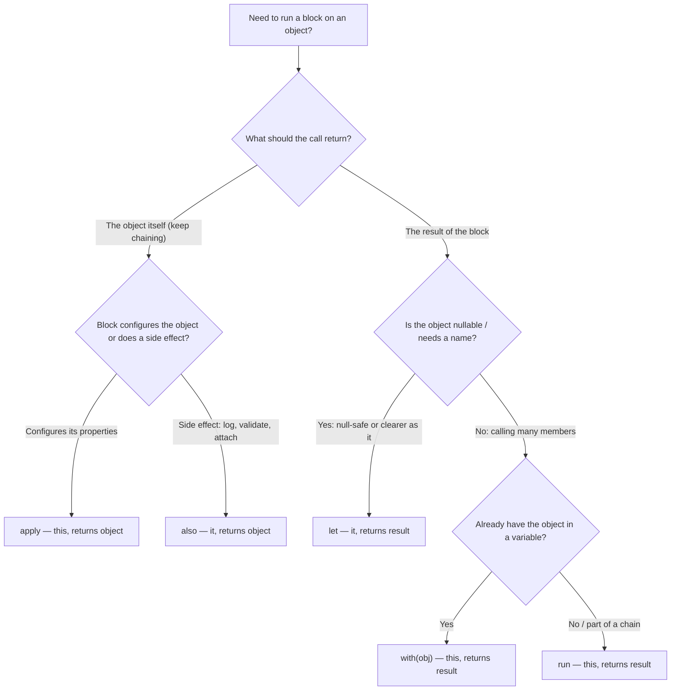

# Scope Functions and Idioms

Kotlin's five scope functions — `let`, `run`, `with`, `apply`, `also` — execute a block in the context of an object, and choosing the right one is a rite-of-passage interview question. This chapter gives you a decision framework for them, then tours the idioms that make code read as "written by a Kotlin developer": `when` expressions, smart casts, ranges, and operator overloading.

## The Five Scope Functions

Two axes distinguish them: how the context object is referenced inside the block (`this` vs `it`), and what the function returns (the lambda result vs the object itself).

| Function | Object is | Returns | Extension? | Typical use |
|---|---|---|---|---|
| `let` | `it` | Lambda result | Yes | Transform a value; null-safe execution via `?.let` |
| `run` | `this` | Lambda result | Yes | Configure + compute a result |
| `with` | `this` | Lambda result | No (takes arg) | Group calls on an object you already have |
| `apply` | `this` | **The object** | Yes | Object configuration/initialization |
| `also` | `it` | **The object** | Yes | Side effects (logging, validation) in a chain |



### Each in Action

```kotlin
// let — transform, and the null-safe workhorse:
val len: Int? = nickname?.let { it.trim().length }

// run — configure and compute:
val port: Int = config.run {
    validate()
    portOrDefault(8080)
}

// with — "with this object, do..." (not for nullables):
val summary = with(order) {
    "Order $id: ${items.size} items, total $total"
}

// apply — build/configure, return the object:
val request = HttpRequest().apply {
    url = "https://api.example.com"
    method = "POST"
    header("Accept", "application/json")
}

// also — side effect without breaking the chain:
val users = loadUsers()
    .also { log.info("loaded ${it.size} users") }
    .filter { it.active }
```

### Pitfalls

```kotlin
// PITFALL 1: apply returns the OBJECT, not your last expression
val size = mutableListOf(1, 2).apply { add(3) }   // size is the LIST, not 3!
val size2 = mutableListOf(1, 2).run { add(3); this.size }  // 3 — run returns the block result

// PITFALL 2: shadowed `this` in nested apply/run blocks — which `this` is it?
outer.apply {
    inner.apply {
        // name resolution silently prefers the innermost receiver — subtle bugs.
        // Prefer let/also (explicit `it`) or named lambda params when nesting.
    }
}

// PITFALL 3: scope-function soup — sometimes a plain statement is clearest
// BAD:
user?.let { u -> u.takeIf { it.active }?.also { grant(it) } }
// GOOD:
if (user != null && user.active) grant(user)
```

## when Expressions

`when` is Kotlin's pattern-friendly replacement for `switch` — and it is an expression:

```kotlin
fun describe(x: Any): String = when (x) {
    0, 1              -> "zero or one"          // multiple constants
    in 2..9           -> "small"                // range check
    is String         -> "string of ${x.length}" // type check + smart cast
    !is Number        -> "not a number"
    else              -> "big number"
}

// Subject-less when replaces if/else-if chains:
val fee = when {
    amount > 10_000       -> 0
    customer.isPremium    -> 50
    else                  -> 100
}

// Capture the subject (Kotlin 1.4+):
val status = when (val code = response.code()) {
    200  -> "OK"
    else -> "Unexpected: $code"
}
```

With sealed types and enums, an exhaustive `when` (no `else`) makes the compiler flag unhandled cases — see [04-Classes-and-Objects.md](04-Classes-and-Objects.md).

## Smart Casts

After a type or null check, the compiler narrows the type automatically — no explicit casting:

```kotlin
fun total(value: Any): Int = when (value) {
    is Int        -> value + 1              // value is Int here
    is List<*>    -> value.size             // value is List<*> here
    is String     -> value.toIntOrNull() ?: 0
    else          -> 0
}

// Works with && and ||:
if (obj is String && obj.isNotEmpty()) println(obj.first())

// The unsafe cast `as` throws; `as?` returns null instead:
val s: String? = obj as? String
```

Remember the limits (from [02-Null-Safety.md](02-Null-Safety.md)): smart casts need stability — they do not apply to mutable properties or custom getters; snapshot into a local `val` first.

## Ranges and Progressions

```kotlin
for (i in 1..5) print(i)             // 12345 (inclusive)
for (i in 1 until 5) print(i)        // 1234  (end-exclusive; also 1..<5 in Kotlin 1.8+)
for (i in 10 downTo 0 step 2) { }    // 10, 8, ..., 0

val valid = score in 0..100          // contains check
val letter = ch in 'a'..'z'
val recent = date in monthStart..monthEnd   // any Comparable works

// Ranges + when is a classic:
fun gradeOf(score: Int) = when (score) {
    in 90..100 -> "A"
    in 80..89  -> "B"
    in 70..79  -> "C"
    else       -> "F"
}

// Iterate collections idiomatically:
for ((index, item) in list.withIndex()) println("$index: $item")
repeat(3) { println("hi #$it") }
```

## Operator Overloading

Kotlin maps a fixed set of operators to named functions marked `operator` — no arbitrary operators, so code stays predictable:

```kotlin
data class Vec(val x: Double, val y: Double) {
    operator fun plus(o: Vec) = Vec(x + o.x, y + o.y)        // a + b
    operator fun times(k: Double) = Vec(x * k, y * k)         // a * 2.0
    operator fun unaryMinus() = Vec(-x, -y)                   // -a
}

class Matrix(private val cells: Array<DoubleArray>) {
    operator fun get(r: Int, c: Int) = cells[r][c]            // m[1, 2]
    operator fun set(r: Int, c: Int, v: Double) { cells[r][c] = v }
    operator fun contains(v: Double) = cells.any { row -> v in row }  // v in m
}

// invoke makes objects callable — used by DSLs and use-case classes:
class GetUser(private val repo: UserRepo) {
    operator fun invoke(id: Long): User = repo.find(id)
}
val getUser = GetUser(repo)
val u = getUser(42)                    // reads like a function

// Conventions you already use daily:
// a == b  -> equals()      a > b -> compareTo()      a in c -> contains()
// c[i]    -> get/set       a..b  -> rangeTo()        a += b -> plusAssign() or plus()
```

Pitfall: overload only where the operator's meaning is conventional (math types, collections, DSLs). `orderA + orderB` meaning "merge orders" will confuse every reader; a named function `merge` is better.

## A Bundle of Small Idioms

```kotlin
// Single-expression + Elvis + require: compact validation
fun findUser(id: Long): User =
    repo.findById(id) ?: throw NoSuchElementException("user $id")

// takeIf / takeUnless: inline filtering of a single value
val validEmail = input.takeIf { it.contains("@") }          // String? — null if invalid

// String helpers over manual checks
val title = rawTitle.ifBlank { "Untitled" }

// Triple-quoted regex without escape soup
val uuid = Regex("""[0-9a-f]{8}-[0-9a-f]{4}-[0-9a-f]{4}-[0-9a-f]{4}-[0-9a-f]{12}""")

// use() for AutoCloseable — Kotlin's try-with-resources
FileInputStream("data.bin").use { stream -> process(stream) }

// buildString for accumulation
val csv = buildString {
    append("id,name\n")
    users.forEach { append("${it.id},${it.name}\n") }
}
```

## Real-World Context

- **Android**: `apply` configures `Intent`s/`Bundle`s/views; `viewBinding.apply { ... }` groups UI updates; Compose leans on trailing lambdas and receivers everywhere.
- **Backend**: Ktor/Spring bean and route configuration is `apply`/lambda-with-receiver DSLs; `also` is common for structured logging in service chains.
- **Code review culture**: knowing *when not to use* scope functions is as valued as knowing them — reviewers routinely push back on nested `let` chains.

## Best Practices

- **Pick scope functions by return value first** (object → `apply`/`also`; result → `let`/`run`/`with`), then by readability of `this` vs `it`.
- **Avoid nesting scope functions that share `this`** (`apply` inside `apply`/`run`) — shadowed receivers cause silent wrong-target calls; prefer `it`-based functions or named parameters when nesting.
- **`?.let` for one nullable, plain `if` for several** — do not build `let` pyramids.
- **Use exhaustive `when` over sealed/enum subjects without `else`** so new cases fail compilation.
- **Overload operators only with conventional meaning**; reach for `invoke` to make use-case/command objects callable.
- **Prefer `use { }`** for every `Closeable`, `takeIf` for single-value filters, and `buildString`/`buildList` over mutable accumulation in scope.

## Interview Questions

<details>
<summary>1. Summarize the differences between let, run, with, apply, and also.</summary>

Two axes: context reference and return value. `let` (object as `it`) and `run` (object as `this`) return the lambda result — use for transformation/computation; `with(obj) { }` is `run` in non-extension form for an object you already hold. `apply` (as `this`) and `also` (as `it`) return the object itself — `apply` for configuring properties, `also` for side effects in a chain. Choose by desired return value first, then by whether `this` (member-heavy configuration) or `it` (needs a name, passing to functions) reads better.
</details>

<details>
<summary>2. Why does <code>val x = list.apply { add(1) }.size</code> work but people still get <code>apply</code> return values wrong?</summary>

`apply` always returns the receiver object, ignoring the lambda's last expression. So `list.apply { add(1) }` is the list (and `.size` afterwards works), but `val n = list.apply { size }` is the *list*, not its size — a common bug when people expect `run` semantics. Rule: if you want the block's result, use `run`/`let`/`with`; if you want the object to keep chaining, use `apply`/`also`.
</details>

<details>
<summary>3. What is the danger of nesting <code>apply</code>/<code>run</code> blocks?</summary>

Both bind the receiver to `this`, and inner receivers shadow outer ones. An unqualified call inside nested blocks resolves to the innermost receiver that has a matching member — which may silently be the wrong object, especially after refactors add a same-named member. Mitigations: avoid nesting `this`-based scope functions; use `also`/`let` so each object has an explicit name (`it` or a named parameter); or qualify with labeled `this@outer`.
</details>

<details>
<summary>4. How is <code>when</code> more powerful than Java's <code>switch</code>?</summary>

`when` is an expression that returns a value; branches match constants, multiple values, ranges (`in 1..10`), type checks (`is String` with smart cast), and arbitrary booleans in subject-less form; no fall-through exists; the subject can be captured (`when (val x = f())`); and over sealed/enum subjects it is exhaustively checked without `else`, turning unhandled cases into compile errors. Java's modern switch expressions close some of this gap, but Kotlin's smart casts and range/condition branches remain more flexible.
</details>

<details>
<summary>5. How does operator overloading work in Kotlin, and how does it avoid C++-style abuse?</summary>

An operator maps to a conventionally named member/extension function marked with the `operator` modifier: `+` to `plus`, `[]` to `get`/`set`, `in` to `contains`, `()` to `invoke`, comparison to `compareTo`, etc. Only this fixed set is overloadable — you cannot invent new operators or change precedence — so expressions stay parseable and predictable. Discipline still matters: overload only where the symbol's conventional meaning holds (vectors, money, matrices, DSL indexing).
</details>

<details>
<summary>6. What are <code>takeIf</code> and <code>takeUnless</code>, and when are they better than <code>if</code>?</summary>

`x.takeIf(predicate)` returns `x` when the predicate holds, else `null` (`takeUnless` inverts it). They shine mid-chain, converting a condition into nullability that flows into `?.let`/`?:`: `input.takeIf { it.isNotBlank() }?.let(::process) ?: defaultResult`. For a standalone condition with two branches, a plain `if` is clearer — `takeIf` chains that grow beyond one step usually should be rewritten.
</details>

<details>
<summary>7. Show an idiomatic Kotlin rewrite of a Java-style null-and-type-check block.</summary>

Java style: `if (obj != null && obj instanceof String) { String s = (String) obj; if (!s.isEmpty()) return s.toUpperCase(); } return "";`. Idiomatic Kotlin: `return (obj as? String)?.takeIf { it.isNotEmpty() }?.uppercase() ?: ""` — the safe cast `as?` folds the type check and cast into a nullable value, `takeIf` folds the condition into nullability, and Elvis supplies the default. Alternatively, a `when` with `is String` and smart cast achieves the same with more room for extra branches.
</details>
