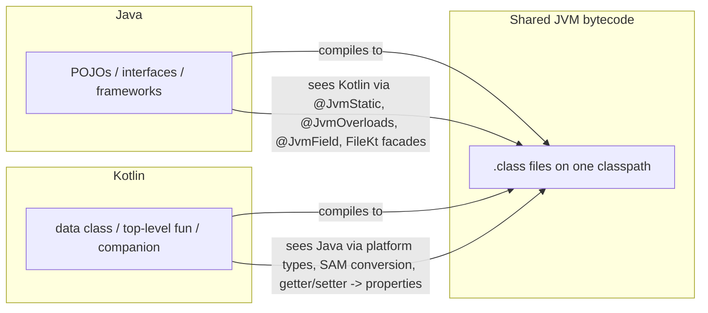
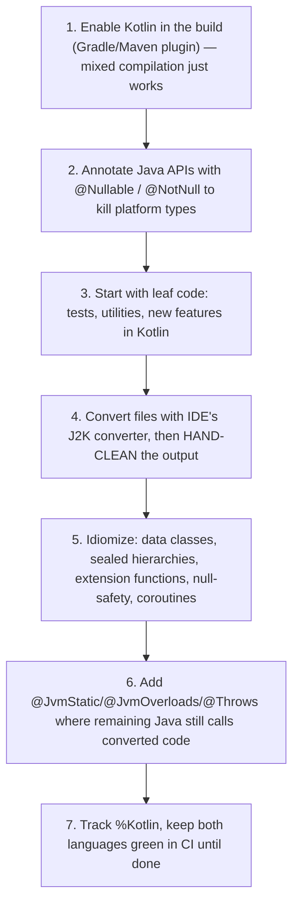

# Kotlin vs Java Interop

Kotlin's seamless two-way interoperability with Java is the reason it could be adopted incrementally inside million-line codebases — Kotlin calls Java naturally, and Java can call Kotlin with a few annotations smoothing the edges. This chapter covers both directions, the `@Jvm*` annotation family, SAM conversions, checked exceptions at the boundary, and a practical migration strategy.



## Calling Java from Kotlin

Mostly frictionless — Kotlin adapts Java conventions automatically:

```kotlin
// Java getters/setters appear as Kotlin properties:
val cal = java.util.Calendar.getInstance()
println(cal.timeZone.id)          // calls getTimeZone().getID()
cal.timeZone = TimeZone.getDefault()   // calls setTimeZone(...)

// Keywords used as Java identifiers get backticks:
val type = jsonNode.`is`          // Java method named is()

// Java collections map onto Kotlin's (platform) collection types:
val list: MutableList<String> = javaService.getNames()  // java.util.List is both List and MutableList
```

The two friction points:

1. **Platform types** — un-annotated Java values arrive as `String!`: the compiler cannot verify nullability, so NPEs can sneak in (see [02-Null-Safety.md](02-Null-Safety.md)). Fix by annotating Java with `@Nullable`/`@NotNull`.
2. **Java generics arrive with wildcards**: `List<? extends T>` maps to `List<out T>`; raw types become star projections.

## Calling Kotlin from Java

Kotlin features without direct Java equivalents compile to conventions Java can use — and the `@Jvm*` annotations make the Java-facing API idiomatic.

### Top-Level Functions: `@JvmName`

```kotlin
// File: StringUtils.kt
@file:JvmName("StringUtils")          // Java sees class StringUtils, not StringUtilsKt
package com.example

fun capitalizeWords(s: String): String = /* ... */ ""
```

```java
// Java:
String result = StringUtils.capitalizeWords("hello world");
```

### Companion Objects: `@JvmStatic` and `@JvmField`

```kotlin
class Analytics private constructor() {
    companion object {
        @JvmStatic fun track(event: String) { /* ... */ }   // real static method for Java
        @JvmField val MAX_BATCH = 100                        // real static field, no getter
        const val VERSION = "1.2"                            // const is already a static constant
        fun flush() { }                                      // NOT annotated
    }
}
```

```java
Analytics.track("click");              // thanks to @JvmStatic
int max = Analytics.MAX_BATCH;         // thanks to @JvmField
Analytics.Companion.flush();           // without annotations: go through Companion
```

### Default Arguments: `@JvmOverloads`

Java has no default arguments — without help, Java callers must pass every parameter:

```kotlin
class Poller @JvmOverloads constructor(
    val url: String,
    val intervalMs: Long = 5_000,
    val retries: Int = 3
)
// Generates constructors: (String), (String, long), (String, long, int) for Java
```

Note `@JvmOverloads` generates overloads dropping parameters **from the right only** — it cannot express "default for the middle parameter."

### Properties, Nullability, and Exceptions

```kotlin
class Config {
    var timeout: Int = 30           // Java sees getTimeout()/setTimeout()
    val isDebug: Boolean = false    // is-prefixed: Java sees isDebug() (no getIsDebug)
}
```

Kotlin non-null parameters get runtime `checkNotNullParameter` guards, so Java passing null fails fast with a clear message.

## SAM Conversions

A lambda can implement any Java interface with a **S**ingle **A**bstract **M**ethod:

```kotlin
// Java: public interface Runnable { void run(); }
val t = Thread { println("running") }               // lambda -> Runnable

executor.submit { processBatch() }                   // lambda -> Callable/Runnable

button.addActionListener { e -> println(e.id) }      // Swing listener
```

For **Kotlin** interfaces, SAM conversion requires declaring them `fun interface`:

```kotlin
fun interface Validator {
    fun validate(input: String): Boolean
}
val v = Validator { it.length > 3 }     // OK because of `fun interface`

// A plain Kotlin interface would need: object : Validator { override fun ... }
// Rationale: in pure Kotlin you would normally just use a function type (String) -> Boolean.
```

Pitfall: passing the "same" lambda twice creates two objects — listener removal needs a stored reference:

```kotlin
// BAD: this removes NOTHING — a new listener object is created for the removal call
bus.register { onEvent(it) }
bus.unregister { onEvent(it) }

// GOOD: keep one reference
val listener = Listener { onEvent(it) }
bus.register(listener)
bus.unregister(listener)
```

## Checked Exceptions Across the Boundary

Kotlin has **no checked exceptions** — you never must catch or declare anything. Two consequences at the boundary:

```kotlin
// Kotlin calling Java: free to ignore Java's `throws IOException`
val bytes = Files.readAllBytes(path)     // no try/catch required (but the exception still exists!)
```

```kotlin
// Java calling Kotlin: Kotlin methods declare no `throws`, so javac will refuse
// `try { ktFun(); } catch (IOException e) {}` as "exception never thrown".
// Fix: @Throws generates the throws clause in bytecode.
@Throws(IOException::class)
fun loadConfig(path: String): Config { /* may throw IOException */ }
```

Rule of thumb: put `@Throws` on any public Kotlin API that Java callers might need to catch specific checked exceptions from. And remember: Kotlin not *forcing* you to handle `IOException` does not make it disappear — deliberate exception handling is still your job.

## Migrating a Java Codebase to Kotlin

The strategy used by Google, Square, Meta, and countless enterprises — incremental, file by file:



Practical notes:

- **Order matters less than annotations**: nullability annotations on the remaining Java produce the biggest safety wins for already-converted Kotlin.
- **J2K output is a starting point, not an end state** — it produces working but Java-flavored Kotlin (`!!`, `var`, open classes). Budget cleanup time.
- **Watch the semantics that differ**: Kotlin classes/methods are final by default (breaks Mockito/Spring proxying — use the `kotlin-spring`/`all-open` compiler plugins), data-class `equals` vs Java identity assumptions, and `internal` visibility mangling.
- **Frameworks**: Spring officially supports Kotlin; Lombok-heavy Java maps naturally to data classes; Jackson needs `jackson-module-kotlin` for constructor-based deserialization.

## Real-World Context

- **Android**: virtually every large app went through this migration; AndroidX itself is annotated for null-safety precisely to give Kotlin real types.
- **Backend**: Spring Boot Kotlin services routinely depend on Java libraries (JDBC drivers, Kafka clients, AWS SDK) — platform-type discipline and `Dispatchers.IO` wrapping are daily interop concerns.
- **Libraries**: if you publish a Kotlin library consumed by Java teams, the `@Jvm*` annotations are the difference between a pleasant and a hostile Java API.

## Best Practices

- **Annotate Java nullability first** (`@Nullable`/`@NotNull`, JSR-305 or JetBrains annotations) — it upgrades platform types to checked types across the whole boundary.
- **Design Java-facing Kotlin APIs deliberately**: `@file:JvmName` for facades, `@JvmStatic` for companion members, `@JvmOverloads` where defaults matter, `@Throws` for checked exceptions.
- **Treat every un-annotated Java return value as nullable** unless documented otherwise.
- **Use `fun interface` for Kotlin SAM types** intended for lambda use; prefer plain function types inside pure Kotlin.
- **In migrations, convert tests early** — they validate behavior across the boundary and teach the team idioms with low risk.
- **Enable `all-open`/`kotlin-spring` and `no-arg` compiler plugins** when frameworks need proxies or default constructors, instead of hand-opening classes.
- **Never let J2K output merge unreviewed** — idiomize before shipping, or the codebase becomes "Java with Kotlin syntax."

## Interview Questions

<details>
<summary>1. How does Java see a Kotlin top-level function, and how do you control it?</summary>

Top-level functions compile to `public static` methods on a facade class named after the file (`Utils.kt` → `UtilsKt`), so Java calls `UtilsKt.doThing()`. `@file:JvmName("Utils")` renames the facade; `@JvmMultifileClass` can merge several files into one facade. This exists because the JVM has no free-standing functions — everything must live on a class.
</details>

<details>
<summary>2. What do @JvmStatic, @JvmField, and @JvmOverloads each do?</summary>

`@JvmStatic` on companion/object members generates a real static method on the enclosing class (otherwise Java must call `ClassName.Companion.foo()`). `@JvmField` exposes a property as a public field without getter/setter (needed for constants, frameworks reading fields, or Android Parcelable CREATOR). `@JvmOverloads` on a function/constructor with default arguments generates the telescoping overloads Java needs, dropping defaulted parameters from the right. All three exist because Java lacks companions, properties, and default arguments.
</details>

<details>
<summary>3. What is a SAM conversion, and why do Kotlin interfaces need <code>fun interface</code> for it?</summary>

SAM (Single Abstract Method) conversion lets a lambda stand in for an interface with one abstract method — Kotlin applies it automatically to *Java* interfaces (`Thread { }`, listeners, `Runnable`). For Kotlin-defined interfaces, conversion only works when declared `fun interface`: the designers reasoned that pure Kotlin code should prefer function types (`(String) -> Boolean`), so implicit SAM for all interfaces would add ambiguity; `fun interface` is the explicit opt-in that also enforces exactly one abstract member.
</details>

<details>
<summary>4. How do checked exceptions behave across the Kotlin/Java boundary?</summary>

Kotlin has no checked exceptions: calling a Java method declaring `throws IOException` requires no try/catch in Kotlin. In the other direction, Kotlin functions compile without `throws` clauses, so a Java caller writing `catch (IOException e)` around a Kotlin call gets a *compile error* ("exception is never thrown"). Annotating the Kotlin function with `@Throws(IOException::class)` adds the clause to the bytecode, letting Java catch and declare it properly. The design bet: checked exceptions caused swallowed-exception boilerplate without improving reliability at scale.
</details>

<details>
<summary>5. Outline a strategy for migrating a large Java service to Kotlin.</summary>

(1) Add the Kotlin build plugin — mixed compilation lets both languages coexist per module. (2) Annotate Java APIs with nullability annotations to eliminate platform types. (3) Write new code and tests in Kotlin; convert leaf utilities first, core domain later. (4) Use the IDE's J2K converter per file, then hand-idiomize (remove `!!`, introduce data/sealed classes, val-first). (5) Add `@JvmStatic`/`@JvmOverloads`/`@Throws` where remaining Java consumes converted code. (6) Enable `all-open`/`no-arg` plugins for framework compatibility (Spring proxies, JPA). (7) Track Kotlin percentage and keep CI green throughout — the codebase ships continuously during migration.
</details>

<details>
<summary>6. What surprises await a Java developer around Kotlin's final-by-default classes when using Spring or Mockito?</summary>

Spring AOP/`@Transactional`/`@Configuration` rely on subclass proxies, and Mockito mocks by subclassing — both fail on final classes/methods. Kotlin classes and members are final unless marked `open`. Fixes: the `kotlin-spring` compiler plugin (auto-opens `@Component`/`@Service`-annotated classes), the general `all-open` plugin with chosen annotations, and `mockito-inline`/MockK for mocking final classes. JPA also needs the `no-arg` plugin to synthesize default constructors for entities.
</details>

<details>
<summary>7. How are Kotlin's read-only collections represented to Java, and what risk does that create?</summary>

At bytecode level, Kotlin's `List` *is* `java.util.List` — the read-only/mutable split exists only in Kotlin's type system. Java code receiving a Kotlin `List` sees a full `java.util.List` API and can call `add()`; depending on the backing implementation it either mutates the "read-only" collection or throws `UnsupportedOperationException` at runtime. Defenses: return defensive copies or `Collections.unmodifiableList`-wrapped instances (`java.util.List.copyOf`) at Java-facing boundaries, and document mutability expectations.
</details>
