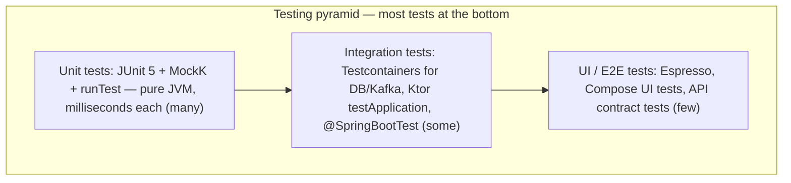

# Testing in Kotlin

Kotlin testing builds on the JVM's mature ecosystem (JUnit 5) while adding Kotlin-native tools: MockK for mocking with full support for final classes and coroutines, kotest for expressive assertions and property testing, and `kotlinx-coroutines-test` for deterministic coroutine tests. Interviewers use testing questions to gauge engineering maturity — knowing *how* to make suspend functions and time-based code testable matters as much as syntax.

## JUnit 5 with Kotlin

JUnit 5 works out of the box; Kotlin adds backtick test names, `lateinit` fixtures, and data classes for expected values:

```kotlin
class PriceCalculatorTest {

    private lateinit var calculator: PriceCalculator

    @BeforeEach
    fun setUp() {
        calculator = PriceCalculator(taxRate = 0.16)
    }

    @Test
    fun `applies tax to net price`() {                    // backticks: readable test names
        val result = calculator.gross(netCents = 10_000)
        assertEquals(11_600, result)
    }

    @Test
    fun `rejects negative prices`() {
        val ex = assertThrows<IllegalArgumentException> {  // Kotlin-friendly reified variant
            calculator.gross(netCents = -1)
        }
        assertTrue("negative" in ex.message.orEmpty())
    }

    @ParameterizedTest
    @CsvSource("0,0", "100,116", "250,290")
    fun `computes gross for various inputs`(net: Int, expected: Int) {
        assertEquals(expected, calculator.gross(net))
    }
}
```

Useful Kotlin specifics:

- `assertThrows<T> { }` (from `kotlin-test-junit5` / JUnit's Kotlin support) uses reified generics — no `Exception.class` tokens.
- Data classes make assertion failures readable: `assertEquals(Money(500, "KES"), actual)` prints both values meaningfully thanks to generated `toString`/`equals`.
- To use `@TestInstance(Lifecycle.PER_CLASS)` you can replace `companion object @JvmStatic @BeforeAll` ceremony with plain instance methods.

## MockK

MockK is the idiomatic Kotlin mocking library — it handles final classes (Kotlin's default!), objects, extension functions, and coroutines, with a DSL that reads naturally:

```kotlin
class OrderServiceTest {

    private val repo = mockk<OrderRepository>()
    private val notifier = mockk<Notifier>(relaxed = true)   // relaxed: unstubbed calls return defaults
    private val service = OrderService(repo, notifier)

    @Test
    fun `places order and notifies customer`() {
        // Arrange
        every { repo.save(any()) } answers { firstArg() }     // echo back the argument
        coEvery { repo.findCustomer(42) } returns Customer(42, "Asha")  // coEvery for suspend funs

        // Act
        val order = runBlocking { service.placeOrder(customerId = 42, amount = 500) }

        // Assert — behavior verification
        verify(exactly = 1) { notifier.send(match { "Asha" in it }) }
        coVerify { repo.findCustomer(42) }
        confirmVerified(notifier)

        // Argument capture
        val slot = slot<Order>()
        verify { repo.save(capture(slot)) }
        assertEquals(500, slot.captured.amount)
    }
}
```

Key MockK features to name-drop accurately:

- `every`/`verify` for regular functions, `coEvery`/`coVerify` for `suspend` functions.
- `relaxed = true` returns sensible defaults for unstubbed calls — convenient, but overuse hides missing stubs; prefer strict mocks for core collaborators.
- `mockkObject`, `mockkStatic`, `mockkConstructor` can mock Kotlin `object`s, statics/extension functions, and constructors — powerful, but needing them often signals a design that wants dependency injection instead.
- `spyk` wraps a real object, letting you stub selectively.

Pitfall: with Mockito, Kotlin's final-by-default classes fail to mock (needs `mockito-inline`), and `any()` returns null causing NPEs on non-null parameters (needs `mockito-kotlin`). MockK avoids the entire class of problems — a good interview talking point.

## kotest

kotest provides expressive matchers, multiple spec styles, and property-based testing. Many teams use just its assertion library alongside JUnit:

```kotlin
// Assertions (usable with any runner):
result shouldBe 42
name shouldStartWith "Ms"
list shouldContainExactly listOf(1, 2, 3)
response.shouldBeInstanceOf<ApiResult.Success<User>>()
shouldThrow<IllegalStateException> { service.close() }

// A spec style (StringSpec):
class StackTest : StringSpec({
    "pop returns last pushed element" {
        val s = ArrayDeque<Int>()
        s.addLast(1); s.addLast(2)
        s.removeLast() shouldBe 2
    }

    "empty stack has size zero" {
        ArrayDeque<Int>().size shouldBe 0
    }
})

// Property-based testing: the framework generates hundreds of cases
class ReverseProps : StringSpec({
    "reversing twice yields the original" {
        checkAll<List<Int>> { list ->
            list.reversed().reversed() shouldBe list
        }
    }
})
```

Property-based testing is a strong differentiator in interviews: instead of hand-picking examples, you state an invariant and let the framework hunt for counterexamples (with automatic shrinking to a minimal failing case).

## Testing Coroutines with runTest

`kotlinx-coroutines-test` provides `runTest`, which runs coroutines on a `TestDispatcher` with **virtual time** — `delay`s complete instantly and deterministically:

```kotlin
class PollingRepositoryTest {

    @Test
    fun `retries three times with backoff`() = runTest {     // virtual time!
        var attempts = 0
        val repo = PollingRepository(
            fetch = { attempts++; if (attempts < 3) throw IOException() else "data" },
            dispatcher = StandardTestDispatcher(testScheduler)  // inject the test dispatcher
        )

        val result = repo.fetchWithRetry(delayMs = 1_000)

        assertEquals("data", result)
        assertEquals(3, attempts)
        // Total virtual time advanced ~2000ms, but the test ran in milliseconds:
        assertEquals(2_000, currentTime)
    }

    @Test
    fun `emits loading then success`() = runTest {
        val vm = ProfileViewModel(FakeUserRepo(), StandardTestDispatcher(testScheduler))

        val states = mutableListOf<UiState>()
        val job = launch { vm.state.toList(states) }   // collect concurrently

        vm.load(userId = 1)
        advanceUntilIdle()                              // run all pending coroutines

        assertEquals(listOf(UiState.Loading, UiState.Success("Asha")), states)
        job.cancel()
    }
}
```

The essential concepts:

- **`runTest { }`** replaces `runBlocking` in tests: it skips `delay`s via virtual time and fails on uncaught exceptions and leaked coroutines.
- **`StandardTestDispatcher`** queues coroutines until the scheduler runs them (`advanceUntilIdle`, `advanceTimeBy`, `runCurrent`); **`UnconfinedTestDispatcher`** runs them eagerly — simpler for straight-line tests, less realistic for ordering.
- **Dispatcher injection is the enabling design**: production code must accept a `CoroutineDispatcher` (or `CoroutineContext`) instead of hardcoding `Dispatchers.IO`, or the test cannot control execution. On Android, `Dispatchers.setMain(testDispatcher)` swaps the main dispatcher.
- For `Flow` testing, collecting into a list under `runTest` works; the **Turbine** library (`flow.test { awaitItem() }`) is the popular ergonomic alternative.

```kotlin
// Production code designed for testability:
class ProfileViewModel(
    private val repo: UserRepo,
    private val dispatcher: CoroutineDispatcher = Dispatchers.Default   // injectable!
) { /* ... */ }
```

## The Test Pyramid in a Kotlin Project



- **Server-side**: Ktor's `testApplication { }` spins the whole HTTP pipeline in-process; Spring Boot tests use `@WebMvcTest`/`@SpringBootTest` with MockK via `springmockk`. Testcontainers gives real PostgreSQL/Kafka in Docker for integration layers.
- **Android**: plain JVM unit tests for ViewModels/use cases (fast, the bulk), Robolectric for framework-dependent classes, Espresso/Compose testing for UI.

## Best Practices

- **Structure every test as Arrange-Act-Assert** (or Given-When-Then), one behavior per test, named in backticks as a readable sentence.
- **Inject dispatchers and clocks**; never hardcode `Dispatchers.IO` or `System.currentTimeMillis()` in logic you intend to test.
- **Prefer fakes for owned interfaces, mocks for verification of interactions** — a hand-written `FakeUserRepo` is often clearer and faster than a web of `every` stubs.
- **Avoid `relaxed = true` for core collaborators** — it silently returns defaults and hides missing stubs.
- **Use `runTest` (never `runBlocking` + real `delay`) for coroutine tests**; assert with virtual time (`advanceTimeBy`, `currentTime`) to keep tests fast and deterministic.
- **Reserve `mockkStatic`/`mockkObject` for legacy edges** — needing them in new code signals missing dependency injection.
- **Add property-based tests for algorithmic/parsing code** — invariants catch edge cases example-based tests miss.
- **Keep unit tests dependency-free and milliseconds-fast**; push Docker/network into a separate, smaller integration suite.

## Interview Questions

<details>
<summary>1. Why do Kotlin projects commonly choose MockK over Mockito?</summary>

Kotlin classes and functions are final by default, which vanilla Mockito cannot mock (requiring `mockito-inline`); Mockito's `any()` matchers return null, tripping Kotlin's non-null parameter checks (requiring `mockito-kotlin` wrappers); and Mockito has no native concept of suspend functions. MockK is Kotlin-first: it mocks final classes out of the box, provides `coEvery`/`coVerify` for suspend functions, supports mocking `object`s, extension and top-level functions, and its DSL (`every { } returns`) reads idiomatically.
</details>

<details>
<summary>2. What does <code>runTest</code> do, and how does virtual time work?</summary>

`runTest` runs a coroutine test body on a `TestScheduler` with virtual time: `delay(5_000)` does not sleep — it registers a task at virtual t+5000 and the scheduler advances the clock instantly, so time-dependent logic (retries, debounce, timeouts) is tested deterministically in milliseconds. It also fails tests on uncaught coroutine exceptions and on coroutines still running at test end (leak detection). You control execution explicitly with `advanceTimeBy`, `advanceUntilIdle`, `runCurrent`, and read the clock via `currentTime`.
</details>

<details>
<summary>3. Why must production code inject its dispatchers, and what happens if it hardcodes <code>Dispatchers.IO</code>?</summary>

`runTest`'s virtual time and deterministic ordering only apply to coroutines running on its `TestDispatcher`. Code that hardcodes `Dispatchers.IO`/`Default` hops onto real thread pools where real time applies — tests become slow, racy, and flaky, and `advanceUntilIdle` cannot see that work. The fix is constructor-injecting `CoroutineDispatcher` (defaulting to the production value), and on Android using `Dispatchers.setMain(testDispatcher)` for main-thread code. This is the coroutine equivalent of injecting a `Clock`.
</details>

<details>
<summary>4. Fakes vs mocks — when do you prefer each?</summary>

A fake is a lightweight working implementation (in-memory `FakeUserRepo` backed by a map); a mock is a framework-generated stand-in whose calls you stub and verify. Prefer fakes for interfaces you own and reuse across many tests — they test state/outcomes, survive refactors, and avoid brittle interaction assertions. Prefer mocks when the *interaction itself* is the contract (exactly one notification sent, correct arguments to a payment gateway) or for one-off stubbing of wide interfaces. Over-mocked tests that verify every call couple tests to implementation details — a common code-smell question.
</details>

<details>
<summary>5. How do you test a <code>Flow</code>, e.g. a ViewModel's StateFlow emissions?</summary>

Inside `runTest`, launch a collector into a list (`val job = launch { vm.state.toList(states) }` with an `UnconfinedTestDispatcher`, or `StandardTestDispatcher` plus `advanceUntilIdle`), trigger the action, assert the recorded emissions, and cancel the collector. Alternatively use Turbine: `vm.state.test { assertEquals(Loading, awaitItem()); assertEquals(Success, awaitItem()) }`, which handles collection, timeouts, and unconsumed-event assertions. For `StateFlow`, remember conflation: rapid intermediate states may be skipped, so assert on meaningful states, not exhaustive sequences.
</details>

<details>
<summary>6. What is property-based testing and when is it worth using?</summary>

Instead of asserting on hand-picked examples, you state an invariant that must hold for *all* inputs — `list.reversed().reversed() == list`, `parse(render(x)) == x`, "sort output is ordered and a permutation of input" — and the framework (kotest's `checkAll`) generates hundreds of randomized cases, shrinking any failure to a minimal counterexample. It excels for algorithms, codecs/parsers, and arithmetic-heavy logic where edge cases (empty, negative, unicode, boundary sizes) hide. It complements, not replaces, example tests, which remain better for documenting specific business rules.
</details>

<details>
<summary>7. How would you integration-test a Ktor or Spring Boot Kotlin service?</summary>

Ktor: `testApplication { }` boots the application modules in-process with a test HTTP client — routes, serialization, and plugins are exercised without a real socket; combine with Testcontainers for a real PostgreSQL/Kafka. Spring Boot: slice tests (`@WebMvcTest` with `springmockk`'s `@MockkBean`) for controllers, `@SpringBootTest` with Testcontainers (`@ServiceConnection`) for full-stack paths, and `@DataJpaTest` for repositories. In both stacks, keep this suite small relative to unit tests, and run containers once per suite (reuse) to keep CI times sane.
</details>
