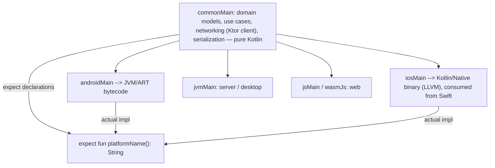

# Kotlin Best Practices and Ecosystem

Writing Kotlin that *compiles* is easy; writing Kotlin that reads like the standard library takes deliberate style. This chapter distills the practices that define idiomatic Kotlin — immutability-first, expression-oriented code, disciplined null handling, DSL design — then surveys the ecosystem you will be asked about: Kotlin Multiplatform, Android, server-side frameworks (Ktor, Spring Boot), and the Gradle Kotlin DSL.

## Immutability First

Default to immutable everything; introduce mutability only where measured need exists:

```kotlin
// Idiomatic: immutable data + transformation
data class CartItem(val sku: String, val qty: Int, val priceCents: Long)

data class Cart(val items: List<CartItem>) {
    val totalCents: Long get() = items.sumOf { it.qty * it.priceCents }

    // "Mutation" = producing a new value:
    fun add(item: CartItem): Cart = copy(items = items + item)
    fun without(sku: String): Cart = copy(items = items.filterNot { it.sku == sku })
}

// AVOID: mutable state bags
class MutableCart {
    var items = mutableListOf<CartItem>()   // shared mutable state: threading bugs,
    var total = 0L                           // 'total' can silently drift out of sync
}
```

Why it matters in interviews: immutable values are thread-safe by construction (critical with coroutines hopping threads), safe as map keys, trivially cacheable, and make state changes explicit — the same reasoning behind Compose/Redux-style unidirectional data flow.

## Expression-Oriented Style

Prefer expressions that *produce values* over statements that *mutate variables*:

```kotlin
// Statement style (Java accent):
fun labelFor(code: Int): String {
    var label: String
    if (code == 200) { label = "OK" }
    else if (code in 400..499) { label = "Client error" }
    else { label = "Other" }
    return label
}

// Expression style (Kotlin accent):
fun labelFor(code: Int): String = when {
    code == 200      -> "OK"
    code in 400..499 -> "Client error"
    else             -> "Other"
}

// try is an expression too:
val config = try { loadConfig() } catch (e: IOException) { Config.DEFAULT }

// Build values in one expression rather than mutate-after-construct:
val server = Server(
    port = env["PORT"]?.toIntOrNull() ?: 8080,
    tls = env["TLS"] == "true",
)
```

## Avoiding !! (and Nullability Discipline)

`!!` in production code is a design smell — each one is a potential crash with no context. Strategies to eliminate it:

```kotlin
// 1. Model non-null by construction (constructor injection over lateinit):
class Service(private val repo: Repo)          // never null, no assertion needed

// 2. Elvis with early return/throw carries a message:
val user = session.user ?: return Unauthorized
val id = payload.id ?: error("payload missing id")   // error() throws IllegalStateException

// 3. requireNotNull/checkNotNull document the invariant:
val parent = requireNotNull(node.parent) { "root node cannot be reparented" }

// 4. Restructure API: return sealed results instead of nullable + error flags
sealed interface LookupResult {
    data class Found(val user: User) : LookupResult
    data object NotFound : LookupResult
}
```

Enforce it: static analysis with **detekt** (rule `UnsafeCallOnNullableType` etc.) and **ktlint** for formatting keeps style debates out of code review. Most teams wire both into CI.

## DSL Building

Type-safe builders are Kotlin's signature library-design technique — lambdas with receivers nested to model structure:

```kotlin
class RouteBuilder {
    private val routes = mutableListOf<Pair<String, String>>()
    fun get(path: String, handler: () -> String) { routes += path to handler() }
    fun build(): Map<String, String> = routes.toMap()
}

class ServerBuilder {
    var port: Int = 8080
    private var routing: RouteBuilder.() -> Unit = {}
    fun routes(block: RouteBuilder.() -> Unit) { routing = block }   // lambda with receiver
    fun build() = RouteBuilder().apply(routing).build() to port
}

fun server(block: ServerBuilder.() -> Unit) = ServerBuilder().apply(block).build()

// Usage reads like configuration, checked by the compiler:
val (routes, port) = server {
    port = 9090
    routes {
        get("/health") { "OK" }
        get("/version") { "1.0" }
    }
}
```

Add `@DslMarker` to prevent inner blocks from accidentally calling outer receivers' members — the mechanism behind kotlinx.html, Ktor routing, Compose, and Gradle's Kotlin DSL. In interviews, be ready to explain that the whole trick is function types with receivers (`ServerBuilder.() -> Unit`) plus `apply`.

## Kotlin Multiplatform (KMP)

KMP shares *business logic* across platforms while keeping UIs native:



Key concepts: `commonMain` holds shared code; `expect`/`actual` declarations bridge platform APIs; libraries like Ktor client, kotlinx.serialization, kotlinx.coroutines, and SQLDelight are multiplatform-ready. Compose Multiplatform extends sharing to UI. Production users include Netflix, McDonald's, Cash App, and Google Docs (iOS). The honest trade-off to mention: iOS interop is via an Objective-C-flavored bridge, build complexity is real, and teams typically share the domain/data layers, not everything.

## Kotlin in Industry

### Android

Kotlin is the default: Jetpack Compose (UI as composable functions), `viewModelScope` + `StateFlow` architecture, Room/DataStore returning Flows, Hilt/Koin for DI. Android questions assume fluency in coroutines, sealed UI state, and immutable state driving recomposition.

### Server-Side: Ktor

Ktor is Kotlin-native, coroutine-based, and unopinionated — every request is a coroutine, so blocking threads are never held:

```kotlin
fun Application.module() {
    install(ContentNegotiation) { json() }
    routing {
        get("/users/{id}") {
            val id = call.parameters["id"]?.toLongOrNull()
                ?: return@get call.respond(HttpStatusCode.BadRequest)
            val user = userService.find(id)                 // suspend call, non-blocking
                ?: return@get call.respond(HttpStatusCode.NotFound)
            call.respond(user)
        }
    }
}
```

### Server-Side: Spring Boot with Kotlin

Spring officially supports Kotlin: constructor injection fits `val` properties, suspend controller functions run on WebFlux, and extensions dot the API:

```kotlin
@RestController
class UserController(private val service: UserService) {   // constructor injection, no @Autowired
    @GetMapping("/users/{id}")
    suspend fun user(@PathVariable id: Long): UserDto =     // suspend handler (WebFlux)
        service.find(id) ?: throw ResponseStatusException(HttpStatus.NOT_FOUND)
}
```

Remember the compiler plugins: `kotlin-spring` (all-open for proxied annotations) and `no-arg`/JPA plugin for entities. Choose Ktor for lightweight, Kotlin-idiomatic services; Spring for the mature ecosystem (Security, Data, Actuator) and enterprise environments.

### Gradle Kotlin DSL

Build scripts in Kotlin (`build.gradle.kts`) bring type safety and IDE completion to the build:

```kotlin
plugins {
    kotlin("jvm") version "2.0.0"
    kotlin("plugin.serialization") version "2.0.0"
}

dependencies {
    implementation("io.ktor:ktor-server-netty:2.3.11")
    implementation(libs.kotlinx.coroutines)     // version catalog reference (libs.versions.toml)
    testImplementation(kotlin("test"))
    testImplementation("io.mockk:mockk:1.13.10")
}

kotlin {
    jvmToolchain(21)
}

tasks.test {
    useJUnitPlatform()
}
```

Best current practice: **version catalogs** (`gradle/libs.versions.toml`) centralize dependency versions across modules; convention plugins in `buildSrc`/build-logic share build configuration.

## Coding Conventions Quick List

```kotlin
// Naming: classes UpperCamelCase, functions/properties lowerCamelCase,
// constants SCREAMING_SNAKE_CASE in companion/top level.

// Prefer named arguments for booleans and same-typed parameters:
resize(width = 100, height = 50, preserveAspect = true)   // not resize(100, 50, true)

// Public API: explicit return types. Private/local: inference is fine.
fun parseTimestamp(raw: String): Instant = /* ... */ TODO()

// Small files organized by feature, not by kind (no giant Utils.kt).
// One class per file for public classes; related small types may share a file
// (a sealed hierarchy and its subtypes belong together).
```

## Best Practices

- **Immutability by default**: `val`, read-only collections, `data class` + `copy`; make mutation a deliberate, localized exception.
- **Write expressions, not mutation sequences**: single-expression functions, `when`/`if`/`try` as expressions, builders (`buildList`) over accumulate-into-var.
- **Zero `!!` in production**; enforce with detekt + ktlint in CI, not code-review nagging.
- **Design APIs Kotlin-first**: default arguments over overloads, sealed results over exceptions for expected failures, extension functions for discoverability, function types over single-method interfaces.
- **Keep DSLs shallow and use `@DslMarker`**; a DSL is justified for genuinely nested configuration, not for every builder.
- **In KMP, share the domain/data layer first**; do not force UI sharing until the team and tooling are ready.
- **Adopt version catalogs and convention plugins** in Gradle; treat the build as code with the same review standards.
- **Follow the official Kotlin coding conventions** (the JetBrains style guide) and let the formatter, not humans, enforce them.

## Interview Questions

<details>
<summary>1. Why is immutability so emphasized in Kotlin, especially with coroutines?</summary>

Coroutines hop threads at suspension points: a coroutine may start on one worker thread and resume on another, so any shared mutable state needs synchronization. Immutable values (`val` + read-only collections + data classes) are safe to share across threads and coroutines without locks, make state transitions explicit (`copy`), enable safe caching and use as map keys, and underpin unidirectional-data-flow UI (Compose recomposition relies on stable, immutable state). Mutability becomes a controlled, local implementation detail rather than the default.
</details>

<details>
<summary>2. What language features make Kotlin DSLs possible?</summary>

Primarily function types with receivers (`ServerBuilder.() -> Unit`) — the block executes with the builder as `this`, so its members are callable unqualified. Supporting cast: trailing-lambda syntax (blocks look like language constructs), extension functions, default/named arguments, infix functions and operator overloading for notation, `inline` to keep abstraction free, and `@DslMarker` to stop inner scopes from resolving against outer receivers. Gradle Kotlin DSL, Ktor routing, kotlinx.html, and Compose are all this pattern.
</details>

<details>
<summary>3. What is Kotlin Multiplatform, and what would you realistically share?</summary>

KMP compiles common Kotlin to JVM (Android/server), Native (iOS via LLVM), and JS/Wasm, with `expect`/`actual` bridging platform APIs. Realistic sharing: domain models, business rules, validation, networking (Ktor client), serialization, persistence (SQLDelight), and view models — typically 40-70% of app code — while UI stays native (SwiftUI/Compose) or optionally shared via Compose Multiplatform. Trade-offs to acknowledge: Objective-C-bridge friction from Swift, build/tooling complexity, and larger iOS binaries; hence "share the core, keep UI native" is the common strategy.
</details>

<details>
<summary>4. Ktor vs Spring Boot for a Kotlin backend — how do you choose?</summary>

Ktor: Kotlin-native, coroutine-first (each request is a coroutine), lightweight, unopinionated plugin model, fast startup, small footprint — great for microservices, KMP-shared clients, teams wanting idiomatic Kotlin end-to-end. Spring Boot: the mature ecosystem — Security, Data/JPA, Actuator observability, transaction management, vast hiring pool and enterprise patterns; official Kotlin support including suspend WebFlux handlers, at the cost of heavier startup/reflection and needing `kotlin-spring`/`no-arg` plugins. Choose Spring when you need its ecosystem or org standardization; Ktor when you want lean, coroutine-idiomatic services.
</details>

<details>
<summary>5. What advantages does the Gradle Kotlin DSL have over Groovy, and what are version catalogs?</summary>

Kotlin DSL (`build.gradle.kts`) is statically typed: IDE completion, navigation, refactoring, and compile-time errors for typos that Groovy would surface only at runtime; build logic can be factored into type-checked convention plugins. Costs: slightly slower first-time script compilation and stricter syntax. Version catalogs (`gradle/libs.versions.toml`) declare dependency coordinates and versions once, exposed as type-safe accessors (`libs.kotlinx.coroutines`) across all modules — eliminating version drift in multi-module builds and enabling tooling (Renovate/Dependabot) to bump one file.
</details>

<details>
<summary>6. How do you enforce code quality standards in a Kotlin team?</summary>

Automate, don't argue: **ktlint** (or ktfmt) for formatting — run as pre-commit hook and CI gate so style never reaches review; **detekt** for static analysis — complexity thresholds, forbidden patterns (`!!`, `GlobalScope`, wildcard imports), with a baseline file to adopt incrementally on legacy code; compiler flags `-Werror` plus explicit-API mode for libraries; consistent Kotlin/AGP versions via version catalogs. Combine with review conventions focused on design (reviewers freed from style nits) and the official Kotlin coding conventions as the arbiter.
</details>

<details>
<summary>7. When is a sealed result type better than throwing exceptions?</summary>

For *expected* domain outcomes — validation failure, not-found, insufficient funds — a sealed hierarchy (`sealed interface TransferResult { Success; InsufficientFunds; AccountFrozen }`) makes every outcome visible in the signature and forces callers to handle each case via exhaustive `when`; exceptions are invisible in Kotlin signatures (no checked exceptions), easily forgotten, and expensive (stack traces). Keep exceptions for *unexpected* failures — bugs, I/O errors, broken invariants — where unwinding to a generic handler is correct. This split (results for business outcomes, exceptions for defects/infrastructure) is standard in modern Kotlin services.
</details>
