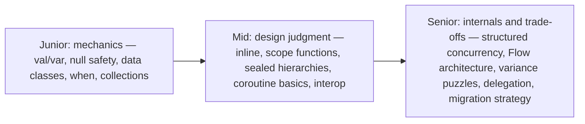
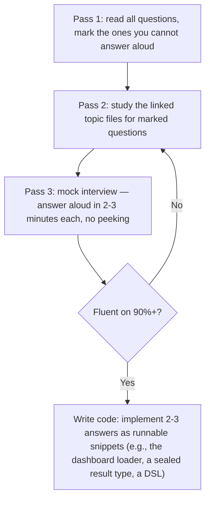

# Kotlin Interview Questions

This is the capstone question bank for the Kotlin guide: 36 curated questions with detailed answers, grouped by difficulty. Junior questions test language mechanics, mid-level questions test the "why" behind features and everyday design judgment, and senior questions probe coroutines internals, variance puzzles, and architectural trade-offs. Answer each out loud before expanding the answer — interviews are spoken, not read.



---

## Junior Level

<details>
<summary>1. What is the difference between <code>val</code> and <code>var</code>, and does <code>val</code> guarantee immutability?</summary>

`val` is a read-only reference (assignable exactly once); `var` is reassignable. `val` does **not** make the object immutable — `val list = mutableListOf(1)` still permits `list.add(2)`; only the reference is fixed. For actual immutability, combine `val` with read-only/immutable types (`List`, `Map`, data classes with `val` properties). Interview follow-up worth volunteering: a `val` property can still return different values if it has a custom getter computing from mutable state.
</details>

<details>
<summary>2. Explain <code>String?</code> vs <code>String</code> and the tools for working with nullable types.</summary>

`String` can never hold null; `String?` can. To use a `String?` you must handle null: safe call `s?.length` (null-propagating), Elvis `s ?: "default"` (fallback, or `?: return`/`?: throw` guards), explicit `if (s != null)` check (compiler smart-casts `s` to `String` in the branch), or `s!!` (asserts non-null, throws NPE if wrong — avoid in production). This moves null handling from runtime discipline to compile-time enforcement.
</details>

<details>
<summary>3. What does a <code>data class</code> give you, and what are its restrictions?</summary>

Generated from primary-constructor properties: `equals`/`hashCode` (structural equality), `toString`, `copy(...)` for modified copies, and `componentN()` for destructuring. Restrictions: needs at least one primary-constructor parameter; cannot be `abstract`, `open`, `sealed`, or `inner`. Gotcha: properties declared in the class body are excluded from all generated methods, and `copy` is shallow.
</details>

<details>
<summary>4. How does <code>==</code> differ from <code>===</code>?</summary>

`==` is structural equality: it compiles to a null-safe `equals()` call (`a?.equals(b) ?: (b === null)`), so comparing strings and data classes with `==` is correct in Kotlin. `===` is referential equality — same object in memory. This is the reverse of Java's `==` on objects. Bonus point: `===` on boxed primitives (`Int?`) is unreliable due to caching and should never be used.
</details>

<details>
<summary>5. What is a string template, and how do you embed an expression?</summary>

`"Hello, $name"` interpolates a variable; `"Total: ${price * qty}"` embeds any expression in `${}`. Raw strings (`"""..."""`) span lines without escapes — combine with `trimIndent()` for readable embedded JSON/SQL/regex. Templates compile to efficient `StringBuilder`-style concatenation.
</details>

<details>
<summary>6. What is <code>when</code> and how is it better than <code>switch</code>?</summary>

`when` is an expression (returns a value), matches constants, multiple values per branch, ranges (`in 1..10`), type checks (`is String` with smart cast), and arbitrary conditions in subject-less form; there is no fall-through and no `break`. Over sealed classes and enums it is exhaustively checked — omit `else` and the compiler errors when a case is unhandled, which turns adding a new enum entry into a compile-time to-do list.
</details>

<details>
<summary>7. What is the difference between <code>List</code>, <code>MutableList</code>, and Java's <code>List</code>?</summary>

Kotlin `List` is a read-only interface (no `add`/`remove`); `MutableList` extends it with mutators. Both erase to `java.util.List` at runtime — the split is compile-time API design, not different runtime classes. Consequence: a "read-only" list may still be mutated through another (mutable or Java) reference; read-only ≠ immutable. Accepting `List` in a signature promises the function will not modify it.
</details>

<details>
<summary>8. What are default and named arguments? What Java pattern do they replace?</summary>

Parameters can declare defaults (`fun connect(host: String, port: Int = 5432)`), and call sites can name arguments (`connect("db", port = 5433)`) in any order, skipping defaulted ones. They replace telescoping constructor/method overloads and most uses of the builder pattern. For Java callers, `@JvmOverloads` generates the overload set, since Java lacks the feature.
</details>

<details>
<summary>9. What is an extension function, and what is one thing it cannot do?</summary>

A function declared as `fun String.shout() = uppercase() + "!"` — callable as if it were a member (`"hi".shout()`), but compiled to a static function taking the receiver as first parameter. It cannot access private members of the receiver class, and it is dispatched *statically* on the declared type — no polymorphic overriding. Member functions shadow same-signature extensions.
</details>

<details>
<summary>10. What is a <code>companion object</code>?</summary>

A singleton object nested in a class, holding what Java would make `static`: factory functions, constants, shared state. Members are called via the class name (`User.create(...)`). Unlike statics, a companion is a real object — it can implement interfaces and be passed around. Java sees members via `User.Companion.create()` unless `@JvmStatic` is applied.
</details>

<details>
<summary>11. How do you iterate 1 to 10 inclusive, exclusive, backwards, and by steps?</summary>

`for (i in 1..10)` inclusive; `for (i in 1 until 10)` (or `1..<10`) end-exclusive; `for (i in 10 downTo 1)` backwards; add `step 2` for stride. Ranges are also values: `x in 0..100` for bounds checks, `in 'a'..'z'` for chars, and ranges of any `Comparable` (dates) for containment checks — commonly combined with `when` branches.
</details>

<details>
<summary>12. What is the Elvis operator and show a guard-clause idiom with it.</summary>

`a ?: b` yields `a` unless it is null, then `b`. Because `return` and `throw` are expressions (type `Nothing`, subtype of everything), guards read: `val user = repo.find(id) ?: return null` or `val email = input.email ?: throw ValidationException("email required")`. This keeps the happy path unindented — an idiom reviewers expect.
</details>

---

## Mid Level

<details>
<summary>13. Explain data class <code>equals</code>/<code>hashCode</code> semantics precisely — including the classic pitfalls.</summary>

Generated `equals` compares *all primary-constructor properties* structurally (and requires same class — a data class and its subclass-like sibling are never equal); `hashCode` is consistent with it. Pitfalls: (1) body-declared properties are ignored — two instances differing only in a body `var` are "equal"; (2) `Array` properties compare by *reference* (`Array.equals` is identity), silently breaking equality — use `List` instead or override manually; (3) mutable properties in data classes used as map keys corrupt hash buckets when mutated after insertion; (4) inheritance: extending a data class is prohibited precisely because symmetric/transitive equals across a hierarchy is unsolvable in general.
</details>

<details>
<summary>14. Explain <code>inline</code>, <code>noinline</code>, and <code>crossinline</code> with the reason each exists.</summary>

`inline` copies the function body and its lambda arguments into call sites: kills the lambda-object allocation and virtual call, enables non-local `return` from lambdas, and enables `reified` type parameters. `noinline` marks a lambda parameter that must stay a normal object — required when the function stores it or forwards it to non-inline code (an inlined lambda has no object identity to store). `crossinline` keeps inlining but forbids non-local returns — required when the lambda executes in another frame (nested lambda, `Runnable`, callback), where "return from the enclosing function" would be meaningless or unsound. Cost of inline: bytecode duplication; use it for small lambda-taking utilities, not general functions.
</details>

<details>
<summary>15. When do you use each scope function — let, run, with, apply, also?</summary>

Decide by return value, then by receiver style. Need the *block's result*: `let` (object as `it` — transformations, `?.let` null gate), `run` (object as `this` — configure then compute), `with(obj)` (non-extension `run` for an object in hand). Need the *object back* (chaining/initialization): `apply` (as `this` — property configuration), `also` (as `it` — side effects like logging/validation). Anti-patterns: nesting `this`-based functions (receiver shadowing), `let` chains where a plain `if` is clearer, and using `apply` expecting the block result.
</details>

<details>
<summary>16. What are sealed classes/interfaces, and how do they compare to enums?</summary>

A `sealed` type's direct subtypes are restricted to the same module/package, giving the compiler a closed set: `when` over it is exhaustive without `else`, so adding a subtype breaks every unhandled `when` at compile time. Each subtype is a full class carrying its own data (`Success(data)` vs `Failure(code)`), unlike enum constants which are fixed singletons of identical shape. Use enums for flag-like constant sets; sealed hierarchies for state machines, UI states, and result types. Sealed *interfaces* additionally allow a subtype to belong to multiple sealed hierarchies.
</details>

<details>
<summary>17. <code>lateinit</code> vs <code>by lazy</code> — mechanics, constraints, and when each is right.</summary>

`lateinit var`: mutable, non-null reference types only (no primitives), initialized externally before first use, `UninitializedPropertyAccessException` if not; checkable via `::prop.isInitialized`. Right for DI/framework-injected fields and Android lifecycle objects. `val by lazy { }`: read-only, any type, initializer runs on first access (synchronized by default, configurable via `LazyThreadSafetyMode`), value cached. Right for expensive construction and breaking initialization-order dependencies. Prefer constructor injection over both when the framework allows — compile-time guarantees beat runtime ones.
</details>

<details>
<summary>18. What are platform types, and how do you defend against them?</summary>

Types coming from Java declarations without nullability annotations, shown as `String!` — the compiler cannot verify nullability, so it permits both nullable and non-null treatment, and a wrong guess yields a runtime NPE: the deliberate hole in Kotlin's null safety that makes interop practical. Defenses: explicitly type Java results as nullable (`val x: String? = javaApi()`), annotate the Java code (`@Nullable`/`@NotNull` — JetBrains or JSR-305), and know that Kotlin adds runtime parameter checks at its public function boundaries so Java-passed nulls fail fast.
</details>

<details>
<summary>19. How do coroutines differ from threads, and what does <code>suspend</code> actually compile to?</summary>

Threads are OS resources (~1MB stack, kernel scheduling); blocking one wastes it. A coroutine is a compiler-managed state machine: each `suspend` function gains a hidden `Continuation` parameter, and its body compiles into a state machine that can park (storing state in a small heap object, freeing the thread) and resume — possibly on a different thread. That is why 100k coroutines on a small pool is routine. `suspend` marks a function as suspension-capable; it can only be called from a coroutine or another suspend function.
</details>

<details>
<summary>20. Compare <code>launch</code> and <code>async</code>, including their exception behavior.</summary>

`launch` returns a `Job` — fire-and-forget; uncaught exceptions propagate up the job tree immediately, reaching the root's `CoroutineExceptionHandler` (or crashing). `async` returns `Deferred<T>` — the exception is stored and rethrown at `await()`; but under a normal parent `Job` it *also* propagates and cancels the parent regardless of `await` — only supervision (`supervisorScope`/`SupervisorJob`) contains it. Use `async` only for parallel decomposition where results are consumed; `async { }.await()` immediately is just a worse `withContext`.
</details>

<details>
<summary>21. What is a SAM conversion, and why do Kotlin interfaces require <code>fun interface</code>?</summary>

A lambda can implement a single-abstract-method interface: `Thread { ... }`, `executor.submit { ... }`. Automatic for Java interfaces. For Kotlin interfaces, you must declare `fun interface` — the language pushes pure-Kotlin APIs toward plain function types (`(T) -> R`) instead, so SAM conversion is an explicit opt-in for cases needing a named type (interop, multiple implementations, denotable contracts). Also remember each conversion site creates an object — store the reference if you must unregister a listener later.
</details>

<details>
<summary>22. How does the read-only vs mutable collection split interact with Java, and what bug can result?</summary>

Kotlin's `List`/`MutableList` both compile to `java.util.List` — the split is purely compile-time. Passing a Kotlin read-only list to Java hands over a full mutable-looking API; Java calling `add()` either mutates your "read-only" data (if backed by `ArrayList`) or throws `UnsupportedOperationException` (if backed by an immutable impl) — a runtime surprise either way. Defend Java-facing boundaries with defensive copies (`toList()`, `List.copyOf`) and document ownership.
</details>

<details>
<summary>23. Sequences vs collections: how does evaluation order differ and when does each win?</summary>

Collection operators are eager: each `map`/`filter` walks the whole input and allocates an intermediate list (horizontal evaluation). Sequences are lazy: intermediate ops record a pipeline, and on a terminal op each element flows through the *entire* pipeline before the next (vertical evaluation) — enabling short-circuiting (`first`, `take`) and constant memory over huge/infinite sources (`generateSequence`, `File.useLines`). Sequences add per-element lambda overhead, so for small collections and short chains, eager wins. Rule: `asSequence()` for large data, long chains, or early termination.
</details>

<details>
<summary>24. Explain property delegation and name three delegates you use.</summary>

`val x by d` compiles property access into `d.getValue(thisRef, property)` (and `setValue` for `var`) — the delegate object supplies the accessor logic, reusable across properties, with `KProperty` metadata telling it which property it serves. Standard delegates: `lazy { }` (memoized init), `Delegates.observable` (change callbacks), `Delegates.vetoable`, map-backed properties (`by map` — config/JSON), and `notNull()`. Ecosystem examples: Android `by viewModels()`, Compose `by remember { mutableStateOf() }`, Gradle `by project`. Class-level delegation (`class A(b: B) : Iface by b`) generates interface forwarding — composition with inheritance's convenience.
</details>

---

## Senior Level

<details>
<summary>25. Why is <code>GlobalScope</code> an anti-pattern, and what does structured concurrency guarantee instead?</summary>

`GlobalScope` creates root coroutines bound to the process, outside any lifecycle: they outlive screens/requests (leaking work and memory, e.g., a network call updating a destroyed Activity), nothing joins them (results and failures can vanish), and their exceptions bypass your supervision tree. Structured concurrency ties every coroutine to a scope forming a parent-child `Job` tree with three guarantees: parents complete only after all children; cancelling a parent cancels the subtree (one `scope.cancel()` at lifecycle end cleans up everything); a child's failure propagates to the parent and cancels siblings by default (no silently lost errors). Correct alternatives: `viewModelScope`/`lifecycleScope` on Android, request scopes on servers, `coroutineScope { }` inside suspend functions, or an application-scoped `CoroutineScope(SupervisorJob() + ...)` you own and cancel deliberately — the difference from `GlobalScope` is exactly that someone owns its lifecycle.
</details>

<details>
<summary>26. Compare Flow, LiveData, and Channel — when is each the right tool?</summary>

**Cold `Flow`**: a declarative asynchronous stream that runs per collector; rich operators, dispatcher control via `flowOn`, backpressure via suspension; multiplatform and framework-agnostic — the default for data streams (DB observations, paging, sensors). **LiveData**: Android-only, main-thread, lifecycle-aware value holder; survives as legacy but lacks operators, backpressure, and multiplatform reach — modern code replaces it with `StateFlow` collected via `repeatOnLifecycle`. **`Channel`**: a hot coroutine-safe queue with exactly-once delivery per element — right for work distribution among consumers and one-shot events that must not be replayed to new subscribers (navigation, toasts), though `SharedFlow` now covers many event cases. Rule of thumb: state → `StateFlow`; streams → cold `Flow`; single-consumer handoff/events → `Channel`; multicast events → `SharedFlow`.
</details>

<details>
<summary>27. A coroutine ignores <code>cancel()</code>. Diagnose the causes and fix them.</summary>

Cancellation is cooperative — `cancel()` marks the Job and makes *suspension points* throw `CancellationException`. Causes of ignoring it: (1) CPU-bound loop that never suspends — fix with `isActive` checks, `ensureActive()`, or periodic `yield()`; (2) catching and swallowing `CancellationException` in a broad `catch (e: Exception)` — always rethrow it; (3) blocking calls (`Thread.sleep`, blocking IO) that no cancellation can interrupt — wrap in `runInterruptible` or use suspending equivalents; (4) work launched in a different, uncancelled scope (e.g., `GlobalScope` inside the function). Also: cleanup in `finally` that itself suspends must run in `withContext(NonCancellable)`, or it will be aborted by the very cancellation it is cleaning up after.
</details>

<details>
<summary>28. Design question: parallel fetch of user, orders, and recommendations where recommendations are optional. Sketch the coroutine structure.</summary>

Use all-or-nothing decomposition for the required parts and supervision for the optional part:

```kotlin
suspend fun loadDashboard(id: Long): Dashboard = coroutineScope {
    val userD = async { userApi.fetch(id) }          // required
    val ordersD = async { orderApi.fetchFor(id) }    // required
    val recs = supervisorScope {
        val recsD = async { recsApi.fetchFor(id) }   // optional
        runCatching { withTimeout(800) { recsD.await() } }.getOrDefault(emptyList())
    }
    Dashboard(userD.await(), ordersD.await(), recs)
}
```

Failure of user/orders cancels everything and propagates (partial dashboard is useless); recommendations failure or timeout degrades to empty. Points interviewers look for: `coroutineScope` not a passed-in scope, `async` started before any `await` (true parallelism), supervision/`runCatching` scoped narrowly to the optional call, timeout on the degradable dependency, and no `GlobalScope`.
</details>

<details>
<summary>29. Variance puzzle: given <code>class Box&lt;T&gt;</code>, <code>Producer&lt;out T&gt;</code>, <code>Consumer&lt;in T&gt;</code>, which assignments compile and why?</summary>

With `Cat : Animal`: (a) `val p: Producer<Animal> = producerOfCats` — **compiles**: covariant `out` means `Producer<Cat> <: Producer<Animal>`; reading gives Cats, which are Animals. (b) `val c: Consumer<Cat> = consumerOfAnimals` — **compiles**: contravariant `in` means `Consumer<Animal> <: Consumer<Cat>`; anything that accepts all Animals accepts Cats. (c) `val b: Box<Animal> = boxOfCats` — **fails**: invariant `Box<T>` has no subtyping between different arguments, since T flows both in and out. (d) `val l: List<Consumer<Animal>> = listOf<Consumer<Cat>>()` — **fails**: `Consumer<Cat>` is not a subtype of `Consumer<Animal>` (contravariance points the other way). (e) Two-layer version: `List<Consumer<Animal>>` **is** assignable to `List<Consumer<Cat>>` — contravariance flips the inner relation, covariant `List` preserves it. Method: annotate each layer's variance and compose the relations mechanically.
</details>

<details>
<summary>30. Why can't <code>MutableList&lt;T&gt;</code> be covariant, and how do use-site projections recover flexibility?</summary>

If `MutableList<Cat> <: MutableList<Animal>` were allowed, code holding the `MutableList<Animal>` view could `add(Dog())` into what is really a list of Cats — heap pollution surfacing as a ClassCastException far from the bug. This is exactly Java's array-covariance mistake (`ArrayStoreException`), which Kotlin refuses to repeat (Kotlin `Array<T>` is invariant). Recovery at use sites: a function needing only to read takes `MutableList<out T>` (accepts `MutableList<Cat>` for `T = Animal`; `add` is forbidden inside), only to write takes `MutableList<in T>` (accepts `MutableList<Any>`); the stdlib's split hierarchy means read-only `List<out E>` is safely covariant by declaration.
</details>

<details>
<summary>31. Explain how <code>reified</code> works and why it cannot exist on classes or non-inline functions.</summary>

JVM erasure removes type arguments at runtime, so ordinary generic code cannot evaluate `T::class` or `x is T`. `reified` is a compile-time trick: the function must be `inline`, so its body is *copied into each call site*, where the actual type argument is statically known; the compiler substitutes the concrete type into the copied body — `is T` becomes `is User`. It cannot work on classes or non-inline functions because they exist as *single* compiled artifacts shared by all instantiations — there is no per-type copy to specialize, and the JVM provides no runtime type argument to consult. Consequences: reified functions are not callable (as generics) from Java, and libraries expose them as thin wrappers over `KClass`-taking APIs (`typeOf<T>()`, `T::class.java`).
</details>

<details>
<summary>32. What delegation patterns do you use to replace inheritance, and what does the compiler generate?</summary>

Class delegation: `class LoggingRepo(private val inner: Repo) : Repo by inner { override fun save(x: X) { log(x); inner.save(x) } }` — the compiler generates forwarding methods for every non-overridden `Repo` member. Patterns this unlocks: decorators (logging, caching, metrics wrappers) without brittle base classes; composing multiple capabilities by delegating different interfaces to different objects (`class Service(a: Auditing, m: Metrics) : Auditing by a, Metrics by m`); adapting/restricting an implementation by overriding selected members. Caveats: delegation is wired at construction (the delegate reference is fixed — later reassigning a `var` delegate does not rebind the forwarders), and the delegate does not know about your overrides (no self-call polymorphism back into the wrapper) — the classic decorator self-call problem, worth naming unprompted.
</details>

<details>
<summary>33. How would you make an existing blocking JDBC-based service coroutine-friendly, end to end?</summary>

(1) Keep JDBC's blocking nature contained: wrap repository calls in `withContext(Dispatchers.IO)` inside suspend functions, making them main-safe/caller-agnostic; size the IO pool (`kotlinx.coroutines.io.parallelism`) against the connection pool (Hikari) — more coroutines than connections just queue at the pool. (2) Expose suspend APIs upward — controllers/handlers (Ktor or WebFlux) call suspend service methods; never `runBlocking` in the request path. (3) For streams of rows, wrap into `Flow` with `flow { ... }.flowOn(Dispatchers.IO)`. (4) Transactions: JDBC transactions are ThreadLocal-bound — either complete each transaction within one `withContext` block (no suspension mid-transaction on another connection), or move to R2DBC/Exposed's suspending transactions, or Spring's coroutine-aware `@Transactional` on WebFlux. (5) Inject dispatchers for testability with `runTest`. The senior point: coroutines do not make JDBC non-blocking — they *contain* the blocking on a dedicated pool and keep the rest of the system suspending.
</details>

<details>
<summary>34. Compare error-handling strategies: exceptions, nullable returns, <code>Result&lt;T&gt;</code>, and sealed result types.</summary>

**Exceptions**: right for bugs and infrastructure faults (unwinding to generic handlers), wrong for expected outcomes — invisible in Kotlin signatures (no checked exceptions), easy to forget, costly stack traces. **Nullable return** (`find(): User?`): perfect when there is exactly one failure meaning ("absent") — Elvis composes beautifully; collapses if you need failure *reasons*. **`kotlin.Result<T>`**: stdlib success-or-Throwable wrapper with `runCatching`/`fold` — fine at boundaries wrapping throwing code, but the error side is untyped `Throwable`, so callers can't exhaustively branch, and `runCatching` dangerously swallows `CancellationException` in coroutines (rethrow it!). **Sealed result hierarchies** (`sealed interface TransferResult`): typed, domain-specific outcomes with exhaustive `when` — the best contract for business operations with multiple meaningful failures. A mature answer: use all four, each in its layer — sealed types at the domain API, nullable for simple absence, exceptions for defects/IO, `Result` sparingly at wrap points.
</details>

<details>
<summary>35. What happens, step by step, when a child coroutine throws in a scope — and how do SupervisorJob and CoroutineExceptionHandler change it?</summary>

Default (`Job` parent): the failing child completes exceptionally → notifies its parent → parent cancels all other children with a `CancellationException` → waits for them → completes exceptionally itself → propagation repeats up to the root; the exception surfaces at the root — rethrown by `runBlocking`/`coroutineScope`, or handed to a `CoroutineExceptionHandler` for a root `launch` (Android default: crash). With `SupervisorJob`/`supervisorScope`: the parent ignores child failures for cancellation purposes — siblings continue; each failed `launch` child needs its own handling (handler or try/catch), each failed `async` surfaces at its `await()`. `CoroutineExceptionHandler` only fires for *uncaught* exceptions at *root* coroutines built with `launch` — installing it on children or `async` does nothing. Also: `CancellationException` is special-cased as cooperative cancellation, not failure — it does not cancel the parent.
</details>

<details>
<summary>36. You are asked to lead a Java-to-Kotlin migration of a large service. What is your plan and what traps do you brief the team on?</summary>

Plan: enable mixed compilation (Kotlin plugin) with zero conversions first; annotate Java APIs `@Nullable`/`@NotNull` (kills platform types — the biggest safety lever); write all new code and tests in Kotlin; convert leaf modules/utilities via IDE J2K then hand-idiomize each file (J2K output is Java-flavored: `!!`, `var`, redundant types); move inward to domain code; add `@JvmStatic`/`@JvmOverloads`/`@Throws`/`@file:JvmName` where remaining Java consumes Kotlin; track Kotlin percentage, keep CI green throughout. Traps to brief: final-by-default breaks Spring proxies and Mockito (use `kotlin-spring`/`all-open`, `no-arg` for JPA entities, MockK); data-class equality changes collection/`equals` behavior versus identity-based Java classes; Kotlin read-only collections are mutable-looking to Java; `internal` is public-with-mangling in bytecode; Jackson needs `jackson-module-kotlin`; and forbid "syntax-only" conversions in review — the goal is idiomatic Kotlin, or you inherit Java's problems in a new syntax.
</details>

---

## How to Drill This Bank



Interviewers probe *depth behind the first answer* — after "what is a data class," expect "why can't it be open?"; after "use `viewModelScope`," expect "what happens to the Job tree when the ViewModel clears?" Practice the follow-up chains, not just the openers. Revisit [07-Coroutines.md](07-Coroutines.md) and [06-Generics-and-Variance.md](06-Generics-and-Variance.md) before senior-level interviews — those two files generate the majority of hard follow-ups.
