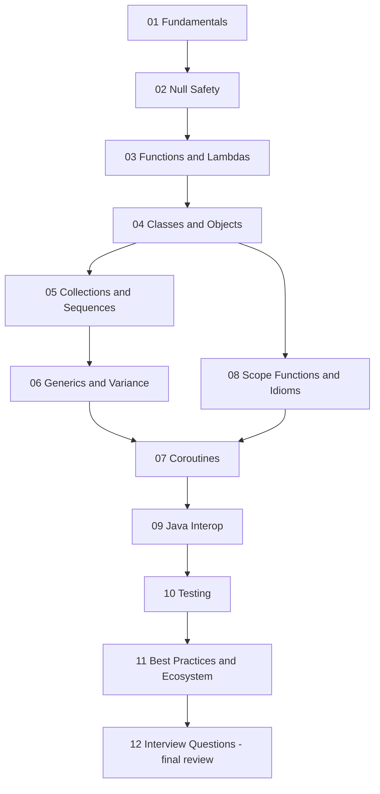

# Kotlin Interview Preparation Guide

Kotlin is a modern, statically typed language that runs on the JVM (and beyond, via Kotlin Multiplatform). It is the official language for Android development, a first-class citizen on the server (Ktor, Spring Boot), and is famous for its null safety, concise syntax, and coroutines-based concurrency model. This guide takes you from the fundamentals through the topics interviewers love most: null safety, coroutines, generics variance, and Java interop.

## Why Kotlin Matters in Interviews

- **Android**: Google made Kotlin the preferred language for Android in 2019; most Android interviews assume Kotlin fluency.
- **Backend**: Spring Boot has first-class Kotlin support, and Ktor is a Kotlin-native async framework used at scale.
- **Interop story**: Kotlin compiles to JVM bytecode and interoperates seamlessly with Java, so questions often probe how well you understand the boundary.
- **Modern language design**: Sealed classes, data classes, coroutines, and extension functions come up as "compare with Java" questions constantly.

## Table of Contents

| # | Topic | What You Will Learn |
|---|-------|---------------------|
| 1 | [Kotlin Fundamentals](01-Kotlin-Fundamentals.md) | val/var, type inference, string templates, compilation to JVM bytecode |
| 2 | [Null Safety](02-Null-Safety.md) | Nullable types, safe calls, Elvis operator, lateinit vs lazy, platform types |
| 3 | [Functions and Lambdas](03-Functions-and-Lambdas.md) | Extension/infix/higher-order functions, lambdas, inline and reified |
| 4 | [Classes and Objects](04-Classes-and-Objects.md) | Constructors, data/sealed/enum classes, objects, delegation |
| 5 | [Collections and Sequences](05-Collections-and-Sequences.md) | Read-only vs mutable collections, functional operators, lazy sequences |
| 6 | [Generics and Variance](06-Generics-and-Variance.md) | in/out variance, star projection, reified type parameters |
| 7 | [Coroutines](07-Coroutines.md) | Structured concurrency, dispatchers, cancellation, Flow, channels |
| 8 | [Scope Functions and Idioms](08-Scope-Functions-and-Idioms.md) | let/run/with/apply/also, when expressions, smart casts |
| 9 | [Kotlin vs Java Interop](09-Kotlin-vs-Java-Interop.md) | @JvmStatic, @JvmOverloads, SAM conversions, migration strategy |
| 10 | [Testing in Kotlin](10-Testing-in-Kotlin.md) | JUnit 5, MockK, kotest, runTest for coroutines |
| 11 | [Best Practices and Ecosystem](11-Kotlin-Best-Practices-and-Ecosystem.md) | Idiomatic style, DSLs, Multiplatform, Ktor/Spring, Gradle Kotlin DSL |
| 12 | [Interview Questions](12-Kotlin-Interview-Questions.md) | 30+ curated questions with answers, grouped junior/mid/senior |

## Suggested Study Order

**Week 1 (foundations)**: Files 01-05. If you already know Java, focus on what is *different*: null safety, extension functions, data classes, and the read-only collection model.

**Week 2 (differentiators)**: Files 06-08. Coroutines is the single most common deep-dive topic in Android and backend Kotlin interviews — budget extra time for it.

**Week 3 (production readiness)**: Files 09-11, then drill file 12 until you can answer every question out loud without looking.

## How to Use This Guide

1. Read each topic file top to bottom; type out the code samples rather than skimming them.
2. Every topic file ends with **Best Practices** and **Interview Questions** sections — treat the questions as flashcards.
3. The final file, [12-Kotlin-Interview-Questions.md](12-Kotlin-Interview-Questions.md), is a mock-interview bank grouped by seniority. Use it for timed self-tests.
4. Pair this guide with hands-on practice: solve a few LeetCode problems in Kotlin, or build a small Ktor service, to make the idioms muscle memory.

Good luck — and remember: interviewers care less about syntax trivia and more about *why* Kotlin makes certain trade-offs (null safety at compile time, structured concurrency, declaration-site variance). This guide explains the why throughout.
