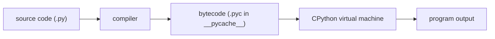
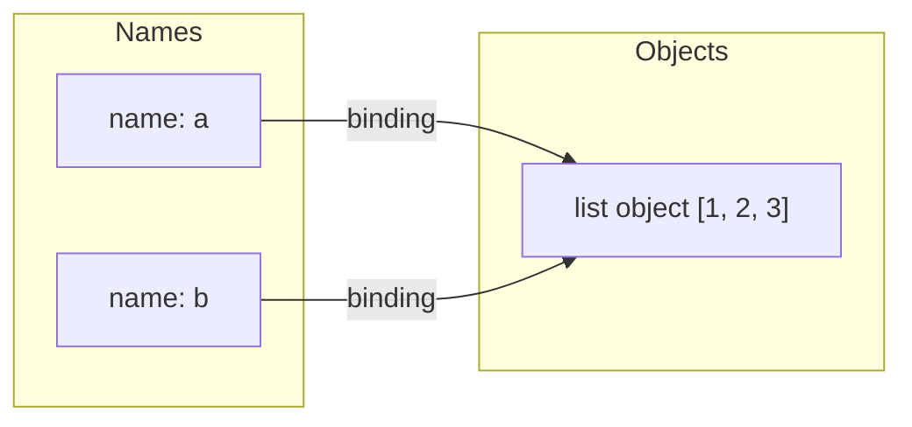

# Python Fundamentals

Before you can answer any advanced Python question, you need a precise mental model of how the language executes code and how it treats data. Python is an interpreted, dynamically typed language in which *everything* is an object and variables are merely *names bound to objects*. This file builds that model: the interpreter and bytecode, the object model, mutability, identity vs equality, truthiness, f-strings, and comprehensions.

## The Interpreter and Bytecode

When people say "Python", they usually mean **CPython**, the reference implementation written in C. CPython does not execute your source text directly. It first *compiles* your `.py` file into **bytecode** — a compact, platform-independent instruction set — and then a virtual machine (a big evaluation loop in C) executes that bytecode.



Key facts interviewers expect you to know:

- The compiled bytecode is cached in `__pycache__/module.cpython-312.pyc` so subsequent imports skip recompilation. The cache is invalidated when the source file changes.
- Bytecode is **not** machine code. The VM interprets it instruction by instruction (CPython 3.11+ adds a specializing adaptive interpreter, and 3.13 adds an experimental JIT).
- Other implementations exist: **PyPy** (JIT-compiled, often much faster), **Jython** (JVM), and **MicroPython** (embedded).

You can inspect bytecode yourself with the `dis` module:

```python
import dis

def add(a, b):
    return a + b

dis.dis(add)
# LOAD_FAST_LOAD_FAST      0 (a, b)
# BINARY_OP                0 (+)
# RETURN_VALUE
```

## Everything Is an Object

In Python, integers, strings, functions, classes, and modules are all objects — heap-allocated structures with a type and an identity. Even `type` itself is an object.

```python
x = 42
print(type(x))          # <class 'int'>
print(type(int))        # <class 'type'>
print((42).bit_length())  # 6  -- even literals have methods

def greet():
    pass

greet.author = "me"      # functions are objects; you can attach attributes
print(greet.author)       # me
print(isinstance(greet, object))  # True
```

Every object has three things:

1. An **identity** (its address in CPython, retrievable with `id(obj)`).
2. A **type** (which never changes for the object's lifetime).
3. A **value** (which may or may not be mutable, depending on the type).

## Names vs Variables

This is the single most important fundamentals concept. Python does not have "variables" that contain values like boxes in C. It has **names** that are *bound* to objects. Assignment never copies data — it binds a name to an object.



```python
a = [1, 2, 3]
b = a            # b is bound to the SAME object, no copy happens
b.append(4)
print(a)         # [1, 2, 3, 4]  -- surprise if you thought b was a copy!
print(a is b)    # True
```

Rebinding a name does not affect other names bound to the same object:

```python
a = [1, 2, 3]
b = a
b = [9, 9]       # rebinds b to a NEW object; a is untouched
print(a)         # [1, 2, 3]
```

This model also explains function-call semantics: Python is **call-by-object-reference** (a.k.a. "call by sharing"). The parameter name inside the function is bound to the same object the caller passed.

```python
def mutate(lst):
    lst.append(99)     # mutates the shared object -> visible to caller

def rebind(lst):
    lst = [0]           # rebinds the LOCAL name only -> invisible to caller

data = [1]
mutate(data)
rebind(data)
print(data)             # [1, 99]
```

## Mutability

Types are either **mutable** (their value can change in place) or **immutable** (any "change" creates a new object).

| Immutable | Mutable |
|-----------|---------|
| `int`, `float`, `complex`, `bool` | `list` |
| `str`, `bytes` | `dict` |
| `tuple`, `frozenset` | `set`, `bytearray` |
| `range`, `NoneType` | user-defined classes (by default) |

```python
s = "hello"
s2 = s.upper()      # strings are immutable: upper() returns a NEW string
print(s)            # hello

t = (1, 2, [3, 4])
t[2].append(5)      # the tuple is immutable, but the list INSIDE it is not
print(t)            # (1, 2, [3, 4, 5])
```

The tuple example is a classic interview trap: immutability is *shallow*. A tuple immutably holds references, but the referenced objects may themselves be mutable.

## `is` vs `==`

- `==` compares **values** (delegates to `__eq__`).
- `is` compares **identity** (are these the same object in memory?).

```python
a = [1, 2]
b = [1, 2]
print(a == b)   # True   -- same value
print(a is b)   # False  -- different objects

x = None
print(x is None)  # True -- ALWAYS use `is` for None, True, False (singletons)
```

Beware of interning, which makes `is` *appear* to work for small values:

```python
a = 256
b = 256
print(a is b)   # True  -- CPython caches ints from -5 to 256

a = 1000
b = 1000
print(a is b)   # False in a REPL (may be True in a script due to constant folding)
# NEVER rely on this: use == for value comparison, is only for singletons.
```

## Truthiness

Every object can be evaluated in a boolean context. Falsy values are: `None`, `False`, numeric zero (`0`, `0.0`, `0j`), and empty containers (`""`, `[]`, `{}`, `set()`, `()`, `range(0)`). Everything else is truthy. Custom classes can define `__bool__` (or `__len__`) to control this.

```python
items = []
if not items:               # idiomatic emptiness check
    print("no items")

# Pitfall: truthiness is not the same as "is None"
def load(timeout=None):
    if not timeout:          # BUG: treats timeout=0 like "not provided"
        timeout = 30
    return timeout

print(load(0))               # 30 -- surprising! Caller asked for 0.
# Fix: if timeout is None: timeout = 30
```

## f-strings

Formatted string literals (f-strings) are the idiomatic way to build strings since Python 3.6. They evaluate expressions inline and support the full format-spec mini-language.

```python
name, score, ratio = "Ada", 97.5, 0.876543

print(f"{name} scored {score}")            # Ada scored 97.5
print(f"{ratio:.2%}")                       # 87.65%
print(f"{score:>10.1f}")                    # '      97.5' (right-aligned, width 10)
print(f"{name=}")                           # name='Ada'  -- great for debugging (3.8+)
print(f"{1_000_000:,}")                     # 1,000,000

# 3.12+: quotes can be reused inside the expression
data = {"key": "value"}
print(f"{data["key"]}")                     # value
```

## Comprehensions

Comprehensions build lists, sets, dicts, and generators declaratively. They are usually faster and clearer than an explicit loop with `.append`.

```python
nums = [1, 2, 3, 4, 5, 6]

squares = [n * n for n in nums]                     # list comprehension
evens = [n for n in nums if n % 2 == 0]             # with a filter
pairs = [(i, j) for i in range(2) for j in range(2)]  # nested loops
labels = {n: ("even" if n % 2 == 0 else "odd") for n in nums}  # dict comp
unique_lengths = {len(w) for w in ["hi", "hey", "yo"]}         # set comp
lazy = (n * n for n in nums)                        # generator expression (lazy)

# Pitfall: don't use a comprehension only for its side effects
[print(n) for n in nums]     # BAD: builds a useless list of None
for n in nums:               # GOOD
    print(n)
```

Keep comprehensions to one, at most two, `for` clauses; beyond that a regular loop is more readable.

**Real-world application:** comprehensions plus the name-binding model are the backbone of data-wrangling code everywhere — for example transforming API responses (`[row["id"] for row in payload["items"]]`) in a FastAPI backend, or building lookup dicts before a join in an ETL job.

## Best Practices

- Use `is` only for singletons (`None`, `True`, `False`, sentinels); use `==` for values.
- Check for "not provided" with `is None`, not truthiness, whenever `0`, `""`, or `[]` are valid inputs.
- Treat assignment as *binding*, never copying. When you need a copy, be explicit: `list(a)`, `a.copy()`, or `copy.deepcopy(a)`.
- Prefer f-strings over `%` formatting and `str.format()`; use `f"{x=}"` while debugging.
- Prefer comprehensions for simple transforms/filters; fall back to loops when logic grows or side effects are involved.
- Know your interpreter: mention CPython bytecode and `__pycache__` when asked "is Python compiled or interpreted?" — the honest answer is "both".
- Never rely on int/string interning behavior; it is an implementation detail.

## Interview Questions

<details>
<summary>Is Python compiled or interpreted?</summary>
Both. CPython compiles source code to bytecode (cached as .pyc files in <code>__pycache__</code>), then a virtual machine interprets that bytecode. So Python is compiled to an intermediate representation and then interpreted; it is not compiled ahead-of-time to machine code (though PyPy JIT-compiles at runtime, and CPython 3.13 ships an experimental JIT).
</details>

<details>
<summary>What is the difference between <code>is</code> and <code>==</code>?</summary>
<code>==</code> compares values by calling <code>__eq__</code>; <code>is</code> compares object identity (same object in memory). <code>[1,2] == [1,2]</code> is True but <code>[1,2] is [1,2]</code> is False. Use <code>is</code> only for singletons like <code>None</code>. Small-integer interning can make <code>256 is 256</code> True, but that is an implementation detail you must not rely on.
</details>

<details>
<summary>Explain "names vs variables" in Python. What does assignment actually do?</summary>
Python has names bound to objects, not variable-boxes containing values. <code>b = a</code> binds the name <code>b</code> to the same object <code>a</code> refers to — no data is copied. Mutating through either name is visible through both; rebinding one name does not affect the other. This is also why function arguments behave as "call by object reference": mutating a passed list is visible to the caller, but rebinding the parameter is not.
</details>

<details>
<summary>Can a tuple's contents change?</summary>
The tuple itself is immutable — you cannot rebind its slots. But immutability is shallow: if a slot references a mutable object like a list, that object can still be mutated, e.g. <code>t = (1, [2]); t[1].append(3)</code> succeeds. A related trap: <code>t[1] += [3]</code> raises TypeError <em>and</em> still mutates the list, because <code>+=</code> mutates in place first and then fails on the tuple assignment.
</details>

<details>
<summary>Which values are falsy in Python, and how can a custom class control truthiness?</summary>
Falsy: <code>None</code>, <code>False</code>, numeric zeros, and empty containers (<code>""</code>, <code>[]</code>, <code>{}</code>, <code>set()</code>, <code>()</code>). A class controls truthiness by defining <code>__bool__</code>; if absent, Python falls back to <code>__len__</code> (nonzero length is truthy); if neither exists, every instance is truthy.
</details>

<details>
<summary>What is a .pyc file and when is it regenerated?</summary>
A .pyc file is cached compiled bytecode stored in <code>__pycache__</code>, tagged with the interpreter version (e.g. <code>cpython-312</code>). It is regenerated when the source file's metadata (size/mtime, or hash in hash-based pycs) no longer matches. It only speeds up import/startup, not execution of the code itself.
</details>

<details>
<summary>Why does <code>def f(timeout=None): if not timeout: ...</code> contain a bug?</summary>
Truthiness conflates "not provided" with valid falsy inputs. If the caller passes <code>timeout=0</code>, <code>not timeout</code> is True and the default is wrongly applied. The correct check is <code>if timeout is None</code>. This pattern generalizes: use identity checks against a sentinel whenever falsy values are legitimate data.
</details>
