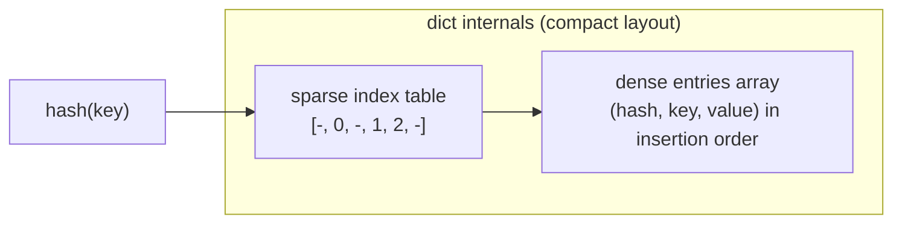
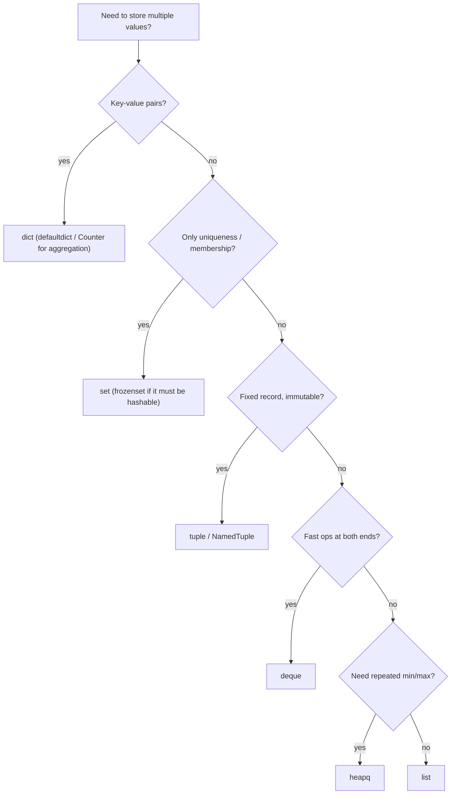

# Python Data Structures

Python ships with four workhorse built-in collections — `list`, `tuple`, `dict`, and `set` — plus a standard library (`collections`, `heapq`) that covers almost every interview data-structure need. Knowing their internals and time complexities is mandatory: "why is membership testing in a list O(n) but O(1) in a set?" is a bread-and-butter interview question. This file covers internals, complexity, the `collections` module, and the pitfalls that trip up even experienced developers.

## The Big Four: Internals

- **`list`** — a dynamic array of object references (not a linked list!). It over-allocates capacity so repeated `append` is amortized O(1). Inserting or deleting at the front shifts every element: O(n).
- **`tuple`** — an immutable fixed-size array of references. Cheaper than a list, hashable (if its elements are), usable as dict keys.
- **`dict`** — an open-addressing hash table. Since CPython 3.6 it uses a compact layout (a dense entries array plus a sparse index table), which is why **insertion order is preserved** — an official language guarantee since Python 3.7.
- **`set`** — a hash table storing only keys. Ideal for membership tests and de-duplication.



## Complexity Table

| Operation | list | tuple | dict | set |
|---|---|---|---|---|
| Index access `x[i]` | O(1) | O(1) | — | — |
| Lookup by key `x[k]` / `k in x` | O(n) | O(n) | **O(1)** avg | **O(1)** avg |
| Append / add | O(1) amortized | — | O(1) avg | O(1) avg |
| Insert/delete at front | O(n) | — | — | — |
| Delete by key | O(n) | — | O(1) avg | O(1) avg |
| Iterate | O(n) | O(n) | O(n) | O(n) |
| Sort | O(n log n) | — | — | — |

```python
# The classic optimization: replace list membership with set membership
banned = ["alice", "bob", "carol"]          # O(n) per check
banned_set = set(banned)                     # O(1) per check
usernames = ["dave", "bob", "erin"]
allowed = [u for u in usernames if u not in banned_set]
print(allowed)                               # ['dave', 'erin']
```

## Dict Ordering Guarantee

```python
d = {}
d["first"] = 1
d["second"] = 2
d["third"] = 3
print(list(d))          # ['first', 'second', 'third'] -- guaranteed since 3.7
```

Because plain dicts preserve insertion order, `collections.OrderedDict` is now mostly useful for `move_to_end()` and order-sensitive equality (`OrderedDict` equality checks order; `dict` equality does not).

## Hashability

An object is *hashable* if it has a `__hash__` that is constant for its lifetime and an `__eq__` consistent with it. Only hashable objects can be dict keys or set members. Immutable built-ins are hashable; mutable containers are not.

```python
ok = {(1, 2): "point"}          # tuples of immutables: fine
# bad = {[1, 2]: "point"}       # TypeError: unhashable type: 'list'
# also = {(1, [2]): "x"}        # TypeError -- tuple containing a list

# Rule: if a == b, then hash(a) must equal hash(b).
print(hash(1) == hash(1.0))     # True, because 1 == 1.0
```

If you define `__eq__` on a class, Python sets `__hash__` to `None` (instances become unhashable) unless you also define `__hash__` — a frequent senior-level question.

## The `collections` Module

### `defaultdict` — missing keys get a default

```python
from collections import defaultdict

# Group words by first letter without key-existence checks
groups = defaultdict(list)
for word in ["apple", "avocado", "banana", "blueberry"]:
    groups[word[0]].append(word)
print(dict(groups))   # {'a': ['apple', 'avocado'], 'b': ['banana', 'blueberry']}
```

### `Counter` — multiset / frequency map

```python
from collections import Counter

votes = Counter("abracadabra")
print(votes.most_common(2))          # [('a', 5), ('b', 2)]
print(votes["z"])                     # 0 -- missing keys count as zero, no KeyError
print(Counter("aab") - Counter("ab")) # Counter({'a': 1}) -- multiset arithmetic
```

### `deque` — O(1) at both ends

`deque` is a doubly-linked list of blocks. Use it for queues and sliding windows; **never** use `list.pop(0)` in a loop (that is O(n) each time, O(n²) total).

```python
from collections import deque

queue = deque([1, 2, 3])
queue.append(4)          # O(1) right push
print(queue.popleft())   # 1 -- O(1) left pop (list.pop(0) would be O(n))

window = deque(maxlen=3) # bounded: old items fall off automatically
for i in range(5):
    window.append(i)
print(window)            # deque([2, 3, 4], maxlen=3)
```

### `namedtuple` — lightweight records

```python
from collections import namedtuple

Point = namedtuple("Point", ["x", "y"])
p = Point(3, 4)
print(p.x, p[1])         # 3 4 -- attribute AND index access
x, y = p                  # tuple unpacking still works
```

For new code, `typing.NamedTuple` or `@dataclass` are usually preferred (see the OOP guide), but `namedtuple` still appears in interviews and legacy codebases.

## `heapq` — the interview MVP

`heapq` turns a plain list into a **min-heap**: `heappush`/`heappop` are O(log n), peeking at the minimum (`heap[0]`) is O(1). It powers "top-K", "merge K sorted lists", and Dijkstra-style problems.

```python
import heapq

nums = [5, 1, 8, 3]
heapq.heapify(nums)              # O(n) in-place
print(heapq.heappop(nums))       # 1 -- always the smallest

# Top 3 largest (min-heap of size k) -- O(n log k)
data = [7, 2, 9, 4, 11, 5]
print(heapq.nlargest(3, data))   # [11, 9, 7]

# Max-heap trick: negate values (heapq has no max-heap)
maxheap = [-x for x in data]
heapq.heapify(maxheap)
print(-heapq.heappop(maxheap))   # 11

# Priority queue with tie-breaking: (priority, counter, item)
pq = []
heapq.heappush(pq, (2, 0, "low"))
heapq.heappush(pq, (1, 1, "high"))
print(heapq.heappop(pq)[2])      # high
```

## When to Use Each



**Real-world applications:** `Counter` for log analysis and word frequency; `deque` for rate-limiter sliding windows and BFS queues; `heapq` for task schedulers and streaming top-K metrics; `dict` for caches and JSON-shaped API data everywhere.

## Common Pitfalls

### Mutable default arguments (the #1 Python gotcha)

Default values are evaluated **once**, at function definition time, and shared across all calls.

```python
def append_bad(item, bucket=[]):    # BAD: one list shared by every call
    bucket.append(item)
    return bucket

print(append_bad(1))   # [1]
print(append_bad(2))   # [1, 2]  -- surprise! Same list as before.

def append_good(item, bucket=None): # GOOD: sentinel + create per call
    if bucket is None:
        bucket = []
    bucket.append(item)
    return bucket

print(append_good(1))  # [1]
print(append_good(2))  # [2]
```

### Multiplying nested lists shares references

```python
grid = [[0] * 3] * 3        # BAD: three references to the SAME inner list
grid[0][0] = 1
print(grid)                  # [[1, 0, 0], [1, 0, 0], [1, 0, 0]] -- surprise!

grid = [[0] * 3 for _ in range(3)]   # GOOD: three distinct lists
grid[0][0] = 1
print(grid)                  # [[1, 0, 0], [0, 0, 0], [0, 0, 0]]
```

### Mutating a collection while iterating

```python
nums = [1, 2, 3, 4]
# for n in nums: nums.remove(n)     # BAD: skips elements (iterator indexes shift)
nums = [n for n in nums if n % 2]    # GOOD: build a new list
print(nums)                          # [1, 3]
# For dicts, mutating during iteration raises RuntimeError.
```

## Best Practices

- Convert to a `set` before repeated membership tests; the O(n) → O(1) speedup is the most common easy optimization in interviews.
- Never write `def f(x, acc=[])`; use `acc=None` plus an `is None` check.
- Use `deque` for queue semantics; `list.pop(0)` in a loop is an instant red flag.
- Build 2-D grids with a comprehension, never `[[0]*c]*r`.
- Reach for `Counter`/`defaultdict` instead of hand-rolled `if key not in d` bookkeeping.
- Use tuples for fixed heterogeneous records and dict keys; lists for homogeneous sequences you will mutate.
- Remember `heapq` is a min-heap: negate values (or invert priorities) for max-heap behavior.
- Don't mutate a collection while iterating over it; iterate a copy or build a new collection.

## Interview Questions

<details>
<summary>Why is a Python list not a linked list, and what does that imply about complexity?</summary>
CPython's list is a contiguous dynamic array of object references with over-allocation. Indexing is O(1); append is amortized O(1) thanks to geometric growth; but insert/delete at the front is O(n) because every element must shift. For frequent operations at both ends, use <code>collections.deque</code>.
</details>

<details>
<summary>How does a Python dict achieve O(1) lookups, and why is it ordered?</summary>
It is an open-addressing hash table: the key is hashed, the hash selects a slot, and collisions are resolved by probing. Since CPython 3.6 the table is split into a sparse index array and a dense entries array holding (hash, key, value) in insertion order — iterating walks the dense array, so insertion order is preserved, and this became a language guarantee in Python 3.7. Lookups degrade to O(n) only under adversarial hash collisions.
</details>

<details>
<summary>What makes an object hashable? Can a tuple be unhashable?</summary>
Hashable means it has a stable <code>__hash__</code> consistent with <code>__eq__</code> (equal objects must have equal hashes). Immutable built-ins are hashable; lists/dicts/sets are not. Yes — a tuple containing a mutable element like <code>(1, [2])</code> is unhashable because hashing recurses into its elements. Also, defining <code>__eq__</code> on a class without defining <code>__hash__</code> makes instances unhashable.
</details>

<details>
<summary>Explain the mutable default argument pitfall.</summary>
Default parameter values are evaluated once at <code>def</code> time and stored on the function object, so a mutable default like <code>[]</code> is shared across all calls: each call that mutates it affects subsequent calls. Fix: default to <code>None</code> and create the object inside the function. (The same mechanism is occasionally exploited deliberately as a cheap per-function cache, but <code>functools.lru_cache</code> is the right tool for that.)
</details>

<details>
<summary>What does <code>[[0] * 3] * 3</code> produce and why is it dangerous?</summary>
A list of three references to one inner list. <code>[0] * 3</code> is fine because ints are immutable, but the outer <code>* 3</code> copies references, not objects. Assigning <code>grid[0][0] = 1</code> appears to change all three rows. Correct construction: <code>[[0] * 3 for _ in range(3)]</code>.
</details>

<details>
<summary>How would you find the K largest elements of a stream efficiently?</summary>
Maintain a min-heap of size K with <code>heapq</code>: push each element, and pop the minimum whenever the heap exceeds K. Each operation is O(log K), total O(n log K) with O(K) memory — better than sorting (O(n log n)) and it works on unbounded streams. In practice <code>heapq.nlargest(k, iterable)</code> does exactly this.
</details>

<details>
<summary>When would you still use OrderedDict now that dicts are ordered?</summary>
Two cases: <code>move_to_end()</code> (handy for LRU caches, moving a key to either end in O(1)) and order-sensitive equality — two OrderedDicts with the same items in different orders compare unequal, whereas plain dicts compare equal. Otherwise a plain dict is smaller and faster.
</details>

<details>
<summary>Counter("aabb") - Counter("abc") returns what?</summary>
<code>Counter({'a': 1, 'b': 1})</code>. Counter subtraction is multiset subtraction that drops non-positive counts: 'a' 2-1=1, 'b' 2-1=1, 'c' 0-1 is negative so it is omitted. (Use <code>Counter.subtract()</code> if you need negative counts kept.)
</details>
