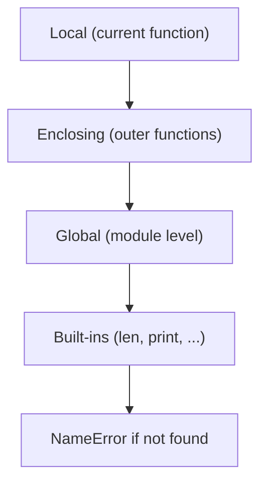

# Functions and Scope

Functions in Python are first-class objects: you can pass them around, store them in data structures, return them from other functions, and close over surrounding state. Combined with Python's LEGB scoping rules, this enables decorators, callbacks, and functional patterns — and also produces some of the most popular interview gotchas, like the late-binding closure trap. This file covers argument-passing syntax, scope resolution, closures, `lambda`, and the essential `functools` utilities.

## First-Class Functions

```python
def shout(text):
    return text.upper() + "!"

def whisper(text):
    return text.lower() + "..."

# Functions are objects: bind them to names, store them, pass them
styles = {"loud": shout, "quiet": whisper}
print(styles["loud"]("hello"))        # HELLO!

def apply_twice(func, value):          # higher-order function
    return func(func(value))

print(apply_twice(lambda s: s + "!", "hi"))   # hi!!
```

This is why `sorted(items, key=len)`, callbacks in web frameworks, and decorators all work: a function is just another value.

## `*args` and `**kwargs`

`*args` collects extra positional arguments into a tuple; `**kwargs` collects extra keyword arguments into a dict. The same symbols *unpack* when calling.

```python
def report(*args, **kwargs):
    print(args, kwargs)

report(1, 2, mode="fast")     # (1, 2) {'mode': 'fast'}

def add(a, b, c):
    return a + b + c

nums = [1, 2, 3]
opts = {"b": 20, "c": 30}
print(add(*nums))              # 6   -- unpack a sequence into positionals
print(add(10, **opts))         # 60  -- unpack a mapping into keywords

# Canonical wrapper pattern (decorators, proxies):
def logged(func):
    def wrapper(*args, **kwargs):
        print(f"calling {func.__name__}")
        return func(*args, **kwargs)   # forward everything unchanged
    return wrapper
```

## Keyword-Only and Positional-Only Parameters

Everything after a bare `*` is **keyword-only**; everything before `/` is **positional-only** (3.8+).

```python
def move(x, y, /, speed=1.0, *, dry_run=False):
    # x, y: positional-only; speed: either; dry_run: keyword-only
    return (x, y, speed, dry_run)

move(1, 2, 2.5, dry_run=True)   # OK
# move(x=1, y=2)                # TypeError: x, y are positional-only
# move(1, 2, 1.0, True)         # TypeError: dry_run is keyword-only
```

Keyword-only flags make call sites self-documenting (`retry(attempts=3, backoff=2)` beats `retry(3, 2)`); positional-only parameters keep parameter names out of your public API so you can rename them later.

## Scope and the LEGB Rule

When Python sees a name, it resolves it by searching four scopes in order: **L**ocal → **E**nclosing → **G**lobal → **B**uilt-ins.



```python
x = "global"

def outer():
    x = "enclosing"
    def inner():
        x = "local"
        print(x)           # local
    inner()
    print(x)               # enclosing

outer()
print(x)                   # global
```

Crucially, *assignment anywhere in a function makes the name local to the whole function* — decided at compile time:

```python
count = 0

def broken():
    print(count)     # UnboundLocalError! `count += 1` below makes count local,
    count += 1       # so the print reads a local that has no value yet.

def fixed():
    global count     # rebind the module-level name
    count += 1

def counter():
    total = 0
    def increment():
        nonlocal total   # rebind the ENCLOSING name (closures that mutate)
        total += 1
        return total
    return increment

inc = counter()
print(inc(), inc(), inc())   # 1 2 3
```

## Closures

A closure is a function that captures names from its enclosing scope. The captured variables live in `__closure__` cells and survive after the outer function returns.

```python
def make_multiplier(factor):
    def multiply(x):
        return x * factor       # `factor` is captured by reference
    return multiply

double = make_multiplier(2)
triple = make_multiplier(3)
print(double(10), triple(10))   # 20 30
print(double.__closure__[0].cell_contents)   # 2
```

### The late-binding closure gotcha

Closures capture **variables, not values**. The variable is looked up when the inner function *runs*, not when it is defined.

```python
funcs = [lambda: i for i in range(3)]
print([f() for f in funcs])      # [2, 2, 2] -- surprise! All see the final i.

# Fix 1: bind the current value via a default argument (evaluated at def time)
funcs = [lambda i=i: i for i in range(3)]
print([f() for f in funcs])      # [0, 1, 2]

# Fix 2: use a factory function to create a new scope per iteration
def make(i):
    return lambda: i
funcs = [make(i) for i in range(3)]
print([f() for f in funcs])      # [0, 1, 2]
```

This bites in real code whenever you create callbacks in a loop — GUI button handlers, task submissions to a thread pool, or route registrations.

## `lambda`

`lambda` creates an anonymous single-expression function. It is ideal for short `key=` functions and inline callbacks — and wrong for anything with logic.

```python
people = [("Ada", 36), ("Grace", 45), ("Alan", 41)]
print(sorted(people, key=lambda p: p[1]))          # sort by age
print(max(people, key=lambda p: p[1]))              # ('Grace', 45)

# PEP 8: never assign a lambda to a name -- just use def
# square = lambda x: x * x        # BAD
def square(x): return x * x       # GOOD (has a real __name__, better tracebacks)
```

For simple key functions, `operator.itemgetter(1)` and `operator.attrgetter("age")` are faster and clearer than lambdas.

## `functools` Essentials

### `partial` — pre-fill arguments

```python
from functools import partial

def power(base, exponent):
    return base ** exponent

square = partial(power, exponent=2)
cube = partial(power, exponent=3)
print(square(5), cube(2))      # 25 8

# Real-world: adapting callbacks that expect fewer arguments
# button.on_click(partial(save, document_id=42))
```

### `reduce` — fold a sequence

```python
from functools import reduce

print(reduce(lambda acc, x: acc * x, [1, 2, 3, 4]))       # 24
print(reduce(lambda acc, x: acc * x, [], 1))               # 1 (initializer)
# Prefer sum(), math.prod(), min(), max(), any(), all() when they exist.
```

### `lru_cache` — memoization in one line

```python
from functools import lru_cache

@lru_cache(maxsize=None)        # or @functools.cache (3.9+)
def fib(n):
    return n if n < 2 else fib(n - 1) + fib(n - 2)

print(fib(80))                  # instant; without the cache: exponential time
print(fib.cache_info())         # CacheInfo(hits=78, misses=81, ...)
# Caveats: arguments must be hashable; the cache keeps references alive
# (careful on instance methods -- it can keep `self` from being collected).
```

**Real-world applications:** `lru_cache` for expensive pure lookups (config parsing, pricing rules); `partial` for wiring callbacks and dependency injection; closures underpin every decorator you will meet in Flask/FastAPI routing, retry wrappers, and instrumentation.

## Best Practices

- Accept `*args, **kwargs` only in true pass-through wrappers; explicit signatures document intent and enable IDE help.
- Use `*` to force keyword-only for boolean flags and rarely-used options; use `/` in library APIs where parameter names are not part of the contract.
- Avoid `global`; prefer returning values or encapsulating state in a class or closure. `nonlocal` is fine for small closure-based state machines.
- Keep lambdas to a single obvious expression; never assign a lambda to a name.
- Prefer `operator.itemgetter`/`attrgetter` over trivial lambdas for sort keys.
- Fix loop-variable capture with a default argument (`lambda i=i: ...`) or a factory function — and be able to explain why.
- Use `functools.cache`/`lru_cache` for pure functions with hashable arguments; set a `maxsize` for long-running services to bound memory.

## Interview Questions

<details>
<summary>What does it mean that functions are first-class in Python?</summary>
Functions are ordinary objects: they can be bound to names, stored in containers, passed as arguments, and returned from other functions. This enables higher-order functions (<code>sorted(key=...)</code>), callbacks, closures, and decorators. A <code>def</code> statement is just an assignment of a function object to a name.
</details>

<details>
<summary>Explain the LEGB rule. Where can it surprise you?</summary>
Name resolution searches Local, then Enclosing function scopes, then Global (module), then Built-ins. The surprise: whether a name is local is decided at compile time — any assignment to a name anywhere in a function makes it local throughout, so reading it before the assignment raises <code>UnboundLocalError</code> even if a global with that name exists. <code>global</code> and <code>nonlocal</code> opt out of this for rebinding.
</details>

<details>
<summary>What is a closure? How is captured state stored?</summary>
A closure is an inner function that references names from an enclosing scope; those names are kept alive in cell objects attached to the function's <code>__closure__</code> attribute, surviving after the outer function returns. Capture is by reference to the variable (the cell), not by value — which is what causes the late-binding gotcha.
</details>

<details>
<summary>What does <code>[lambda: i for i in range(3)]</code> return when each lambda is called, and how do you fix it?</summary>
All three lambdas return 2. They share the same variable <code>i</code>, which is looked up at call time, after the loop ended with <code>i = 2</code>. Fixes: capture the current value with a default argument (<code>lambda i=i: i</code>, defaults are evaluated at definition time) or create a fresh scope per iteration via a factory function.
</details>

<details>
<summary>Difference between <code>global</code> and <code>nonlocal</code>?</summary>
<code>global</code> makes assignments in a function rebind the module-level name. <code>nonlocal</code> makes assignments rebind the nearest enclosing function's variable (it must already exist; it cannot reach module scope). Note that neither is needed for merely <em>mutating</em> an object, e.g. appending to an outer list — only for rebinding the name.
</details>

<details>
<summary>What do <code>*</code> and <code>/</code> mean in a function signature?</summary>
Parameters after a bare <code>*</code> are keyword-only (must be passed by name); parameters before <code>/</code> are positional-only (cannot be passed by name). Example: <code>def f(a, /, b, *, c)</code> — <code>a</code> positional-only, <code>b</code> either, <code>c</code> keyword-only. Built-ins like <code>len(obj, /)</code> use positional-only, which is why <code>len(obj=x)</code> fails.
</details>

<details>
<summary>How does <code>functools.lru_cache</code> work, and what are its constraints?</summary>
It wraps the function with a dict-based memo keyed by the call's arguments, evicting least-recently-used entries beyond <code>maxsize</code>. Constraints: all arguments must be hashable; the cache holds strong references to arguments and results (memory growth, and on methods it can pin <code>self</code> alive); it is unsuitable for functions with side effects or time-dependent results. <code>cache_info()</code> exposes hit/miss stats.
</details>

<details>
<summary>Implement a counter using a closure instead of a class.</summary>
<pre><code>def make_counter():
    count = 0
    def increment():
        nonlocal count
        count += 1
        return count
    return increment
</code></pre>
The key detail is <code>nonlocal</code>: without it, <code>count += 1</code> would compile <code>count</code> as a new local and raise <code>UnboundLocalError</code>. This demonstrates closures as lightweight stateful objects — "a closure is a poor man's object, and vice versa."
</details>
