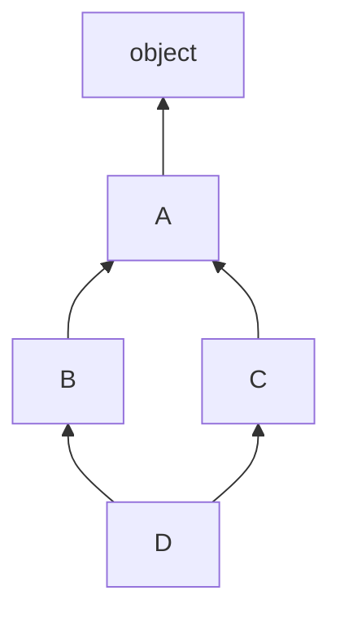

# Object-Oriented Programming in Python

Python's object system is flexible and introspectable: classes are objects, methods are plain functions until accessed through an instance, and "magic" behavior (printing, comparison, iteration, operators) is customized through dunder methods. Interviews probe OOP in Python along two axes — can you *use* it idiomatically (dataclasses, properties, ABCs) and do you *understand* it (MRO, descriptors, `__slots__`). This file covers both.

## Classes and Method Types

```python
class Temperature:
    unit = "C"                       # class attribute (shared by all instances)

    def __init__(self, degrees):
        self.degrees = degrees       # instance attribute

    def is_freezing(self):           # instance method: receives the instance
        return self.degrees <= 0

    @classmethod
    def from_fahrenheit(cls, f):     # receives the CLASS -- alternative constructor
        return cls((f - 32) * 5 / 9)

    @staticmethod
    def valid(degrees):              # receives nothing -- namespaced utility
        return degrees >= -273.15

t = Temperature.from_fahrenheit(32)
print(t.degrees, t.is_freezing())    # 0.0 True
print(Temperature.valid(-300))       # False
```

- **Instance methods** operate on per-object state (`self`).
- **Class methods** are primarily used as *alternative constructors* (`dict.fromkeys`, `datetime.fromtimestamp`); `cls` makes them subclass-friendly.
- **Static methods** are just functions grouped under the class namespace.

Watch the class-attribute trap: assigning `self.unit = "F"` creates an *instance* attribute that shadows the class attribute; mutating a mutable class attribute (like a list) affects every instance.

## Properties

Properties let you expose attribute-style access backed by methods — so you can start with a plain attribute and add validation later without breaking callers.

```python
class Account:
    def __init__(self, balance):
        self._balance = balance      # convention: underscore = internal

    @property
    def balance(self):               # getter: acct.balance
        return self._balance

    @balance.setter
    def balance(self, value):        # setter: acct.balance = x
        if value < 0:
            raise ValueError("balance cannot be negative")
        self._balance = value

acct = Account(100)
acct.balance = 50                    # goes through the setter
# acct.balance = -1                  # ValueError
```

This is why idiomatic Python avoids Java-style `get_x()`/`set_x()` methods: plain attributes can be upgraded to properties transparently.

## Dunder Methods

Dunder ("double underscore") methods let your objects participate in Python's protocols.

```python
class Vector:
    def __init__(self, x, y):
        self.x, self.y = x, y

    def __repr__(self):                       # unambiguous, for developers
        return f"Vector({self.x!r}, {self.y!r})"

    def __eq__(self, other):
        if not isinstance(other, Vector):
            return NotImplemented             # let Python try the other side
        return (self.x, self.y) == (other.x, other.y)

    def __hash__(self):                       # required if __eq__ is defined
        return hash((self.x, self.y))         # and you want hashability

    def __add__(self, other):                 # operator overloading: v1 + v2
        return Vector(self.x + other.x, self.y + other.y)

    def __mul__(self, scalar):                # v * 2
        return Vector(self.x * scalar, self.y * scalar)

    def __len__(self):                        # len(v) -- must return int >= 0
        return 2

v = Vector(1, 2) + Vector(3, 4)
print(v)                    # Vector(4, 6)
print(v == Vector(4, 6))    # True
print({v})                  # works because __hash__ is defined
```

Key rules interviewers look for:

- Defining `__eq__` sets `__hash__ = None` unless you define it too — equal objects **must** hash equal.
- Return `NotImplemented` (not `False`, and don't raise) from comparison dunders for unsupported types, so Python can try the reflected operation (`__radd__`, etc.).
- `__repr__` should be unambiguous (ideally eval-able); `__str__` is for end users and falls back to `__repr__`.
- Containers use `__len__`, `__getitem__`, `__contains__`, `__iter__` — implement these to make your class feel built-in.

## Inheritance and the MRO

With multiple inheritance, Python must decide the order in which base classes are searched for attributes. That order is the **Method Resolution Order (MRO)**, computed by **C3 linearization**: each class comes before its parents, and the left-to-right order of bases is preserved.



```python
class A:
    def who(self): return "A"

class B(A):
    def who(self): return "B"

class C(A):
    def who(self): return "C"

class D(B, C):
    pass

print(D().who())                       # B
print([cls.__name__ for cls in D.__mro__])   # ['D', 'B', 'C', 'A', 'object']
```

The classic "diamond": `D -> B -> C -> A -> object`. Note that `A` appears **once**, after both `B` and `C` — C3 guarantees each class appears exactly once and monotonicity holds. An impossible ordering (e.g. `class X(A, B)` where `B` is a subclass of `A` listed later... reversed constraints) raises `TypeError` at class-creation time.

### `super()` follows the MRO, not "the parent"

```python
class A:
    def setup(self):
        print("A")

class B(A):
    def setup(self):
        print("B"); super().setup()

class C(A):
    def setup(self):
        print("C"); super().setup()

class D(B, C):
    def setup(self):
        print("D"); super().setup()

D().setup()      # D B C A  -- B's super() calls C, not A!
```

`super()` means "the next class in the *instance's* MRO", which is what makes cooperative multiple inheritance (and mixins) work.

## Abstract Base Classes

ABCs define required interfaces and prevent instantiation of incomplete implementations.

```python
from abc import ABC, abstractmethod

class Storage(ABC):
    @abstractmethod
    def save(self, key: str, data: bytes) -> None: ...

    @abstractmethod
    def load(self, key: str) -> bytes: ...

class S3Storage(Storage):
    def save(self, key, data): print(f"uploading {key}")
    def load(self, key): return b"..."

# Storage()                     # TypeError: can't instantiate abstract class
s = S3Storage()                  # OK: all abstract methods implemented
```

ABCs give you *nominal* interface checking (fail at instantiation time). For *structural* typing, prefer `typing.Protocol` (see the Type Hints guide). Real-world use: plugin systems, repository patterns, and swapping storage/payment/notification backends in web services.

## Dataclasses

`@dataclass` generates `__init__`, `__repr__`, `__eq__` (and optionally ordering, hashing, immutability) from annotated fields — killing boilerplate.

```python
from dataclasses import dataclass, field

@dataclass(frozen=True, slots=True)      # immutable + memory-efficient
class Point:
    x: float
    y: float
    tags: tuple[str, ...] = ()

@dataclass
class Basket:
    items: list[str] = field(default_factory=list)   # NEVER items: list = []
    # A bare mutable default raises ValueError -- dataclasses protect you
    # from the shared-mutable-default bug.

p = Point(1.0, 2.0)
print(p)                     # Point(x=1.0, y=2.0, tags=())
# p.x = 5                    # FrozenInstanceError
```

Use dataclasses for data-shaped objects (configs, DTOs, results); use plain classes when behavior dominates; use `pydantic` when you need runtime validation/parsing (ubiquitous in FastAPI).

## `__slots__`

By default every instance carries a `__dict__` for its attributes. `__slots__` replaces it with fixed descriptor slots, cutting memory (often 3-5x for small objects) and slightly speeding attribute access — at the cost of dynamic attribute assignment.

```python
class Slim:
    __slots__ = ("x", "y")
    def __init__(self, x, y):
        self.x, self.y = x, y

s = Slim(1, 2)
# s.z = 3          # AttributeError: 'Slim' object has no attribute 'z'
```

Use `__slots__` (or `@dataclass(slots=True)`) when creating millions of small instances — e.g. rows in an in-memory index, particles in a simulation, nodes in a graph.

## Best Practices

- Always implement `__repr__`; it pays for itself the first time you debug or log the object.
- If you define `__eq__`, decide hashability deliberately: define a consistent `__hash__`, or accept unhashable instances.
- Return `NotImplemented` from binary dunders for foreign types instead of raising or returning `False`.
- Prefer `@dataclass` for data carriers; add `frozen=True` for value objects, `slots=True` for high-volume ones.
- Use `@classmethod` for alternative constructors instead of overloading `__init__` with flags.
- Prefer composition over deep inheritance; when using multiple inheritance, keep it to cooperative mixins and always call `super().__init__(**kwargs)` in every class of the hierarchy.
- Expose plain attributes first; upgrade to `@property` only when you need validation or computation — never write `get_x()`/`set_x()`.
- Don't fight the language with name mangling (`__private`); a single underscore plus discipline is the Python convention.

## Interview Questions

<details>
<summary>Instance method vs class method vs static method — when do you use each?</summary>
Instance methods take <code>self</code> and act on per-object state — the default. Class methods take <code>cls</code> and are used mainly as alternative constructors (<code>Date.from_iso(...)</code>) that automatically work for subclasses. Static methods take neither and are just utility functions namespaced under the class; if it doesn't touch <code>cls</code> or <code>self</code>, it could also be a module-level function.
</details>

<details>
<summary>What is the MRO and how does C3 linearization order the diamond <code>D(B, C)</code> with both inheriting from <code>A</code>?</summary>
The MRO is the deterministic order Python searches classes for attributes: for the diamond it is D, B, C, A, object. C3 linearization guarantees (1) a class precedes its parents, (2) the left-to-right base order in the class statement is preserved, and (3) each class appears exactly once — so <code>A</code> is visited only after <em>both</em> B and C. Inconsistent hierarchies raise TypeError at class-definition time. Inspect it with <code>D.__mro__</code> or <code>D.mro()</code>.
</details>

<details>
<summary>Why does <code>super()</code> in class B sometimes call a class that is not B's parent?</summary>
Because <code>super()</code> resolves to "the next class after B in the <em>instance's</em> MRO", not B's static base. In <code>D(B, C)</code> with an instance of D, B's <code>super()</code> is C. This enables cooperative multiple inheritance: every class calls <code>super()</code> once, and each implementation in the MRO runs exactly once regardless of the diamond shape.
</details>

<details>
<summary>You defined <code>__eq__</code> and now your objects can't go in a set. Why?</summary>
Defining <code>__eq__</code> without <code>__hash__</code> sets <code>__hash__</code> to None, making instances unhashable — Python does this because the default identity-based hash would violate the invariant that equal objects hash equally. Fix: define <code>__hash__</code> over the same fields used by <code>__eq__</code> (only if the object is effectively immutable), e.g. <code>hash((self.x, self.y))</code>, or use <code>@dataclass(frozen=True)</code> which generates both.
</details>

<details>
<summary>What do <code>__slots__</code> do, and what are the trade-offs?</summary>
<code>__slots__</code> replaces the per-instance <code>__dict__</code> with fixed slot descriptors declared at class level. Benefits: significantly less memory per instance and faster attribute access. Costs: no dynamic attributes, no default <code>__weakref__</code> slot (unless added), trickier multiple inheritance (both bases having non-empty slots conflicts), and subclasses without slots silently regain a dict. Best for millions of small, fixed-shape objects.
</details>

<details>
<summary>Dataclass vs NamedTuple vs plain class vs pydantic model?</summary>
<code>@dataclass</code>: mutable-by-default data carrier with generated init/repr/eq, supports defaults, slots, frozen — the modern default. <code>NamedTuple</code>: immutable, iterable/unpackable, tuple-compatible — good for small records returned from functions. Plain class: when behavior and invariants dominate over data shape. Pydantic <code>BaseModel</code>: runtime validation, coercion, and JSON (de)serialization — the standard for API boundaries such as FastAPI request/response models. Dataclasses do <em>not</em> validate types at runtime.
</details>

<details>
<summary>What's the difference between <code>__repr__</code> and <code>__str__</code>?</summary>
<code>__repr__</code> targets developers: unambiguous, ideally <code>eval</code>-able, used in the REPL, containers, and debuggers. <code>__str__</code> targets end users: readable output for <code>print()</code> and <code>str()</code>. If <code>__str__</code> is missing, Python falls back to <code>__repr__</code> — so implement <code>__repr__</code> first, and note that formatting a list of objects always uses each element's <code>__repr__</code>.
</details>

<details>
<summary>How do abstract base classes differ from Protocols?</summary>
ABCs are nominal: a class must explicitly inherit (or be registered) and instantiation fails until all <code>@abstractmethod</code>s are implemented — enforcement at runtime instantiation. Protocols (PEP 544) are structural: any class with matching method signatures conforms, checked statically by mypy/pyright with no inheritance required (and optionally at runtime via <code>@runtime_checkable</code> isinstance checks on method <em>presence</em>). Use ABCs for framework base classes with shared behavior; Protocols for decoupled "duck-typed" interfaces.
</details>
