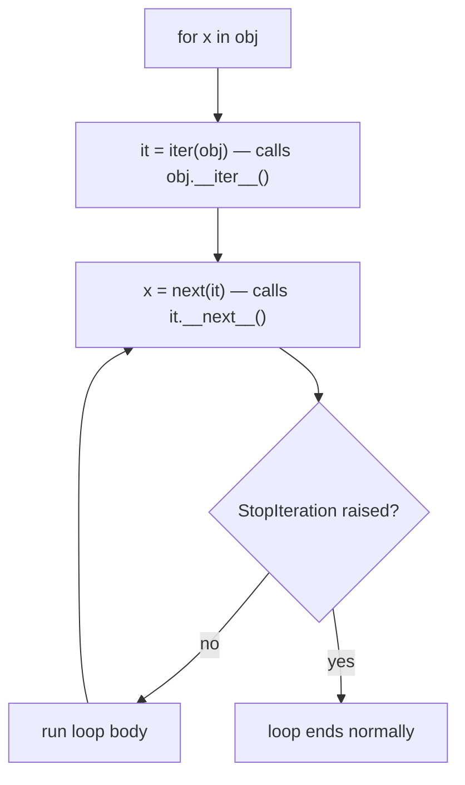

# Iterators, Generators, and Decorators

Iteration and decoration are Python's two most distinctive protocols. The iterator protocol powers every `for` loop; generators make lazy, memory-efficient pipelines trivial to write; decorators wrap functions with reusable behavior like caching, retries, and logging. Interviewers love these topics because implementing "a decorator from scratch" or "explain what `yield` does" quickly reveals depth of understanding.

## The Iterator Protocol

An **iterable** is anything with `__iter__` (returns an iterator). An **iterator** has `__next__` (returns the next item or raises `StopIteration`) and its own `__iter__` returning itself. A `for` loop is sugar over this protocol.



```python
class Countdown:
    """An iterable that produces a fresh iterator each time."""
    def __init__(self, start):
        self.start = start

    def __iter__(self):
        return CountdownIterator(self.start)

class CountdownIterator:
    def __init__(self, current):
        self.current = current

    def __iter__(self):
        return self                      # iterators are self-iterable

    def __next__(self):
        if self.current <= 0:
            raise StopIteration
        self.current -= 1
        return self.current + 1

print(list(Countdown(3)))    # [3, 2, 1]
```

Iterators are **exhaustible** — a classic trap:

```python
it = iter([1, 2, 3])
print(list(it))    # [1, 2, 3]
print(list(it))    # []  -- surprise! The iterator is spent.
# Lists are iterables (fresh iterator each time); iterators are one-shot.
```

## Generators and `yield`

A generator function contains `yield`; calling it runs *no code* — it returns a generator object implementing the iterator protocol. Each `next()` resumes execution until the next `yield`, preserving all local state between calls.

```python
def countdown(start):
    print("starting")            # runs on FIRST next(), not at call time
    while start > 0:
        yield start
        start -= 1

gen = countdown(3)               # nothing printed yet -- lazy!
print(next(gen))                 # starting \n 3
print(next(gen))                 # 2
print(list(gen))                 # [1] -- consumes the rest
```

Generators shine for **memory**: they produce items one at a time instead of materializing everything.

```python
import sys

squares_list = [n * n for n in range(1_000_000)]    # list: all in memory
squares_gen = (n * n for n in range(1_000_000))     # generator expression: lazy
print(sys.getsizeof(squares_list))   # ~8,000,000+ bytes
print(sys.getsizeof(squares_gen))    # ~200 bytes

# Lazy pipelines compose without intermediate lists:
lines = (line.strip() for line in open("data.txt"))       # imagine a huge file
non_blank = (l for l in lines if l)
total = sum(len(l) for l in non_blank)   # constant memory regardless of file size
```

Two more generator features worth naming in interviews:

```python
def flatten(nested):
    for item in nested:
        if isinstance(item, list):
            yield from flatten(item)     # delegate to a sub-generator
        else:
            yield item

print(list(flatten([1, [2, [3, 4]], 5])))   # [1, 2, 3, 4, 5]
```

`yield from` delegates to another iterable; generators also support `.send()`, `.throw()`, and `.close()` (coroutine features that historically led to `async`/`await`).

## `itertools` Highlights

```python
import itertools as it

print(list(it.islice(it.count(10, 2), 3)))          # [10, 12, 14] (infinite counter, sliced)
print(list(it.chain([1, 2], [3, 4])))              # [1, 2, 3, 4]
print(list(it.pairwise("abc")))                     # [('a','b'), ('b','c')]  (3.10+)
print(list(it.combinations([1, 2, 3], 2)))          # [(1,2), (1,3), (2,3)]
print(list(it.permutations("ab")))                  # [('a','b'), ('b','a')]
print(list(it.product([0, 1], repeat=2)))           # [(0,0), (0,1), (1,0), (1,1)]
print(list(it.accumulate([1, 2, 3, 4])))            # [1, 3, 6, 10] (running sum)

# groupby requires SORTED input by the same key -- classic pitfall
words = sorted(["apple", "ant", "bee", "bear"], key=lambda w: w[0])
for letter, group in it.groupby(words, key=lambda w: w[0]):
    print(letter, list(group))    # a ['ant','apple'] / b ['bear','bee']
```

## Decorators from Scratch

A decorator is a callable that takes a function and returns a replacement. `@deco` above a `def` is exactly `func = deco(func)`.

```python
import functools
import time

def timed(func):
    @functools.wraps(func)                 # preserve __name__, __doc__, etc.
    def wrapper(*args, **kwargs):
        start = time.perf_counter()
        try:
            return func(*args, **kwargs)
        finally:
            elapsed = time.perf_counter() - start
            print(f"{func.__name__} took {elapsed:.4f}s")
    return wrapper

@timed
def slow_add(a, b):
    time.sleep(0.1)
    return a + b

print(slow_add(2, 3))        # slow_add took 0.1001s \n 5
print(slow_add.__name__)     # slow_add -- thanks to functools.wraps
# Without @functools.wraps this would print "wrapper", breaking introspection,
# help(), pickling, and some frameworks.
```

### Decorators with arguments

A parameterized decorator needs **three** layers: the factory takes the arguments and returns a decorator.

```python
import functools

def retry(times=3, exceptions=(Exception,)):
    def decorator(func):
        @functools.wraps(func)
        def wrapper(*args, **kwargs):
            for attempt in range(1, times + 1):
                try:
                    return func(*args, **kwargs)
                except exceptions:
                    if attempt == times:
                        raise
                    print(f"attempt {attempt} failed, retrying...")
        return wrapper
    return decorator

@retry(times=2, exceptions=(ValueError,))     # note: retry(...) is CALLED first
def flaky():
    raise ValueError("boom")

# flaky()   # attempt 1 failed, retrying... then ValueError propagates
```

Decorators stack bottom-up: with `@a` above `@b`, the result is `a(b(func))`. Real-world examples you should be able to cite: `@app.get("/users")` in FastAPI (registration), `@login_required` in Django (authorization), `@functools.lru_cache` (caching), `@pytest.fixture` (testing), `@retry` in tenacity (resilience).

## Context Managers

The `with` statement guarantees setup/teardown via `__enter__` and `__exit__` — even when exceptions fly.

```python
class Timer:
    def __enter__(self):
        self.start = time.perf_counter()
        return self                              # bound to the `as` target

    def __exit__(self, exc_type, exc, tb):
        self.elapsed = time.perf_counter() - self.start
        return False    # False = propagate exceptions; True would swallow them

with Timer() as t:
    sum(range(1_000_000))
print(f"{t.elapsed:.4f}s")
```

`contextlib.contextmanager` builds one from a generator — the code before `yield` is `__enter__`, after it is `__exit__`:

```python
from contextlib import contextmanager

@contextmanager
def temp_setting(config, key, value):
    old = config[key]
    config[key] = value
    try:
        yield config           # with-body runs here
    finally:
        config[key] = old      # always restored, even on exceptions

config = {"debug": False}
with temp_setting(config, "debug", True):
    print(config["debug"])     # True
print(config["debug"])         # False
```

Other `contextlib` gems: `suppress(FileNotFoundError)`, `closing(obj)`, and `ExitStack` for managing a dynamic number of context managers. Real-world uses: file handles, database transactions (`with session.begin():`), locks (`with lock:`), and temporary state in tests.

## Best Practices

- Prefer generators/generator expressions when data is large or streamed; materialize with `list()` only when you need multiple passes, `len()`, or indexing.
- Remember iterators are one-shot; if a function may iterate its input twice, document it or copy to a list first.
- Always use `@functools.wraps` in decorator wrappers — no exceptions.
- Keep decorators transparent: accept `*args, **kwargs`, return the wrapped result, and avoid changing the signature's meaning.
- Use `@contextmanager` with `try/finally` around the `yield` — otherwise cleanup is skipped when the body raises.
- Return `False` (or `None`) from `__exit__` unless you deliberately intend to swallow exceptions.
- Reach for `itertools` before writing manual index juggling; remember `groupby` needs sorted input.
- Don't overuse `.send()`-style generator coroutines in new code — `async`/`await` superseded them.

## Interview Questions

<details>
<summary>What's the difference between an iterable and an iterator?</summary>
An iterable has <code>__iter__</code> returning an iterator (lists, dicts, strings, generators). An iterator additionally has <code>__next__</code> and returns itself from <code>__iter__</code>; it is stateful and one-shot, raising <code>StopIteration</code> when exhausted. Every iterator is an iterable, not vice versa. Consequence: you can loop over a list many times, but over an iterator only once.
</details>

<details>
<summary>What happens when you call a generator function?</summary>
Nothing in its body executes; you get back a generator object. The first <code>next()</code> runs code until the first <code>yield</code>, which produces a value and suspends the frame — locals and instruction pointer preserved. Each subsequent <code>next()</code> resumes after the <code>yield</code>. A <code>return</code> (or falling off the end) raises <code>StopIteration</code>, which <code>for</code> loops absorb.
</details>

<details>
<summary>Generator expression vs list comprehension — how do you choose?</summary>
A list comprehension materializes every element immediately: O(n) memory, supports len/indexing/multiple passes. A generator expression is lazy: O(1) memory, single pass, and can short-circuit (e.g. <code>any(p(x) for x in xs)</code> stops at the first hit). Prefer generators when feeding an aggregator (<code>sum</code>, <code>max</code>, <code>join</code>) or processing large/streaming data; prefer lists when you need the whole result.
</details>

<details>
<summary>Write a decorator and explain what <code>functools.wraps</code> does.</summary>
<pre><code>import functools
def log_calls(func):
    @functools.wraps(func)
    def wrapper(*args, **kwargs):
        print(f"calling {func.__name__}")
        return func(*args, **kwargs)
    return wrapper
</code></pre>
<code>@log_calls</code> is sugar for <code>f = log_calls(f)</code>. <code>functools.wraps</code> copies <code>__name__</code>, <code>__doc__</code>, <code>__module__</code>, <code>__qualname__</code>, and <code>__wrapped__</code> from the original onto the wrapper, so introspection, help(), tracebacks, and tools that unwrap decorators keep working. Omitting it is the most common decorator bug.
</details>

<details>
<summary>How does a decorator that takes arguments differ structurally?</summary>
It's a decorator <em>factory</em> — three nested layers. <code>@retry(times=3)</code> first calls <code>retry(times=3)</code>, which returns the actual decorator; that decorator then receives the function and returns the wrapper. So: factory(args) → decorator(func) → wrapper(*a, **kw). A common trick to support both <code>@deco</code> and <code>@deco()</code> is checking whether the first argument is callable.
</details>

<details>
<summary>Explain <code>__enter__</code>/<code>__exit__</code> and what <code>__exit__</code>'s return value controls.</summary>
<code>with cm as x:</code> calls <code>cm.__enter__()</code> (its return value binds to <code>x</code>), runs the body, then always calls <code>cm.__exit__(exc_type, exc, tb)</code>. If the body raised, the exception triple is passed in; returning a truthy value suppresses the exception, falsy propagates it. This guarantees cleanup (files, locks, transactions) on all paths — the RAII of Python.
</details>

<details>
<summary>What does <code>yield from</code> do beyond a for-loop of yields?</summary>
<code>yield from sub</code> delegates to a sub-iterable: besides yielding all its values, it transparently forwards <code>.send()</code> and <code>.throw()</code> into the subgenerator and gives the delegating generator the subgenerator's return value (<code>StopIteration.value</code>) as the expression result. For plain iteration it's equivalent to a loop, but for generator-based coroutines the forwarding semantics matter — it was the foundation for <code>await</code>.
</details>

<details>
<summary>Why does itertools.groupby sometimes "lose" groups?</summary>
Because it only groups <em>consecutive</em> elements with equal keys — it's a streaming operator, not SQL GROUP BY. Unsorted input yields fragmented groups. Sort by the same key first, and consume each group before advancing, since the group iterators share the underlying stream and are invalidated by the next iteration step.
</details>
