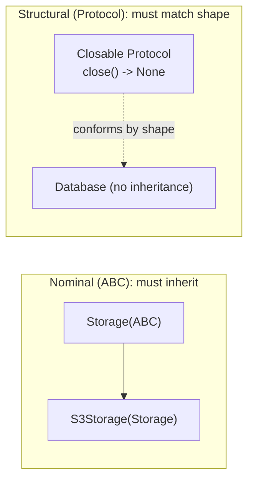

# Type Hints and Modern Python

Python remains dynamically typed at runtime, but since PEP 484 it has grown a rich *gradual typing* system checked by external tools (mypy, pyright). Modern codebases — especially FastAPI services and large monorepos — are typed by default, and interviews increasingly expect fluency in `Optional`, generics, `Protocol`, and the newest syntax (pattern matching, the walrus operator, 3.10–3.13 features). This file gets you current.

## Typing Basics

Annotations are metadata: the interpreter stores them but does **not** enforce them. Static checkers and frameworks (pydantic, FastAPI, dataclasses) are what give them power.

```python
def greet(name: str, times: int = 1) -> str:
    return ", ".join([f"Hello {name}"] * times)

greet(42, "x")   # runs fine at runtime! Only mypy/pyright will complain.
```

### Optional, Union, and the `|` syntax

```python
from typing import Optional, Union

# These three are equivalent; the last is preferred on 3.10+
def find_user(uid: int) -> Optional[str]: ...
def find_user2(uid: int) -> Union[str, None]: ...
def find_user3(uid: int) -> str | None: ...

def handle(value: int | str) -> str:      # union of types
    if isinstance(value, int):             # checkers "narrow" the type here
        return str(value + 1)
    return value.upper()                   # here value is known to be str
```

Note that `Optional[X]` means "X or None" — *not* "optional parameter". A parameter with a default is optional; its type is whatever you annotate.

### Generics and collections

```python
# 3.9+: subscript built-ins directly (no typing.List/Dict needed)
def tally(words: list[str]) -> dict[str, int]: ...
def first_pair(items: list[tuple[int, str]]) -> tuple[int, str]: ...

from typing import TypeVar
from collections.abc import Iterable, Sequence, Callable

T = TypeVar("T")

def first(items: Sequence[T]) -> T:            # generic function
    return items[0]

def apply(fn: Callable[[int], str], x: int) -> str:
    return fn(x)

# 3.12+ syntax: inline type parameters, no TypeVar boilerplate
def last[T](items: Sequence[T]) -> T:
    return items[-1]

class Stack[T]:                                # generic class (3.12+)
    def __init__(self) -> None:
        self._items: list[T] = []
    def push(self, item: T) -> None:
        self._items.append(item)
```

Prefer *abstract* parameter types (`Iterable`, `Sequence`, `Mapping` from `collections.abc`) and *concrete* return types (`list`, `dict`) — accept broadly, return precisely.

### TypedDict, Literal, and friends

```python
from typing import TypedDict, Literal, Final, Any

class UserPayload(TypedDict):          # types for dict-shaped (JSON) data
    id: int
    name: str
    role: Literal["admin", "member"]   # only these exact strings allowed

def promote(user: UserPayload) -> None:
    print(user["name"])                 # checker knows keys and value types
    # user["nmae"]                      # checker error: unknown key (typo caught!)

MAX_RETRIES: Final = 3                  # constant: reassignment is a checker error

def parse(raw: Any) -> int: ...         # Any disables checking -- use sparingly
```

`TypedDict` is the right tool for JSON API payloads when you don't want a full pydantic model; `Literal` encodes enums-of-strings; `Final` marks constants.

## Structural Typing with `Protocol`

Protocols (PEP 544) capture **duck typing** statically: anything with the right methods conforms — no inheritance required.

```python
from typing import Protocol

class Closable(Protocol):
    def close(self) -> None: ...

class Database:
    def close(self) -> None:            # never imports or mentions Closable
        print("db closed")

def shutdown(resource: Closable) -> None:
    resource.close()

shutdown(Database())     # OK: structural match -- "if it quacks, it types"
```



This is ideal for decoupling: your function can accept "anything with `.read()`" without depending on a base class from another package. Compare Go interfaces or TypeScript structural types.

## mypy and pyright

- **mypy**: the reference checker; configured in `pyproject.toml`; run `mypy src/`. `--strict` turns on the full battery (no implicit `Any`, required annotations).
- **pyright**: Microsoft's checker, powers Pylance in VS Code; very fast, often stricter inference.

```toml
# pyproject.toml
[tool.mypy]
strict = true
python_version = "3.12"
```

Gradual adoption strategy for real codebases: type new code, enable `strict` per-module, use `# type: ignore[code]` sparingly with the specific error code.

## Pattern Matching (`match`/`case`, 3.10+)

Structural pattern matching destructures and branches in one construct — far more than a switch statement.

```python
def describe(event: object) -> str:
    match event:
        case {"type": "click", "x": x, "y": y}:            # mapping pattern
            return f"click at ({x}, {y})"
        case {"type": "key", "key": ("ctrl" | "cmd") as mod}:  # or-pattern + capture
            return f"modifier {mod}"
        case [first, *rest] if len(rest) > 2:              # sequence pattern + guard
            return f"long list starting with {first}"
        case Point(x=0, y=0):                              # class pattern
            return "origin"
        case Point(x=x, y=y):
            return f"point ({x}, {y})"
        case _:                                            # wildcard
            return "unknown"

from dataclasses import dataclass

@dataclass
class Point:
    x: int
    y: int
```

Pitfall: a bare name in a `case` is a **capture pattern**, not a comparison — `case status:` matches *everything* and binds it to `status`. To compare against a constant, use a dotted name (`case HttpStatus.OK:`) or a literal.

## The Walrus Operator (`:=`, 3.8+)

Assignment expressions bind a name *inside* an expression — killing the "compute, test, use" duplication.

```python
import re

# Before: compute twice or split across lines
line = "user=ada id=42"
if (m := re.search(r"id=(\d+)", line)):
    print(m.group(1))                    # 42

# In while loops: read-until-empty without duplication
# while (chunk := file.read(8192)):
#     process(chunk)

# In comprehensions: compute once, use twice
data = [1, 4, 9]
results = [y for x in data if (y := x * 2) > 4]
print(results)                           # [8, 18]
```

Use it where it removes duplication; don't cram it into already-dense expressions.

## Modern Syntax by Version (3.10–3.13)

| Version | Highlights |
|---|---|
| **3.10** | `match`/`case`; `X \| Y` union syntax; `itertools.pairwise`; better error messages (precise locations) |
| **3.11** | Big speedups (specializing interpreter, ~25% faster); `ExceptionGroup` and `except*`; `tomllib`; `Self` type; fine-grained tracebacks |
| **3.12** | Inline generics `def f[T](...)` and `type Alias = ...`; f-strings fully re-parsed (nesting, reused quotes); per-interpreter GIL groundwork (PEP 684) |
| **3.13** | Experimental **free-threaded** build (PEP 703, no GIL); experimental JIT (PEP 744); vastly improved REPL (colors, multiline editing); `@deprecated` |

```python
# 3.12 type alias statement
type Vector = list[float]
type Pair[T] = tuple[T, T]

# 3.11 Self type -- fluent builders without TypeVar gymnastics
from typing import Self

class QueryBuilder:
    def where(self, clause: str) -> Self:    # subclasses return the subclass type
        return self
```

**Real-world applications:** FastAPI derives request validation and OpenAPI docs entirely from type hints; pydantic validates settings and payloads; typed codebases at scale (Dropbox, Instagram) rely on mypy/pyright in CI to make refactors safe.

## Best Practices

- Type all public function signatures; let local variable types be inferred.
- Use `X | None` (3.10+) instead of `Optional[X]`, and built-in generics (`list[int]`) instead of `typing.List`.
- Accept abstract types (`Iterable`, `Mapping`, `Callable`), return concrete ones.
- Prefer `Protocol` over ABCs for cross-package interfaces; keep protocols small (one to three methods).
- Reach for `TypedDict` at JSON boundaries and `Literal` for closed string sets before creating full classes.
- Run mypy or pyright in CI; treat new `Any` leakage as a review flag, and always scope `# type: ignore[...]` to an error code.
- In `match` statements, remember bare names capture; compare constants via dotted names, and always include a `case _:` when exhaustiveness matters.
- Use the walrus operator to eliminate duplicated computation, not to shorten clear code into clever code.

## Interview Questions

<details>
<summary>Do type hints affect runtime behavior?</summary>
Essentially no — CPython stores annotations (accessible via <code>__annotations__</code>) but never enforces them; <code>def f(x: int)</code> happily accepts a string. Enforcement comes from static checkers (mypy/pyright) at development time, or from libraries that consume annotations at runtime, such as pydantic and FastAPI (validation), dataclasses (field generation), and functools.singledispatch.
</details>

<details>
<summary>What is the difference between nominal and structural typing in Python?</summary>
Nominal typing (ABCs, regular inheritance) requires an explicit subtype relationship: a class conforms because it inherits. Structural typing (<code>typing.Protocol</code>) requires only a matching shape: any class with the right methods/attributes conforms, no inheritance or import needed — static duck typing. Protocols decouple consumers from providers, similar to Go interfaces; use <code>@runtime_checkable</code> to allow isinstance checks (which verify method presence only, not signatures).
</details>

<details>
<summary>What does <code>Optional[int]</code> mean, and what's a common misreading?</summary>
It means <code>int | None</code> — the value may be None — and nothing else. The misreading is thinking it marks an optional <em>parameter</em>; optionality of a parameter comes from having a default value. So <code>def f(x: int = 0)</code> is an optional parameter that is never None, while <code>def f(x: Optional[int])</code> is a required parameter that might be None. On 3.10+ write <code>int | None</code>.
</details>

<details>
<summary>When would you use TypedDict instead of a dataclass or pydantic model?</summary>
TypedDict types <em>existing dict-shaped data</em> — JSON payloads, config dicts — with zero runtime cost and no conversion: the object stays a plain dict, but checkers validate keys and value types statically. Choose a dataclass when you want a real object with methods and identity; choose pydantic when you need <em>runtime</em> validation/coercion at trust boundaries. TypedDict does not validate anything at runtime.
</details>

<details>
<summary>In a <code>match</code> statement, why does <code>case OK:</code> behave unexpectedly?</summary>
A bare name in a pattern is a capture pattern: it matches any subject and binds it to that name — it does not compare against an existing variable <code>OK</code>. So <code>case OK:</code> always matches and shadows <code>OK</code>. To compare with a constant, use a qualified dotted name (<code>case Status.OK:</code>), a literal (<code>case 200:</code>), or a guard (<code>case s if s == OK:</code>).
</details>

<details>
<summary>What does the walrus operator do, and give a genuinely good use case.</summary>
<code>:=</code> is an assignment <em>expression</em>: it binds a name and yields the value inside a larger expression. Canonical wins: <code>while (chunk := f.read(8192)):</code> (loop-and-test without duplication), <code>if (m := re.search(...)):</code> then use <code>m</code>, and comprehensions that need a computed value in both the filter and the output. It differs from <code>=</code>, which is a statement and illegal in those positions.
</details>

<details>
<summary>Name several impactful features from Python 3.10–3.13.</summary>
3.10: structural pattern matching and <code>X | Y</code> unions. 3.11: ~25% average speedup from the specializing adaptive interpreter, ExceptionGroup/<code>except*</code>, and the <code>Self</code> type. 3.12: native generic syntax <code>def f[T]()</code>, the <code>type</code> alias statement, and more capable f-strings. 3.13: the experimental free-threaded (no-GIL) build per PEP 703, an experimental JIT, and the modernized interactive REPL.
</details>
