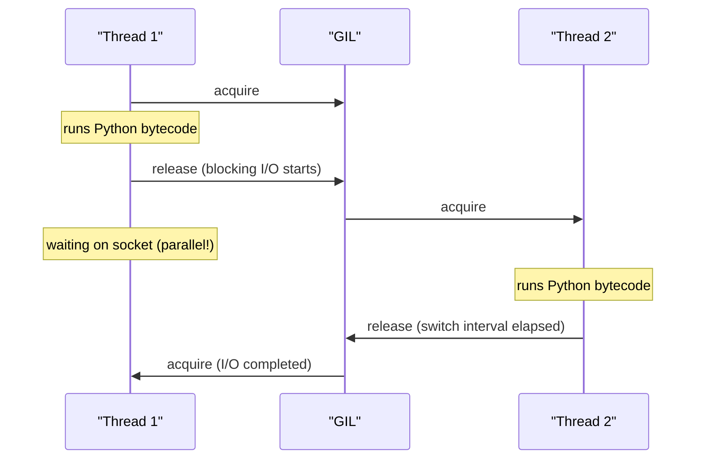
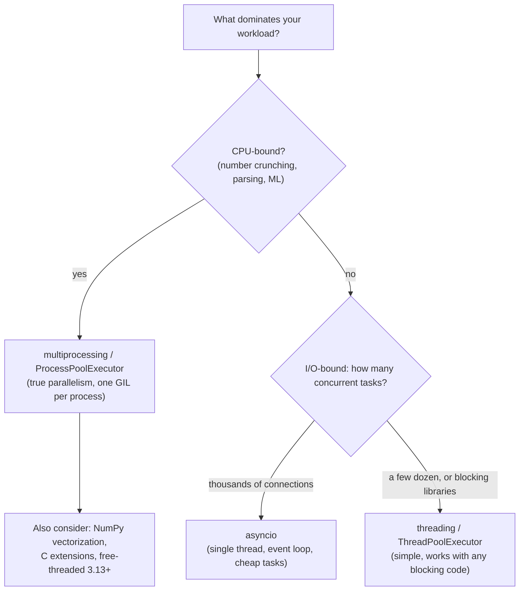

# Concurrency in Python

Concurrency is where Python interviews get serious: the Global Interpreter Lock (GIL) is probably the single most-asked "explain X" question for Python roles. This file explains what the GIL actually locks, gives you a decision framework for threading vs multiprocessing vs asyncio, walks through `async`/`await` and the event loop, and covers where free-threaded Python (PEP 703) stands today.

## The GIL: What It Actually Locks

The **Global Interpreter Lock** is a mutex in CPython that allows only **one thread at a time to execute Python bytecode**. It exists because CPython's memory management (reference counting) is not thread-safe; a single global lock is a simple, fast way to protect it.

Precision matters in interviews:

- The GIL locks the *interpreter*, not your data. Two threads can still interleave between bytecodes, so **race conditions absolutely still happen** — you still need `threading.Lock` for compound operations.
- Threads *do* run concurrently for **I/O**: when a thread blocks on a socket, file, or `time.sleep`, it **releases the GIL** and another thread runs.
- C extensions (NumPy, hashing, compression) often release the GIL during heavy computation, so even some CPU-bound work parallelizes in threads.
- A running thread is also forced to release the GIL periodically (`sys.getswitchinterval()`, 5 ms by default) so others can run — concurrency, but not parallelism.



```python
import threading

counter = 0

def bump():
    global counter
    for _ in range(100_000):
        counter += 1          # NOT atomic: load, add, store -- three steps

threads = [threading.Thread(target=bump) for _ in range(4)]
for t in threads: t.start()
for t in threads: t.join()
print(counter)                # often < 400000 -- the GIL did NOT save you!

# Fix: guard the compound operation
lock = threading.Lock()
def bump_safe():
    global counter
    for _ in range(100_000):
        with lock:
            counter += 1
```

## Threading vs Multiprocessing vs Asyncio

The decision hinges on one question: is the workload **I/O-bound** (waiting on network/disk) or **CPU-bound** (computing)?



| | threading | multiprocessing | asyncio |
|---|---|---|---|
| Parallel CPU work | No (GIL) | **Yes** | No |
| Concurrent I/O | Yes | Yes (overkill) | **Yes, at scale** |
| Memory model | Shared (locks needed) | Separate (IPC/pickling) | Shared, single-threaded |
| Cost per task | ~MB stack per thread | Process fork/spawn | ~KB per task |
| Works with blocking libs | Yes | Yes | No (needs async libs) |

## `concurrent.futures` — the High-Level API

Prefer executors over raw `Thread`/`Process` objects.

```python
from concurrent.futures import ThreadPoolExecutor, ProcessPoolExecutor, as_completed
import urllib.request

URLS = ["https://example.com", "https://python.org", "https://pypi.org"]

def fetch(url):
    with urllib.request.urlopen(url, timeout=10) as r:
        return url, len(r.read())

# I/O-bound -> threads
with ThreadPoolExecutor(max_workers=8) as pool:
    futures = {pool.submit(fetch, u): u for u in URLS}
    for fut in as_completed(futures):
        url, size = fut.result()          # re-raises worker exceptions here
        print(url, size)

# CPU-bound -> processes (must be under __main__ guard on Windows/macOS spawn)
def is_prime(n):
    return n > 1 and all(n % i for i in range(2, int(n ** 0.5) + 1))

if __name__ == "__main__":
    with ProcessPoolExecutor() as pool:
        print(list(pool.map(is_prime, [112272535095293, 115280095190773])))
```

## `async`/`await` and the Event Loop

`asyncio` achieves concurrency with a **single thread**: an event loop runs coroutines, and every `await` on I/O is a point where the coroutine *yields control* so the loop can run others. It is **cooperative** multitasking — nothing preempts a coroutine; blocking code blocks everyone.

```python
import asyncio

async def fetch_user(uid):
    await asyncio.sleep(1)          # simulates non-blocking I/O
    return f"user-{uid}"

async def main():
    # Sequential: ~3 seconds
    # a = await fetch_user(1); b = await fetch_user(2); c = await fetch_user(3)

    # Concurrent: ~1 second -- all three "sleep" overlap on the loop
    results = await asyncio.gather(fetch_user(1), fetch_user(2), fetch_user(3))
    print(results)                  # ['user-1', 'user-2', 'user-3']

    # 3.11+ structured concurrency: TaskGroup cancels siblings on failure
    async with asyncio.TaskGroup() as tg:
        t1 = tg.create_task(fetch_user(4))
        t2 = tg.create_task(fetch_user(5))
    print(t1.result(), t2.result())

asyncio.run(main())
```

Critical rules:

```python
async def bad_handler():
    time.sleep(5)          # BAD: blocks the entire event loop -- every request stalls
    requests.get(url)      # BAD: blocking HTTP client in async code

async def good_handler():
    await asyncio.sleep(5)                       # yields to the loop
    # use an async client: await httpx_client.get(url)
    # or push blocking work to a thread:
    data = await asyncio.to_thread(blocking_io_call)
```

Also remember: calling a coroutine function returns a coroutine object; nothing runs until it is awaited or scheduled (`asyncio.create_task`). A never-awaited coroutine triggers a `RuntimeWarning`.

**Real-world applications:** asyncio powers FastAPI/Starlette and aiohttp servers handling thousands of concurrent connections per process; thread pools back "sync" endpoints and legacy SDK calls; multiprocessing (or better: NumPy/polars vectorization) handles CPU-heavy ETL; celery/RQ move CPU work out of web processes entirely.

## Free-Threaded Python (PEP 703)

PEP 703 removes the GIL. Status as of Python 3.13:

- 3.13 ships an **optional free-threaded build** (`python3.13t`), officially *experimental*. The default build keeps the GIL.
- Reference counting becomes thread-safe via biased reference counting plus per-object locks; the specializing interpreter needed rework.
- Single-threaded code pays an overhead (initially ~10-40%, shrinking in 3.14+), which is why it is opt-in.
- C extensions must be rebuilt/audited for thread safety; ecosystem support (NumPy etc.) is actively rolling out.
- The long-term plan (PEP 779 acceptance path) is for free-threading to become supported and eventually the default once overhead and compatibility are acceptable. Related: PEP 684 gave each subinterpreter its own GIL in 3.12.

Interview takeaway: "the GIL is gone" is wrong; "CPython 3.13+ offers an experimental GIL-free build, with the standard build unchanged" is right.

## Best Practices

- Classify the workload first: I/O-bound → threads or asyncio; CPU-bound → processes or vectorized/native code. Say this out loud in interviews before picking a tool.
- Use `concurrent.futures` executors (and `asyncio.TaskGroup`) rather than hand-managing threads/processes/tasks.
- The GIL is not a correctness tool: guard shared mutable state with locks, or avoid sharing (queues, message passing).
- Never call blocking functions inside a coroutine; use async libraries or `asyncio.to_thread`.
- Always `asyncio.gather`/TaskGroup your independent awaits — sequential `await`s are the most common async performance bug.
- Put multiprocessing entry points under `if __name__ == "__main__":` and keep task payloads picklable and chunky (IPC has overhead).
- Set timeouts everywhere (`asyncio.wait_for`, socket timeouts, executor `result(timeout=...)`); untimed waits are production incidents waiting to happen.
- Prefer higher-level abstractions when they fit: task queues (celery), `multiprocessing.Pool.map`, or simply vectorizing with NumPy.

## Interview Questions

<details>
<summary>What is the GIL, and why does CPython have it?</summary>
A mutex allowing only one thread to execute Python bytecode at a time in a CPython process. It exists chiefly to protect CPython's non-thread-safe reference-counting memory management (and other interpreter internals) cheaply; it also makes single-threaded execution and C extension integration simpler and faster. It is a CPython implementation detail — Jython and IronPython have no GIL, and CPython 3.13's free-threaded build removes it.
</details>

<details>
<summary>If the GIL only runs one thread at a time, are Python threads useless?</summary>
No. Threads excel at I/O-bound concurrency: a thread blocking on network/disk releases the GIL, so other threads run — 50 threads can wait on 50 sockets simultaneously. Many C extensions (NumPy, hashlib, zlib) also release the GIL during computation. Threads are only ineffective for parallelizing pure-Python CPU-bound code, where multiprocessing or native/vectorized code is the answer.
</details>

<details>
<summary>Does the GIL make Python code thread-safe?</summary>
No — this is the trap. The GIL serializes individual bytecode instructions, but operations like <code>counter += 1</code> compile to several bytecodes (load, add, store), and a thread switch between them loses updates. Compound operations on shared state still need <code>threading.Lock</code>, or you should avoid sharing via <code>queue.Queue</code>/message passing. Only some single-bytecode operations happen to be atomic, and you should not design around that.
</details>

<details>
<summary>How does asyncio achieve concurrency with one thread?</summary>
An event loop schedules coroutines cooperatively. When a coroutine hits <code>await</code> on a non-blocking operation, it suspends and returns control to the loop, which resumes another ready coroutine; OS-level readiness (epoll/kqueue) tells the loop when I/O completes. Because tasks are just objects (KBs, not MBs) and switching is a function call rather than a kernel context switch, one process can juggle tens of thousands of connections — but a single blocking call freezes everything, since nothing preempts a running coroutine.
</details>

<details>
<summary>When do you choose multiprocessing over threading, and what are its costs?</summary>
For CPU-bound pure-Python work: each process has its own interpreter and GIL, so you get true parallelism across cores. Costs: process startup (especially spawn on Windows/macOS), pickling of arguments/results for IPC, no cheap shared memory (you need <code>multiprocessing.shared_memory</code>, Managers, or queues), and higher memory footprint. Rule of thumb: make units of work large enough that compute dwarfs serialization overhead — or sidestep it by vectorizing with NumPy/polars.
</details>

<details>
<summary>What's wrong with <code>async def handler(): requests.get(url)</code>?</summary>
<code>requests.get</code> is blocking: it holds the thread, so the event loop cannot run any other task until it returns — one slow call stalls every request in the process. Fixes: use an async HTTP client (<code>httpx.AsyncClient</code>, <code>aiohttp</code>) with <code>await</code>, or offload to a thread with <code>await asyncio.to_thread(requests.get, url)</code>. The same applies to <code>time.sleep</code> vs <code>asyncio.sleep</code> and to blocking DB drivers.
</details>

<details>
<summary>What is free-threaded Python (PEP 703) and what is its current status?</summary>
An officially sanctioned CPython build without the GIL, first shipped as an experimental opt-in build in 3.13 (<code>python3.13t</code>). It makes refcounting thread-safe (biased reference counting, per-object locks), allowing true multi-threaded parallelism of Python code. Trade-offs: single-threaded overhead (being reduced each release), and C extensions need thread-safety audits and separate wheels. The default build still has the GIL; free-threading is on a path toward becoming fully supported and eventually default.
</details>

<details>
<summary>asyncio.gather vs sequential awaits vs TaskGroup?</summary>
<code>await a(); await b()</code> runs serially — total time is the sum. <code>await asyncio.gather(a(), b())</code> schedules both immediately and waits for all — total time is the max — with <code>return_exceptions=True</code> to collect failures. <code>asyncio.TaskGroup</code> (3.11+) is structured concurrency: tasks are scoped to the <code>async with</code> block, and if one fails the others are cancelled and errors surface as an ExceptionGroup — the safer modern default.
</details>
