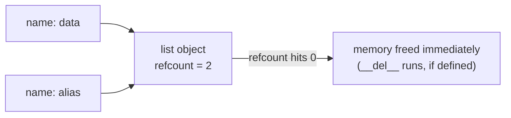
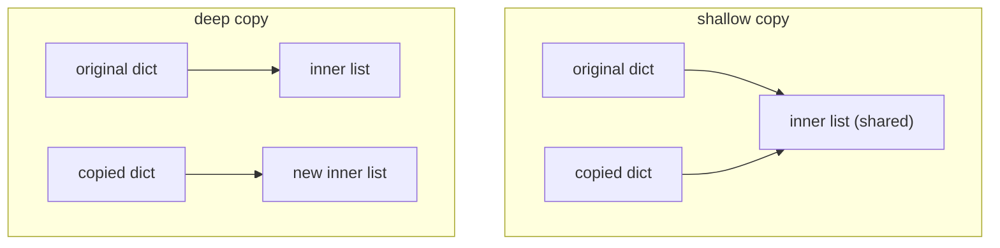

# Memory Management and Python Internals

CPython manages memory automatically with a two-part strategy: **reference counting** as the primary mechanism, backed by a **cyclic garbage collector** for the reference cycles that counting alone cannot free. Understanding this — plus interning, weak references, and copy semantics — lets you answer senior-level questions ("when exactly is an object freed?") and debug real memory leaks. This file covers the machinery and the tools to observe it.

## Reference Counting

Every CPython object carries a count of references pointing to it. Bindings, container insertions, and function arguments increment it; rebinding, `del`, and scope exit decrement it. **When the count hits zero, the object is freed immediately** — this is deterministic, unlike JVM/Go garbage collection.

```python
import sys

data = [1, 2, 3]
print(sys.getrefcount(data))   # 2 -- `data` plus the temporary argument reference!

alias = data
print(sys.getrefcount(data))   # 3

del alias
print(sys.getrefcount(data))   # 2
# Note: getrefcount always reports one extra, because passing `data`
# into the function creates a temporary reference.
```



Deterministic destruction is why CPython code *appears* to close files when they go out of scope — but you should still use `with`, because that behavior is an implementation detail (PyPy does not refcount).

## The Cycle-Detecting Garbage Collector

Reference counting has one blind spot: **cycles**. If A references B and B references A, both counts stay at 1 forever even when nothing else can reach them.

```python
import gc

class Node:
    def __init__(self):
        self.other = None

a, b = Node(), Node()
a.other = b
b.other = a          # cycle: a -> b -> a
del a, b             # refcounts stay > 0; refcounting alone leaks these

print(gc.collect())  # e.g. 4 -- the cyclic GC found and freed the cycle
```

How it works, in interview-ready form:

- The GC tracks *container* objects (lists, dicts, class instances — things that can hold references). Ints and strings are not tracked.
- It is **generational**: new objects start in generation 0; survivors of a collection are promoted to 1, then 2. Young generations are collected frequently (most objects die young), old ones rarely.
- Collection is triggered by allocation/deallocation thresholds (`gc.get_threshold()` → `(700, 10, 10)` by default), or manually with `gc.collect()`.
- It finds cycles by temporarily subtracting internal references within the tracked set; objects whose count drops to zero are unreachable from outside and get freed.
- `gc.disable()` turns off cycle collection only — reference counting always runs. Some latency-sensitive services disable or tune the GC and call `gc.collect()` at safe points (a famous Instagram optimization).

## Weak References

A weak reference points at an object **without increasing its refcount**, so it cannot keep the object alive. Perfect for caches and observer patterns where the cache must not cause a leak.

```python
import weakref

class Config:
    pass

cfg = Config()
ref = weakref.ref(cfg)
print(ref() is cfg)     # True -- dereference by calling

del cfg
print(ref())            # None -- the object is gone; the weakref didn't hold it

# WeakValueDictionary: entries vanish when the value dies elsewhere
cache = weakref.WeakValueDictionary()
obj = Config()
cache["current"] = obj
del obj
print(list(cache))      # [] -- no leak
```

Caveats: not all types support weak references (plain `list`, `dict`, `int`, `tuple` do not; instances of user classes do unless `__slots__` omits `__weakref__`).

## Object Interning

CPython reuses certain immutable objects to save memory and time:

- **Small integers** from **-5 to 256** are created once at startup and shared.
- Many **strings** are interned: identifiers, string literals that look like identifiers, and anything passed to `sys.intern()`.

```python
a, b = 256, 256
print(a is b)            # True  -- small-int cache

a, b = 257, 257
print(a is b)            # False in a REPL (separate objects)
                          # ...but possibly True in a script/module, where the
                          # compiler folds constants. Implementation detail!

import sys
s1 = sys.intern("a very long runtime-built string" + "!")
s2 = sys.intern("a very long runtime-built string" + "!")
print(s1 is s2)          # True -- explicit interning enables fast identity compares
```

The lesson for interviews: interning explains the weird `is` results, and it is exactly why you must compare values with `==`, never `is`.

## Shallow vs Deep Copy

Assignment copies nothing; `copy.copy` copies one level; `copy.deepcopy` copies recursively.

```python
import copy

team = {"name": "core", "members": ["ada", "alan"]}

alias = team                       # no copy: same object
shallow = copy.copy(team)          # new dict, but values are SHARED references
deep = copy.deepcopy(team)         # fully independent clone

shallow["members"].append("grace")
print(team["members"])             # ['ada', 'alan', 'grace'] -- surprise!
                                    # the inner list is shared with the shallow copy

deep["members"].append("linus")
print(team["members"])             # ['ada', 'alan', 'grace'] -- deep copy is isolated
```



`list(x)`, `x[:]`, `dict(x)`, and `x.copy()` are all shallow. `deepcopy` handles cycles via a memo dict and can be customized with `__copy__`/`__deepcopy__`. Deep copies are expensive — often the better design is immutability (tuples, frozen dataclasses) so copying is unnecessary.

## Memory Profiling

Practical tools to name (and use):

```python
import sys
print(sys.getsizeof([1, 2, 3]))      # shallow size of the list object itself
# Note: getsizeof does NOT include referenced elements -- sum recursively if needed.

import tracemalloc                    # stdlib allocation tracker
tracemalloc.start()
data = [str(i) * 10 for i in range(100_000)]
current, peak = tracemalloc.get_traced_memory()
print(f"current={current/1e6:.1f}MB peak={peak/1e6:.1f}MB")
top = tracemalloc.take_snapshot().statistics("lineno")[:3]   # top allocation sites
```

Beyond stdlib: `memray` (Bloomberg's allocation profiler, flame graphs), `objgraph` (find what keeps objects alive), `pympler`. Typical real-world leak suspects: module-level caches and `lru_cache` on methods, closures/lambdas capturing large objects, cycles involving `__del__`, and growing global registries.

**Real-world applications:** tuning `gc` thresholds in high-throughput services, using `__slots__`/generators to fit datasets in memory, `WeakValueDictionary` identity-caches in ORMs (SQLAlchemy does this), and `tracemalloc`/memray to hunt leaks in long-running workers.

## Best Practices

- Rely on `with` blocks for cleanup, never on refcount-triggered `__del__` — destruction timing is an implementation detail (and `__del__` on cyclic objects is delicate).
- Compare with `==`; treat interning-driven `is` behavior as trivia, not a feature.
- Default to shallow copies for flat structures; reach for `deepcopy` knowingly (it is slow); prefer immutable designs that need no copying.
- Use weak references for caches/registries that must not extend object lifetimes; check the weakref for `None` before use.
- Bound every cache (`lru_cache(maxsize=...)`, TTLs); "unbounded dict as cache" is the classic Python memory leak.
- Profile before optimizing: `tracemalloc` or memray will usually point at a handful of lines.
- For millions of small objects, use `__slots__`, tuples, generators, or arrays (`array`, NumPy) instead of dicts of dicts.
- Don't call `gc.disable()` unless you've measured GC pauses and you collect manually at safe points.

## Interview Questions

<details>
<summary>How does Python memory management work, end to end?</summary>
CPython uses reference counting as the primary mechanism: every object tracks how many references point to it, and at zero it is destroyed immediately (deterministically). Because refcounting cannot reclaim reference cycles, a supplementary generational garbage collector periodically scans tracked container objects, detects unreachable cycles, and frees them. Allocation itself goes through pymalloc, an arena-based small-object allocator. Note this is CPython-specific — PyPy uses pure tracing GC.
</details>

<details>
<summary>Why does <code>sys.getrefcount(x)</code> report one more than you expect?</summary>
Because the call itself temporarily creates an extra reference: <code>x</code> is passed as a function argument, which binds it to the parameter for the duration of the call. So an object referenced only by one name reports 2. (On 3.12+, some objects are "immortal" — e.g. None, True, small ints — and report a huge sentinel refcount.)
</details>

<details>
<summary>Why is a cyclic garbage collector needed at all, and how does it find cycles?</summary>
Two objects referencing each other keep nonzero refcounts forever even when unreachable — pure refcounting leaks them. The cyclic GC tracks container objects in three generations, and on collection it conceptually subtracts references that originate <em>inside</em> the tracked set; any object whose external count reaches zero is unreachable from the outside and gets collected. Generational design exploits the fact that most objects die young: gen-0 is scanned often, gen-2 rarely.
</details>

<details>
<summary>What is a weak reference and when would you use one?</summary>
A reference that does not increment the target's refcount, so it never keeps the object alive; dereferencing after collection yields <code>None</code>. Use cases: caches (<code>WeakValueDictionary</code> — entries disappear when the object dies elsewhere), parent/child backlinks that would otherwise form cycles, and observer lists that shouldn't pin subscribers. ORMs use weak identity maps so loaded rows can be evicted under memory pressure.
</details>

<details>
<summary>Explain shallow vs deep copy with a concrete surprise.</summary>
Shallow copy creates a new outer container whose slots reference the <em>same</em> inner objects; deep copy recursively clones everything. Surprise: after <code>s = copy.copy({"m": [1]})</code>, doing <code>s["m"].append(2)</code> also changes the original's list, because both dicts share it. <code>x[:]</code>, <code>list(x)</code>, and <code>dict(x)</code> are all shallow. Deepcopy uses a memo dict to survive cycles and can be customized via <code>__deepcopy__</code>.
</details>

<details>
<summary>What is object interning, and what results does it produce for <code>is</code>?</summary>
CPython pre-creates and reuses immutable objects: ints -5..256 are singletons, and identifier-like string literals are interned (deduplicated). Hence <code>256 is 256</code> → True but <code>257 is 257</code> → often False in a REPL — yet possibly True inside one script, where the compiler shares constants. Explicit <code>sys.intern()</code> enables O(1) identity comparison for dictionaries of repeated strings. It's all an implementation detail: use <code>==</code> for values.
</details>

<details>
<summary>Name common causes of memory leaks in Python services and how you'd find them.</summary>
Causes: unbounded caches (module-level dicts, <code>lru_cache(maxsize=None)</code>, especially on methods where entries pin <code>self</code>); global registries/lists that only grow; closures capturing large structures; cycles involving objects with <code>__del__</code>; C-extension leaks. Finding them: <code>tracemalloc</code> snapshots diffed over time to locate allocation sites, memray flame graphs, <code>objgraph</code> to see what still references a leaked object, and <code>gc.get_objects()</code> counts by type.
</details>
