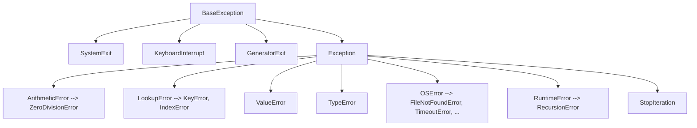

# Error Handling and Robustness

Python treats exceptions as the normal control-flow mechanism for error conditions — the language's own idioms (EAFP: "easier to ask forgiveness than permission") are built around them. Interviewers use error-handling questions to gauge production maturity: do you know the hierarchy, do you catch precisely, do you log usefully, and do you avoid the classic anti-patterns? This file covers all of it, including 3.11's exception groups.

## The Exception Hierarchy

All exceptions derive from `BaseException`; almost everything you should ever catch derives from `Exception`. The distinction is deliberate: `KeyboardInterrupt`, `SystemExit`, and `GeneratorExit` bypass ordinary handlers so programs remain stoppable.



Useful hierarchy facts: `KeyError` and `IndexError` share `LookupError` (catch both at once); most filesystem/network errors are `OSError` subclasses; `bool` of catching order matters — Python uses the **first matching** `except` clause, so put subclasses before superclasses.

## `try` / `except` / `else` / `finally`

```python
def read_config(path):
    try:
        f = open(path)                     # code that may fail
    except FileNotFoundError:
        print("no config, using defaults")  # handle the SPECIFIC failure
        return {}
    except OSError as e:
        raise RuntimeError(f"cannot read config: {path}") from e   # chain context
    else:
        # runs only if the try block did NOT raise -- keeps the happy path
        # out of the try so its own bugs aren't accidentally swallowed
        with f:
            return parse(f.read())
    finally:
        print("attempted config load")      # runs ALWAYS: success, failure, return
```

Two details interviewers probe:

- `else` exists to minimize the code inside `try` — only the risky statement belongs there.
- `raise ... from e` sets `__cause__`, producing the "The above exception was the direct cause..." traceback. `raise ... from None` suppresses context. A bare `raise` inside an `except` block re-raises the current exception with its original traceback — the right way to "log and rethrow".

```python
try:
    risky()
except ValueError:
    log.warning("risky failed")
    raise                # re-raise the SAME exception; don't `raise e` (rebuilds traceback context)
```

## Custom Exceptions

Define a base exception per library/domain so callers can catch your errors with one clause; attach structured data.

```python
class PaymentError(Exception):
    """Base for all payment failures."""

class CardDeclined(PaymentError):
    def __init__(self, card_last4: str, reason: str):
        super().__init__(f"card ****{card_last4} declined: {reason}")
        self.card_last4 = card_last4
        self.reason = reason

class InsufficientFunds(PaymentError):
    pass

def charge(card, amount):
    raise CardDeclined("4242", "expired")

try:
    charge("...", 100)
except PaymentError as e:          # one clause catches the whole domain
    print(type(e).__name__, e)      # CardDeclined card ****4242 declined: expired
```

Guidelines: inherit from `Exception` (never `BaseException`), suffix names with `Error` when appropriate, keep the hierarchy shallow, and prefer standard exceptions (`ValueError`, `TypeError`, `KeyError`) when they already say the right thing.

## EAFP vs LBYL

- **LBYL** — "Look Before You Leap": check preconditions first.
- **EAFP** — "Easier to Ask Forgiveness than Permission": just try it, handle the exception. This is the Pythonic default, and it is *race-free*.

```python
import json, os

# LBYL: racy -- the file can vanish between the check and the open (TOCTOU)
if os.path.exists("data.json"):
    with open("data.json") as f:      # may STILL raise FileNotFoundError!
        data = json.load(f)

# EAFP: atomic and idiomatic
try:
    with open("data.json") as f:
        data = json.load(f)
except FileNotFoundError:
    data = {}

# EAFP with dicts... but know the dedicated tools:
value = d.get("key", default)          # cleaner than try/except KeyError
```

Use LBYL when the check is cheap, exceptions would be common (exceptions are slow *when raised*), or failure would have side effects you can't undo.

## Exception Groups and `except*` (3.11+)

Concurrent code can fail in multiple ways *at once*. `ExceptionGroup` bundles exceptions; `except*` catches matching members while letting the rest propagate.

```python
def validate(user):
    errors = []
    if not user.get("name"):
        errors.append(ValueError("name required"))
    if "@" not in user.get("email", ""):
        errors.append(ValueError("bad email"))
    if errors:
        raise ExceptionGroup("validation failed", errors)

try:
    validate({})
except* ValueError as eg:               # eg is an ExceptionGroup of the matches
    for err in eg.exceptions:
        print("-", err)                  # - name required / - bad email
```

`asyncio.TaskGroup` raises `ExceptionGroup` when multiple tasks fail — this is the flagship real-world use.

## Logging Best Practices

```python
import logging

logger = logging.getLogger(__name__)     # per-module logger, named by module path

def process(order_id):
    logger.info("processing order %s", order_id)    # lazy %-formatting: the string
                                                    # is built only if emitted
    try:
        do_work(order_id)
    except Exception:
        logger.exception("order %s failed", order_id)  # logs at ERROR + traceback
        raise                                           # handle OR log-and-reraise; never both silently

# Configure ONCE, at the application entry point (never in libraries):
logging.basicConfig(
    level=logging.INFO,
    format="%(asctime)s %(name)s %(levelname)s %(message)s",
)
```

Rules that signal seniority:

- Libraries call `logging.getLogger(__name__)` and never configure handlers (except a `NullHandler`); applications configure logging once at startup.
- Use lazy `%s` parameters, not f-strings, in log calls (avoids formatting suppressed messages; enables aggregation by template).
- `logger.exception(...)` inside an `except` block captures the traceback automatically.
- Don't log-and-swallow at every layer (log storms, duplicated stack traces); handle an exception exactly once, at the level that can act on it.
- In services, prefer structured logging (JSON via `structlog` or custom formatters) so logs are queryable.

## Common Anti-Patterns

```python
# 1. Bare except -- catches KeyboardInterrupt, SystemExit, typos, EVERYTHING
try:
    process()
except:                     # BAD: unstoppable, hides bugs (even NameError!)
    pass

# 2. except Exception: pass -- the silent failure
try:
    save(record)
except Exception:
    pass                    # BAD: data silently not saved; nobody will ever know

# 3. Catching too early / too broadly
def get_user(uid):
    try:
        return db.fetch(uid)
    except Exception:
        return None         # BAD: connection errors now look like "user not found"

# 4. Using exceptions for normal flow control on hot paths
# 5. raise e inside except (loses/rewrites context) instead of bare raise
# 6. try block spanning 30 lines -- you can no longer tell what you meant to guard
```

The acceptable narrow use of broad catching: a top-level boundary (request handler, worker loop, CLI main) that logs with traceback and converts to an error response — followed by `raise` or a controlled recovery.

**Real-world applications:** web frameworks map exception types to HTTP status codes (FastAPI's `HTTPException` and exception handlers); retry libraries (tenacity) catch specific transient exceptions; ETL pipelines use exception groups to report every bad record instead of dying on the first.

## Best Practices

- Catch the most specific exception that you can actually handle; let the rest propagate.
- Keep `try` blocks minimal; move the happy path to `else`, cleanup to `finally` or (better) context managers.
- Chain with `raise NewError(...) from e` when translating exceptions across layers; re-raise with bare `raise`.
- Create a small domain exception hierarchy rooted in one base class per package.
- Default to EAFP; choose LBYL only for cheap checks or when exceptions would be frequent.
- Never write bare `except:`; the broadest acceptable is `except Exception` at a logged top-level boundary.
- Configure logging once at the entry point; use `getLogger(__name__)`, lazy formatting, and `logger.exception` in handlers.
- Handle each error exactly once — decide per layer whether to handle, translate, or propagate, and don't log the same failure at every level.

## Interview Questions

<details>
<summary>Why is bare <code>except:</code> dangerous, and how does <code>except Exception:</code> differ?</summary>
Bare <code>except:</code> catches <em>everything</em> derived from <code>BaseException</code>, including <code>KeyboardInterrupt</code> and <code>SystemExit</code>, making the program unkillable with Ctrl+C and masking even typos (<code>NameError</code>). <code>except Exception:</code> at least lets interpreter-control exceptions through. Both hide bugs when paired with <code>pass</code>; only use broad catches at logged top-level boundaries, and re-raise or convert deliberately.
</details>

<details>
<summary>When does the <code>else</code> clause of a try statement run, and why use it?</summary>
It runs only when the <code>try</code> block completed without raising, before <code>finally</code>. Its purpose is scoping: only the risky statement lives in <code>try</code>, and the follow-up work in <code>else</code> is guaranteed not to have its own exceptions accidentally captured by the <code>except</code> clauses. It makes "what am I actually guarding?" explicit.
</details>

<details>
<summary>What's the difference between <code>raise</code>, <code>raise e</code>, and <code>raise NewError() from e</code>?</summary>
Inside an except block: bare <code>raise</code> re-raises the active exception with its original traceback — the correct log-and-rethrow. <code>raise e</code> re-raises the same object but restarts the raise from the current line (extra traceback entry; easy to mangle context). <code>raise NewError() from e</code> translates the exception across an abstraction boundary, setting <code>__cause__</code> so both tracebacks print chained; <code>from None</code> suppresses the chain.
</details>

<details>
<summary>Explain EAFP vs LBYL with an example where LBYL is actually buggy.</summary>
LBYL checks preconditions (<code>if os.path.exists(p): open(p)</code>); EAFP attempts the operation and handles the exception. The file-existence check is a TOCTOU race: the file can be deleted between the check and the open, so the code can still crash — the check gave false confidence. EAFP (<code>try: open(p) except FileNotFoundError:</code>) is atomic. Prefer EAFP in Python; prefer LBYL when raising would be frequent (exceptions are cheap to set up but expensive to raise) or when the attempt has irreversible side effects.
</details>

<details>
<summary>What are ExceptionGroup and <code>except*</code> for?</summary>
Introduced in 3.11 for situations where several independent failures happen together — concurrent tasks, batch validation. <code>ExceptionGroup("msg", [e1, e2])</code> carries multiple exceptions; <code>except* ValueError as eg:</code> extracts the matching subgroup (possibly nested) and handles it while non-matching members keep propagating as a smaller group. <code>asyncio.TaskGroup</code> raises ExceptionGroups when tasks fail, so modern async code must know <code>except*</code>.
</details>

<details>
<summary>How should logging be set up in a library vs an application?</summary>
Libraries: <code>logger = logging.getLogger(__name__)</code>, emit records, configure nothing (optionally attach a NullHandler) — the consumer decides destinations and levels via the logger-name hierarchy. Applications: configure once at the entry point (basicConfig or dictConfig): handlers, formatters (JSON for services), levels per logger. Within handlers use <code>logger.exception()</code> to capture tracebacks, and pass parameters lazily (<code>logger.info("x=%s", x)</code>) instead of pre-formatted f-strings.
</details>

<details>
<summary>Design exceptions for a payments module. What structure do you choose and why?</summary>
One base class <code>PaymentError(Exception)</code> so callers can catch the whole domain in one clause, then a shallow set of specific subclasses (<code>CardDeclined</code>, <code>InsufficientFunds</code>, <code>GatewayTimeout</code>) carrying structured fields (card_last4, decline_reason, retryable flag). Transient errors get a marker (subclass or attribute) so retry logic can target them. At API boundaries, translate third-party exceptions into this hierarchy with <code>raise ... from e</code>, and map subclasses to HTTP statuses in one exception handler.
</details>
