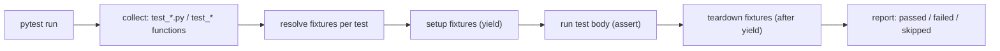

# Testing in Python

Testing questions separate candidates who solve puzzles from engineers who ship. The Python ecosystem has converged on **pytest** for test authoring, `unittest.mock` for isolation, **coverage.py** for measurement, and **hypothesis** for property-based testing. This file covers the tools, the patterns, and — because interviewers love them — the mocking pitfalls.

## pytest Fundamentals

pytest discovers files named `test_*.py`, functions named `test_*`, and uses **plain `assert`** with rich failure introspection — no `assertEqual` boilerplate.

```python
# test_cart.py
import pytest
from cart import Cart, EmptyCartError

def test_total_sums_item_prices():
    cart = Cart()
    cart.add("apple", 1.50)
    cart.add("bread", 2.25)
    assert cart.total() == pytest.approx(3.75)     # approx for floats!

def test_checkout_empty_cart_raises():
    with pytest.raises(EmptyCartError, match="empty"):   # assert exception + message
        Cart().checkout()
```



## Fixtures

Fixtures provide reusable setup/teardown via dependency injection: a test *asks* for a fixture by parameter name.

```python
import pytest

@pytest.fixture
def db():
    conn = create_test_database()      # setup
    yield conn                          # value injected into the test
    conn.drop_all()                     # teardown -- runs even if the test fails

@pytest.fixture
def user(db):                           # fixtures can depend on fixtures
    return db.create_user(name="ada")

def test_user_lookup(db, user):         # request by name; pytest wires the graph
    assert db.find(user.id).name == "ada"
```

Key facts: default scope is `function` (fresh per test); `scope="session"`/`"module"` shares expensive resources (DB containers, HTTP servers); `conftest.py` makes fixtures available to a whole directory without imports; built-ins like `tmp_path`, `capsys`, and `monkeypatch` cover files, stdout, and env/attribute patching.

## Parametrize

One test, many cases — each reported separately.

```python
import pytest

@pytest.mark.parametrize(
    ("raw", "expected"),
    [
        ("42", 42),
        ("-7", -7),
        ("  8 ", 8),
        pytest.param("0x10", 16, id="hex", marks=pytest.mark.xfail),  # documented gap
    ],
)
def test_parse_int(raw, expected):
    assert parse_int(raw) == expected

# Stacked parametrize = cartesian product (2 x 2 = 4 test cases)
@pytest.mark.parametrize("role", ["admin", "member"])
@pytest.mark.parametrize("active", [True, False])
def test_permissions(role, active): ...
```

## Markers

```python
@pytest.mark.slow                      # custom marker: select with `pytest -m slow`
def test_full_reindex(): ...

@pytest.mark.skip(reason="feature removed")
def test_legacy(): ...

@pytest.mark.skipif(sys.platform == "win32", reason="POSIX only")
def test_permissions_bits(): ...

@pytest.mark.xfail(reason="known bug #123", strict=True)   # strict: XPASS fails the suite
def test_unicode_filenames(): ...
```

Register custom markers in `pyproject.toml` (`[tool.pytest.ini_options] markers = [...]`) so typos fail loudly with `--strict-markers`.

## Mocking with `unittest.mock`

`Mock` objects record calls and return configured values; `patch` swaps real objects for mocks within a scope.

```python
from unittest.mock import Mock, patch

def test_sends_welcome_email():
    mailer = Mock()
    signup(mailer, "ada@example.com")
    mailer.send.assert_called_once_with(to="ada@example.com", template="welcome")

# Patching: replace the collaborator where it is USED
# app/orders.py:  from app.payments import charge
@patch("app.orders.charge")                 # NOT "app.payments.charge"!
def test_order_charges_card(mock_charge):
    mock_charge.return_value = {"status": "ok"}
    place_order(order)
    mock_charge.assert_called_once()
```

### The pitfalls interviewers ask about

```python
# Pitfall 1: patching where it's DEFINED instead of where it's LOOKED UP.
# `from x import f` copies the name into the importing module; patching x.f
# does not touch the copy. Patch "importing_module.f".

# Pitfall 2: Mock happily accepts ANY call -- tests can pass against dead code.
m = Mock()
m.tpyo_method(1, 2, 3)               # no error! Typos go unnoticed.
m.assert_called_wtih(1)              # 'assert_called_wtih' is itself just a mock! (older versions)

# Fix: spec / autospec pin the mock to the real API
from unittest.mock import create_autospec
mock_charge = create_autospec(charge)
# mock_charge("wrong", "arity")      # TypeError: signature enforced
# Prefer patch("app.orders.charge", autospec=True)

# Pitfall 3: forgetting that patch is scope-bound -- as a decorator, context
# manager, or fixture (mocker from pytest-mock); a stray global mock leaks state.
```

Rule of thumb: mock at *boundaries* (network, clock, randomness, filesystem) and prefer real objects or fakes for your own logic — over-mocked tests break on every refactor while catching nothing.

## Coverage

```bash
pytest --cov=myapp --cov-report=term-missing --cov-branch
# Name                Stmts   Miss Branch  Cover   Missing
# myapp/cart.py          40      2      8    93%   57-58
```

Enable **branch coverage** (an `if` with no `else` can be 100% line-covered while its false path is untested). Treat coverage as a *detector of untested code*, not a target: 100% coverage with assertion-free tests proves nothing. Many teams gate CI at 80-90% with `--cov-fail-under`.

## Property-Based Testing with hypothesis

Instead of hand-picking examples, describe *properties* that must hold for all inputs; hypothesis generates hundreds of cases and **shrinks** failures to minimal reproductions.

```python
from hypothesis import given, strategies as st

@given(st.lists(st.integers()))
def test_sort_is_idempotent(xs):
    once = sorted(xs)
    assert sorted(once) == once                 # property: sorting twice = once

@given(st.lists(st.integers(), min_size=1))
def test_max_is_an_element_and_upper_bound(xs):
    m = max(xs)
    assert m in xs and all(x <= m for x in xs)

@given(st.text())
def test_encode_decode_roundtrip(s):
    assert decode(encode(s)) == s               # the classic roundtrip property
# When this fails, hypothesis reports the MINIMAL failing string, e.g. '\x00'
# and replays it from its example database on the next run.
```

Great properties: roundtrips (serialize/deserialize), invariants (balance never negative), oracles (fast implementation matches naive one), idempotence. Real-world: hypothesis famously finds Unicode, empty-input, and boundary bugs that example-based tests miss.

## Test Structure Best Practices

```python
# Arrange-Act-Assert: one behavior per test, named after the behavior
def test_expired_coupon_is_rejected():
    coupon = make_coupon(expires=YESTERDAY)      # Arrange (builders/factories)
    result = cart.apply(coupon)                  # Act (exactly one action)
    assert result.error == "coupon_expired"      # Assert (on behavior, not internals)
```

- Layout: `tests/` mirroring `src/` (`src/myapp/cart.py` ↔ `tests/test_cart.py`); shared fixtures in `conftest.py`.
- Tests must be **independent and order-agnostic** — no shared mutable state; parallel-safe (`pytest -n auto` with pytest-xdist).
- Follow the pyramid: many fast unit tests, fewer integration tests, few end-to-end tests.
- Test the public interface and observable behavior; asserting on private attributes welds tests to the implementation.
- Determinism: freeze time (`freezegun`/`time-machine`), seed randomness, stub the network.

## Best Practices

- Use pytest, plain asserts, and `pytest.raises`/`pytest.approx`; reserve `unittest` style for legacy codebases.
- Push all setup into fixtures; scope expensive ones (`session`) and keep state-mutating ones function-scoped.
- Parametrize instead of copy-pasting tests; give cases readable `id`s.
- Always patch where the name is *used*, and use `autospec=True` so mocks enforce real signatures.
- Mock external boundaries only; use fakes/in-memory implementations for your own interfaces.
- Measure branch coverage in CI, gate at a sane threshold, and read the "Missing" column rather than chasing 100%.
- Add hypothesis tests for parsers, serializers, and algorithmic code — anywhere a property is crisper than examples.
- Name tests after behaviors (`test_expired_coupon_is_rejected`), keep one logical assert per test, and make every test runnable in isolation.

## Interview Questions

<details>
<summary>How do pytest fixtures work, and what problem do they solve over setUp/tearDown?</summary>
A fixture is a function registered with <code>@pytest.fixture</code>; tests receive it by declaring a parameter with the fixture's name, and pytest resolves the dependency graph, running setup before the test and teardown (code after <code>yield</code>) after it — even on failure. Versus unittest's setUp/tearDown: fixtures are composable (fixtures use fixtures), reusable across files via conftest.py, scoped (function/module/session) for expensive resources, and each test declares exactly what it needs instead of inheriting a monolithic setup.
</details>

<details>
<summary>Why did <code>patch("app.payments.charge")</code> not take effect in a test of <code>app.orders</code>?</summary>
Because <code>app.orders</code> did <code>from app.payments import charge</code>, which binds a <em>copy</em> of the name into the orders module at import time. Patching <code>app.payments.charge</code> rebinds the original module's name, but orders still holds the old reference. Patch where the name is looked up: <code>patch("app.orders.charge")</code>. (If orders used <code>import app.payments</code> and called <code>app.payments.charge()</code>, patching the payments module would work.)
</details>

<details>
<summary>What is autospec and why should you use it?</summary>
<code>autospec=True</code> (or <code>create_autospec</code>) builds a mock that mirrors the real object's attributes and call signatures. Without it, a Mock accepts any method name and any arguments — so tests keep passing after you rename a method or change its signature, and even asserting-method typos can silently pass. With autospec, wrong attribute access raises AttributeError and wrong arity raises TypeError, keeping mocks honest as the code evolves.
</details>

<details>
<summary>Is 100% code coverage a good goal?</summary>
No — coverage measures execution, not verification: a suite that calls every line but asserts nothing scores 100% and catches nothing. Also, line coverage misses untested branches, so enable branch coverage. Coverage is best used negatively — to find important untested code — and as a reasonable CI floor (80-90%) to prevent regression. Prioritize meaningful assertions, edge cases, and mutation-resistant tests over the last few percent.
</details>

<details>
<summary>What is property-based testing, and what makes hypothesis's shrinking valuable?</summary>
Instead of asserting on hand-picked examples, you state a property that must hold for <em>all</em> inputs — roundtrips, invariants, idempotence, agreement with a naive oracle — and hypothesis generates hundreds of randomized inputs, deliberately biased toward nasty edges (empty, huge, Unicode, NaN). When a case fails, shrinking repeatedly simplifies it to a minimal reproduction (e.g. from a 400-char string to <code>'\x00'</code>), which turns a random failure into an obvious bug report; failures are stored and replayed until fixed.
</details>

<details>
<summary>How would you test code that depends on the current time or on an external HTTP API?</summary>
Both are boundaries to control. Time: inject a clock (pass <code>now: Callable[[], datetime]</code>), or freeze it with freezegun/time-machine, so expiry logic is deterministic. HTTP: don't hit the network in unit tests — wrap the API in a client interface and substitute a fake, or stub the transport with responses/respx/VCR cassettes; assert on the request your code built and on behavior given canned responses. Keep a small number of real integration tests (marked <code>slow</code>/<code>integration</code>) that exercise the true dependency in CI.
</details>

<details>
<summary>What is the difference between skip and xfail in pytest?</summary>
<code>skip</code> doesn't run the test at all (platform not supported, dependency missing). <code>xfail</code> runs it but expects failure — reported as XFAIL, not an error — documenting a known bug or unimplemented feature; with <code>strict=True</code>, an unexpected pass (XPASS) fails the suite, alerting you the moment the bug is fixed so the marker gets removed. xfail keeps the failing case visible in the suite instead of deleting it.
</details>
