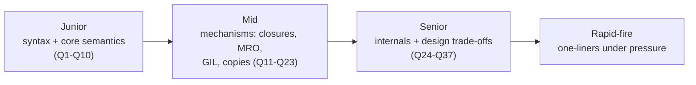

# Python Interview Questions

This is the drill file: 30+ curated Python interview questions with detailed answers, grouped by difficulty. Work through them actively — predict the output or sketch the answer *before* expanding the solution, and practice saying answers out loud, since interviews reward crisp verbal explanations backed by tiny code examples.

How to use each tier:

- **Junior**: you should answer these instantly and correctly.
- **Mid**: expect follow-ups ("why?", "show me"); know the mechanism, not just the rule.
- **Senior**: expect design trade-offs and internals; answers should mention CPython specifics and real-world implications.

---

## Junior Level

1. What is the difference between a list and a tuple?

Lists are mutable dynamic arrays (<code>append</code>, <code>sort</code>, item assignment); tuples are immutable fixed-size sequences. Consequences of immutability: tuples are hashable (usable as dict keys/set members) when their elements are hashable, slightly smaller and faster, and safe to share. Convention: tuples for heterogeneous fixed records (<code>(lat, lon)</code>), lists for homogeneous collections you'll modify. Note immutability is shallow — a tuple can contain a mutable list.

2. What is the difference between <code>is</code> and <code>==</code>?

<code>==</code> compares values via <code>__eq__</code>; <code>is</code> compares identity (same object in memory). <code>[1] == [1]</code> is True; <code>[1] is [1]</code> is False. Use <code>is</code> only for singletons: <code>x is None</code>. Interning trap: <code>256 is 256</code> is True (CPython caches -5..256) while <code>257 is 257</code> may be False — an implementation detail, never something to rely on.

3. Predict the output — the mutable default argument:
<pre><code>def add(item, items=[]):
    items.append(item)
    return items
print(add(1)); print(add(2))</code></pre>

Output: <code>[1]</code> then <code>[1, 2]</code>. Default values are evaluated once at <code>def</code> time and stored on the function object, so every call without <code>items</code> shares the <em>same</em> list. Fix: use a sentinel — <code>items=None</code>, then <code>if items is None: items = []</code>. This is arguably the most famous Python gotcha; recognize it instantly.

4. How do <code>*args</code> and <code>**kwargs</code> work?

In a signature, <code>*args</code> collects extra positional arguments into a tuple and <code>**kwargs</code> collects extra keyword arguments into a dict. At a call site they unpack: <code>f(*[1,2], **{"x": 3})</code> equals <code>f(1, 2, x=3)</code>. The main real use is transparent wrappers/decorators that forward everything: <code>def wrapper(*args, **kwargs): return func(*args, **kwargs)</code>.

5. What is the difference between <code>append</code> and <code>extend</code>?

<code>lst.append(x)</code> adds <code>x</code> as a single element (appending a list nests it: <code>[1, [2, 3]]</code>); <code>lst.extend(iterable)</code> adds each element of the iterable (<code>[1, 2, 3]</code>). <code>lst += other</code> behaves like extend (in-place, mutates the shared object), whereas <code>lst = lst + other</code> creates a new list — a meaningful difference when other names reference the same list.

6. Predict the output — string immutability:
<pre><code>s = "hello"
s.upper()
print(s)</code></pre>

<code>hello</code>. Strings are immutable: <code>upper()</code> returns a new string, which was discarded. You must rebind: <code>s = s.upper()</code>. The same reasoning explains why <code>sorted(lst)</code> returns a new list while <code>lst.sort()</code> mutates in place and returns <code>None</code> — and why <code>x = lst.sort()</code> leaves <code>x</code> as <code>None</code>, another classic trap.

7. How does a <code>for</code> loop actually work in Python?

It's sugar over the iterator protocol: <code>iter(obj)</code> calls <code>obj.__iter__()</code> to get an iterator, then repeatedly calls <code>next(it)</code> (<code>__next__</code>) until <code>StopIteration</code> is raised, which the loop absorbs to terminate. Anything implementing the protocol is loopable — files yield lines, dicts yield keys, generators yield lazily. This is also why an exhausted iterator produces an empty second loop.

8. What are Python's falsy values, and what bug does truthiness cause with defaults?

Falsy: <code>None</code>, <code>False</code>, <code>0</code>/<code>0.0</code>, and empty containers (<code>""</code>, <code>[]</code>, <code>{}</code>, <code>set()</code>, <code>()</code>). Bug: <code>if not timeout: timeout = 30</code> wrongly overrides a legitimate <code>timeout=0</code>. When falsy values are valid data, test identity explicitly: <code>if timeout is None</code>.

9. What is a dictionary, and what can be a key?

A hash table mapping keys to values with average O(1) lookup/insert/delete, preserving insertion order (guaranteed since 3.7). Keys must be hashable: stable <code>__hash__</code> consistent with <code>__eq__</code> — so strings, numbers, and tuples of immutables work; lists/dicts/sets don't (<code>TypeError: unhashable type</code>). Related idioms: <code>d.get(k, default)</code>, <code>d.setdefault</code>, <code>collections.defaultdict</code>, and dict comprehensions.

10. What is a virtual environment and why do you need one?

An isolated per-project Python environment with its own installed packages, so projects with conflicting dependency versions coexist and the system Python stays clean. Create with <code>python -m venv .venv</code> (or, modern tooling, <code>uv</code>), record dependencies in <code>pyproject.toml</code>, and pin exact versions with a lockfile for reproducible deploys. Installing project deps into the global interpreter is a hallmark of inexperience.

---

## Mid Level

11. Predict the output — the <code>[[]] * 3</code> gotcha:
<pre><code>grid = [[]] * 3
grid[0].append("x")
print(grid)</code></pre>

<code>[['x'], ['x'], ['x']]</code>. Sequence multiplication copies <em>references</em>, so the outer list holds three references to one inner list; mutating it through any row shows through all rows. Correct: <code>grid = [[] for _ in range(3)]</code>. Note <code>[0] * 3</code> is safe only because ints are immutable — you rebind slots rather than mutate the shared object.

12. Predict the output — closure late binding:
<pre><code>funcs = [lambda: i for i in range(3)]
print([f() for f in funcs])</code></pre>

<code>[2, 2, 2]</code>. Closures capture the <em>variable</em>, not its value at definition time; all three lambdas share the single loop variable <code>i</code>, read when called — after the loop finished at 2. Fixes: default-argument capture, <code>lambda i=i: i</code> (defaults evaluate at def time), or a factory function that gives each lambda its own enclosing scope. This bites in real code with callbacks registered in loops.

13. Implement a <code>@timed</code> decorator from scratch. What would you forget under pressure?

<pre><code>import functools, time

def timed(func):
    @functools.wraps(func)
    def wrapper(*args, **kwargs):
        start = time.perf_counter()
        try:
            return func(*args, **kwargs)
        finally:
            print(f"{func.__name__}: {time.perf_counter() - start:.4f}s")
    return wrapper</code></pre>
Commonly forgotten: (1) <code>functools.wraps</code> — without it the wrapper hijacks <code>__name__</code>/<code>__doc__</code>; (2) returning the wrapped function's result; (3) <code>try/finally</code> so timing prints even on exceptions; (4) <code>*args, **kwargs</code> so any signature works. For a parameterized decorator (<code>@timed(unit="ms")</code>), add a third outer layer that takes the arguments and returns the decorator.

14. Generator vs list — when and why? Prove the memory difference.

A list comprehension materializes all elements (O(n) memory, reusable, indexable); a generator produces items lazily (O(1) memory, single pass, can short-circuit). <code>sys.getsizeof([x for x in range(10**6)])</code> is megabytes; <code>sys.getsizeof(x for x in range(10**6))</code> is ~200 bytes. Use generators for pipelines feeding <code>sum</code>/<code>any</code>/<code>join</code>, streaming large files, or infinite sequences; use lists when you need multiple passes or <code>len</code>. Trap: generators exhaust — iterating twice yields nothing the second time.

15. Explain shallow vs deep copy. Predict:
<pre><code>import copy
a = [[1, 2], [3, 4]]
b = copy.copy(a)
b[0].append(99)
b.append([5])
print(a)</code></pre>

<code>[[1, 2, 99], [3, 4]]</code>. <code>copy.copy</code> creates a new outer list whose slots reference the <em>same</em> inner lists — so mutating <code>b[0]</code> shows through <code>a</code>, while appending to <code>b</code> itself (a new outer-list operation) does not. <code>copy.deepcopy</code> would clone recursively and isolate everything. Remember <code>a[:]</code>, <code>list(a)</code>, and <code>a.copy()</code> are all shallow.

16. What is the GIL and what does it mean for your design?

The Global Interpreter Lock is a CPython mutex allowing one thread at a time to execute Python bytecode, protecting refcounting internals. Implications: threads give no speedup for pure-Python CPU-bound work (use multiprocessing, vectorization, or native code) but work well for I/O-bound tasks, since blocking I/O releases the GIL. Crucially, it does <em>not</em> make code thread-safe: <code>counter += 1</code> is multiple bytecodes and races without a lock. Python 3.13 adds an experimental free-threaded build (PEP 703) without a GIL.

17. Predict the MRO and output:
<pre><code>class A:
    def hi(self): return "A"
class B(A):
    def hi(self): return "B"
class C(A):
    def hi(self): return "C"
class D(B, C):
    pass
print(D().hi(), [c.__name__ for c in D.__mro__])</code></pre>

<code>B ['D', 'B', 'C', 'A', 'object']</code>. C3 linearization orders the diamond as D → B → C → A → object: each class precedes its parents, base order (B before C) is preserved, and A appears only once, after all its subclasses. <code>D().hi()</code> finds <code>hi</code> first on B. Follow-up to expect: if B's method called <code>super().hi()</code>, it would invoke <em>C's</em>, not A's — <code>super()</code> follows the instance's MRO.

18. What are <code>@classmethod</code> and <code>@staticmethod</code> for? Give a real use of each.

<code>@classmethod</code> receives the class (<code>cls</code>) — the idiom for alternative constructors that remain subclass-correct: <code>datetime.fromtimestamp</code>, <code>dict.fromkeys</code>, your own <code>Config.from_yaml(path)</code>. <code>@staticmethod</code> receives nothing — a utility namespaced in the class for discoverability, e.g. <code>Validator.is_email(s)</code>. If a method uses <code>self</code>, it's an instance method; uses only <code>cls</code>, classmethod; uses neither, staticmethod or a module function.

19. How do context managers work, and how do you write one?

<code>with cm as x:</code> calls <code>cm.__enter__()</code> (result bound to <code>x</code>), runs the body, then guarantees <code>cm.__exit__(exc_type, exc, tb)</code> on every exit path; returning True from <code>__exit__</code> suppresses the exception. Easiest implementation: <code>@contextlib.contextmanager</code> on a generator — code before <code>yield</code> is setup, after it (inside <code>try/finally</code>) is teardown. Uses: files, locks, DB transactions, temporarily patched state in tests. It's Python's guaranteed-cleanup construct — prefer it over relying on refcount-triggered <code>__del__</code>.

20. EAFP vs LBYL — which is Pythonic and why?

EAFP ("easier to ask forgiveness than permission"): attempt the operation and catch the specific exception — Pythonic because it's atomic (no time-of-check/time-of-use race like checking <code>os.path.exists</code> before <code>open</code>) and matches how the stdlib behaves. LBYL is right when checks are cheap and failures common (raised exceptions are expensive) or when the attempt has irreversible side effects. Also know the dedicated middle ground: <code>d.get(k, default)</code> instead of either.

21. Why did defining <code>__eq__</code> break using my objects in a set?

Defining <code>__eq__</code> without <code>__hash__</code> sets <code>__hash__ = None</code>, making instances unhashable. Python enforces the invariant that equal objects must have equal hashes — the inherited identity hash would violate it. Fix: implement <code>__hash__</code> over the same fields as <code>__eq__</code> (hash a tuple of them) and keep those fields effectively immutable, or use <code>@dataclass(frozen=True)</code>/<code>eq=True, frozen=True</code> to generate both consistently.

22. What does <code>if __name__ == "__main__":</code> do, and why does multiprocessing require it?

Every module has <code>__name__</code>: <code>"__main__"</code> when run as a script, the module's dotted name when imported — so the guard runs entry-point code only on direct execution, keeping the module importable (for tests, reuse) without side effects. Multiprocessing with the spawn start method (default on Windows/macOS) re-imports the main module in each child process; without the guard, the child would re-execute the pool-creation code, recursively spawning processes.

23. Predict the output — iterating while mutating:
<pre><code>nums = [1, 2, 3, 4]
for n in nums:
    if n % 2 == 0:
        nums.remove(n)
print(nums)</code></pre>

<code>[1, 3]</code> — but only by luck, and the mechanism matters: the list iterator tracks an index; removing an element shifts later elements left, so the loop <em>skips</em> the element after each removal. With input <code>[1, 2, 2, 3]</code> the second 2 survives: output <code>[1, 2, 3]</code>. Dicts fail louder — mutation during iteration raises RuntimeError. Correct approaches: build a new list (<code>[n for n in nums if n % 2]</code>) or iterate over a copy.

---

## Senior Level

24. Walk through CPython memory management: when exactly is an object freed?

Primary: reference counting — every object tracks incoming references; bindings/containers/arguments increment, del/rebinding/scope-exit decrement; at zero the object is finalized and freed <em>immediately and deterministically</em>. Blind spot: reference cycles never reach zero, so a generational cyclic GC (three generations, thresholds ~(700, 10, 10)) periodically scans tracked container objects, identifies groups unreachable from outside, and collects them. Allocation uses pymalloc arenas for small objects. Design consequences: cleanup should use <code>with</code>, not <code>__del__</code>; unbounded caches are the classic leak; and 3.12 immortal objects plus PEP 703's biased refcounting show this machinery still evolving.

25. Threading vs multiprocessing vs asyncio — give the decision framework and the failure mode of each.

CPU-bound → multiprocessing (one GIL per process; true parallelism); I/O-bound with moderate concurrency or blocking libraries → threads; I/O-bound at scale (thousands of sockets) → asyncio. Failure modes: threads — races on shared state (GIL is not thread safety) and memory per thread; multiprocessing — pickling/IPC overhead, spawn-related import gotchas, no cheap shared memory; asyncio — one blocking call (requests, time.sleep, sync DB driver) stalls the whole event loop, and forgotten <code>await</code>s silently never run. Bonus points: mention vectorization/C extensions as the fourth option for CPU work, and <code>asyncio.to_thread</code> as the bridge.

26. Design an LRU cache. Then explain what <code>functools.lru_cache</code> does about its known drawbacks.

Core design: hash map for O(1) key lookup + doubly-linked list for O(1) recency reordering and eviction of the least-recently-used tail; or in Python, an <code>OrderedDict</code> with <code>move_to_end</code> and <code>popitem(last=False)</code>. <code>functools.lru_cache</code> implements exactly this with a lock for thread safety. Drawbacks to discuss: arguments must be hashable; it holds strong references (on instance methods, entries pin <code>self</code>, leaking objects — put the cache on a helper function or use per-instance caches/<code>cached_property</code>); unbounded <code>maxsize=None</code> grows forever; and cache keys distinguish <code>f(1)</code> from <code>f(x=1)</code>.

27. Predict and explain:
<pre><code>t = (1, 2, [3])
t[2] += [4]
print(t)</code></pre>

It raises <code>TypeError: 'tuple' object does not support item assignment</code> — <em>and yet</em> printing <code>t</code> afterward shows <code>(1, 2, [3, 4])</code>. Why: <code>t[2] += [4]</code> desugars to <code>t[2] = t[2].__iadd__([4])</code>; the list's in-place <code>__iadd__</code> mutates it successfully, then the tuple slot assignment fails. The example demonstrates that (a) <code>+=</code> is load, operate, store; (b) tuple immutability is shallow; (c) an exception does not undo already-performed mutation.

28. How does <code>super()</code> really work in multiple inheritance? Why must cooperative <code>__init__</code>s accept <code>**kwargs</code>?

<code>super()</code> resolves to the <em>next class in the instance's MRO</em> after the current one — not the static parent. In <code>D(B, C)</code>, B's <code>super().__init__()</code> calls C's, so each class in the diamond runs exactly once if every class calls <code>super()</code>. Because any class may be next in someone's MRO, cooperative <code>__init__</code>s take their own keyword arguments, strip them, and forward the rest: <code>def __init__(self, *, color, **kwargs): super().__init__(**kwargs)</code>. This is how well-designed mixins (Django class-based views, DRF) compose without each class knowing the full hierarchy.

29. What are descriptors, and how do they explain <code>@property</code>, methods, and <code>__slots__</code>?

A descriptor is a class-attribute object implementing <code>__get__</code>/<code>__set__</code>/<code>__delete__</code>; attribute access on instances routes through them (data descriptors take precedence over the instance <code>__dict__</code>). <code>property</code> is a data descriptor wrapping getter/setter functions. Functions are non-data descriptors whose <code>__get__</code> returns a bound method — that's the entire mechanism behind <code>self</code>. <code>__slots__</code> generates slot descriptors that store values in fixed C-level offsets instead of a per-instance dict. Knowing this unifies "magic" features into one protocol — a strong senior signal.

30. Predict the output — class vs instance attributes:
<pre><code>class Config:
    flags = []
    def add(self, f): self.flags.append(f)

a, b = Config(), Config()
a.add("x")
print(b.flags)
a.flags = ["y"]
a.add("z")
print(b.flags, a.flags)</code></pre>

First print: <code>['x']</code> — <code>self.flags</code> finds the shared <em>class</em> attribute and mutates it, so all instances see it. Then <code>a.flags = ["y"]</code> creates an <em>instance</em> attribute shadowing the class one, so <code>a.add("z")</code> mutates only a's list. Second print: <code>['x'] ['y', 'z']</code>. Lesson: mutable class attributes are shared state; initialize per-instance mutables in <code>__init__</code> (or use <code>dataclass field(default_factory=list)</code>).

31. Explain generators as coroutines: what do <code>send</code>, <code>throw</code>, <code>close</code>, and <code>yield from</code> do, and how did they lead to async/await?

<code>yield</code> is bidirectional: <code>gen.send(value)</code> resumes the generator with <code>value</code> as the result of the paused <code>yield</code> expression; <code>throw</code> raises an exception at the pause point; <code>close</code> raises GeneratorExit for cleanup. <code>yield from</code> (PEP 380) delegates to a subgenerator, transparently forwarding send/throw and returning its <code>StopIteration.value</code>. This machinery let frameworks suspend/resume functions around I/O — generator-based coroutines — which PEP 492 formalized as <code>async def</code>/<code>await</code> with distinct types. Modern code uses async/await, but the lineage explains why coroutines and generators share internals.

32. Your Python service's memory grows steadily. Diagnose it.

Confirm it's Python heap growth vs fragmentation/RSS artifacts. Instrument: <code>tracemalloc</code> — take snapshots minutes apart, diff by <code>statistics("lineno")</code> to find growing allocation sites; or attach memray/py-spy in production. Usual suspects: unbounded caches (module dicts, <code>lru_cache(maxsize=None)</code>, especially on methods pinning <code>self</code>), ever-growing global registries/lists, closures capturing large payloads, exception objects stored with tracebacks (holding entire frames alive), cycles involving <code>__del__</code>, and C-extension leaks (invisible to tracemalloc). Fixes: bound caches with maxsize/TTL, use <code>WeakValueDictionary</code> for identity maps, clear references, and add a leak test that asserts object counts return to baseline after N requests.

33. Predict the output — dict key equality across types:
<pre><code>d = {1: "int", 1.0: "float", True: "bool"}
print(d, len(d))</code></pre>

<code>{1: 'bool'} 1</code>. In Python <code>1 == 1.0 == True</code> and their hashes are equal (<code>bool</code> is a subclass of <code>int</code>; numeric hashing is unified), so all three literals reference the <em>same dict slot</em>: the first insertion sets key object <code>1</code>, and each later assignment overwrites the value while keeping the original key object. Practical implications: never mix bools and ints as keys, and be careful using floats as dict/set keys at all.

34. How would you make a class immutable and value-semantic in Python, and what do you gain?

Options in increasing rigor: <code>@dataclass(frozen=True, slots=True)</code> — generated <code>__init__</code>/<code>__eq__</code>/<code>__hash__</code>, assignment raises FrozenInstanceError, slots prevent new attributes; <code>NamedTuple</code> for tuple-compatible records; or manual <code>__slots__</code> plus <code>__setattr__</code> raising. Gains: hashability (usable in sets/dict keys), safe sharing across threads and caches without defensive copies, cheap equality semantics, fewer aliasing bugs (no action at a distance), and clearer APIs (transformations return new objects, like <code>datetime.replace</code>). Caveat: "frozen" is shallow — store tuples/frozensets inside, not lists — and it's convention-strength, since <code>object.__setattr__</code> can still bypass it.

35. What actually happens at <code>import</code> time, and how do circular imports break?

<code>import m</code>: check <code>sys.modules</code> cache (imports are singletons); if absent, find the module (finders on <code>sys.meta_path</code>, <code>sys.path</code>), create a module object, insert it into <code>sys.modules</code> <em>before</em> executing, then run the module's top-level code to populate its namespace. Circular imports: if A imports B and B imports A, B gets A's <em>partially initialized</em> module from the cache — attributes defined below A's import of B don't exist yet, so <code>from a import name</code> raises ImportError/AttributeError. Fixes: restructure to remove the cycle (extract shared code), import at function level, import the module rather than names from it, or use <code>if TYPE_CHECKING:</code> for type-only imports.

36. Compare pydantic models, dataclasses, and TypedDict for an API service — where does each belong?

Boundary (untrusted input): pydantic <code>BaseModel</code> — runtime validation, coercion, serialization, and OpenAPI schema generation (FastAPI builds on it); its core is Rust, so validation is fast. Domain layer (trusted, internal): <code>@dataclass</code> (frozen for value objects) — zero runtime validation cost, plain Python semantics, easy testing. Dict-shaped pass-through data (JSON you index but don't model): <code>TypedDict</code> — static-only checking, no conversion, no runtime cost. Anti-patterns: pydantic everywhere (validation tax and framework coupling in the core), or raw dicts everywhere (no checking at all). The layering also gives clean serialization boundaries and testable domain logic.

37. Predict the output — name shadowing and UnboundLocalError:
<pre><code>x = 10
def f():
    print(x)
    x = 20
f()</code></pre>

<code>UnboundLocalError: cannot access local variable 'x' where it is not associated with a value</code> — the <code>print</code> never succeeds. At compile time, the assignment <code>x = 20</code> anywhere in the function classifies <code>x</code> as local for the <em>whole</em> function body, so <code>print(x)</code> reads an uninitialized local rather than the global. Remove the assignment and it prints 10; add <code>global x</code> and it prints 10 then rebinds the module-level name. The same rule powers the <code>nonlocal</code> keyword for closures.

---

## Rapid-Fire Round

Short questions you should answer in one or two sentences:

- **`sorted(lst)` vs `lst.sort()`?** New list vs in-place returning `None`; both accept `key=` and `reverse=`.
- **What does `zip(*matrix)` do?** Transposes a matrix — unpacking rows as arguments to zip pairs up columns.
- **`dict.get(k)` vs `d[k]`?** `get` returns `None`/default on missing keys; `[]` raises `KeyError`.
- **What is `__init__.py` for?** Marks a directory as a package (and runs on package import); optional since 3.3 namespace packages, but still standard.
- **`@staticmethod` on a function that uses `self`?** Won't work — no instance is passed; it's a bug.
- **How to merge two dicts?** `merged = a | b` (3.9+); `{**a, **b}` earlier; right side wins on conflicts.
- **What is `pass`?** A syntactic no-op placeholder where a statement is required.
- **`range` memory for `range(10**9)`?** Constant — `range` is a lazy sequence object computing values on demand.
- **Check type idiomatically?** `isinstance(x, T)` (respects subclasses), not `type(x) == T`; better yet, duck-type.
- **Why `if TYPE_CHECKING:` imports?** Avoid runtime import cost/cycles for names needed only by the type checker.

## How to Practice

1. Cover each answer, say your response out loud, then compare — verbalizing is half the skill.
2. Type out and run every "predict the output" snippet; being wrong once in practice inoculates you in the interview.
3. For senior questions, practice the follow-up chain: every answer above ends where an interviewer would ask "why?" one more time — make sure you can go one level deeper (bytecode, CPython source, design trade-offs).
4. Re-derive the big three from scratch weekly: a decorator with arguments, an LRU cache, and a generator-based pipeline.
