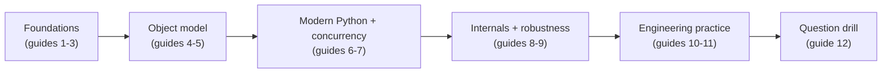

# Python Interview Preparation Guide

Python is one of the most widely used languages in technical interviews and in industry, prized for its readability, dynamic typing, and enormous ecosystem spanning web backends, data science, machine learning, automation, and scripting. Its concise syntax lets you focus on problem-solving rather than boilerplate, which is exactly why interviewers love it — and why they probe deeply into how it actually works under the hood. This guide takes you from fundamentals to internals, with runnable examples, diagrams, and curated interview questions throughout.

## Why Python for Interviews?

- **Readability**: Python reads close to pseudocode, so you spend interview time on the algorithm, not the syntax.
- **Dynamic typing with optional static hints**: Fast to prototype, and modern type hints (`mypy`, `pyright`) bring safety when you need it.
- **Batteries included**: `collections`, `itertools`, `heapq`, and `functools` solve most interview data-structure needs out of the box.
- **Huge ecosystem**: From FastAPI and Django on the backend to NumPy, pandas, and PyTorch in data/ML, Python dominates several industries — expect domain questions alongside language questions.

## Table of Contents

| # | Guide | What You Will Learn |
|---|-------|---------------------|
| 1 | [Python Fundamentals](01-Python-Fundamentals.md) | Interpreter and bytecode, everything-is-an-object, names vs variables, mutability, `is` vs `==`, truthiness, f-strings, comprehensions |
| 2 | [Data Structures](02-Data-Structures.md) | list/tuple/dict/set internals, complexity tables, `collections`, `heapq`, mutable default pitfalls |
| 3 | [Functions and Scope](03-Functions-and-Scope.md) | First-class functions, `*args`/`**kwargs`, closures, LEGB, `functools`, late-binding gotchas |
| 4 | [OOP in Python](04-OOP-in-Python.md) | Methods, properties, dunder methods, MRO and C3 linearization, ABCs, dataclasses, `__slots__` |
| 5 | [Iterators, Generators, and Decorators](05-Iterators-Generators-and-Decorators.md) | Iterator protocol, `yield`, `itertools`, decorators from scratch, context managers |
| 6 | [Type Hints and Modern Python](06-Type-Hints-and-Modern-Python.md) | `typing`, `Protocol`, `TypedDict`, pattern matching, walrus operator, 3.10–3.13 highlights |
| 7 | [Concurrency in Python](07-Concurrency-in-Python.md) | The GIL, threading vs multiprocessing vs asyncio, `async`/`await`, free-threaded Python |
| 8 | [Memory Management and Internals](08-Memory-Management-and-Internals.md) | Reference counting, cycle GC, weak references, interning, shallow vs deep copy |
| 9 | [Error Handling and Robustness](09-Error-Handling-and-Robustness.md) | Exception hierarchy, EAFP vs LBYL, exception groups, logging best practices |
| 10 | [Testing in Python](10-Testing-in-Python.md) | pytest fixtures and parametrize, mocking pitfalls, coverage, property-based testing |
| 11 | [Best Practices and Ecosystem](11-Python-Best-Practices-and-Ecosystem.md) | PEP 8, project structure, uv/ruff/poetry, packaging, performance tips |
| 12 | [Python Interview Questions](12-Python-Interview-Questions.md) | 30+ curated questions with detailed answers, grouped junior / mid / senior |

## Suggested Study Order

1. **Foundations first (guides 1–3).** Names vs variables, mutability, and scope rules explain 80% of Python "gotcha" questions. Do not skip these even if you use Python daily.
2. **Object model (guides 4–5).** Dunder methods, MRO, iterators, and decorators are the most common mid-level screening topics.
3. **Modern Python and concurrency (guides 6–7).** Type hints and the GIL are near-guaranteed topics for mid-to-senior roles.
4. **Internals and robustness (guides 8–9).** Memory management and error-handling questions separate senior candidates from the rest.
5. **Engineering practice (guides 10–11).** Testing and tooling questions show you can ship production code, not just solve puzzles.
6. **Drill (guide 12).** Work through the question bank last, ideally out loud, as if in a real interview.

## How to Use This Guide

- Every code block is runnable — paste it into a Python 3.12+ REPL and experiment.
- Pitfall examples show the *surprising* output in a comment; make sure you can predict it before reading the explanation.
- Each topic file ends with **Best Practices** and **Interview Questions** sections; use the collapsible answers to self-test.
