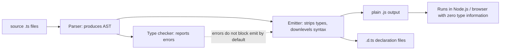
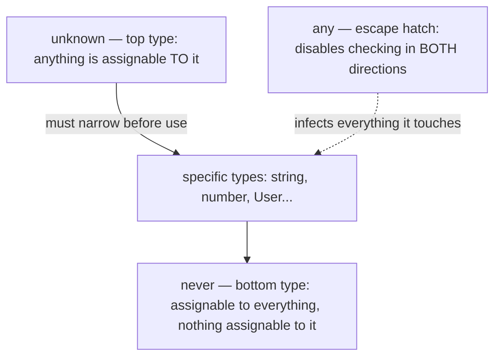

# TypeScript Fundamentals

TypeScript is JavaScript plus a static type system that exists only at compile time. The compiler (`tsc`) checks your code against type annotations and inferred types, reports errors, and then emits plain JavaScript with every type erased. Understanding this "compile-then-erase" model, the strict compiler flags, and the core built-in types is the foundation for every other TypeScript topic in interviews.

## What TypeScript Adds Over JavaScript

- **Static type checking** — errors like `undefined is not a function` are caught before the code runs.
- **Rich editor tooling** — autocomplete, safe refactors (rename symbol), and inline documentation are all powered by the type system.
- **Modern syntax down-leveling** — you can write current ECMAScript and compile to older targets.
- **Self-documenting APIs** — function signatures and interfaces communicate intent to teammates.

Crucially, TypeScript adds **no runtime behavior** (with tiny historical exceptions like `enum` and legacy decorators). Types cannot be inspected at runtime — a fact that drives real-world patterns like runtime validation with zod (see guide 11).

## The Compilation and Erasure Model



Two facts from this diagram surprise newcomers and are popular interview probes:

1. **Type errors do not necessarily stop emit.** By default `tsc` still produces JavaScript for a file with type errors (set `noEmitOnError: true` to change that). Types are a linting layer, not a gate.
2. **Erasure means no runtime types.** `x instanceof MyInterface` is impossible — interfaces do not exist at runtime. You need type guards or runtime validators instead.

```typescript
interface User {
  name: string;
}

function greet(u: User) {
  // ❌ WRONG: 'User' only refers to a type, but is being used as a value here. (ts2693)
  // if (u instanceof User) { ... }

  // ✅ Check the shape at runtime instead
  if (typeof u.name === "string") {
    console.log(`Hello ${u.name}`);
  }
}
```

## tsconfig Essentials

`tsconfig.json` controls the compiler. In interviews, know what **strict mode** turns on and why teams insist on it.

```jsonc
{
  "compilerOptions": {
    "target": "ES2022",          // JS language level of the output
    "module": "NodeNext",        // module system for emit + resolution
    "strict": true,              // umbrella flag — always enable
    "noUncheckedIndexedAccess": true, // arr[i] is T | undefined
    "noEmitOnError": true,
    "outDir": "dist",
    "declaration": true          // emit .d.ts files
  },
  "include": ["src"]
}
```

Key flags bundled into `strict`:

| Flag | Effect |
|------|--------|
| `strictNullChecks` | `null`/`undefined` are not assignable to other types; forces explicit handling |
| `noImplicitAny` | Parameters/variables the compiler cannot infer must be annotated |
| `strictFunctionTypes` | Function parameters are checked contravariantly (see guide 6) |
| `strictPropertyInitialization` | Class fields must be initialized or definitely assigned |
| `strictBindCallApply` | `bind`/`call`/`apply` are type-checked |

Without `strictNullChecks`, this classic bug compiles:

```typescript
// ❌ With strictNullChecks OFF this compiles and crashes at runtime
function firstChar(s: string | null) {
  return s.charAt(0); // runtime TypeError when s is null
}

// ✅ With strictNullChecks ON the compiler forces you to handle null:
// error TS18047: 's' is possibly 'null'.
function firstCharSafe(s: string | null) {
  return s?.charAt(0) ?? "";
}
```

## Basic Types and Annotations vs Inference

```typescript
// Primitive annotations
let title: string = "TypeScript";
let count: number = 42;
let done: boolean = false;
let big: bigint = 10n;
let sym: symbol = Symbol("id");
let nothing: null = null;
let missing: undefined = undefined;

// Inference — prefer it. The annotation above is redundant:
let inferredTitle = "TypeScript"; // type: string

// Annotate where inference cannot help: parameters and (often) return types
function repeat(text: string, times: number): string {
  return text.repeat(times);
}
```

**Rule of thumb interviewers like:** annotate function boundaries (parameters, public return types), let the compiler infer locals. Over-annotating adds noise and can even hide better inferred types (e.g. literal types).

## any vs unknown vs never

This trio is one of the most common interview questions.



```typescript
// any: opts OUT of type checking entirely — avoid.
let a: any = JSON.parse('{"x": 1}');
a.foo.bar.baz(); // compiles fine, explodes at runtime

// unknown: type-safe counterpart of any. You can store anything,
// but must prove the type before using it.
let u: unknown = JSON.parse('{"x": 1}');
// u.x;                       // ❌ error TS18046: 'u' is of type 'unknown'.
if (typeof u === "object" && u !== null && "x" in u) {
  console.log((u as { x: number }).x); // ✅ after narrowing / assertion
}

// never: the type of values that cannot exist. A function that always
// throws returns never; it also powers exhaustiveness checks (guide 3).
function fail(msg: string): never {
  throw new Error(msg);
}
```

Real-world guidance: `unknown` is the correct type for external input (HTTP bodies, `catch` clause errors, `JSON.parse` results); `never` mostly appears in exhaustive `switch` statements and advanced conditional types; `any` should be rare and deliberate.

## Arrays, Tuples, and Enums

```typescript
// Arrays — two equivalent syntaxes
const nums: number[] = [1, 2, 3];
const names: Array<string> = ["Ada", "Grace"];

// Tuples — fixed length, per-position types
const point: [x: number, y: number] = [3, 4];
const [x, y] = point; // x: number, y: number

// Tuples with optional and rest elements
type HttpResponse = [status: number, body: string, ...headers: string[]];

// readonly arrays/tuples prevent mutation
const frozen: readonly number[] = [1, 2, 3];
// frozen.push(4); // ❌ Property 'push' does not exist on type 'readonly number[]'.
```

### Enums — and why const objects often beat them

```typescript
enum Direction {
  Up,
  Down,
}
// Numeric enums generate a runtime object with reverse mappings — real JS output!
// This breaks the "types are erased" rule and surprises bundlers/tree-shaking.

// ✅ The modern idiom: a const object + a derived type
const Direction2 = {
  Up: "UP",
  Down: "DOWN",
} as const;

type Direction2 = (typeof Direction2)[keyof typeof Direction2]; // "UP" | "DOWN"

function move(d: Direction2) { /* ... */ }
move(Direction2.Up); // ✅ ergonomic like an enum
move("UP");          // ✅ plain strings also work — great for APIs/tests
```

Why teams prefer the const-object pattern:

- No extra emitted runtime code beyond a plain object; tree-shakes cleanly.
- String literal unions interoperate with JSON payloads and other libraries; enum members are nominal-ish and require importing the enum.
- Numeric enums are unsound in old TS versions (any number was assignable) and reverse mappings bloat output.
- `erasableSyntaxOnly` (TS 5.8+) and runtimes like Node's type stripping outright reject `enum` because it is not erasable syntax.

## Type Assertions and Literal Types

```typescript
const el = document.getElementById("app") as HTMLDivElement; // assertion, no runtime check
const port = 8080 as const; // literal type 8080, not number

// ❌ Assertions are promises to the compiler, not conversions:
const n = "hello" as unknown as number; // compiles, lies, crashes later
```

Prefer narrowing (guide 3) over assertions; every `as` is a place the compiler stops protecting you.

## Real-World Applications

- Migrating a JavaScript codebase: start with `allowJs` + `checkJs`, rename files to `.ts` incrementally, and ratchet up strict flags — this is how large companies (Airbnb, Stripe, Slack) migrated millions of lines.
- API clients: typed request/response models catch breaking backend changes at compile time instead of in production.
- The erasure model explains why every serious backend validates inbound data at runtime (zod, valibot) even though it is "typed".

## Best Practices

- Always enable `strict: true`; add `noUncheckedIndexedAccess` on new projects.
- Prefer type inference for locals; annotate function parameters and exported function return types.
- Use `unknown`, never `any`, for values of genuinely unknown shape; narrow before use.
- Prefer `as const` objects + literal unions over `enum`; if you must use enums, use string enums.
- Treat `as` assertions as code smells; each one deserves a comment explaining why it is safe.
- Turn on `noEmitOnError` in CI so broken types fail the build.

## Interview Questions

<details>
<summary>1. What happens to TypeScript types at runtime?</summary>

They are erased. `tsc` type-checks the program, then emits JavaScript containing no type information (interfaces, type aliases, annotations, generics all disappear). Consequences: you cannot do `instanceof` on an interface, you cannot reflect on types at runtime, and data crossing a trust boundary (network, file, user input) must be validated with runtime code such as zod. The small historical exceptions that do emit code are `enum` and namespaces.
</details>

<details>
<summary>2. Compare any, unknown, and never.</summary>

`any` disables type checking in both directions — anything can be assigned to it and it can be assigned to anything, so errors silently propagate. `unknown` is the type-safe top type: anything is assignable to `unknown`, but you cannot use an `unknown` value until you narrow it with a type guard or assertion. `never` is the bottom type: no value ever has type `never`; it is the return type of functions that never return (throw/infinite loop) and the type left over after exhaustive narrowing, which enables exhaustiveness checks.
</details>

<details>
<summary>3. What does strictNullChecks do and why does it matter?</summary>

Without it, `null` and `undefined` are assignable to every type, so `function f(s: string)` can receive `null` and crash. With `strictNullChecks`, nullable values must be typed `string | null` and the compiler forces you to handle the null case (optional chaining, checks, defaults) before use. It eliminates the largest class of JavaScript runtime errors ("cannot read property of undefined") at compile time.
</details>

<details>
<summary>4. Do type errors stop tsc from emitting JavaScript?</summary>

Not by default — `tsc` reports the errors but still emits output, because TypeScript is designed to let partially migrated or temporarily broken code run. Setting `noEmitOnError: true` makes errors block emit; many teams instead run `tsc --noEmit` as a CI check and let a bundler (esbuild, swc) do the actual transpilation, since those tools strip types without type-checking at all.
</details>

<details>
<summary>5. Why do many teams ban enum in favor of const objects?</summary>

`enum` generates runtime JavaScript (an object, plus reverse mappings for numeric enums), violating the rule that TS syntax is erasable — which is why Node's built-in type stripping and the `erasableSyntaxOnly` flag reject it. Const objects with `as const` plus a derived literal-union type give the same ergonomics with zero runtime cost beyond a plain object, tree-shake cleanly, and produce string-literal types that interoperate naturally with JSON and third-party APIs.
</details>

<details>
<summary>6. When should you annotate a type versus letting TypeScript infer it?</summary>

Annotate the boundaries: function parameters (inference is impossible there without context), public/exported function return types (documents intent and prevents accidental API changes), and object literals passed to distant code. Let inference handle local variables and simple returns — inferred types are often more precise (literal types, exact unions), and redundant annotations add noise and can widen types unnecessarily.
</details>

<details>
<summary>7. What is the difference between a tuple and an array in TypeScript?</summary>

An array type like `number[]` is homogeneous and unbounded in length. A tuple like `[number, string]` has a fixed length and a specific type per position; TS checks both. Tuples support labels (`[x: number, y: number]`), optional elements, and rest elements, and are the inferred type of things like `Object.entries` pairs or React's `useState` return value. `readonly` tuples additionally forbid mutation.
</details>

<details>
<summary>8. Is "hello" as unknown as number safe? What are assertions really doing?</summary>

It compiles but is a lie: assertions perform no runtime conversion or check — they simply override the compiler's knowledge. The double assertion through `unknown` defeats the sanity check that the two types overlap. Any downstream code treating that value as a number will misbehave at runtime. Assertions are appropriate only when you have information the compiler cannot have (e.g., a DOM element's concrete type), and even then a runtime check or type guard is usually better.
</details>
