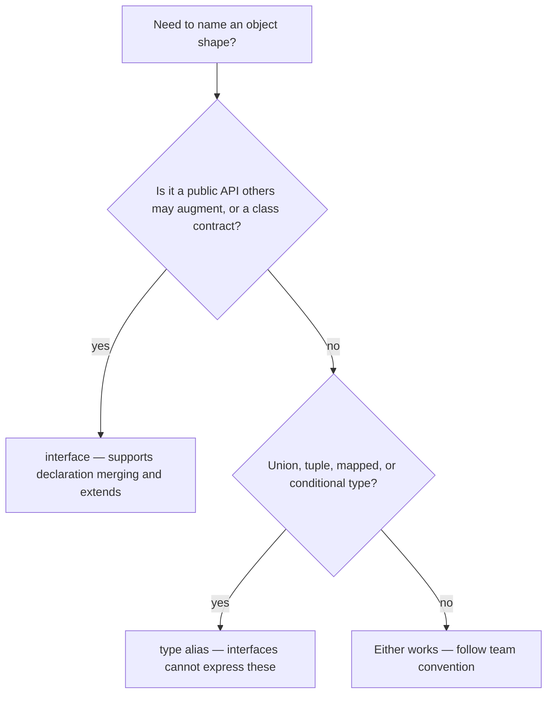

# Functions and Objects

Functions and object shapes are the bread and butter of everyday TypeScript, and interviews probe them constantly: how to type callbacks, when overloads are worth it, what `readonly` really guarantees, and the perennial "interface vs type alias" question. This guide covers function type expressions, parameter variations, `this` typing, index signatures, and the real (not folklore) differences between interfaces and type aliases.

## Function Type Expressions

```typescript
// A function type expression: parameters + return type
type Logger = (message: string, level: number) => void;

const log: Logger = (msg, lvl) => console.log(`[${lvl}] ${msg}`);
// Note: parameter names in the type are for documentation only;
// msg/lvl don't have to match message/level.

// Callbacks are the everyday use case
function retry(times: number, task: () => Promise<void>): Promise<void> {
  return task().catch(() => (times > 1 ? retry(times - 1, task) : Promise.reject()));
}

// Call signatures inside object types allow functions with properties
type Counter = {
  (): number;          // callable
  reset(): void;       // plus methods
  count: number;       // plus data
};
```

## Optional, Default, and Rest Parameters

```typescript
function buildUrl(
  host: string,
  path = "/",              // default => inferred string, optional for callers
  port?: number,           // optional => number | undefined inside the body
  ...query: string[]       // rest => zero or more strings
): string {
  const p = port ?? 443;   // must handle undefined under strictNullChecks
  return `https://${host}:${p}${path}?${query.join("&")}`;
}

buildUrl("example.com");
buildUrl("example.com", "/api", 8080, "a=1", "b=2");

// ❌ PITFALL: optional parameters must come after required ones
// function bad(a?: string, b: string) {}
// error TS1016: A required parameter cannot follow an optional parameter.
```

A subtlety interviewers enjoy: a callback type with fewer parameters is assignable to one with more, because JavaScript ignores extra arguments.

```typescript
const nums = [1, 2, 3];
nums.forEach((value) => console.log(value)); // ✅ fine to ignore index/array params
```

## Function Overloads

Overloads let one implementation present several precise call signatures.

```typescript
// Overload signatures (what callers see)
function parseInput(input: string): string[];
function parseInput(input: number): number;
// Implementation signature (hidden from callers, must cover all overloads)
function parseInput(input: string | number): string[] | number {
  return typeof input === "string" ? input.split(",") : input * 2;
}

const parts = parseInput("a,b");  // string[] — precise!
const doubled = parseInput(21);   // number

// ❌ Without overloads, a union signature loses precision:
// parseUnion("a,b") would be string[] | number, forcing callers to narrow.
```

Prefer union types or generics when they suffice — overloads add maintenance cost and the implementation signature is not itself callable. Real-world examples: DOM's `createElement`, Node's `fs.readFile` (encoding changes the return type).

## Typing `this`

```typescript
interface DbConnection {
  isOpen: boolean;
}

// A fake 'this' parameter (erased at compile time) types the call context
function assertOpen(this: DbConnection) {
  if (!this.isOpen) throw new Error("Connection closed");
}

const conn: DbConnection & { assertOpen: typeof assertOpen } = {
  isOpen: true,
  assertOpen,
};
conn.assertOpen();      // ✅ this = conn
// assertOpen();        // ❌ error TS2684: The 'this' context of type 'void'
//                      //    is not assignable to method's 'this' of type 'DbConnection'.
```

Arrow functions capture lexical `this` and cannot declare a `this` parameter — the classic fix for callbacks losing their context in event handlers and class methods.

## Object Types, Optional Properties, and readonly

```typescript
interface Article {
  readonly id: string;      // cannot be reassigned after creation
  title: string;
  subtitle?: string;        // string | undefined
  tags: readonly string[];  // array cannot be mutated through this reference
}

const a: Article = { id: "1", title: "TS", tags: ["dev"] };
// a.id = "2";       // ❌ Cannot assign to 'id' because it is a read-only property.
// a.tags.push("x"); // ❌ Property 'push' does not exist on type 'readonly string[]'.

// ⚠️ readonly is shallow and compile-time only — it is erased like all types,
// and an aliased mutable reference can still mutate the underlying object.
const mutableTags: string[] = ["dev"];
const b: Article = { id: "2", title: "TS", tags: mutableTags };
mutableTags.push("sneaky"); // b.tags changed — no error
```

## Index Signatures and Records

```typescript
// Index signature: unknown keys, uniform value type
interface Scores {
  [student: string]: number;
}
const scores: Scores = { ada: 95, grace: 98 };

// noUncheckedIndexedAccess makes lookups honest:
const s = scores["nobody"]; // number | undefined — must check!

// Record is usually cleaner, especially with literal-union keys
type Env = Record<"dev" | "staging" | "prod", string>;
const urls: Env = { dev: "d", staging: "s", prod: "p" }; // all keys required

// Mixing declared properties with an index signature: every property
// must be assignable to the index signature's value type.
interface Config {
  [key: string]: string | number;
  name: string;   // ✅ string is assignable to string | number
  retries: number;
  // debug: boolean; // ❌ TS2411: Property 'debug' of type 'boolean' is not
  //                 //    assignable to 'string' index type 'string | number'.
}
```

## Interfaces vs Type Aliases — the Real Differences



Both can describe object shapes, be implemented by classes, and extend each other. The real differences:

### 1. Declaration merging (interfaces only)

```typescript
interface Window {
  myAppVersion: string; // merges into the global Window interface
}
// Two same-named interfaces in one scope merge; two same-named type aliases
// are a duplicate-identifier error. Merging powers global/module augmentation
// (e.g. adding fields to Express's Request).
```

### 2. What each can express

```typescript
type Id = string | number;              // unions: type alias only
type Pair = [number, number];           // tuples: alias is idiomatic
type Nullable<T> = T | null;            // generic aliases over unions
type Keys = keyof Article;              // operators produce aliases

interface Point { x: number; y: number } // object shapes: interface is idiomatic
```

### 3. extends vs intersection (&)

```typescript
interface Animal { name: string }
interface Dog extends Animal { bark(): void }  // extends: checked eagerly,
// incompatible extension is an immediate, clear error

type Cat = Animal & { name: number };
// ⚠️ No error at declaration! 'name' silently becomes string & number = never.
// You only discover it when constructing a Cat becomes impossible.
```

`extends` gives better error messages and is cached better by the compiler; intersections can silently produce `never` properties.

### 4. Error messages and display

Interfaces keep their name in errors and hovers; complex type aliases are often expanded inline, making errors harder to read.

**Practical rule** (and a fine interview answer): use `interface` for object shapes that are part of a public or extendable API; use `type` for unions, tuples, function types, and anything computed. Consistency matters more than the choice.

## Real-World Applications

- Express/Fastify middleware: `this`-free arrow handlers plus `Request`/`Response` interface augmentation via declaration merging.
- SDK design: overloads model APIs whose return type depends on an options flag (e.g. `readFile` with/without encoding).
- Configuration objects: `readonly` + `Record` types prevent accidental mutation of shared config in long-lived Node processes.

## Best Practices

- Type callbacks with function type expressions; never use the unsafe `Function` type (it accepts any arguments and returns `any`).
- Reach for union types or generics before overloads; use overloads only when the return type genuinely depends on the argument type.
- Mark properties `readonly` by default in data models; remember it is shallow and compile-time only.
- Prefer `Record<K, V>` with literal-union keys over string index signatures; enable `noUncheckedIndexedAccess`.
- Use `interface` for object shapes, `type` for everything else, and be consistent across the codebase.
- Avoid optional properties as a substitute for discriminated unions (guide 3) — `{ ok?: boolean; error?: string }` invites impossible states.

## Interview Questions

<details>
<summary>1. What are the real differences between interface and type alias?</summary>

Both name object shapes, can be implemented by classes, and can extend one another. Real differences: (1) interfaces support declaration merging — two same-named declarations merge, which enables module/global augmentation; type aliases cannot be redeclared. (2) Type aliases can express unions, tuples, mapped, conditional, and primitive-renaming types; interfaces cannot. (3) `interface extends` reports conflicts eagerly with clear errors, while intersections can silently collapse a property to `never`. (4) Interfaces preserve their names in error messages and are slightly friendlier to the compiler's caching. Convention: interface for object shapes, type for everything else.
</details>

<details>
<summary>2. Why is a function taking fewer parameters assignable to a type taking more?</summary>

Because in JavaScript it is always safe to call a function with more arguments than it uses — extras are ignored. So `(value: number) => void` is assignable to `(value: number, index: number) => void`. This is why `arr.forEach(v => ...)` works even though `forEach` passes three arguments. The reverse (requiring more parameters than the type provides) is unsafe and rejected.
</details>

<details>
<summary>3. How do function overloads work, and what is the implementation signature?</summary>

You write two or more overload signatures that callers can use, followed by one implementation whose signature must be general enough to cover all overloads (typically using unions). The implementation signature itself is invisible to callers. Overloads are resolved top-down, first match wins — so order them most-specific first. TS checks the implementation only loosely against the overloads, which is a known soundness gap: you can write an implementation that mismatches an overload's promise.
</details>

<details>
<summary>4. What does a `this` parameter in a function declaration do?</summary>

It is a fake first parameter, erased at compile time, that tells the checker what `this` must be when the function is invoked. Calling the function with the wrong (or no) context is a compile error. It is used for methods intended to be attached to particular objects and in APIs like jQuery-style callbacks. Arrow functions cannot declare `this` because they capture it lexically.
</details>

<details>
<summary>5. What does readonly actually guarantee?</summary>

Only that the property cannot be written through that particular type, at compile time. It is shallow (nested objects remain mutable), erased at runtime (no `Object.freeze` is applied), and can be bypassed by an aliased mutable reference or an assertion. For deep or runtime immutability you need `as const` for literals, `Readonly`/custom `DeepReadonly` mapped types for depth in the type system, and `Object.freeze` or immutable data structures at runtime.
</details>

<details>
<summary>6. When would you use an index signature vs Record vs a Map?</summary>

Use `Record<K, V>` with a literal-union key when the set of keys is known — all keys are then required and typo-checked. Use an index signature (`[key: string]: V`) for genuinely open string-keyed data, ideally with `noUncheckedIndexedAccess` so lookups are `V | undefined`. Use a runtime `Map` when keys are dynamic at runtime, non-strings, or when you need insertion order and size — `Map<K, V>` also avoids prototype-pollution issues that plain objects have with keys like `__proto__`.
</details>

<details>
<summary>7. Why can adding a property to an interface via a second declaration be useful?</summary>

That is declaration merging, and it is how you augment types you do not own: adding your fields to Express's `Request`, extending `Window` with globals injected by a script, or plugin systems where each plugin merges options into a shared `PluginRegistry` interface. Inside a module you wrap the augmentation in `declare module "express-serve-static-core" { ... }`. This is impossible with type aliases.
</details>

<details>
<summary>8. What's wrong with the type Function, and what should you use instead?</summary>

`Function` accepts any callable, performs no checking of arguments, and calling it returns `any` — so it silently discards type safety, similar to `any` for callables. Use a concrete function type expression like `(args: A) => R`, or `(...args: unknown[]) => unknown` when the signature is truly unknown, forcing narrowing before the call.
</details>
