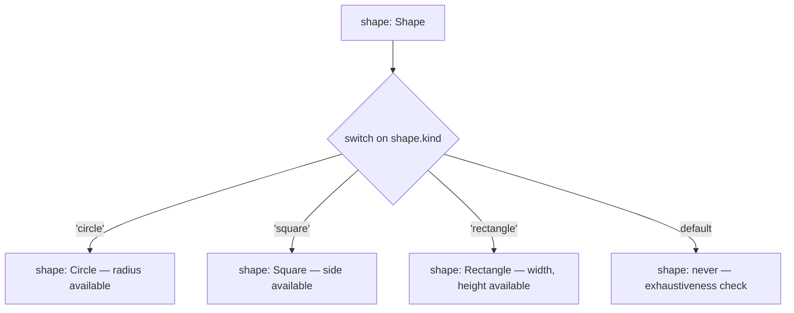
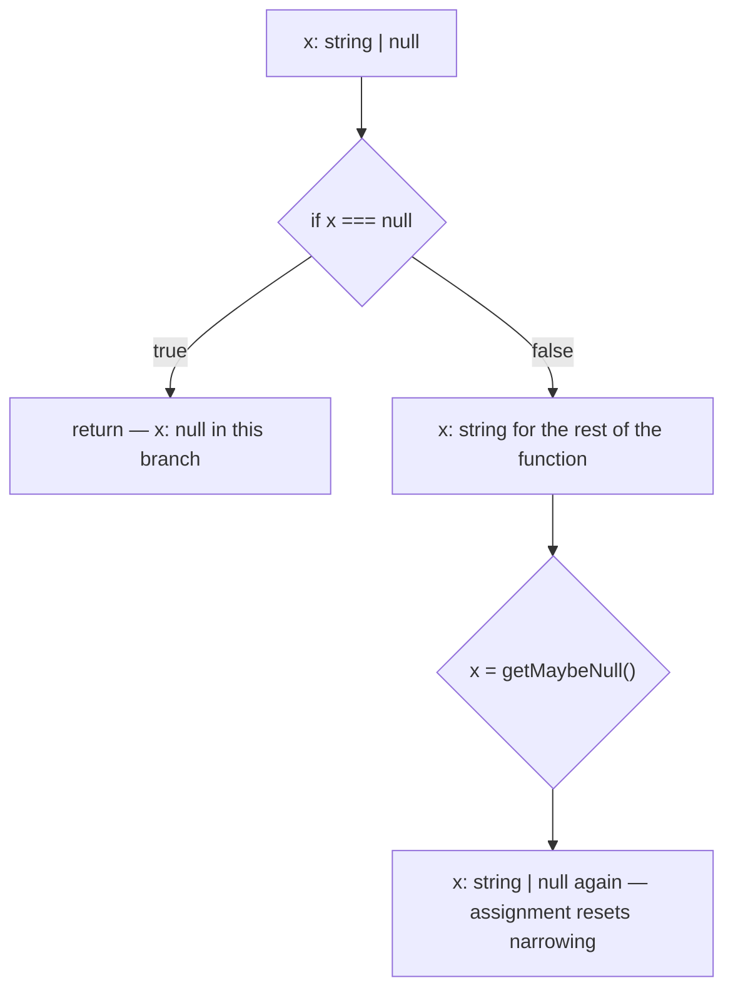

# Unions, Intersections, and Narrowing

Union types model "one of several possibilities," and narrowing is how TypeScript's control-flow analysis proves which possibility you actually hold at each point in the code. Discriminated unions plus exhaustive `switch` statements are arguably the single most important day-to-day TypeScript pattern, and they appear in virtually every mid-level interview. This guide covers unions, intersections, literal types, all the type guards, and exhaustiveness checking with `never`.

## Union and Intersection Types

```typescript
type Id = string | number;          // union: EITHER a string OR a number

function printId(id: Id) {
  // Only members common to ALL union arms are accessible before narrowing:
  id.toString();       // ✅ exists on both
  // id.toUpperCase(); // ❌ TS2339: Property 'toUpperCase' does not exist on type 'Id'.
}

type Timestamps = { createdAt: Date };
type Authored = { author: string };
type Post = Timestamps & Authored;  // intersection: BOTH sets of members

const p: Post = { createdAt: new Date(), author: "ada" };
```

Mental model: a union **widens the set of allowed values** but **shrinks the set of safely usable members**; an intersection does the opposite. Intersecting incompatible primitives yields `never` (`string & number` is `never`).

## Literal Types

```typescript
type HttpMethod = "GET" | "POST" | "PUT" | "DELETE"; // string literal union
type DiceRoll = 1 | 2 | 3 | 4 | 5 | 6;

function request(method: HttpMethod, url: string) { /* ... */ }
request("GET", "/users");   // ✅
// request("FETCH", "/x");  // ❌ TS2345: Argument of type '"FETCH"' is not
//                          //    assignable to parameter of type 'HttpMethod'.

// ⚠️ PITFALL: widening. let-variables widen literals to their base type:
let m = "GET";              // type: string (widened)
// request(m, "/users");    // ❌ string is not assignable to HttpMethod
const m2 = "GET";           // type: "GET" — const keeps the literal
request(m2, "/users");      // ✅
```

## Type Guards

Narrowing happens through *guards* — runtime checks the compiler understands.

```typescript
function stringify(value: string | number | Date | string[] | null): string {
  if (value === null) return "null";               // equality narrowing
  if (typeof value === "string") return value;     // typeof guard
  if (typeof value === "number") return value.toFixed(2);
  if (value instanceof Date) return value.toISOString(); // instanceof guard
  return value.join(",");                          // only string[] remains
}

// The `in` guard checks for a property's existence
type Fish = { swim: () => void };
type Bird = { fly: () => void };
function move(animal: Fish | Bird) {
  if ("swim" in animal) animal.swim();
  else animal.fly();
}
```

### Custom Type Predicates

```typescript
interface ApiError { code: number; message: string }

// The `value is ApiError` return type makes this a user-defined guard
function isApiError(value: unknown): value is ApiError {
  return (
    typeof value === "object" &&
    value !== null &&
    typeof (value as ApiError).code === "number" &&
    typeof (value as ApiError).message === "string"
  );
}

function handle(err: unknown) {
  if (isApiError(err)) {
    console.error(err.code, err.message); // err is ApiError here
  }
}

// ❌ PITFALL: the compiler barely checks the guard's body. This LIES:
function isString(v: unknown): v is string {
  return typeof v === "number"; // compiles fine — guard bugs cause runtime bugs
}

// Assertion functions are the throwing cousin of predicates:
function assertIsString(v: unknown): asserts v is string {
  if (typeof v !== "string") throw new Error("not a string");
}
```

## Discriminated Unions — the Workhorse Pattern

Give every variant a common literal-typed property (the *discriminant*), and the compiler can narrow on it perfectly.



```typescript
interface Circle    { kind: "circle"; radius: number }
interface Square    { kind: "square"; side: number }
interface Rectangle { kind: "rectangle"; width: number; height: number }

type Shape = Circle | Square | Rectangle;

function area(shape: Shape): number {
  switch (shape.kind) {
    case "circle":    return Math.PI * shape.radius ** 2; // shape: Circle
    case "square":    return shape.side ** 2;             // shape: Square
    case "rectangle": return shape.width * shape.height;  // shape: Rectangle
    default: {
      // Exhaustiveness check: if every case is handled, shape is never here.
      const _exhaustive: never = shape;
      throw new Error(`Unhandled shape: ${_exhaustive}`);
    }
  }
}
```

The payoff: add `interface Triangle { kind: "triangle"; base: number; height: number }` to the union, and the `default` branch immediately fails to compile — `Triangle` is not assignable to `never` — pointing you to every switch that must be updated. This is compile-time protection against forgotten cases, and it is *the* answer to "how do you make illegal states unrepresentable?"

### Why not optional properties?

```typescript
// ❌ ANTI-PATTERN: impossible states are representable
interface RequestState1 {
  loading?: boolean;
  data?: string;
  error?: Error;
}
// Nothing stops { loading: true, data: "x", error: e } — all three at once!

// ✅ Discriminated union: exactly one state at a time
type RequestState =
  | { status: "idle" }
  | { status: "loading" }
  | { status: "success"; data: string }
  | { status: "error"; error: Error };

function render(s: RequestState) {
  if (s.status === "success") return s.data; // data ONLY exists on success
  return s.status;
}
```

This exact pattern underpins Redux actions, React reducer state, event systems, and API result modeling.

## Control-Flow Analysis

The compiler tracks types through assignments, conditions, and early returns.



```typescript
function process(x: string | null) {
  if (x === null) return;   // early return narrows the remainder
  x.toUpperCase();          // ✅ x: string

  // ⚠️ PITFALL: narrowing does not survive into callbacks that run later
  let y: string | null = "hi";
  if (y !== null) {
    setTimeout(() => {
      // y.toUpperCase(); // ❌ TS18047: 'y' is possibly 'null'.
      // The compiler can't prove y wasn't reassigned before the callback runs.
    }, 100);
    const snapshot = y;     // ✅ capture into a const — stays narrowed
    setTimeout(() => snapshot.toUpperCase(), 100);
  }
}
```

Narrowing also does not propagate through function calls: extracting `if (typeof v === "string")` into a plain boolean-returning helper loses the narrowing — unless the helper is a *type predicate* (`v is string`), which is exactly why predicates exist.

## Real-World Applications

- **Redux/useReducer**: actions are a discriminated union on `type`; reducers get exhaustive switches for free.
- **API result modeling**: `type Result<T> = { ok: true; value: T } | { ok: false; error: AppError }` replaces thrown exceptions with typed control flow.
- **WebSocket/message protocols**: every inbound message is a union discriminated on a `type` field, narrowed at the single entry point.
- **Parsers and interpreters**: AST nodes are discriminated unions; exhaustiveness catches unhandled node kinds when the grammar grows.

## Best Practices

- Model state machines and API results as discriminated unions, never as bags of optional properties.
- Always include an exhaustiveness check (`const _: never = x` or a shared `assertNever` helper) in the `default` branch of switches over unions.
- Prefer narrowing over type assertions; each `as` is unchecked, each guard is verified control flow.
- Keep discriminant properties simple literals (`kind`, `type`, `status`) and consistent across the codebase.
- Write custom type predicates for reusable checks, and unit-test them — the compiler does not verify predicate bodies deeply.
- Capture narrowed values into `const` before using them in closures or after `await`, since narrowing can reset.

## Interview Questions

<details>
<summary>1. What is a discriminated union and why is it so widely used?</summary>

A union of object types that all share a common property (the discriminant) whose type is a distinct literal in each member, e.g. `kind: "circle" | "square"`. Checking the discriminant (`switch (s.kind)`) narrows the whole object to the matching member, giving safe access to variant-specific fields. It makes illegal states unrepresentable, enables compiler-enforced exhaustiveness, and is the backbone of Redux actions, state machines, protocol messages, and Result types.
</details>

<details>
<summary>2. How does exhaustiveness checking with never work?</summary>

After a `switch` (or if/else chain) handles every member of a union, control-flow analysis narrows the value to `never` in the default branch. Assigning it to a `never`-typed variable (`const _x: never = shape`) then compiles. If someone later adds a union member without handling it, the value in default is that member — not `never` — and the assignment fails to compile, flagging every switch that needs updating. Teams usually wrap this in an `assertNever(x: never): never` helper that also throws at runtime.
</details>

<details>
<summary>3. What kinds of type guards does TypeScript understand?</summary>

`typeof x === "string"` (and the other typeof results) for primitives; `x instanceof C` for class instances; `"prop" in x` for property presence; equality/truthiness checks (`x === null`, `if (x)`); discriminant property checks (`x.kind === "circle"`); array checks via `Array.isArray`; and user-defined guards — type predicates (`v is T`) and assertion functions (`asserts v is T`). All feed the same control-flow narrowing engine.
</details>

<details>
<summary>4. Why does extracting a check into a helper function break narrowing, and what's the fix?</summary>

Narrowing is intraprocedural: the compiler doesn't look inside called functions, so a helper returning plain `boolean` conveys no type information back to the call site. The fix is a type predicate return type — `function isFish(a: Animal): a is Fish` — which tells the checker "a true return proves the argument is Fish", restoring narrowing at the call site. The caveat: the predicate body is trusted mostly on faith, so a buggy predicate reintroduces unsoundness.
</details>

<details>
<summary>5. Why might narrowing be lost inside a callback or after an await?</summary>

Narrowing of a mutable (`let`) variable assumes no reassignment happens between the check and the use. A callback may run arbitrarily later, and code between an await's suspension and resumption may reassign the variable, so the compiler conservatively resets the narrowing. Fix: copy the value into a `const` after narrowing and use that inside the closure — `const` bindings can't be reassigned, so their narrowed type is stable.
</details>

<details>
<summary>6. What is the difference between a union and an intersection, and what is string & number?</summary>

A union `A | B` accepts values of either type but only exposes members present on both. An intersection `A & B` requires a value satisfying both types and exposes all members of each. For object types, intersection effectively merges shapes. For disjoint primitives like `string & number`, no value can be both, so the type collapses to `never` — a frequent source of silent bugs when intersecting object types with conflicting property types.
</details>

<details>
<summary>7. Explain literal widening: why does let m = "GET" not work where "GET" is expected?</summary>

The literal `"GET"` has literal type `"GET"`, but when assigned to a mutable `let` binding without annotation, TS widens it to `string` (you could reassign any string later). A `const` binding keeps the literal type. Fixes: use `const`, annotate the variable (`let m: HttpMethod = "GET"`), or use `as const` on object/array literals to keep all nested literals narrow and readonly — essential when passing config objects to APIs expecting literal unions.
</details>

<details>
<summary>8. Design the state for a data-fetching component so invalid combinations cannot exist.</summary>

Use a discriminated union: `type State<T> = { status: "idle" } | { status: "loading" } | { status: "success"; data: T } | { status: "error"; error: Error }`. Now `data` exists only in the success arm and `error` only in the error arm, so "loading with data and error simultaneously" is unrepresentable, rendering logic narrows on `status`, and an exhaustive switch guarantees every state has UI. This is superior to `{ loading: boolean; data?: T; error?: Error }`, where 2^3 combinations exist but only 4 are meaningful.
</details>
