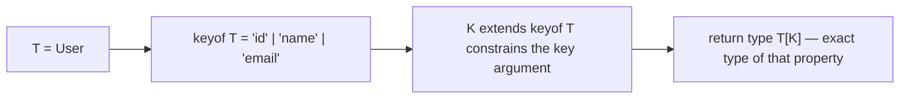

# Generics

Generics let you write functions, interfaces, and classes that work over many types while preserving the relationship between inputs and outputs — the difference between `(x: any) => any` and "returns exactly what you gave it." Combined with `keyof` and indexed access types, generics are the toolkit for building type-safe utilities, and implementing such utilities live is a staple of mid-to-senior interviews.

## Generic Functions

```typescript
// Without generics you either duplicate or lose information:
function firstAny(arr: any[]): any { return arr[0]; }        // ❌ loses the type
function firstOf<T>(arr: T[]): T | undefined { return arr[0]; } // ✅ preserves it

const n = firstOf([1, 2, 3]);        // n: number | undefined — T inferred as number
const s = firstOf(["a", "b"]);       // s: string | undefined
const e = firstOf<number>([]);       // explicit type argument when inference can't help

// Multiple type parameters relate inputs to outputs
function mapValues<T, U>(arr: T[], fn: (item: T) => U): U[] {
  return arr.map(fn);
}
const lengths = mapValues(["aa", "b"], (s) => s.length); // number[]
```

**Inference** is the magic: TS deduces `T` from the arguments, so callers rarely write type arguments. A good interview line: "a type parameter is worth declaring only if it appears in at least two positions (or in a constrained relationship) — otherwise it's noise."

```typescript
// ❌ Useless generic — T appears once, might as well be the concrete type
function log1<T>(value: T): void { console.log(value); }
// ✅ Meaningful generic — links parameter and return
function identity<T>(value: T): T { return value; }
```

## Constraints with extends

```typescript
// T must have a length property
function longest<T extends { length: number }>(a: T, b: T): T {
  return a.length >= b.length ? a : b;
}
longest("alice", "bob");     // ✅ strings have length
longest([1, 2], [3]);        // ✅ arrays have length
// longest(10, 20);          // ❌ TS2345: Argument of type 'number' is not
//                           //    assignable to parameter of type '{ length: number }'.

// ⚠️ PITFALL: constraints restrict inputs but you still return T, not the constraint
function broken<T extends { length: number }>(x: T): T {
  // return { length: 1 };  // ❌ TS2322: '{ length: number }' is not assignable to 'T'.
  // T could be a subtype with MORE members than the constraint.
  return x;
}
```

## keyof and Indexed Access Types

```typescript
interface User {
  id: number;
  name: string;
  email: string;
}

type UserKeys = keyof User;        // "id" | "name" | "email"
type NameType = User["name"];      // string  (indexed access)
type ValueTypes = User[keyof User]; // number | string (all value types)

// The canonical interview one-liner: a fully type-safe property getter
function getProp<T, K extends keyof T>(obj: T, key: K): T[K] {
  return obj[key];
}

const u: User = { id: 1, name: "Ada", email: "ada@ex.com" };
const name = getProp(u, "name");   // string — K inferred as "name"
const id = getProp(u, "id");       // number
// getProp(u, "age");              // ❌ '"age"' is not assignable to
//                                 //    parameter of type 'keyof User'.
```



## Generic Interfaces and Type Aliases

```typescript
interface ApiResponse<T> {
  status: number;
  data: T;
}

type Paginated<T> = {
  items: T[];
  total: number;
  next?: string;
};

async function fetchUsers(): Promise<ApiResponse<Paginated<User>>> {
  const res = await fetch("/api/users");
  return res.json() as Promise<ApiResponse<Paginated<User>>>;
}

// Generic function types
type Comparator<T> = (a: T, b: T) => number;
const byId: Comparator<User> = (a, b) => a.id - b.id;
```

## Generic Classes

```typescript
class TypedQueue<T> {
  private items: T[] = [];

  enqueue(item: T): void { this.items.push(item); }
  dequeue(): T | undefined { return this.items.shift(); }
  peek(): T | undefined { return this.items[0]; }
  get size(): number { return this.items.length; }
}

const q = new TypedQueue<string>();
q.enqueue("job-1");
// q.enqueue(42);   // ❌ Argument of type 'number' is not assignable to 'string'.
const job = q.dequeue(); // string | undefined

// Note: statics cannot use the class type parameter — there is one static
// side shared by TypedQueue<string> and TypedQueue<number> alike.
```

## Default Type Parameters

```typescript
// Default kicks in when the parameter is neither passed nor inferable
interface EventBus<Payload = unknown> {
  emit(event: string, payload: Payload): void;
  on(event: string, handler: (payload: Payload) => void): void;
}

declare const anyBus: EventBus;            // Payload = unknown
declare const userBus: EventBus<User>;     // Payload = User

// Defaults can reference earlier parameters:
type Pair<A, B = A> = [A, B];
type Same = Pair<number>;        // [number, number]
type Mixed = Pair<number, string>; // [number, string]
```

## How Inference Behaves (and Misbehaves)

```typescript
// Inference from return position via context:
declare function makeArray<T>(fill: T, n: number): T[];
const flags = makeArray(true, 3);      // boolean[] (literal widened to boolean)

// Forcing literal inference with const type parameters (TS 5.0+):
function pick<const T>(value: T): T { return value; }
const picked = pick({ mode: "dark" }); // { readonly mode: "dark" } — stays narrow

// ⚠️ PITFALL: inference from multiple candidates unions them
declare function both<T>(a: T, b: T): T;
const r = both("a", 1);
// In modern TS this infers T = string | number; older versions errored.
// If you WANT an error when the types differ, use two parameters:
declare function bothStrict<T, U extends T>(a: T, b: U): T;
```

## Building Type-Safe Utilities

Putting it together — patterns you may be asked to write on the spot:

```typescript
// 1. pluck: extract one property from every element
function pluck<T, K extends keyof T>(items: T[], key: K): T[K][] {
  return items.map((item) => item[key]);
}
const emails = pluck([u], "email"); // string[]

// 2. groupBy with typed keys
function groupBy<T, K extends PropertyKey>(
  items: T[],
  keyFn: (item: T) => K
): Record<K, T[]> {
  const out = {} as Record<K, T[]>;
  for (const item of items) {
    const k = keyFn(item);
    (out[k] ??= []).push(item);
  }
  return out;
}

// 3. A typed event emitter — the classic senior screener
type Events = {
  login: { userId: number };
  logout: undefined;
};

class Emitter<E extends Record<string, unknown>> {
  private handlers: { [K in keyof E]?: Array<(payload: E[K]) => void> } = {};

  on<K extends keyof E>(event: K, handler: (payload: E[K]) => void): void {
    (this.handlers[event] ??= []).push(handler);
  }
  emit<K extends keyof E>(event: K, payload: E[K]): void {
    this.handlers[event]?.forEach((h) => h(payload));
  }
}

const emitter = new Emitter<Events>();
emitter.on("login", (p) => console.log(p.userId)); // p: { userId: number }
// emitter.emit("login", { userId: "1" });  // ❌ string not assignable to number
// emitter.on("signup", () => {});          // ❌ '"signup"' is not a key of Events
```

## Real-World Applications

- **Collections and data structures**: typed queues, caches (`LRUCache<K, V>`), repositories (`Repository<Entity, Id>`).
- **API layers**: `request<TResponse>(url): Promise<TResponse>` in every SDK; tRPC and GraphQL codegen push this to end-to-end inference.
- **React**: `useState<T>`, `Props<T>` for generic components like tables and selects (`Table<Row>`).
- **ORMs**: Prisma and Drizzle infer row types from schema definitions using exactly these mechanics (`keyof`, indexed access, constraints).

## Best Practices

- Name type parameters descriptively in public APIs (`TItem`, `TResponse`) — single letters are fine for short local helpers.
- Only introduce a type parameter that appears in two or more positions; otherwise use the concrete type or `unknown`.
- Constrain type parameters (`extends`) as tightly as the implementation requires, no tighter — over-constraining hurts reuse.
- Let inference work: design parameter order so values carrying the type come first; avoid making callers write explicit type arguments.
- Prefer `K extends keyof T` + `T[K]` over stringly-typed property access — it turns typos into compile errors.
- Reach for `const` type parameters when literal preservation matters (config objects, route strings).

## Interview Questions

<details>
<summary>1. What problem do generics solve compared to using any?</summary>

`any` erases the relationship between input and output: `first(arr: any[]): any` gives back a value the compiler knows nothing about, so all downstream checking is lost. A generic `first<T>(arr: T[]): T | undefined` preserves the link — give it `number[]`, get `number | undefined` — with zero runtime cost. Generics are parametric polymorphism: one implementation, many precisely-typed instantiations.
</details>

<details>
<summary>2. Write a function getProp(obj, key) that is fully type-safe. Explain each part.</summary>

```typescript
function getProp<T, K extends keyof T>(obj: T, key: K): T[K] {
  return obj[key];
}
```

`T` is inferred from `obj`. `K extends keyof T` constrains `key` to the union of `T`'s property names, so misspelled keys fail at compile time. The return type `T[K]` is an indexed access type — the exact type of that property, so `getProp(user, "id")` returns `number`, not a union of all value types.
</details>

<details>
<summary>3. What does a generic constraint (extends) do, and why can't you return an object matching the constraint as T?</summary>

`T extends C` restricts which type arguments are legal and lets the implementation use `C`'s members on values of type `T`. But `T` may be any subtype of `C` — potentially with extra members — so returning a plain value of type `C` where `T` is expected is unsound and rejected: the caller might have instantiated `T` as a richer type. You must return an actual `T` (usually derived from a `T`-typed input).
</details>

<details>
<summary>4. When are default type parameters useful?</summary>

When a sensible fallback exists and you want the type usable without arguments: `EventBus<Payload = unknown>`, React's `Component<P = {}, S = {}>`, `Map`-like wrappers. Defaults apply only when the parameter is neither explicitly passed nor inferable from arguments. They also enable adding new type parameters to a published generic type without breaking existing users — a real API-evolution technique.
</details>

<details>
<summary>5. Why can't static members reference the class's type parameter?</summary>

Type parameters are bound per instantiation — `TypedQueue<string>` and `TypedQueue<number>` are different instance types — but there is only one constructor object at runtime, shared by all instantiations. A static member typed `T` would have no consistent meaning. Workarounds: make the static method itself generic, or use a standalone generic factory function.
</details>

<details>
<summary>6. How does TypeScript infer type arguments, and how do you keep literals from widening?</summary>

The checker matches argument types against parameter positions that mention the type parameter, collecting candidates and picking the best common type (unioning candidates when needed); contextual typing can also flow types into callbacks. Literals normally widen (`"dark"` becomes `string`) during inference. To preserve them: pass `as const` values, constrain the parameter with `extends string` (literal-preserving inference sites), or declare the parameter as `<const T>` (TS 5.0+), which infers the narrowest readonly type.
</details>

<details>
<summary>7. Sketch a typed event emitter where event names and payload types are linked.</summary>

Parameterize the class over an event map: `class Emitter<E extends Record<string, unknown>>` with methods `on<K extends keyof E>(event: K, handler: (p: E[K]) => void)` and `emit<K extends keyof E>(event: K, payload: E[K])`. Instantiating with `{ login: { userId: number }; logout: undefined }` means `on("login", ...)` receives a handler whose payload is `{ userId: number }`, and both unknown event names and wrong payload shapes are compile errors. Node's typed `EventEmitter` wrappers, Socket.IO's typed events, and Vue's emits all use this pattern.
</details>

<details>
<summary>8. What is the difference between T[] , Array&lt;T&gt;, and readonly T[]?</summary>

`T[]` and `Array<T>` are identical — pure syntax preference (generic syntax is required for unions without parens: `(A | B)[]` vs `Array<A | B>`). `readonly T[]` (alias `ReadonlyArray<T>`) removes all mutating members (`push`, `sort`, index assignment) at compile time. Mutable `T[]` is assignable to `readonly T[]` but not vice versa, so accepting `readonly T[]` in function parameters is the more permissive, self-documenting choice for functions that don't mutate.
</details>
