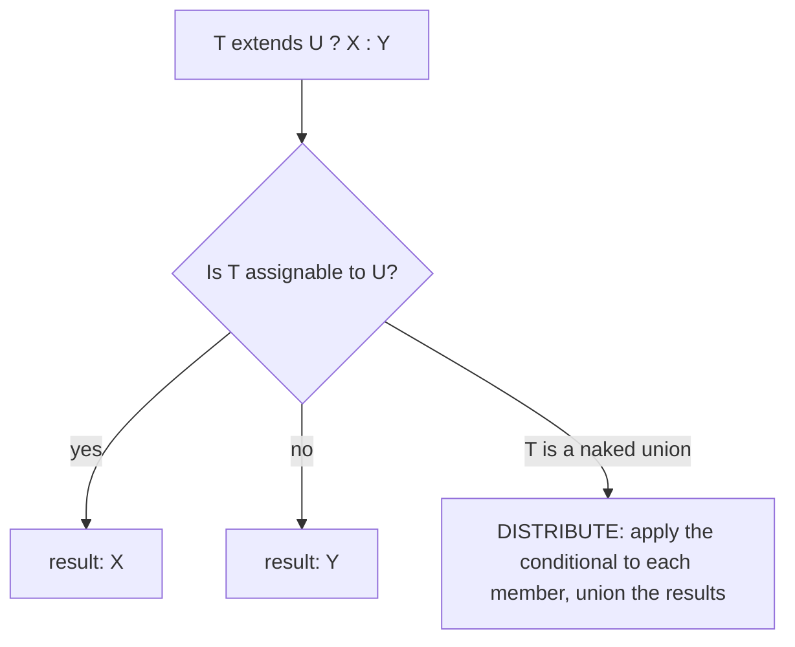
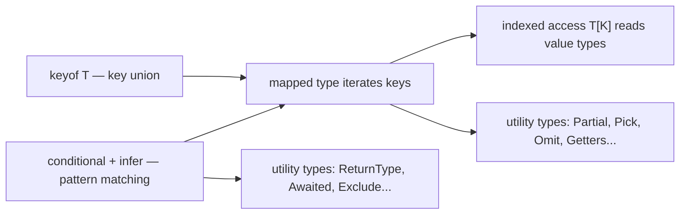

# Advanced Types

TypeScript's type system is itself a small functional programming language: conditional types are its if-expressions, `infer` its pattern matching, mapped types its loops, and template literal types its string manipulation. Senior interviews routinely ask you to implement the built-in utility types (`Partial`, `Pick`, `ReturnType`, ...) from scratch, so this guide shows the machinery and then hand-rolls each one.

## Conditional Types

```typescript
// SomeType extends OtherType ? TrueType : FalseType
type IsString<T> = T extends string ? true : false;

type A = IsString<"hello">; // true
type B = IsString<42>;      // false

// Practical: choose an output type based on an input type
type IdOf<T> = T extends { id: infer U } ? U : never;
type UserId = IdOf<{ id: number; name: string }>; // number
```



## infer — Pattern Matching for Types

`infer` declares a type variable *inside* the `extends` clause and captures whatever sits in that position.

```typescript
// Extract the element type of an array
type ElementType<T> = T extends (infer E)[] ? E : T;
type E1 = ElementType<string[]>; // string
type E2 = ElementType<number>;   // number (no match, fallthrough)

// Extract a function's return type — this IS the built-in ReturnType
type MyReturnType<T> = T extends (...args: any[]) => infer R ? R : never;
type R1 = MyReturnType<() => Date>; // Date

// Extract parameters as a tuple — the built-in Parameters
type MyParameters<T> = T extends (...args: infer P) => any ? P : never;
type P1 = MyParameters<(a: string, b: number) => void>; // [a: string, b: number]

// Unwrap a promise (simplified Awaited — the real one recurses and
// handles thenables)
type MyAwaited<T> = T extends Promise<infer V> ? MyAwaited<V> : T;
type W1 = MyAwaited<Promise<Promise<number>>>; // number
```

## Distributivity of Conditional Types

When the checked type is a **naked type parameter** and you instantiate it with a union, the conditional distributes over each member.

```typescript
type ToArray<T> = T extends any ? T[] : never;
type X = ToArray<string | number>;
// Distributes: ToArray<string> | ToArray<number> = string[] | number[]
// NOT (string | number)[]

// Turning distribution OFF: wrap both sides in a one-element tuple
type ToArrayNonDist<T> = [T] extends [any] ? T[] : never;
type Y = ToArrayNonDist<string | number>; // (string | number)[]

// Distribution powers the built-in Exclude/Extract:
type MyExclude<T, U> = T extends U ? never : T;   // drop members assignable to U
type MyExtract<T, U> = T extends U ? T : never;   // keep members assignable to U

type NoNull = MyExclude<string | null | undefined, null | undefined>; // string

// ⚠️ PITFALL: never is the empty union, so distributing over it yields never
type IsNever<T> = T extends never ? true : false;
type Oops = IsNever<never>;    // never, not true! (distributed over zero members)
type IsNeverFixed<T> = [T] extends [never] ? true : false;
type Ok = IsNeverFixed<never>; // true
```

## Mapped Types

Mapped types iterate over a union of keys (usually `keyof T`) and build a new object type.

```typescript
type MyReadonly<T> = { readonly [K in keyof T]: T[K] };
type MyPartial<T>  = { [K in keyof T]?: T[K] };

// Modifiers can be REMOVED with a minus sign:
type MyRequired<T> = { [K in keyof T]-?: T[K] };   // strip optionality
type Mutable<T>    = { -readonly [K in keyof T]: T[K] }; // strip readonly

// Mapping over an arbitrary key union — the built-in Record
type MyRecord<K extends PropertyKey, V> = { [P in K]: V };
```

### Key Remapping with `as`

```typescript
// Rename keys while mapping (TS 4.1+)
type Getters<T> = {
  [K in keyof T as `get${Capitalize<string & K>}`]: () => T[K];
};

interface Person { name: string; age: number }
type PersonGetters = Getters<Person>;
// { getName: () => string; getAge: () => number }

// Filter keys by remapping to never:
type OnlyStringProps<T> = {
  [K in keyof T as T[K] extends string ? K : never]: T[K];
};
type S = OnlyStringProps<{ id: number; name: string; email: string }>;
// { name: string; email: string }
```

## Template Literal Types

```typescript
type Lang = "en" | "fr";
type Page = "home" | "about";
type Route = `/${Lang}/${Page}`;
// "/en/home" | "/en/about" | "/fr/home" | "/fr/about" — the cross product!

// Intrinsic string helpers: Uppercase, Lowercase, Capitalize, Uncapitalize
type Shout<T extends string> = Uppercase<T>;

// Parsing with infer — extract Express-style route params:
type ParamsOf<Path extends string> =
  Path extends `${string}:${infer Param}/${infer Rest}`
    ? Param | ParamsOf<`/${Rest}`>
    : Path extends `${string}:${infer Param}`
      ? Param
      : never;

type P = ParamsOf<"/users/:userId/posts/:postId">; // "userId" | "postId"
```

This exact technique powers the typed routers in Hono, tRPC, and modern Express type definitions — a great real-world example to cite.

## Hand-Rolled Utility Types

The complete set interviewers ask for, each in one or two lines:

```typescript
type MyPartial<T>   = { [K in keyof T]?: T[K] };
type MyRequired<T>  = { [K in keyof T]-?: T[K] };
type MyReadonly<T>  = { readonly [K in keyof T]: T[K] };
type MyRecord<K extends PropertyKey, V> = { [P in K]: V };

type MyPick<T, K extends keyof T> = { [P in K]: T[P] };
type MyExclude<T, U> = T extends U ? never : T;
type MyOmit<T, K extends PropertyKey> = MyPick<T, MyExclude<keyof T, K>>;
// or directly with key remapping:
type MyOmit2<T, K extends PropertyKey> = {
  [P in keyof T as P extends K ? never : P]: T[P];
};

type MyReturnType<T> = T extends (...a: any[]) => infer R ? R : never;
type MyParameters<T> = T extends (...a: infer P) => any ? P : never;
type MyNonNullable<T> = T extends null | undefined ? never : T;
type MyAwaited<T> = T extends Promise<infer V> ? MyAwaited<V> : T;

// Recursive types — the DeepPartial follow-up:
type DeepPartial<T> = T extends object
  ? { [K in keyof T]?: DeepPartial<T[K]> }
  : T;

interface Config { server: { host: string; port: number }; debug: boolean }
const patch: DeepPartial<Config> = { server: { port: 8080 } }; // ✅ any subset

// Verify your implementations against the built-ins:
type AssertEqual<A, B> = [A] extends [B] ? ([B] extends [A] ? true : false) : false;
const _check: AssertEqual<MyPick<Config, "debug">, Pick<Config, "debug">> = true;
```



## Common Pitfalls

```typescript
// ❌ Homomorphic vs non-homomorphic mapping: mapping over `keyof T` preserves
// modifiers (optional/readonly); mapping over an unrelated union does not.
type Copy<T> = { [K in keyof T]: T[K] };          // keeps ? and readonly
type Flat<T, K extends keyof T> = { [P in K]: T[P] }; // drops none here, but
// Pick is homomorphic by special-case; hand-written variants may differ.

// ❌ Deep recursion limits: heavily recursive types can hit
// "Type instantiation is excessively deep and possibly infinite. (ts2589)"
// Fix by adding depth counters or simplifying.

// ❌ boolean distributes as true | false:
type BoolCheck<T> = T extends true ? "yes" : "no";
type Weird = BoolCheck<boolean>; // "yes" | "no" — often surprising
```

## Real-World Applications

- **Form libraries** (React Hook Form): `FieldPath<T>` uses template literals + recursion to type `"user.address.city"` strings.
- **API clients**: `ReturnType`/`Awaited` extract response types from handler functions (tRPC's entire premise).
- **Redux Toolkit**: `PayloadAction<T>` and slice inference rely on mapped and conditional types.
- **ORMs**: Prisma's `select`/`include` result types are conditional types over your query shape.

## Best Practices

- Prefer the built-in utility types over hand-rolled ones in production; hand-roll for learning and for behavior the built-ins lack (e.g. `DeepPartial`).
- Keep type-level programming shallow in application code; bury complexity in well-tested library types with readable names.
- Wrap conditionals in `[T] extends [U]` when you do *not* want distribution — and know `never`/`boolean` edge cases.
- Use key remapping with `as ... : never` for key filtering instead of intersecting `Pick`s.
- Add `AssertEqual`-style compile-time tests (or `expect-type`, see guide 10) for any nontrivial exported type.
- If a type errors with "excessively deep", simplify before reaching for tricks — future readers will thank you.

## Interview Questions

<details>
<summary>1. Implement Pick and Omit from scratch.</summary>

```typescript
type MyPick<T, K extends keyof T> = { [P in K]: T[P] };
type MyOmit<T, K extends PropertyKey> = MyPick<T, Exclude<keyof T, K>>;
```

`Pick` maps over exactly the chosen keys, reading each value type via indexed access. `Omit` computes the complement of the key set using `Exclude` (a distributive conditional that drops members of `keyof T` assignable to `K`), then Picks those. Note the built-in `Omit` deliberately loosens `K` to `PropertyKey` (any key, not just existing ones) — worth mentioning as an API-design tradeoff.
</details>

<details>
<summary>2. What is a distributive conditional type? Give an example where it surprises people.</summary>

When a conditional type checks a *naked* type parameter (`T extends U ? X : Y`) and `T` is instantiated with a union, the conditional is applied to each member separately and results are unioned: `Exclude<"a" | "b", "a">` = `never | "b"` = `"b"`. Surprises: `IsNever<never>` evaluates to `never` (distribution over an empty union produces nothing), and `boolean` splits into `true | false`. Wrapping in tuples — `[T] extends [U]` — disables distribution because `T` is no longer naked.
</details>

<details>
<summary>3. How does infer work and what is it for?</summary>

Inside a conditional's `extends` clause, `infer X` introduces a type variable that captures the type occupying that structural position when matching succeeds — type-level destructuring. It powers `ReturnType` (capture the return slot of a function type), `Parameters` (capture the arg tuple), `Awaited` (capture the promised value, recursively), and template-literal parsing (capture substrings). Multiple `infer`s can appear in one pattern, and the same variable in multiple positions unions the candidates (or intersects, in contravariant positions).
</details>

<details>
<summary>4. Implement DeepPartial and explain the recursion.</summary>

```typescript
type DeepPartial<T> = T extends object
  ? { [K in keyof T]?: DeepPartial<T[K]> }
  : T;
```

Non-objects pass through unchanged (base case). Objects are mapped: every key becomes optional and its value type is recursively deep-partialed. Follow-ups worth volunteering: arrays and `Date`/`Map` need special-casing (`T extends (infer E)[] ? DeepPartial<E>[] : ...`, and functions match `extends object` too), and unconstrained recursion on huge types can hit the instantiation-depth limit.
</details>

<details>
<summary>5. What is key remapping in mapped types and what can it do?</summary>

The `as` clause in `[K in keyof T as NewKey]` transforms each key while mapping. Two headline uses: renaming keys with template literals (`get${Capitalize<K>}` to generate getter interfaces) and filtering keys by remapping unwanted ones to `never`, which drops them (`[K in keyof T as T[K] extends Function ? never : K]` removes methods). This is how libraries derive event-handler prop types, getter/setter pairs, and "only serializable fields" types.
</details>

<details>
<summary>6. What are template literal types capable of beyond concatenation?</summary>

They form cross products over unions (`/${Lang}/${Page}` yields all combinations), integrate the intrinsic transforms (`Uppercase`, `Capitalize`, ...), and — combined with `infer` in conditionals — can *parse* strings at the type level: extracting `:param` segments from route strings, splitting on delimiters, converting `snake_case` keys to `camelCase` in a mapped type. Real libraries built on this: typed `express`/Hono route params, Prisma field paths, `styled-components` theme accessors.
</details>

<details>
<summary>7. Why does Partial not affect nested objects, and what's the general rule?</summary>

`Partial` is a homomorphic mapped type over `keyof T` — it touches only the top level, adding `?` to each immediate property; the value types are copied as-is, so `Partial<Config>` still requires a complete `server` object if you provide `server` at all. The general rule: built-in utilities are shallow by design (predictable, cheap); depth requires explicit recursion (`DeepPartial`, `DeepReadonly`), with the attendant edge cases around arrays, functions, and built-in classes.
</details>

<details>
<summary>8. When is advanced type-level programming the wrong choice?</summary>

When the type gymnastics outweigh the safety payoff: types that take minutes to understand, produce unreadable multi-page errors, slow down `tsc` and editor feedback (deep recursion, huge unions), or encode invariants better enforced at runtime. Application code should mostly use simple interfaces, discriminated unions, and built-in utilities; heavy machinery belongs inside libraries where thousands of users amortize the complexity — and even there it needs type-level tests.
</details>
